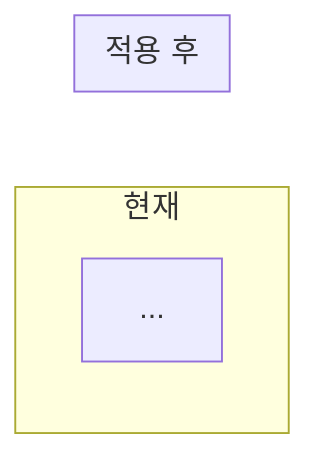
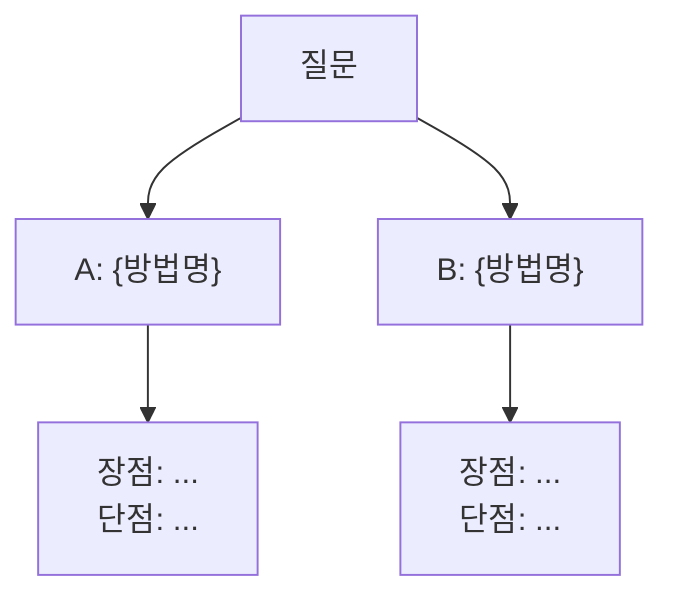

# commit-plan Skill

## 목적

현재 브랜치에서 진행 중인 구현의 **방향, 설계 결정, 진행 상태**를 `docs/plan/{주차}/{브랜치명}-plan.md`에 기록한다.

- 구현 시작 전: **아키텍처 방향 합의** + 커밋 단위 계획
- 구현 중: 변경된 결정 사항 업데이트 + 진행 상태 갱신
- 구현 완료 후: PR 작성 전 최종 점검

파일이 없으면 새로 생성, 있으면 기존 내용에 **추가(append)** 한다.

---

## 실행 절차

### 1. 컨텍스트 수집

```bash
git rev-parse --abbrev-ref HEAD
git log main..HEAD --oneline
git diff main..HEAD --name-only
git status --short
```

### 2. 발제 문서 분석

브랜치의 주차를 추출하고 해당 폴더의 문서를 확인한다.

- **발제 문서 경로**: `docs/discussion/{주차}/`
- discussion 파일 — 실험 기록, 의사결정 히스토리

발제 문서에서 추출:

| 항목 | 추출 방법 |
|------|----------|
| **핵심 문제** | 문제 정의, 환경 제약 (스레드 수, 커넥션 풀, TPS 등) |
| **Step 목록** | 단계별 구성 + 체크리스트 |
| **권장 접근 순서** | "단순 → 고도화" 경로 |

### 3. 코드 분석

| 관점 | 확인 사항 |
|------|----------|
| **도메인** | 추가/변경된 도메인 |
| **레이어** | Domain/Application/Interfaces/Infrastructure 변경 범위 |
| **API** | 추가/변경 엔드포인트 |
| **테스트** | 단위/통합/E2E 현황 |
| **기존 인프라** | 재사용 가능한 것 (ShedLock, RedisConfig 등) |

### 4. 문서 생성/업데이트

`docs/plan/{주차}/{브랜치명}-plan.md` 경로에 아래 구조로 작성한다.

---

## 문서 구조

Plan은 **Part 1(아키텍처 방향) → Part 2(커밋 상세)** 2단계로 구성한다.

Part 1에서 핵심 결정을 확정한 후 Part 2를 작성한다. 결정 없이 커밋 계획을 세우면 구현 도중 방향이 흔들린다.

---

### Part 1: 아키텍처 방향 결정

> 커밋 구현 전에 이 섹션에서 방향을 확정한다.
> 여기서 내리는 결정이 전체 커밋 구조를 결정한다.

```markdown
# {브랜치명} — 구현 계획

> 생성: {날짜} | 마지막 업데이트: {날짜}

## Part 1. 아키텍처 방향 결정

### 1-1. 핵심 문제 정의

{현재 시스템 흐름과 문제를 코드/수치로 설명}



### 1-2. 환경 제약과 수치 산정

{처리량, 커넥션 풀, 스레드 수 등 핵심 수치를 도출}
→ 이 수치가 이후 모든 설정값의 출발점

> ⚠️ 초기 가설 수치는 실측 후 교체 필요 시 명시

### 1-3. 전체 흐름 시퀀스

```mermaid
sequenceDiagram
    ...
```

### 1-4. 핵심 결정 사항

{구현 전 확정해야 할 결정 2~5개}

#### 결정 A: {결정 주제}

{Mermaid 흐름도로 선택지를 시각화}



> 결정: {선택} — {이유}

#### 결정 B: ...

### 1-5. 현재 코드베이스 상태

{재사용 가능한 기존 인프라 (Config, Scheduler, Repository 등)}
```

#### Part 1 작성 규칙

- **결정 사항은 Mermaid flowchart로 시각화**: 텍스트만으로는 선택지가 머릿속에 그려지지 않는다
- **결정 후 `> 결정:` 마커로 즉시 기록**: 별도 테이블이 아니라 결정 위치에 인라인으로
- **수치 산정은 가설임을 명시**: `> ⚠️ 주의: 실측 전 초기 가설이다` 형태. 실측 후 교체
- **기존 코드베이스 파악**: 이미 있는 인프라(ShedLock, RedisConfig 등)를 파악하여 중복 구현 방지
- **2~5개 핵심 결정만**: 사소한 결정(변수 타입, 반환값 등)은 Part 2 커밋별 섹션에

---

### Part 2: 커밋 단위 상세 계획

```markdown
## Part 2. 커밋 단위 상세 계획

### 전체 커밋 개요

| 커밋 | Step | 타입 | 스코프 | 설명 | 상태 |
|------|------|------|--------|------|------|
| 1 | Step 1 | feat | {domain} | {설명} | ⬜ |
| 2 | Step 1 | test | {domain} | {설명} | ⬜ |

---

### Commit 1: `{type}({scope}): {설명}`

#### 핵심 설계

{이 커밋의 핵심 구조 — 키 설계, 알고리즘, 상태 전이 등}

| 키/엔티티 | 타입 | 용도 |
|-----------|------|------|
| ... | ... | ... |

#### 구현 파일

```
{레이어별 파일 트리}
domain/{domain}/
  {Interface}.java
  {Service}.java

infrastructure/{domain}/
  {RepositoryImpl}.java
```

#### 엣지 케이스 & 결정 포인트

{구현 중 만날 분기점을 미리 정리}

> 선택사항: {주제}
> A: {방법} — {장단점}
> B: {방법} — {장단점}
>
> 결정: (개발자 선택 후 기록)

### Commit N: ...
```

#### Part 2 작성 규칙

- **커밋 1개 = 1 논리 단위**: 여러 도메인/레이어를 한 커밋에 혼합 금지
- **발제 Step 순서 준수**: Step 1을 완전히 끝내기 전에 Step 2를 섞지 않는다
- **구현 파일 트리 명시**: 어느 레이어에 어떤 파일을 만들지 사전에 정한다
- **엣지 케이스 사전 정리**: 구현 중 만날 분기점을 미리 적어두면 코딩 중 멈추지 않는다
- **결정 포인트는 `> 선택사항:` 마커**: 개발자가 선택할 때까지 빈칸으로 두고, 선택 후 `> 결정:` 추가
- **사소한 결정도 여기에**: Part 1에 넣기엔 작지만 구현에 영향을 주는 결정 (반환 타입, 키 네이밍 등)

---

## 결정 추적 규칙

### 인라인 마커 형식

Plan 전체에서 결정을 추적하는 통일된 형식:

```markdown
> 선택사항: {주제}
> A: {방법} — {장단점}
> B: {방법} — {장단점}
>
> 결정: {선택} — {이유}
```

- 결정이 내려지면 **즉시 `> 결정:` 라인 추가** — 나중에 모아서 기록하지 않는다
- **discussion 파일에도 동일 내용 기록** (CLAUDE.md "과정 기록" 규칙)
- 결정이 이후 커밋에 영향을 미치면 **하위 커밋 항목도 즉시 수정**

### 상태 표기

| 상태 | 의미 |
|------|------|
| ✅ | 완료 — 코드 존재 + 테스트 통과 |
| 🔧 | 진행 중 |
| ⬜ | 미착수 |

실행할 때마다 현재 코드 기준으로 갱신한다.

---

## 작성 원칙

- **사실 기반**: 코드에서 확인된 것만 작성. 추측 금지
- **미결정 명시**: 합의되지 않은 것은 `> 선택사항:` 으로 남김
- **간결함**: 각 항목은 1~2줄. 장황한 설명은 discussion으로
- **상태 최신화**: 실행할 때마다 ✅/🔧/⬜ 갱신
- **과도한 고도화 경계**: 발제 Step을 넘어서는 구현은 별도 표기
- **수치 가설 표기**: 실측 전 가설 수치에는 `⚠️` 붙이고, 실측 후 교체

---

## 파일 경로 규칙

### Plan 파일
- 저장 위치: `docs/plan/{주차}/{브랜치명}-plan.md`
  - 주차는 브랜치명에서 추출 (예: `feat/week8-wait-queue` → `week8`)
  - 브랜치명에서 `/` → `-` 치환 (예: `feat/week8-wait-queue` → `feat-week8-wait-queue-plan.md`)
- 주차를 식별할 수 없는 브랜치의 경우 `docs/plan/misc/{브랜치명}-plan.md`

### Discussion 파일
- 저장 위치: `docs/discussion/{주차}/{브랜치명}-discussion.md`
  - 주차 추출 방식은 plan과 동일
- 주차를 식별할 수 없는 브랜치의 경우 `docs/discussion/misc/{브랜치명}-discussion.md`

### 디렉터리
- 필요한 디렉터리가 없으면 생성
