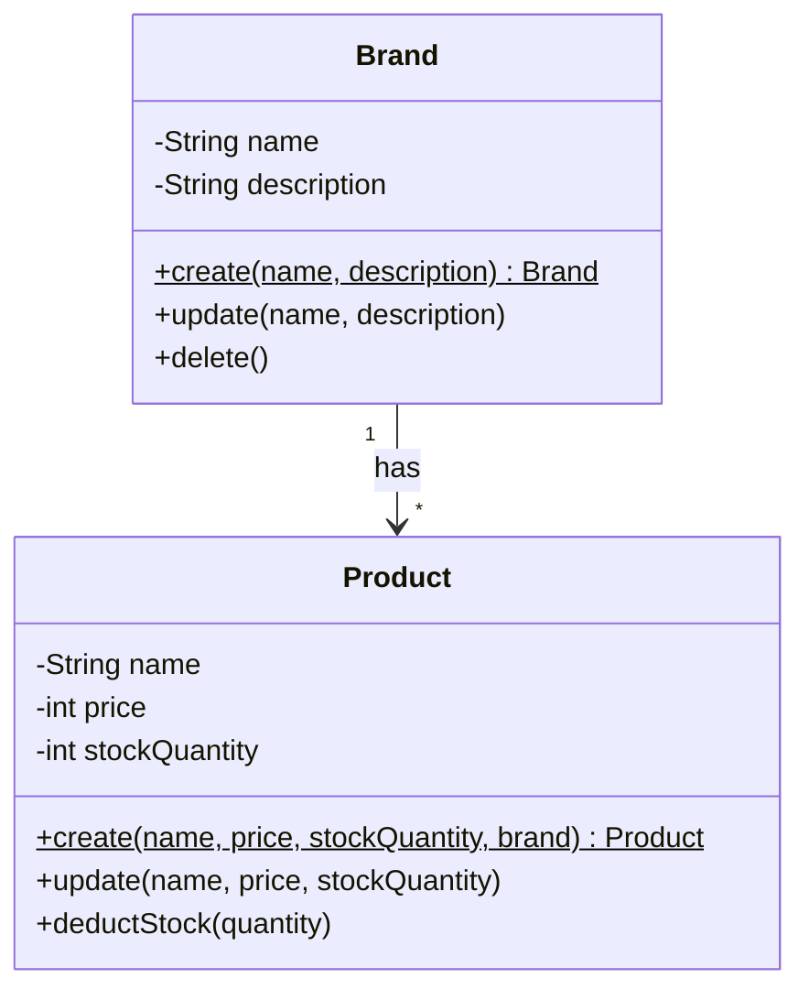

# 클래스다이어그램 Mermaid 문법

## 기본 구조



## 필드/메서드 표기

| 접근제어자 | 기호 |
|-----------|------|
| private | `-` |
| protected | `#` |
| public | `+` |
| static | `$` (메서드 뒤) |

## 관계

| 문법 | 의미 | 용도 |
|------|------|------|
| `-->` | 연관 (Association) | 일반적인 참조 |
| `*--` | 컴포지션 (Composition) | 생명주기 종속 |
| `o--` | 집합 (Aggregation) | 생명주기 독립 |
| `..>` | 의존 (Dependency) | 메서드 파라미터 등 |
| `<\|--` | 상속 (Inheritance) | extends |
| `<\|..` | 구현 (Realization) | implements |

## 다중성

```mermaid
Brand "1" --> "*" Product : has
Order "1" --> "1..*" OrderItem : contains
```

## 스테레오타입

```mermaid
class Money {
    <<VO>>
    -int amount
}
```

## 작성 규칙

- Entity, VO, Entity 간 관계, 핵심 행위 메서드만 포함
- Repository, Service, Facade, Controller, DTO, 인프라 인터페이스는 제외
- Entity는 도메인 필드와 행위 메서드만 표시
- BaseEntity 필드(id, createdAt, updatedAt, deletedAt) 생략
- VO는 `<<VO>>` 스테레오타입 표시
- 정적 팩토리 메서드는 `$` 표시
- 인프라 추상화(PasswordEncoder 등)는 설계 결정 섹션에 텍스트로 기술
