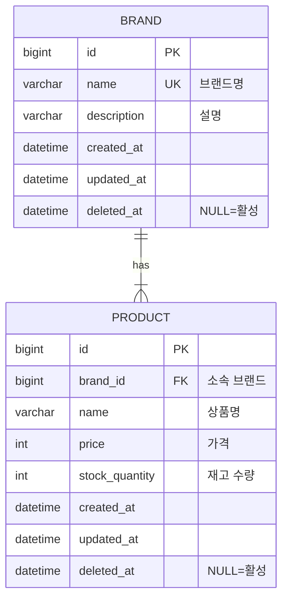

# ERD Mermaid 문법

## 기본 구조

## 컬럼 타입

| 타입 | Java 매핑 | 용도 |
|------|----------|------|
| bigint | Long | PK, FK |
| varchar | String | 문자열 |
| int | int/Integer | 숫자 |
| datetime | LocalDateTime | 타임스탬프 |
| date | LocalDate | 날짜 |
| boolean | boolean | 플래그 |
| text | String | 긴 텍스트 |

## 제약 조건

| 표기 | 의미 |
|------|------|
| PK | Primary Key |
| FK | Foreign Key |
| UK | Unique Key |

## 관계

| 문법 | 의미 |
|------|------|
| `\|\|--\|\|` | 1:1 |
| `\|\|--o{` | 1:N (선택) |
| `\|\|--\|{` | 1:N (필수) |
| `}o--o{` | N:M |

## 작성 규칙

- 테이블명: UPPER_SNAKE_CASE
- 컬럼명: lower_snake_case
- 모든 테이블에 `bigint id PK`
- Soft Delete 대상: `created_at`, `updated_at`, `deleted_at`
- Hard Delete / 삭제 불가: `created_at`만
- VO는 컬럼으로 풀어서 표현 (Money → int price)
- 관계는 논리적으로만 표현 (물리적 FK 미적용이 프로젝트 기본)
- 코멘트로 한글 설명 추가
