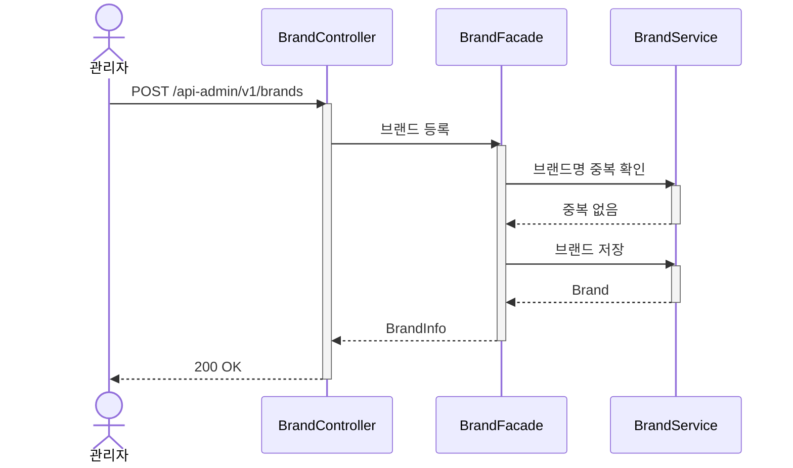

# 시퀀스다이어그램 Mermaid 문법

## 기본 구조



## 메시지 작성 규칙

- API 엔드포인트: 그대로 표기 (프론트 합의 지점)
- 내부 호출: 메서드명 대신 **행위 설명** 사용 (한글)
- 응답: 반환 타입 또는 결과 설명

## participant 네이밍

- 약어: 클래스명 첫 글자 조합 (BC = BrandController)
- 선언 순서: Controller → Facade → Service
- Repository는 표시하지 않음 (Service가 내부적으로 사용)
- 액터: 한글 (사용자, 관리자)

## 블록

### 트랜잭션 경계

```mermaid
critical @Transactional
    BF->>BS: 브랜드 저장
    BF->>PS: 하위 상품 연쇄 삭제
end
```

### 조건 분기

```mermaid
alt 브랜드명 중복
    BS-->>BF: 충돌 에러
else 정상
    BF->>BS: 브랜드 저장
end
```

### 선택적 실행

```mermaid
opt 브랜드명 변경 시
    BF->>BS: 브랜드명 중복 확인
end
```

## 화살표

| 문법 | 의미 |
|------|------|
| `->>` | 동기 호출 (실선) |
| `-->>` | 응답 반환 (점선) |
| `-)` | 비동기 호출 |
