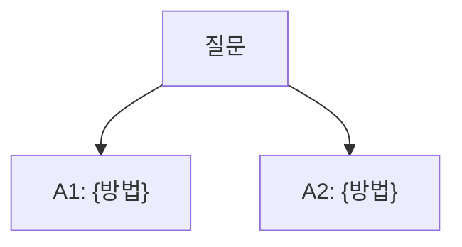
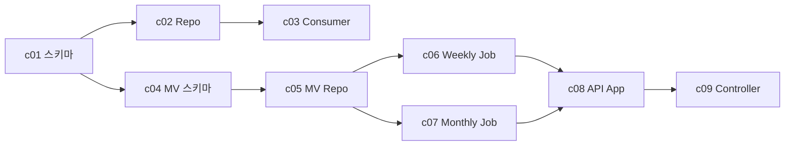

# granular-plan Skill

## 목적

대형 구현(커밋 10개 이상, 여러 모듈/앱 동시 수정, 크로스 도메인 스키마 변경)을 **메인 플랜 1개 + 커밋별 서브 플랜 N개**로 분리하여 관리한다.

**granular-plan이 해결하는 문제**:
- 단일 plan 파일이 700줄을 넘으면 Read 도구 한 번으로 안 읽히고, 특정 커밋만 집중해서 보기 어렵다
- 결정 하나가 바뀌면 plan 전체를 훑어 영향받는 커밋을 찾아야 하는데, 놓치기 쉽다
- 파일별 핵심 내용(DDL, 시그니처, 의사 코드)을 미리 적어두면 구현 속도가 빨라지지만, 단일 plan에 다 넣으면 가독성 파괴

**commit-plan vs granular-plan**:

| 기준 | commit-plan | granular-plan |
|------|-------------|---------------|
| 커밋 수 | 10개 이하 | 10개 이상 |
| 수정 모듈 | 1~2개 | 3개 이상 |
| 크로스 도메인 스키마 변경 | 없음 | 있음 |
| 파일당 상세도 | 파일 트리만 | 파일별 DDL/시그니처/의사 코드 |
| 결정 관리 | 단일 파일 인라인 | 메인 + 서브 간 캐스케이드 |

작은 작업이면 commit-plan을 쓴다. 판단이 애매하면 commit-plan으로 시작했다가 필요시 granular-plan으로 마이그레이션한다.

---

## 파일 레이아웃

```
docs/plan/{주차}/{브랜치명}/
  main.md                        # 메인 플랜 — 전역 결정, 커밋 목록, 파일 변경 맵, 의존성
  commits/
    c01-{slug}.md                # 커밋 1 상세
    c02-{slug}.md                # 커밋 2 상세
    ...
```

- **주차 추출**: 브랜치명에서 `week{N}` 추출 (예: `feat/week10-batch` → `week10`). 실패 시 `misc/`
- **브랜치명 정규화**: `/` → `-` (예: `feat/week10-batch` → `feat-week10-batch`)
- **slug**: 커밋의 핵심 주제를 kebab-case로 (예: `c01-product-metrics-daily-schema.md`)
- **번호**: `c{NN}` 2자리 제로패딩. 커밋 순서 = 파일명 정렬 순서

**디스커션 경로는 commit-plan과 동일** (`docs/plan`이 아닌 `docs/discussion/{주차}/{브랜치명}-discussion.md`)

---

## 실행 모드

granular-plan은 4가지 모드로 호출한다. 사용자가 명시하지 않으면 컨텍스트로 추론.

### 1. `init` — 메인 + 커밋 뼈대 생성

신규 브랜치에서 최초 호출. 다음을 수행:

1. 컨텍스트 수집 (git, 발제 문서, 기존 코드)
2. **Part 1 전역 결정 항목** 도출 (파일 구조/스키마에 영향을 주는 것만)
3. **커밋 개요 테이블** 작성 (커밋 수, 타입, 스코프, 한 줄 설명)
4. **파일 변경 맵** 초안 작성 (파일 → 어느 커밋에서 건드리는지)
5. **의존성 그래프** 작성 (Mermaid)
6. `commits/c{NN}-{slug}.md` 파일을 **뼈대만** 각각 생성 (목적, 파일 목록, TBD 섹션)

이 단계에서 커밋 서브 플랜의 상세 내용은 비워둔다. `expand` 단계에서 채운다.

### 2. `expand {N}` — 특정 커밋 서브 플랜 상세화

`commits/c{NN}-*.md`를 열고:
- 변경 파일 전체 목록 확정
- 각 파일별 핵심 내용 (DDL, 시그니처, 의사 코드) 작성
- 커밋 국한 결정 항목 도출 (대안 제시)
- upstream/downstream 커밋 명시
- 테스트 시나리오
- 체크리스트

여러 커밋을 한 번에 확장하려면 `expand 1..3` 또는 `expand all` 형태로 요청.

### 3. `sync` — 현재 코드 상태 반영

- `git log`/`git diff`로 각 커밋이 이미 수행되었는지 판단
- 메인 플랜의 상태 열(⬜/🔧/✅) 갱신
- 이미 작성된 파일과 플랜의 시그니처가 불일치하면 `⚠️ 드리프트` 플래그 삽입

### 4. `cascade {N}` — 커밋 N의 결정 변경 전파

커밋 N의 서브 플랜에서 결정이 바뀐 직후 호출:

1. 변경된 결정 라인을 추출
2. 커밋 N의 `downstream` 목록에 있는 커밋들의 서브 플랜을 읽음
3. 각 서브 플랜에서 **이전 결정에 의존하는 라인**을 찾아 수정 또는 `⚠️ 영향 받음` 플래그 삽입
4. **메인 플랜의 파일 변경 맵** 재계산 (파일이 추가/삭제/이동된 경우)
5. discussion 파일에 "커밋 N 결정 변경 + 영향 전파 결과" 기록

---

## 메인 플랜 (`main.md`) 구조

```markdown
# {브랜치명} — 구현 계획 (메인)

> 생성: {날짜} | 마지막 업데이트: {날짜} | 스킬: granular-plan

## Part 0. 개요

{1~3 문단으로 이번 브랜치의 목적/범위/예상 커밋 수}

## Part 1. 전역 결정 사항

> 파일 구조, 스키마, 모듈 경계에 영향을 주는 결정만 여기에.
> 특정 커밋 내부의 결정은 해당 서브 플랜에 둔다.

### 결정 A: {주제}



| | 방식 | 장점 | 단점 | 영향 커밋 |
|---|------|------|------|----------|
| A-1 | ... | ... | ... | c01, c03 |
| A-2 | ... | ... | ... | c01, c04 |

> 결정: {선택} — {이유}
> 영향: c01, c03 수정 필요 (cascade 실행 이력)

### 결정 B: ...

## Part 2. 커밋 개요

| # | 파일 | 타입 | 스코프 | 설명 | 의존 | 상태 |
|---|------|------|--------|------|------|------|
| 1 | [c01-...](commits/c01-product-metrics-daily-schema.md) | feat | metrics | 일간 메트릭 스키마 | - | ⬜ |
| 2 | [c02-...](commits/c02-product-metrics-daily-repo.md) | feat | metrics | Repository + upsert | c01 | ⬜ |
| 3 | [c03-...](commits/c03-streamer-consumer.md) | feat | streamer | Consumer 확장 | c02 | ⬜ |

## Part 3. 파일 변경 맵 (역인덱스)

> 파일 → 커밋. cascade 판단에 사용.

| 파일 경로 | c01 | c02 | c03 | ... | 비고 |
|-----------|-----|-----|-----|-----|------|
| `apps/commerce-streamer/.../ProductMetricsDailyModel.java` | 생성 | - | - | - | 엔티티 |
| `apps/commerce-streamer/.../ProductMetricsDailyJpaRepository.java` | - | 생성 | - | - | Repo |
| `apps/commerce-streamer/.../CatalogEventConsumer.java` | - | - | 수정 | - | |
| `db/migration/V202604__*.sql` | 생성 | - | - | - | Flyway |

## Part 4. 커밋 의존성 그래프



## Part 5. 후속 과제 (이 브랜치 밖)

> 플랜 비대화를 막기 위해 의도적으로 제외된 항목.
> 운영 단계 또는 다음 브랜치에서 다룸.

- R: 지연 이벤트 재집계 → 다음 브랜치
- T: `stat_date` RANGE 파티셔닝 → 3개월 후 재검토
- U: Observability (Pushgateway) → 운영팀
- ...
```

### 메인 플랜 작성 규칙

- **전역 결정 항목은 5개 이내**로 압축. 더 많으면 Part 1이 비대해지고 서브 플랜과 중복
- **파일 변경 맵은 역인덱스**: 파일을 키로, 커밋을 값으로 → cascade 시 "이 파일을 건드리는 커밋이 더 있나?" 즉시 확인 가능
- **의존성 그래프는 Mermaid**: 텍스트 나열보다 시각화가 커밋 순서 판단에 유리
- **후속 과제 섹션 필수**: "이 브랜치에서 **하지 않을** 것"을 명시해야 플랜 비대화를 막을 수 있다
- **커밋 상태(⬜/🔧/✅)는 sync 모드에서만 갱신** — 수동 편집 금지

---

## 커밋 서브 플랜 (`commits/c{NN}-{slug}.md`) 구조

```markdown
# c{NN} · `{type}({scope}): {설명}`

> 메인 플랜: [main.md](../main.md)
> 상태: ⬜ | 의존: c{MM} | downstream: c{XX}, c{YY}

## 목적

{이 커밋이 해결하는 구체적 문제. 1~3 문단.}

## 변경 파일 목록

| 파일 | 작업 | 비고 |
|------|------|------|
| `apps/.../Foo.java` | 생성 | 엔티티 |
| `apps/.../Bar.java` | 수정 | 메서드 추가 |
| `db/migration/V...__foo.sql` | 생성 | 테이블 |

## 파일별 핵심 내용

### `apps/.../FooModel.java` (생성)

{이 파일의 역할 한 줄}

```java
// 핵심 필드/메서드 시그니처 의사 코드
public class FooModel extends BaseEntity {
    private Long refProductId;
    private LocalDate statDate;
    // ...
}
```

주요 포인트:
- 필드 X는 ~ 이유로 NOT NULL
- 인덱스 Y는 ~ 쿼리를 위함

### `apps/.../FooJpaRepository.java` (생성)

```java
@Query(value = """
    INSERT INTO foo (...) VALUES (...)
    ON DUPLICATE KEY UPDATE ...
    """, nativeQuery = true)
@Modifying
void upsert(@Param("x") Long x, @Param("y") LocalDate y);
```

주요 포인트:
- `ON DUPLICATE KEY UPDATE`로 멱등성 보장
- `last_event_at`은 `GREATEST`로 더 큰 값 유지

### `db/migration/V202604__foo.sql` (생성)

```sql
CREATE TABLE foo (
  id BIGINT AUTO_INCREMENT PRIMARY KEY,
  ref_product_id BIGINT NOT NULL,
  stat_date DATE NOT NULL,
  UNIQUE KEY uk_foo (ref_product_id, stat_date),
  KEY idx_foo_date (stat_date)
);
```

## 이 커밋의 결정 항목

> 메인 플랜의 전역 결정이 아닌, 이 커밋 내부의 구현 선택지만.

> 선택사항: `last_event_at` 갱신 방식
> A: GREATEST 사용 — 역순 이벤트에 안전 / 문법 복잡
> B: 항상 덮어쓰기 — 단순 / 역순 이벤트에서 과거 값으로 오염
>
> 결정: A — GREATEST. 카프카 파티션 재분배 시 역순 이벤트 발생 가능하므로 안전 우선.

## upstream / downstream

**upstream** (이 커밋이 의존하는 것):
- c01: `ProductMetricsDailyModel` 엔티티가 먼저 있어야 Repository가 구현 가능

**downstream** (이 커밋의 결정이 영향을 주는 것):
- c03: 이 커밋의 Repository 메서드 시그니처가 Consumer 호출부에 직접 반영됨
- c06: Weekly Job의 Reader SQL이 이 테이블의 인덱스에 의존

> cascade 실행 이력:
> - 2026-04-12: `last_event_at` 결정 A 확정 → c03 Consumer 호출부의 `eventAt` 파라미터 추가됨 (영향 전파 완료)

## 테스트 시나리오

| # | 시나리오 | 기대 결과 |
|---|---------|----------|
| 1 | upsert 2회 호출 | view_count 누적 정확 |
| 2 | 동시성 10스레드 | 유니크 키 락으로 정합성 |
| 3 | 역순 eventAt | last_event_at이 더 큰 값 유지 |

## 체크리스트

- [ ] 엔티티 생성 (BaseEntity 상속)
- [ ] Repository 인터페이스 + JPA 구현
- [ ] Flyway 마이그레이션 스크립트
- [ ] TestContainers 통합 테스트
- [ ] 메인 플랜 상태 ⬜ → ✅

## 참고

- 발제 문서: `docs/discussion/week10/...`
- 관련 week9 결정: `product_daily_signals` 재사용 여부 논의 (discussion)
```

### 커밋 서브 플랜 작성 규칙

- **파일별 핵심 내용은 "복붙하면 컴파일되기 직전"까지** 상세하게. 구현 시점에 또 고민하지 않도록
- **의사 코드는 타입/시그니처/핵심 로직만**. 구현 본문까지 다 쓰면 plan이 아니라 코드
- **결정 항목은 이 커밋 국한**만. 전역 결정은 메인 플랜으로
- **upstream/downstream 명시는 필수** — cascade 모드가 이 필드를 읽어 전파 대상을 찾음
- **cascade 실행 이력 append** — 결정 변경이 일어난 날짜와 전파 결과를 누적. 나중에 "왜 이 파일이 수정됐지?" 추적 가능
- **체크리스트 마지막 항목은 항상 "메인 플랜 상태 갱신"**

---

## Cascading 규칙

### 원리

커밋 서브 플랜에서 결정이 바뀌면 다음을 순서대로 수행:

1. **해당 서브 플랜 수정** — 결정 라인 + `cascade 실행 이력`에 날짜/내용 append
2. **downstream 목록 읽기** — 이 커밋의 downstream에 있는 모든 커밋 번호
3. **downstream 서브 플랜 열어서 검사**:
   - 변경된 결정에 의존하는 라인(파일명, 시그니처, 스키마 필드 등)이 있으면 **즉시 수정**
   - 즉시 수정이 불가능(더 큰 재설계 필요)하면 **`⚠️ 영향 받음: c{N} 결정 변경` 플래그 삽입** + 메인 플랜의 상태를 `🔧`로 표시
4. **메인 플랜 Part 3 (파일 변경 맵) 재계산** — 파일 추가/삭제/이동 시
5. **메인 플랜 Part 4 (의존성 그래프) 재검토** — 의존 관계 변경 시
6. **discussion 파일에 기록** (CLAUDE.md 필수 규칙)

### 전파 판단 기준

downstream 서브 플랜에서 **어떤 라인이 영향받는지**를 판단할 때:

| 변경 유형 | 영향 라인 탐지 |
|-----------|---------------|
| 파일 경로/이름 변경 | 해당 경로 문자열 검색 |
| 메서드 시그니처 변경 | 메서드명 + 파라미터 타입 검색 |
| 스키마 필드 추가/제거 | 컬럼명 검색 |
| 결정값 자체 | 전역 결정이면 메인 플랜 Part 1, 커밋 결정이면 서브 플랜 결정 블록 |

### 전파하지 않아도 되는 경우

- downstream 커밋이 이미 `✅ 완료` 상태 → 코드 직접 수정으로 해결. 플랜 수정은 **이력으로만** 기록
- 변경이 "동등한 리팩터"(외부 시그니처 불변) → downstream 영향 없음. cascade 실행 이력에 "영향 없음" 기록

### cascade 실행 이력 형식

```markdown
> cascade 실행 이력:
> - 2026-04-12: 결정 A 변경 (B-1 → B-3) → downstream c03, c05 영향 확인 후 수정 완료
> - 2026-04-15: 파일 `FooRepo.java` → `FooRepository.java` 리네임 → 영향 커밋 없음 (sync로 반영)
```

---

## 실행 절차 요약

### `init` 실행 시

```
1. git branch, git log, git diff 수집
2. 발제 문서 (docs/discussion/{주차}/) 읽기
3. 기존 코드 분석 (재사용 가능한 인프라)
4. 사용자와 대화로 Part 1 전역 결정 5개 이내 확정
5. 커밋 개요 테이블 작성 (10~20개 예상)
6. docs/plan/{주차}/{브랜치명}/main.md 생성
7. docs/plan/{주차}/{브랜치명}/commits/c{NN}-*.md 뼈대 N개 생성
   (뼈대: 목적 한 줄, 변경 파일 목록 TBD, 나머지 TBD)
8. 사용자에게 "init 완료, expand {N}으로 상세화 가능" 안내
```

### `expand {N}` 실행 시

```
1. commits/c{NN}-*.md 읽기
2. 메인 플랜 Part 1의 전역 결정 참조
3. 변경 파일 목록 확정 — 메인 플랜 Part 3 파일 변경 맵과 교차 검증
4. 파일별 핵심 내용 작성 (DDL, 시그니처, 의사 코드)
5. 이 커밋 국한 결정 항목 도출 → 사용자 확인
6. upstream/downstream 명시
7. 테스트 시나리오 + 체크리스트
8. 메인 플랜 Part 3에 파일이 추가됐으면 역인덱스 갱신
9. discussion 파일에 결정 내용 기록
```

### `sync` 실행 시

```
1. git log main..HEAD 로 이미 수행된 커밋 확인
2. 커밋 메시지와 메인 플랜의 "커밋 개요"를 매칭
3. 완료된 커밋 → 상태 ✅
4. 진행 중(파일은 수정됐으나 커밋 안 됨) → 상태 🔧
5. 미착수 → 상태 ⬜
6. 드리프트 검사: 완료된 커밋의 실제 코드와 서브 플랜의 시그니처 비교
7. 불일치 시 해당 서브 플랜에 `⚠️ 드리프트` 플래그 + 실제 코드 반영 여부 사용자에게 질문
```

### `cascade {N}` 실행 시

```
1. commits/c{NN}-*.md 읽기 — 최근 변경된 결정 확인
2. downstream 목록 추출
3. downstream 각 파일 읽기
4. 영향 라인 탐지 → 수정 or `⚠️ 영향 받음` 플래그
5. 메인 플랜 Part 3, Part 4 재계산
6. cascade 실행 이력에 결과 append (모든 관련 파일)
7. discussion 파일에 전파 결과 기록
8. 사용자에게 수정된 파일 목록 보고
```

---

## 미니멀 예시 — 초기 init 결과물

```
docs/plan/week10/feat-week10-batch/
├── main.md                                      (400줄, Part 0~5)
└── commits/
    ├── c01-product-metrics-daily-schema.md      (뼈대, expand 전)
    ├── c02-product-metrics-daily-repo.md        (뼈대)
    ├── c03-streamer-consumer-expand.md          (뼈대)
    ├── c04-mv-product-rank-schema.md            (뼈대)
    ├── c05-mv-product-rank-repo.md              (뼈대)
    ├── c06-weekly-rank-job.md                   (뼈대)
    ├── c07-monthly-rank-job.md                  (뼈대)
    ├── c08-ranking-app-period-branch.md         (뼈대)
    ├── c09-ranking-controller-period-param.md   (뼈대)
    ├── c10-batch-integration-test.md            (뼈대)
    ├── c11-api-period-test.md                   (뼈대)
    └── c12-operation-guide.md                   (뼈대)
```

init 시점에는 뼈대만. expand 시점에 각 파일이 200~400줄 수준까지 상세화.

---

## 단일 plan → granular-plan 마이그레이션 가이드

기존 `docs/plan/{주차}/{브랜치명}-plan.md` 단일 파일을 granular-plan 구조로 옮길 때:

1. **원본 파일 읽어서 커밋 목록 추출**
2. `docs/plan/{주차}/{브랜치명}/main.md` 생성 (Part 1 전역 결정 + Part 2 개요 + Part 3 파일 맵)
3. `commits/c{NN}-*.md` 파일을 커밋 개수만큼 생성
4. 원본의 각 "Commit N" 섹션을 해당 서브 플랜으로 이동
5. **원본 파일 보존 또는 삭제 여부는 사용자 결정** — 기본은 `{브랜치명}-plan-legacy.md`로 리네임하여 보존
6. discussion에 "granular-plan으로 마이그레이션" 기록

마이그레이션은 반자동 — 스킬은 구조 변환까지 수행하되, 전역 결정 항목 선별(Part 1 축소)은 사용자와 대화로 진행.

---

## 작성 원칙

- **사실 기반**: 코드와 git에서 확인된 것만. 추측 금지
- **미결정은 `> 선택사항:` 마커**: 빈칸으로 두고 사용자 선택 후 `> 결정:` 추가
- **장황한 설명은 discussion으로**: plan은 구조와 결정 요약, discussion은 논의 과정
- **cascade 이력 누적**: 결정 변경은 덮어쓰지 말고 append
- **상태 최신화는 sync 모드에서만**: 수동 편집 금지

---

## Never Do

- 커밋 서브 플랜 없이 메인 플랜에 모든 내용을 몰아넣기 → commit-plan 쓰는 것과 차이 없음
- 전역 결정 10개 이상 Part 1에 나열 → 5개 이내로 압축, 나머지는 커밋 서브 플랜으로
- 결정 변경 후 cascade 생략 → 반드시 downstream 검사
- cascade 실행 이력을 남기지 않고 downstream 수정 → 추적 불가
- discussion 파일 기록 생략 → CLAUDE.md 필수 규칙 위반
- init 시점에 서브 플랜을 상세화 → 뼈대만. 상세화는 expand 단계에서

---

## 관련 스킬

- **commit-plan** — 작은 브랜치용. 단일 파일 plan
- **pr-creation** — PR 작성 시 main.md와 서브 플랜의 완료 상태를 참조
- **technical-writing** — 서브 플랜의 결정 항목과 cascade 이력이 블로그 글 소스가 됨