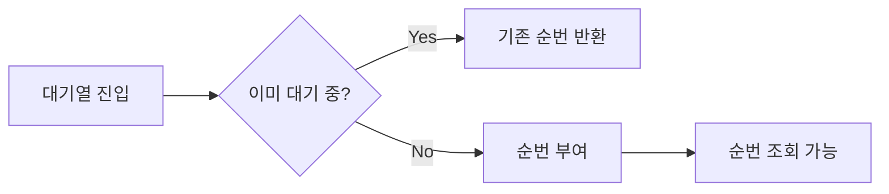

# PR 생성 가이드

## 개요

기능 구현이 완료된 후, 코드와 발제 문서를 분석하여 PR 문서를 작성하는 워크플로우입니다.

---

## 핵심 원칙: 발제의 스텝을 따라가며, 선택을 근거로 증명한다

PR 문서의 목적은 **"무엇을 구현했다"가 아니라 "발제가 제시한 문제를 스텝별로 어떻게 해결했고, 각 선택이 왜 논리적인지 근거로 증명하는 것"** 이다.

좋은 PR은 다음 흐름을 따른다:
1. **발제의 문제 정의**를 먼저 명시한다 (발제 문서에서 그대로 가져온 핵심 문제)
2. **스텝별 접근**: 발제가 제시한 각 Step에서 어떤 선택을 했는지 서술한다
3. **선택 근거**: 대안을 비교했고, 어떤 테스트/수치/실험으로 결정했는지 보여준다
4. **다이어그램**: 핵심 흐름은 Mermaid로 시각화한다

**모르면 질문하지 말고, 코드와 테스트 결과에서 답을 찾는다.** 근거가 없으면 해당 항목에 `(검증 필요)` 표시를 남긴다.

---

## 워크플로우

### 전체 흐름

```
[Step 1] 발제 문서 수집    docs/discussion/{주차}/ 폴더의 모든 문서 확인
[Step 2] 개발 기록 분석    커밋 히스토리 + 변경 파일 구조
[Step 3] PR 문서 작성      volume-{n}-pr.md — 스텝 기반 선택 근거 서술
```

저장 경로: `.idea/volume-{n}-pr.md`

---

### Step 1: 발제 문서 수집

브랜치명에서 주차를 추출하고 해당 폴더의 문서를 모두 확인한다.

```bash
git rev-parse --abbrev-ref HEAD
# 예: feat/week8-wait-queue → 주차: week8
```

#### 수집 대상

- `docs/discussion/{주차}/` 폴더 내 **모든 파일**을 읽는다
  - 과제 설명 문서 (예: `feat-week8-wait-queue.md`) — 문제 정의, 스텝, 체크리스트
  - discussion 파일 (예: `feat-week8-wait-queue-discussion.md`) — 실험 기록, 의사결정 히스토리
- `docs/plan/{주차}/{브랜치명}-plan.md` — 구현 전 합의한 방향

#### 발제 문서에서 추출할 정보

| 항목 | 추출 방법 |
|------|----------|
| **핵심 문제** | 발제 문서 상단의 "문제 분석" 또는 "Summary" 섹션 |
| **Step 목록** | 발제 문서의 단계별 구성 (Step 1, Step 2, ...) |
| **키워드** | 발제 문서의 Keywords 섹션 |
| **체크리스트** | 각 Step에 명시된 구현 항목 또는 학습 목표 |

---

### Step 2: 개발 기록 분석

브랜치의 커밋 히스토리와 변경 파일을 분석하여 발제 스텝과 매핑한다.

```bash
git log main..HEAD --oneline
git diff main..HEAD --shortstat
git log main..HEAD --stat
```

발제의 Step과 커밋을 대응시킨다:

```
발제 Step 1 → 커밋 A, B, C
발제 Step 2 → 커밋 D, E
...
```

이 매핑이 PR의 "스텝별 접근" 섹션의 골격이 된다.

---

### Step 3: PR 문서 작성

코드에서 설계 선택의 근거를 찾을 수 없는 경우:
- discussion 문서, 커밋 메시지, 테스트 클래스를 우선 탐색한다
- 그래도 근거를 찾을 수 없으면 `(검증 필요)` 표시를 남긴다
- **추론으로 근거를 지어내지 않는다**

#### PR 템플릿 구조

```markdown
## 📌 Summary

* 발제 문제: {발제 문서에서 정의한 핵심 문제를 1~2문장으로}
* 접근 방향: {이 PR이 문제를 해결한 큰 그림 — 스텝 구성 요약}
* 결과: {구현 완료된 것 — 기능, 테스트 수, 측정 수치}

---

## 🗂️ 발제 스텝별 접근

### Step {N}. {발제 문서의 스텝 제목}

**발제 의도**: {이 스텝이 학습/구현하려는 것}

**선택한 방식**: {구체적으로 어떻게 구현했는지}

**고려한 대안**:
- A: {대안 A} — {장점 / 단점}
- B: {대안 B} — {장점 / 단점}

**선택 근거**: {테스트 결과, 수치, 실험, 트레이드오프 중 해당되는 것}

**결정**: {무엇을 선택했고, 무엇을 포기했는지}

> (측정값이 있다면): Before: {수치} → After: {수치}

---

## 🏗️ Design Overview

### 변경 범위

* 영향 받는 모듈/도메인:
    * {모듈/패키지 목록}
* 신규 추가:
    * {새로 추가된 클래스, API, 기능}
* 제거/대체:
    * {삭제된 것, 대체된 것}

### 주요 컴포넌트 책임

* `{클래스명}`:
    * {이 클래스가 맡는 역할}

---

## 🔁 Flow Diagram

### {핵심 흐름 이름}

```mermaid
sequenceDiagram
  autonumber
  participant Client
  participant Controller as {Controller명}
  participant Service as {Service명}

  Client->>Controller: {HTTP 메서드} {경로}
  Controller->>Service: {메서드 호출}
  ...
  alt {실패 조건}
    ...-->>Client: {에러 코드} ApiResponse FAIL
  else {성공 조건}
    ...-->>Client: {성공 코드} ApiResponse SUCCESS
  end
```

---

## ✅ 테스트 현황

| 종류 | 클래스 | 테스트 수 | 검증한 시나리오 |
|------|--------|----------|----------------|
| 단위 | ... | N | ... |
| 통합 | ... | N | ... |

---

## ❓ Review Questions

{리뷰어가 물어볼 만한 설계 선택 2~3가지}
1. ...
2. ...
```

---

## 스텝별 접근 작성 규칙

### 발제 스텝과 1:1 대응

- 발제 문서의 Step 수만큼 섹션을 만든다
- 발제에 Step 구분이 없다면 기능 단위로 나눈다
- 각 섹션은 반드시: 발제 의도 → 선택한 방식 → 근거 순서로 서술한다

### 선택 근거 서술

각 설계 선택에는 반드시 다음 중 하나 이상이 있어야 한다:

- **실험/테스트 결과**: 직접 테스트한 수치 또는 PASS/FAIL 결과
- **계산식**: 설정값·임계값의 도출 과정
- **트레이드오프 명시**: "~은 포기하지만, ~을 얻는다"
- **발제 문서 근거**: 발제가 직접 제시한 제약 조건

근거가 "경험적으로 적절하다", "일반적으로 좋다" 수준이면 `(검증 필요)`로 표시한다.

**나쁜 예** (이유만):
> "Polling 방식을 선택했다. 구현이 단순하기 때문이다."

**좋은 예** (근거 포함):
> "Polling을 1단계로 선택. 발제 문서에서 'Polling → SSE 전환'을 권장하며, 테스트 기준 최대 500명 대기 시 2초 주기 Polling은 초당 250req 추가 부하로 기존 TPS 내 수용 가능. SSE는 로드밸런서 설정 변경 비용이 있어 1단계 배제."

### 다이어그램 포함 기준

다음 중 하나라도 해당하면 Mermaid 다이어그램을 포함한다:

- 여러 컴포넌트가 관여하는 흐름 (3개 이상의 레이어를 거치는 경우)
- 비동기 처리나 이벤트 발행/수신이 포함된 경우
- 분기(성공/실패, 조건부 처리)가 있는 경우
- 스텝별 상태 전이가 있는 경우

flowchart는 컴포넌트 간 의존 관계나 상태 전이 표현에 사용한다:



---

## Mermaid Sequence Diagram 작성 규칙

### participant 구성

```
Client → Controller → Service/Facade → Reader → Repository → Model → DB
```

### 규칙

1. **autonumber 사용**: 메시지에 순서 번호를 붙인다
2. **alt/else 블록**: 성공/실패 분기를 명확히 표현한다
3. **에러 응답에 ErrorType 명시**: `CoreException(CONFLICT)` 형태로 어떤 타입인지 표기
4. **self-call 표현**: `Model->>Model: validate()` — 내부 검증 로직
5. **JPA dirty checking**: save() 없이 `TX commit (dirty checking flush)`로 표현
6. **비동기 처리**: `Note over Handler: @Async (별도 스레드)`로 구분