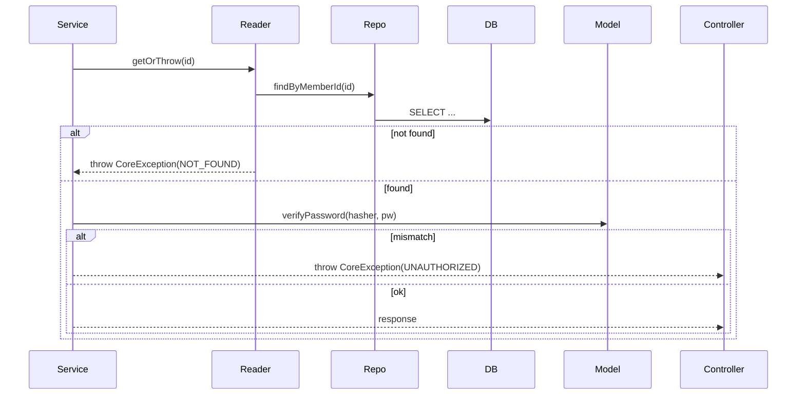
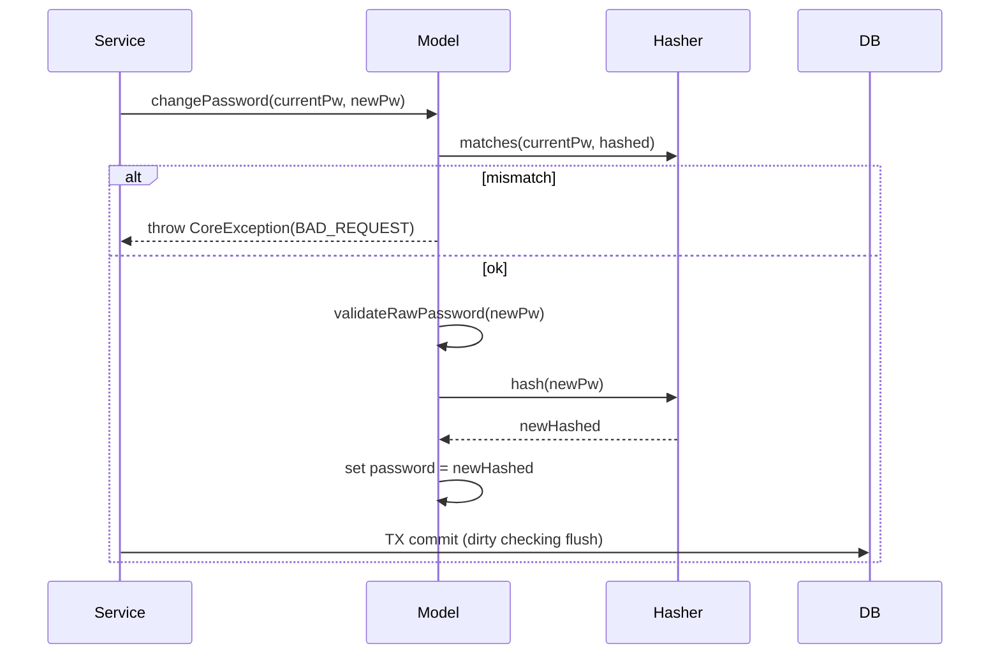

# PR 생성 가이드

## 개요

기능 구현이 완료된 후, 코드를 분석하고 개발자의 의사결정을 확인하여 PR 문서를 작성하는 3단계 워크플로우입니다.

---

## 핵심 원칙: 고민과 결정을 드러내는 PR

PR 문서의 목적은 **"무엇을 구현했다"가 아니라 "왜 이렇게 구현했는지"를 설명하는 것**이다.

좋은 PR은 다음 질문에 답한다:
- 어떤 문제를 인식했는가? (구체적 수치, 증거)
- 어떤 대안을 고려했는가?
- 왜 이 방법을 선택했는가? (실험 결과, 트레이드오프)
- 선택으로 무엇을 얻고 무엇을 포기했는가?

**나쁜 예** (무엇을 했는지만 나열):
> "Redis 캐싱을 적용했다. TTL은 1분이다."

**좋은 예** (고민과 결정이 드러남):
> "목록 API에서 반복 호출 시 매번 DB full scan이 발생했다. ID 리스트 캐싱과 전체 데이터 캐싱을 비교 테스트한 결과 ID 리스트 방식이 RPS 682/s vs 573/s로 19% 우세했다. 단, 캐시 만료 시 일시적 stale 가능성을 TTL 1분으로 허용했다."

---

## 워크플로우

### 전체 흐름

```
[Step 1] volume-{n}-pr.md       답변 반영 + 코드 수정(필요 시) → 최종 PR 문서 생성
```

저장 경로: `.idea/volume-{n}*.md`

---

### Step 1: 개발 기록 작성 (`volume-{n}.md`)

브랜치의 커밋 히스토리와 변경 파일을 분석하여 개발 흐름을 Phase 단위로 정리한다.

#### 수집 정보

1. **커밋 히스토리**: `git log {base}..HEAD` — 해시, 날짜, 메시지 테이블
2. **변경 통계**: `git diff {base}..HEAD --shortstat` — 파일 수, 추가/삭제 라인
3. **커밋별 변경**: `git log {base}..HEAD --stat` — 각 커밋의 영향 파일

#### 구성

```markdown
# Volume {n} - {도메인} 구현 기록

## 개요
시작 커밋 ~ 종료 커밋 범위, 총 변경 통계

## 커밋 히스토리
| Hash | 날짜 | 커밋 메시지 |

## Phase 1: {주제}
- 변경 내용, 추가된 클래스/메서드, 테스트

## Phase N: ...

## 최종 파일 구조
프로덕션 코드 트리

## API 엔드포인트 현황
| Method | Path | 설명 | 인증 |

## 테스트 현황
| 종류 | 클래스 | 테스트 수 |

## 아키텍처 패턴 요약
적용된 패턴, 리팩토링 포인트
```

#### Phase 분류 기준

- 관련된 커밋을 기능/레이어 단위로 묶는다
- 예: VO 구축 → 서비스 레이어 → API 레이어 → 리팩토링

---

### Step 2: 의사결정 질문 (`volume-{n}-question.md`)

코드를 전수 분석하여 설계/구현 의도가 불분명한 부분을 질문한다.

#### 질문 도출 관점

| 관점 | 예시 |
|------|------|
| **레이어 규칙 위반** | Domain에서 Infrastructure를 import하고 있는가? |
| **타입 설계 일관성** | 일부 필드만 VO로 래핑하고 나머지는 원시 타입인 이유? |
| **중복/비효율 로직** | 같은 검증이 여러 곳에서 실행되는가? |
| **미사용 코드** | 테스트에서만 쓰이는 생성자/메서드가 있는가? |
| **규칙 불일치** | CLAUDE.md의 규칙과 실제 코드가 어긋나는 곳? |
| **HTTP 시맨틱** | 에러 코드/응답 코드가 의미에 맞는가? |
| **캡슐화 수준** | 내부 상태(getter)가 불필요하게 노출되는가? |

#### 질문 형식

```markdown
## {번호}. {주제 한 줄}

{현상 설명 — 코드 인용 포함}

{왜 의문인지 근거 — CLAUDE.md 규칙, HTTP 표준, 설계 원칙 등}

**{핵심 질문 — 굵게}**
```

#### 개발자 답변 유형과 후속 처리

| 답변 유형 | 후속 처리 |
|-----------|----------|
| "삭제해줘" | PR에서 해당 항목 제외 |
| "의도적 결정입니다. 이유는..." | PR의 Context & Decision에 근거 서술 |
| "수정 바랍니다" | 코드 수정 후 PR에 Before/After 기록 |
| "추천해주고 수정해주세요" | 방안 제시 → 코드 수정 → PR에 기록 |
| "요구사항입니다" | PR에서 해당 항목 제외 |

---

### Step 3: PR 문서 작성 (`volume-{n}-pr.md`)

답변을 반영하여 최종 PR 문서를 생성한다.

#### PR 템플릿 구조

```markdown
## 📌 Summary

* 배경: {기존 상태의 구체적 문제 — 가능하면 수치 포함}
* 목표: {이 PR이 달성하려는 것을 1~2문장으로}
* 결과: {실제 달성한 것 — 기능, 테스트 수, 측정 수치}

---

## 🧭 Context & Decision

### {번호}. {결정 주제 — 무엇을 어떻게 해결했는지 한 줄}

**문제**: {어떤 현상이 문제였는지, 가능하면 수치/로그/EXPLAIN 인용}

**고려한 대안**:
- A: {대안 A} — {장점 / 단점}
- B: {대안 B} — {장점 / 단점}

**결정**: {무엇을 선택했는지}

**이유**: {왜 이 선택인지 — 실험 결과, 트레이드오프, 제약 조건}

> (측정값이 있다면): Before: {수치} → After: {수치} ({배율}배)

---

## 🏗️ Design Overview

### 변경 범위

* 영향 받는 모듈/도메인:
    * {모듈/패키지 목록}
* 신규 추가:
    * {새로 추가된 클래스, API, 기능}
* 제거/대체:
    * {삭제된 것, 대체된 것}

### 주요 컴포넌트 책임

* `{클래스명}`:
    * {이 클래스가 맡는 역할 설명}
* ...

---

## 🔁 Flow Diagram

### Main Flow

#### {n}) {API 이름} `{METHOD} {PATH}`

```mermaid
sequenceDiagram
  autonumber
  participant Client
  participant Controller as {Controller명}
  participant Service as {Service명}
  ...

  Client->>Controller: {HTTP 메서드} {경로}\n{요청 설명}
  Controller->>Service: {메서드 호출}
  ...
  alt {실패 조건}
    ...-->>Client: {에러 코드} ApiResponse FAIL
  else {성공 조건}
    ...-->>Client: {성공 코드} ApiResponse SUCCESS
  end
```

### 예외 흐름

```mermaid
sequenceDiagram
  autonumber
  participant App as ApiControllerAdvice
  participant Client

  Note over App: CoreException(ErrorType) 발생 시
  App-->>Client: {코드} {ErrorType}
  ...
```

---
```

---

## Context & Decision 작성 규칙

### 핵심: 사고 흐름을 자연스럽게 서술한다

각 결정 항목은 다음 흐름으로 서술한다:

```
1. 어떤 현상/문제를 발견했는가
2. 어떤 대안을 검토했는가
3. 어떤 실험이나 근거로 비교했는가
4. 최종적으로 무엇을 선택했고, 무엇을 포기했는가
```

결정이 여러 개인 경우 **번호를 붙여 독립 섹션으로 분리**한다.
각 결정은 독자가 "왜 이렇게 했는지"를 납득할 수 있어야 한다.

### 수치와 실험 결과 포함

- 성능 문제라면 EXPLAIN 결과, RPS, p99 latency, 에러율 등을 인용한다
- 부하 테스트 결과가 있으면 Before/After를 구체적으로 기재한다
- 실험 없이 추론만으로 결정한 경우에도 그 근거(제약, 원칙, 위험)를 명시한다

**예시**:
```
Before: full table scan 94,664 rows, 340ms
After: idx_products_status_like 적용, 1.9ms (109x 개선)
```

### 대안 서술

- 실제로 고려한 대안이 없더라도 "왜 다른 방법을 안 했는지"를 설명하기 위해 최소 2개 대안을 제시한다
- 각 대안은 장단점을 포함하되, 단순 나열보다 "왜 이 대안이 문제 상황에 맞지 않았는지"를 서술한다
- 최종 결정에서 포기한 것을 명확히 한다 ("~은 포기하지만, ~을 얻는다")

### volume-{n}-question.md의 답변 반영 방식

| 답변 유형 | 반영 위치 |
|-----------|----------|
| 의도적 결정 + 이유 | Context & Decision의 해당 결정 항목에 "이유" 서술 보강 |
| 코드 수정 요청 | Design Overview의 **제거/대체**에 Before→After 기록 |
| 향후 계획 언급 | 해당 결정 항목 끝에 "추후 개선 여지" 한 줄 추가 |
| 삭제/요구사항 | PR에서 제외 (언급하지 않음) |

---

## Summary 작성 규칙

### 배경 (Background)

- 현재 상태의 구체적 한계를 서술 — 가능하면 수치 포함
- "~했지만, ~해서 ~이 약했다" 형태
- 예: "200VU 부하테스트에서 RPS 17/s, 에러율 90.5%로 서비스 불가 수준이었다"

### 목표 (Objective)

- "~하고, ~한다" 형태로 이 PR이 달성할 것을 서술
- 범위를 명확히 한정

### 결과 (Result)

- 실제 산출물 나열: 기능 수, 테스트 수, 성능 수치
- 가능하면 정량 지표 포함 (RPS, 에러율, 응답시간 개선 등)

---

## Mermaid Sequence Diagram 작성 규칙

### participant 구성

프로젝트 레이어 구조에 맞춰 participant를 배치한다:

```
Client → Controller → Service/Facade → Reader → Repository → Model → DB
                                                                ↕
                                                           PasswordHasher 등 인프라
```

### 규칙

1. **autonumber 사용**: 메시지에 순서 번호를 붙인다
2. **alt/else 블록**: 성공/실패 분기를 명확히 표현한다
3. **에러 응답에 ErrorType 명시**: `CoreException(CONFLICT)` 형태로 어떤 타입인지 표기
4. **self-call 표현**: `Model->>Model: validateRawPassword()` — 내부 검증 로직
5. **JPA dirty checking**: save() 없이 `TX commit (dirty checking flush)`로 표현

### 예시 패턴

#### 조회 + 인증



#### 도메인 행위 (다단계 검증)



---

## 참고: 실제 적용 사례

### 의사결정이 잘 드러나는 Context & Decision 예시

```markdown
### 2. Redis 캐시 전략 — ID 리스트 캐싱 + 스탬피드 방지

**문제**: 반복 호출 시 매번 DB full scan이 발생, 부하 테스트에서 목록 API RPS 17/s, 에러율 90.5%

**고려한 대안**:
- A: 전체 데이터 캐싱 — 구현 단순, 단 변경 시 대용량 캐시 무효화 필요
- B: ID 리스트만 캐싱 후 상세 별도 조회 — 캐시 크기 최소화, 단 조회 2회 발생

**결정**: B (ID 리스트 캐싱)

**이유**: 테스트 결과 ID 리스트 방식 RPS 682/s, 전체 데이터 방식 RPS 573/s (19% 우세).
캐시 키 단위 ReentrantLock 적용 후 Redis ops/sec 969 → 147 (-85%), RPS 136/s → 193/s (+42%).

추후 개선 여지: Lua 스크립트로 Lock 로직을 Redis 측으로 이전 가능
```

### question.md 답변에서 PR까지의 흐름

```
[질문] "password가 VO가 아닌 이유?"
    ↓
[답변] "해시된 값이 VO 검증을 통과하지 못하기 때문. 의도적 결정."
    ↓
[PR 반영] Context & Decision > 2. 비밀번호 타입 설계:
  문제: 해시 후 저장값이 VO 형식 검증(길이·패턴)을 통과하지 못함
  고려한 대안:
    A: password VO로 래핑, Converter로 해시값 우회
    B: String(해시) 유지, 행위 메서드(verifyPassword)로 캡슐화
  결정: B 선택
  이유: 해시된 값은 원시 입력과 다른 도메인 개념이므로 VO 검증 적용이 부자연스럽다.
        타입 안정성은 포기하지만 비밀번호 행위를 Model 내부에 캡슐화하여 도메인 의미를 보존.
```

```
[질문] "ErrorType이 BAD_REQUEST로 과도하게 사용됨"
    ↓
[답변] "수정 바랍니다"
    ↓
[코드 수정] UNAUTHORIZED/CONFLICT 추가, 서비스 코드 변경, 테스트 수정
    ↓
[PR 반영]
  Design Overview > 제거/대체:
    ErrorType: UNAUTHORIZED(401), CONFLICT(409) 추가 — 시맨틱 분리
  Context & Decision > 3. HTTP 에러 코드 시맨틱:
    문제: 인증 실패, 중복 등 서로 다른 상황이 모두 BAD_REQUEST(400)으로 반환됨
    결정: HTTP 표준에 따라 UNAUTHORIZED(401), CONFLICT(409) 분리
    이유: 클라이언트가 에러 유형을 구분하여 처리할 수 있어야 함
```
