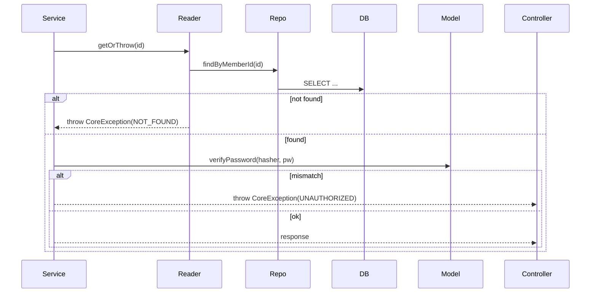
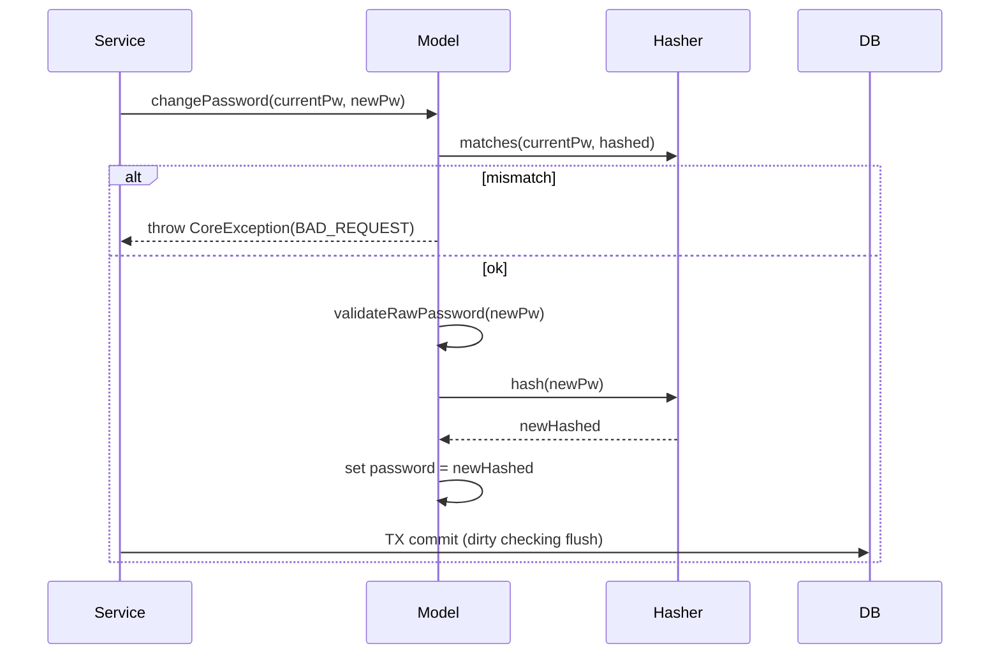

# PR 생성 가이드

## 개요

기능 구현이 완료된 후, 코드를 분석하여 PR 문서를 작성하는 워크플로우입니다.

---

## 핵심 원칙: 발제의 문제를 정의하고, 테스트로 증명한다

PR 문서의 목적은 **"무엇을 구현했다"가 아니라 "발제의 문제를 어떻게 해결했고, 그 선택이 왜 논리적인지 수치로 증명하는 것"** 이다.

좋은 PR은 다음 흐름을 따른다:
1. **발제의 환경/제약 조건**을 먼저 명시한다 (예: PG 시뮬레이터 42% 성공률, Tomcat 40 스레드)
2. **그 환경에서 발생하는 구체적 문제**를 정의한다 (예: 타임아웃 없으면 6.6초 내 전체 스레드 소진)
3. **테스트/계산으로 선택지를 비교**한다 (수식, 부하 테스트, EXPLAIN 등)
4. **수치 근거로 결정**한다 (왜 3초인지, 왜 40 bulkhead인지, 왜 80% threshold인지)

**모르면 질문하지 말고, 테스트로 증명한다.** 의사결정에 의문이 생기면 개발자에게 묻는 대신, 코드와 테스트 결과에서 답을 찾는다. 설정값·수치·선택에 근거가 없으면 그 부분을 PR에서 "검증 필요" 항목으로 명시한다.

**나쁜 예** (수치 없이 이유만):
> "타임아웃을 3초로 설정했다. PG가 느릴 수 있기 때문이다."

**좋은 예** (환경 조건에서 수치를 도출):
> "PG readTimeout 3초 설정. 근거: 132 req/s 기준 정상 PG 호출은 동시 4개(4 × 3s = 12 thread-seconds). 타임아웃 없을 경우 PG 응답 지연 시 스레드 점유가 누적되어 40 스레드 × 3s = 6.6초 내 전체 소진. 60초(PG 권장값) 적용 시 단 1번의 지연 요청만으로도 전체 스레드 묶임."

**나쁜 예** (결과만):
> "15회 부하 테스트 후 92.3% 달성했다."

**좋은 예** (개선 경로를 보여줌):
> "A→O 15회 반복 테스트: 31.7%(기준선) → 48.1%(Decorator 패턴 전환 +16.4%) → 90.7%(재고 선점 타이밍 이동 +42.6%) → 92.3%(Resilience 튜닝 +1.6%)"

---

## 워크플로우

### 전체 흐름

```
[Step 1] 개발 기록 분석    커밋 히스토리 + 발제 환경 조건 + 변경 파일 구조
[Step 2] PR 문서 작성      volume-{n}-pr.md — 테스트 증거 기반 의사결정 서술
```

저장 경로: `.idea/volume-{n}*.md`

---

### Step 1: 개발 기록 분석 (`volume-{n}.md`)

브랜치의 커밋 히스토리와 변경 파일을 분석하여 개발 흐름을 Phase 단위로 정리한다.

#### 수집 정보

1. **커밋 히스토리**: `git log {base}..HEAD` — 해시, 날짜, 메시지 테이블
2. **변경 통계**: `git diff {base}..HEAD --shortstat` — 파일 수, 추가/삭제 라인
3. **커밋별 변경**: `git log {base}..HEAD --stat` — 각 커밋의 영향 파일
4. **발제 환경 조건**: 이번 주 발제 문서(`docs/discussion/`)에서 핵심 제약 조건 추출

#### 구성

```markdown
# Volume {n} - {도메인} 구현 기록

## 발제 환경 조건
이번 주 발제가 전제하는 환경 제약 (예: PG 성공률, 스레드 수, 커넥션 풀 크기)
→ 이 수치들이 이후 모든 설계 결정의 출발점이 된다

## 개요
시작 커밋 ~ 종료 커밋 범위, 총 변경 통계

## 커밋 히스토리
| Hash | 날짜 | 커밋 메시지 |

## Phase 1: {주제}
- 변경 내용, 추가된 클래스/메서드, 테스트
- 이 Phase에서 해결하려 한 문제

## Phase N: ...

## 최종 파일 구조
프로덕션 코드 트리

## API 엔드포인트 현황
| Method | Path | 설명 | 인증 |

## 테스트 현황
| 종류 | 클래스 | 테스트 수 | 검증한 시나리오 |

## 아키텍처 패턴 요약
적용된 패턴, 각 패턴이 해결한 문제
```

#### Phase 분류 기준

- 관련된 커밋을 기능/레이어 단위로 묶는다
- 각 Phase가 이전 Phase의 어떤 문제를 해결하는지 명시한다

---

### Step 2: PR 문서 작성 (`volume-{n}-pr.md`)

Step 1 분석을 바탕으로, **테스트 결과와 수식으로 뒷받침된** PR 문서를 생성한다.

코드에서 설정값이나 설계 선택의 근거를 찾을 수 없는 경우:
- 테스트 클래스, discussion 문서, 커밋 메시지를 우선 탐색한다
- 그래도 근거를 찾을 수 없으면 해당 항목에 `(검증 필요)` 표시를 남긴다
- **근거 없는 추론으로 Context & Decision을 채우지 않는다**

#### PR 템플릿 구조

```markdown
## 📌 Summary

* 발제 환경: {이번 주 발제가 전제하는 핵심 제약 조건 — 성공률, 스레드 수, 커넥션 수 등}
* 문제: {그 환경에서 발생하는 구체적 문제 — 수치 포함}
* 목표: {이 PR이 달성하려는 것을 1~2문장으로}
* 결과: {실제 달성한 것 — 기능, 테스트 수, 측정 수치, 개선 경로}

---

## 🧭 Context & Decision

### {번호}. {결정 주제 — 무엇을 왜 선택했는지 한 줄}

**환경/전제**: {이 결정의 출발점이 된 제약 조건 또는 수치}

**문제**: {그 환경에서 구체적으로 어떤 현상이 문제인지 — 수식 또는 측정값 포함}

**고려한 대안**:
- A: {대안 A} — {장점 / 단점}
- B: {대안 B} — {장점 / 단점}

**검증**: {테스트 결과, 부하 테스트 수치, 계산식, EXPLAIN 결과 중 해당되는 것}

**결정**: {무엇을 선택했는지}

**이유**: {검증 결과 기반으로 — 수치·트레이드오프·포기한 것 명시}

> (측정값이 있다면): Before: {수치} → After: {수치}

---

## 🏗️ Design Overview

### 변경 범위

* 영향 받는 모듈/도메인:
    * {모듈/패키지 목록}
* 신규 추가:
    * {새로 추가된 클래스, API, 기능}
* 제거/대체:
    * {삭제된 것, 대체된 것}

### 주요 컴포넌트 책임

* `{클래스명}`:
    * {이 클래스가 맡는 역할 설명}
* ...

---

## 🔁 Flow Diagram

### Main Flow

#### {n}) {API 이름} `{METHOD} {PATH}`

```mermaid
sequenceDiagram
  autonumber
  participant Client
  participant Controller as {Controller명}
  participant Service as {Service명}
  ...

  Client->>Controller: {HTTP 메서드} {경로}\n{요청 설명}
  Controller->>Service: {메서드 호출}
  ...
  alt {실패 조건}
    ...-->>Client: {에러 코드} ApiResponse FAIL
  else {성공 조건}
    ...-->>Client: {성공 코드} ApiResponse SUCCESS
  end
```

### 예외 흐름

```mermaid
sequenceDiagram
  autonumber
  participant App as ApiControllerAdvice
  participant Client

  Note over App: CoreException(ErrorType) 발생 시
  App-->>Client: {코드} {ErrorType}
  ...
```

---
```

---

## Context & Decision 작성 규칙

### 핵심: 발제 환경 조건에서 수치를 도출한다

각 결정 항목은 반드시 다음 흐름으로 서술한다:

```
1. 발제가 전제하는 환경 조건 (스레드 수, 커넥션 풀, 성공률 등)
2. 그 조건에서 어떤 문제가 발생하는가 (계산 또는 측정으로 명시)
3. 어떤 대안을 비교했는가
4. 어떤 테스트/계산으로 검증했는가
5. 무엇을 선택했고, 무엇을 포기했는가
```

설정값·상수·임계값이 등장할 때는 반드시 그 수치의 근거를 서술한다.
"경험적으로 적절하다"는 근거로 인정하지 않는다.

### 수치와 실험 결과 포함

- 타임아웃·임계값 등 상수는 계산식으로 도출 과정을 보여준다
- 부하 테스트 결과가 있으면 반복 횟수, VU 수, 측정 수치를 기재한다
- 개선이 여러 단계에 걸쳐 이루어졌다면 각 단계의 수치를 보여준다
- EXPLAIN 결과, RPS, p99 latency, 에러율 등 측정 가능한 값은 모두 포함한다

**수치 도출 예시**:
```
Tomcat 스레드 40개, 정상 TPS 132req/s 기준 PG 동시 처리 4개(4×3s=12 thread-seconds).
readTimeout 60s(PG 권장) 적용 시: 지연 1건당 60 thread-seconds 점유.
→ 40스레드 ÷ (132/4) = 1.2초 내 전체 스레드 소진.
따라서 3s로 설정: 정상 부하에서 여유 충분, 장애 시 6.6초 내 감지 가능.
```

### 대안 서술

- 실제로 테스트하거나 계산으로 비교한 대안을 서술한다
- 각 대안이 발제 환경 조건에서 왜 문제인지를 수치로 설명한다
- 최종 결정에서 포기한 것을 명확히 한다 ("~은 포기하지만, ~을 얻는다")

---

## Summary 작성 규칙

### 발제 환경 (Assignment Environment)

- 이번 주 발제가 전제하는 핵심 제약 조건을 먼저 명시
- 예: "PG 시뮬레이터: 요청 성공률 60%, 처리 성공률 70%, 응답 지연 100~500ms"
- 이 조건들이 이후 모든 결정의 출발점임을 명시

### 문제 (Problem)

- 그 환경에서 아무 대응 없을 때 발생하는 구체적 현상 — 수치 포함
- 예: "기본 설정으로 50VU 60s 부하 시 성공률 31.7%, 데이터 정합성 미보장"

### 목표 (Objective)

- "~하고, ~한다" 형태로 이 PR이 달성할 것을 서술

### 결과 (Result)

- 개선 경로를 단계별로 기재 (최종값만 아님)
- 예: "31.7% → 48.1%(Decorator) → 90.7%(재고 타이밍) → 92.3%(튜닝), 테스트 40건"

---

## Mermaid Sequence Diagram 작성 규칙

### participant 구성

프로젝트 레이어 구조에 맞춰 participant를 배치한다:

```
Client → Controller → Service/Facade → Reader → Repository → Model → DB
                                                                ↕
                                                           PasswordHasher 등 인프라
```

### 규칙

1. **autonumber 사용**: 메시지에 순서 번호를 붙인다
2. **alt/else 블록**: 성공/실패 분기를 명확히 표현한다
3. **에러 응답에 ErrorType 명시**: `CoreException(CONFLICT)` 형태로 어떤 타입인지 표기
4. **self-call 표현**: `Model->>Model: validateRawPassword()` — 내부 검증 로직
5. **JPA dirty checking**: save() 없이 `TX commit (dirty checking flush)`로 표현

### 예시 패턴

#### 조회 + 인증



#### 도메인 행위 (다단계 검증)



---

## 참고: 실제 적용 사례

### 발제 환경에서 수치를 도출하는 Context & Decision 예시

```markdown
### 1. PG readTimeout — 3초 설정

**환경/전제**: Tomcat 스레드 40개, 정상 TPS 132req/s, PG 동시 처리 4개

**문제**: PG가 응답을 반환하지 않을 경우 스레드가 점유된 채 대기.
PG 권장값 60s 적용 시: 지연 요청 1건 = 60 thread-seconds 점유.
132req/s 기준 6.6초 내 40 스레드 전체 소진 → 서비스 전체 응답 불가.

**고려한 대안**:
- A: PG 권장값 60초 — PG 지연 시 결제 성공 가능성 최대화. 단, 단 1건의 지연 요청으로 전체 스레드 소진.
- B: 3초 — 정상 부하(동시 4개 × 3s = 12 thread-seconds)에서 여유 유지. PG 장애 시 6.6초 내 감지.

**검증**: 50VU 60s 부하 테스트에서 60초 설정 시 PG 지연 구간에 에러율 100%, 3초 설정 시 REQUESTED 상태로 전환 후 폴링 회수.

**결정**: 3초

**이유**: 스레드 보호 우선. 타임아웃 결제는 REQUESTED 상태로 기록하고 폴링으로 사후 처리. 즉시 성공률을 포기하지만 서비스 가용성을 확보.
```

### 개선 경로를 보여주는 Summary 예시

```markdown
## 📌 Summary

* 발제 환경: PG 시뮬레이터 요청 성공률 60%, 처리 성공률 70%, 응답 지연 100~500ms, Tomcat 40 스레드
* 문제: 기본 설정 기준 50VU 60s 부하 시 성공률 31.7%, 타임아웃 시 스레드 점유로 전체 서비스 마비 위험
* 목표: 성공률 90% 이상 달성, 결제-주문 데이터 정합성 100% 보장
* 결과: A→O 15회 반복 테스트 — 31.7% → 48.1%(Decorator 패턴 +16.4%) → 90.7%(재고 선점 타이밍 이동 +42.6%) → 92.3%(Resilience 튜닝 +1.6%). 결제 136건 = 유료 주문 136건, 미아 결제 0건. 테스트 40건.
```
