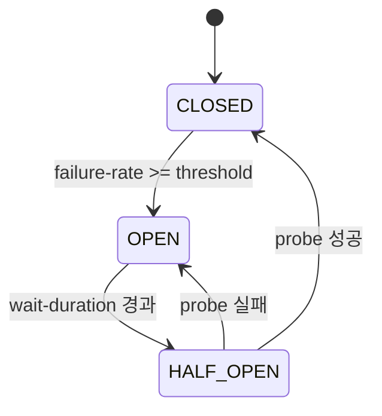
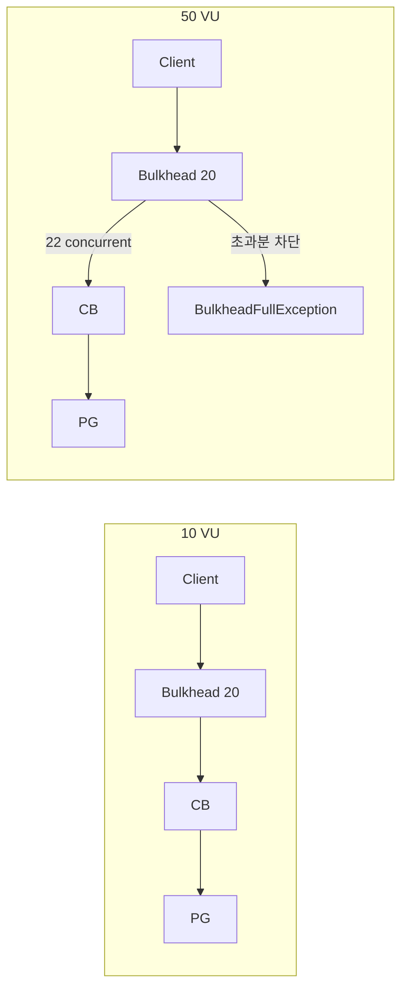

# Technical Writing Skill

## 목적

실험 기반 테크니컬 블로그 글을 작성한다. 핵심은 **"통설을 의심하고, 실험으로 확인하고, 수치로 말한다"**.

저장 경로: `docs/technical_writing/{주차}/{글 제목 slug}.md`

---

## 글의 뼈대 (필수 구조)

```
1. TL;DR (인용 블록)
2. 제목 (H1)
3. 도입부 — 통설 제시 → "정말 그런가?" 의문
4. 실험 환경 (표)
5. 실험 본문 (Phase/Exp 단위, 각각 표 + 해석)
6. "다시 생각해본 점들" — 메타적 해석
7. "그러면 어떻게 접근하면 좋을까" — 실용적 제안
8. "정리하며" — 전체 요약 + 열린 질문 마무리
```

---

## 1. 제목

### 대제목 (H1)

**패턴**: 통설에 의문을 던지는 질문형 또는 도발적 명제 + em dash(—) + 구체적 실험 맥락

| 좋은 예 | 패턴 |
|---------|------|
| 대기열은 정말 공정할까? — 한정 수량 100개, 어뷰저는 몇 개를 가져갈까 | 질문형 + 실험 맥락 |
| 리밸런싱은 정말 잠깐 멈출 뿐일까? — Kafka Consumer 실험 | 질문형 + 기술 키워드 |
| 오늘의 설정은 내년의 설정이 아닐 수 있다 | 도발적 명제 |

**규칙:**
- "정말 ~할까?" 또는 통설을 뒤집는 명제
- 추상적 제목 금지 ("Kafka 리밸런싱 정리" ❌)

### 소제목 (H2)

**패턴**: 서술문 형태 — 명사형 요약이 아니라 문장

| 나쁜 예 (명사형) | 좋은 예 (서술형) |
|-----------------|-----------------|
| 실험 결과 | crash 감지는 늦는다 |
| Eager vs Cooperative | Eager는 전체를, Cooperative는 부분만 멈춘다 |
| 결론 | 다시 생각해본 점들 |

**특징:**
- 대비 구조 활용: "A는 ~, B는 ~"
- 반전/발견 암시: "~지만", "~자", "~보다"
- Phase/Exp 기반 실험은 번호 체계 사용: `Phase 0 — 어뷰저 없이, 대기열은 공정한가`

---

## 2. TL;DR

글 최상단에 `>` 인용 블록으로 배치. 4~6줄. **굵은 글씨**로 핵심 포인트 강조.

```markdown
> **TL;DR**
> 대기열 자체(Redis Sorted Set FIFO)는 진입 순서에 대해 **공정하다**.
> 문제는 진입이 아니라 **토큰 획득 후 주문 속도**에서 발생한다.
> 폴링 속도 제한은 효과가 없었고, **토큰→주문 최소 대기 시간**이 유일하게 유효했다.
> 하지만 정교한 봇까지 막으려면 서버 사이드만으로는 한계가 있다.
```

**규칙:**
- 실험의 핵심 발견을 압축
- "~를 알아봤다" 같은 목적 서술 금지 → 결과/발견을 직접 서술
- 직관과 달랐던 점을 반드시 포함

---

## 3. 도입부

**패턴**: 통설/직관 제시 → "정말 그런가?" → 직접 확인 동기

```markdown
Kafka Consumer 관련 코드를 작성할 때 세 가지 직관이 있다.

첫째, Consumer를 늘리면 처리량이 비례해서 늘어난다. 둘째, ...

이 직관들은 틀리지 않다. 하지만 충분하지 않다.

> *Consumer 4개가 처리량의 상한인가? 리밸런싱 중 그 "잠깐"이 메시지 유실 또는 중복을 만드는가?*

답을 알고 있다고 생각했지만, 수치로 확인한 적이 없었다.
```

**규칙:**
- 독자에게 직접 말 걸기("여러분") 금지
- 저자 자신의 사고 과정을 공유하는 형태로 독자를 끌어들인다
- "~라는 의문이 생겼습니다", "직접 확인해보고 싶었습니다"

---

## 4. 문체

### 경어체 + 실험자 시점

- **과거형 경어체**: "~했습니다", "~이었습니다", "~수 있었습니다"
- **1인칭 실험자 관점**: "확인한 것은 ~였습니다", "직접 확인해보고 싶었습니다"
- 학술 논문처럼 딱딱하지 않고, 캐주얼 반말도 아닌 중간 톤

### 핵심 문체 패턴

| 패턴 | 예시 | 용도 |
|------|------|------|
| 가설 → 반전 | "~라고 생각했지만, 실제로는 ~였습니다" | 실험 결과가 직관과 다를 때 |
| 짧은 원인 제시 | "이유는 단순했습니다." | 원인을 한 줄로 |
| "즉" 요약문 | "즉, Partition 수가 처리 병렬도의 상한이라는 점은 확인됐습니다." | 각 실험 결과 뒤 한 줄 요약 |
| 열린 결론 | "~하지 않을까 생각합니다" | 마무리에서 단정 회피 |

### 절대 금지

- "여러분", "우리" 등 직접 호칭
- "~해보겠습니다", "~알아보겠습니다" (미래형 안내)
- 이모지, 감탄사

---

## 5. 데이터 제시

### 표(Table) 중심

모든 실험 데이터는 **마크다운 표**로 정리한다. 비교 실험은 이전 Phase 결과를 같은 표에 병기.

```markdown
| 그룹 | Phase 1 (방어 없음) | Phase 4a (3초) | Phase 4b (2초) |
|------|-------------------|---------------|---------------|
| 정상 회원 | 60 (37.5%) | 83 (51.9%) | **95 (59.4%)** |
| 어뷰저 A | 20 (100%) | 0 (0%) | **0 (0%)** |
```

### 계산식

코드 블록(`text` 언어)으로 표현:

```text
50 VU x 800ms / (800ms + 1000ms sleep) ≈ 22 concurrent calls
bulkhead=20 → 일부 요청은 PG에 닿기 전에 차단
```

### 설정값

YAML 코드 블록:

```yaml
resilience4j:
  circuitbreaker:
    circuit-breaker-aspect-order: 1
```

### 코드 블록 전후 패턴

1. **전**: 어떤 의도로 보여주는지 한 문장
2. **코드 블록**
3. **후**: "즉 ~"으로 해석

```markdown
현재 설정을 개념적으로 요약하면 아래와 같았습니다.

(코드 블록)

즉 '평균 오류율 40%이므로 안 열려야 한다'가 아니라, 짧은 구간 안에서 실패가 집중되면 열린다가 더 정확한 설명이었습니다.
```

---

## 6. Mermaid 다이어그램

### 적극적으로 사용한다

텍스트만으로 전달이 어려운 흐름, 상태 전이, 비교는 반드시 Mermaid로 시각화한다.

### 사용할 다이어그램 유형

| 상황 | 다이어그램 유형 |
|------|---------------|
| 요청이 시스템을 관통하는 흐름 | `sequenceDiagram` |
| 상태 전이 (CB CLOSED→OPEN→HALF_OPEN 등) | `stateDiagram-v2` |
| 요청 경로 분기/비교 | `flowchart TD` 또는 `flowchart LR` |
| 시간축 비교 (10 VU vs 100 VU) | `flowchart` + subgraph |
| 아키텍처/컴포넌트 관계 | `flowchart` + subgraph |

### 배치 패턴 (3단계)

1. **텍스트로 먼저 설명**: "이 흐름을 그림으로 표현하면 더 분명하게 보였습니다."
2. **Mermaid 다이어그램 삽입**
3. **다이어그램 아래에서 추가 해석**

### Mermaid 작성 규칙

- 노드 텍스트는 짧게 (한 줄 이내)
- 한 다이어그램에 노드 10개 이하
- 비교 다이어그램은 `subgraph`로 Before/After 또는 조건별 분리
- 색상/스타일은 핵심 노드 강조에만 사용

```markdown
상태 전이로 보면 더 분명하게 보였습니다.



즉 HALF_OPEN에서 3 probes 모두 성공할 확률은 0.6³ = 21.6%였습니다.
```

### 흐름 비교 다이어그램 예시



---

## 7. 강조 패턴

| 요소 | 용도 | 예시 |
|------|------|------|
| **bold** | 핵심 결론, 수치 강조 | **40%를 어뷰저가 독점** |
| `>` 인용 블록 | 가설, 핵심 통찰, 실무 적용 | > 리밸런싱의 실제 비용은 잠깐 멈춘 시간보다... |
| _**이탤릭+볼드**_ | 글 전체의 핵심 테제 (1회) | _**"오늘의 설정은 내년의 설정이 아닐 수 있습니다."**_ |
| `---` 수평선 | H2 섹션 사이 시각적 구분 | 모든 H2 사이에 배치 |

---

## 8. 실험 본문 구조

### Phase/Exp 번호 체계

실험을 Phase 또는 Exp로 번호 매긴다. 각 Phase는:

```markdown
## Phase N — {서술형 소제목}

**설정**: {변경된 조건}

| 측정 항목 | 값 |
|-----------|-----|
| ... | ... |

{해석 1~2문단}

즉, {한 줄 요약}.
```

### "예상 밖의 것이 있었다" 패턴

실험 중 직관과 다른 결과가 나왔을 때:

```markdown
**여기서 예상 밖의 것이 있었다.**

{현상 설명}

원인: {근본 원인}

> **실무 적용**: {이 발견이 실제 운영에 미치는 영향}
```

---

## 9. "다시 생각해본 점들" 섹션

실험 결과를 나열한 뒤, 한 발 물러서서 메타적으로 해석한다.

**패턴 A**: #### 번호 매긴 인사이트

```markdown
## 다시 생각해본 점들

#### 1. 대기열의 공정성은 진입이 아니라 활용에서 결정된다

{2~3문단 해석}

#### 2. 방어는 단일 레이어보다 복합적이어야 한다

{2~3문단 해석}
```

**패턴 B**: 첫째/둘째/셋째 리스트

```markdown
## 이 실험을 통해 다시 생각해본 점들

- **첫째**, {인사이트}. {설명}
- **둘째**, {인사이트}. {설명}
- **셋째**, {인사이트}. {설명}
```

---

## 10. "그러면 어떻게 접근하면 좋을까" 섹션

실용적 가이드라인을 **굵은 문장으로 시작하는 단락**으로 제시:

```markdown
## 그러면 어떻게 접근하면 좋을까

**첫째, 방어 지점을 정확히 식별해야 합니다.** {설명}

**둘째, 방어는 단일 레이어보다 복합적으로 구성해야 합니다.** {설명}

**셋째, 방어 강도는 숫자로 결정해야 합니다.** {설명}
```

---

## 11. "정리하며" 섹션

전체 실험을 3~4문장으로 압축한 뒤 열린 메시지로 마무리.

```markdown
## 정리하며

{전체 요약 3~4문장}

{열린 결론 — 단정 회피}
```

**마무리 패턴:**
- "~하지 않을까 생각합니다." (열린 질문)
- "이 글이 그 결정을 할 때 참고할 수 있는 수치를 제공하면 충분하다." (겸손한 마무리)

---

## 12. 숫자 정리 테이블

"정리하며" 전에 실험에서 확인된 핵심 수치를 테이블로 한번에 모아준다:

```markdown
### 숫자로 확인된 것

| 관찰 | 수치 |
|------|------|
| Consumer 1→2개 시 처리 시간 | 108ms → ~0ms |
| 정상 종료 리밸런싱 완료까지 | **1,004ms** |
| 장애(crash) 리밸런싱 완료까지 | **17,050ms** |
```

---

## 실행 절차

### 1. 소재 수집

```bash
git rev-parse --abbrev-ref HEAD
git log main..HEAD --oneline
```

- 브랜치의 discussion 문서, plan 문서, 테스트 결과 확인
- 실험 데이터(k6 결과, 테스트 로그 등) 수집

### 2. 구조 설계

- 핵심 질문 정의: "정말 ~할까?"
- Phase/Exp 단위 구성
- 각 Phase의 가설 → 실험 → 결과 → "즉" 요약 설계
- Mermaid 다이어그램이 필요한 지점 식별

### 3. 초안 작성

위 뼈대 구조에 따라 작성. 개발자 승인 후 진행.

### 4. 저장

`docs/technical_writing/{주차}/{글 제목 slug}.md`

---

## 체크리스트

- [ ] 제목이 질문형 또는 도발적 명제인가
- [ ] TL;DR이 인용 블록으로 최상단에 있는가
- [ ] 도입부가 통설 → 의문 → 실험 동기 구조인가
- [ ] 실험 환경이 표로 정리되어 있는가
- [ ] 각 Phase/Exp에 표 + "즉" 요약이 있는가
- [ ] Mermaid 다이어그램이 흐름/상태전이/비교에 사용되었는가
- [ ] "다시 생각해본 점들" 섹션이 있는가
- [ ] "정리하며"가 열린 결론으로 끝나는가
- [ ] H2 섹션 사이에 `---` 수평선이 있는가
- [ ] 문체가 과거형 경어체 + 1인칭 실험자 시점인가