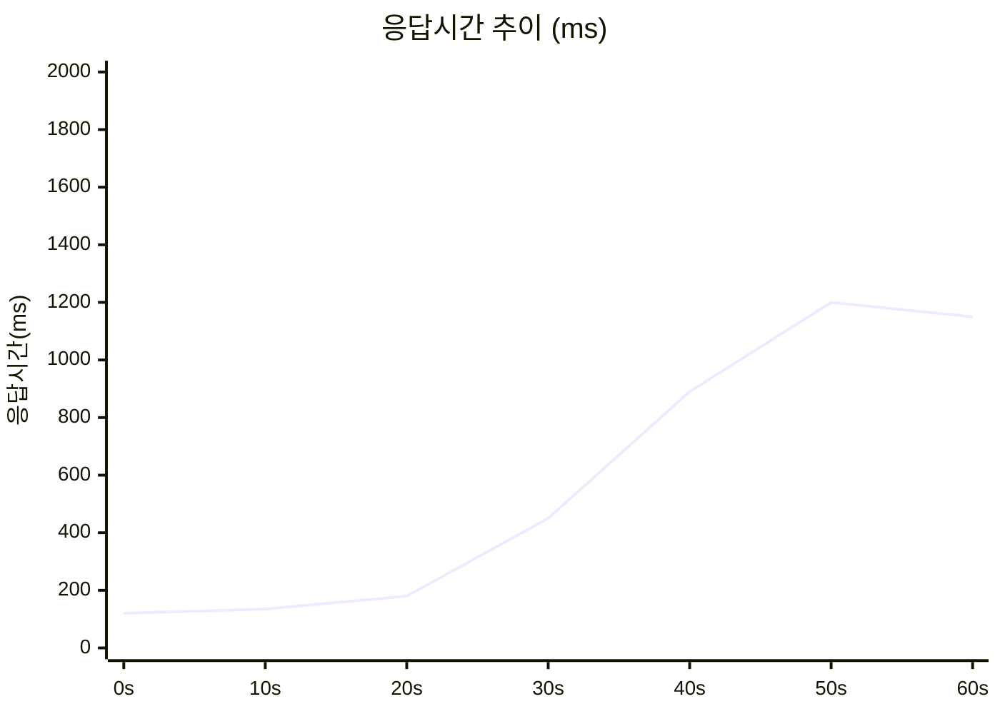
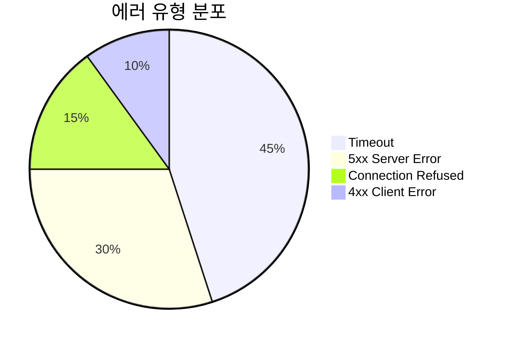
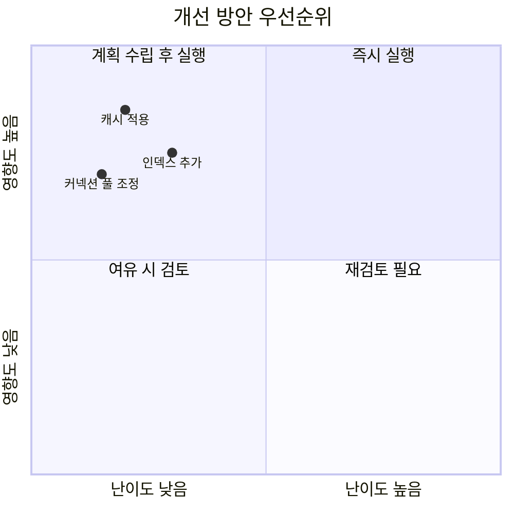

# Test Report Analyzer

테스트 결과를 시니어 백엔드 개발자의 관점에서 분석하고, 구조화된 마크다운 리포트를 생성한다.

## 스킬 트리거 조건

다음 상황에서 이 스킬을 사용한다:

- 사용자가 테스트 결과 파일(JSON, CSV, TXT, 로그)을 제공하며 분석을 요청할 때
- "테스트 결과 분석", "리포트 생성", "부하 테스트 정리" 등을 언급할 때
- k6, JMeter, Gatling, Artillery, JUnit, TestNG, pytest 등 테스트 도구 결과를 다룰 때
- 테스트 결과를 바탕으로 성능 개선이나 장애 대응 방안을 원할 때

---

## 1단계: 입력 파일 파악 및 파싱

### 지원 형식 자동 감지

테스트 결과 파일을 받으면 다음 순서로 형식을 판별한다:

1. 파일 확장자 확인 (.json, .csv, .txt, .log, .xml)
2. 내용 구조로 도구 식별:
   - **k6 JSON/CSV**: `metrics`, `http_req_duration`, `vus`, `iterations` 등의 키
   - **JMeter CSV/XML**: `timeStamp`, `elapsed`, `responseCode`, `label` 컬럼
   - **Gatling**: `simulation.log` 형태 또는 `stats.json`
   - **JUnit XML**: `<testsuites>`, `<testsuite>`, `<testcase>` 태그
   - **pytest**: `pytest --tb=short` 출력 또는 pytest-json-report 형식
   - **Artillery**: `aggregate` 및 `intermediate` 키를 가진 JSON
3. 형식을 파악할 수 없으면 사용자에게 어떤 도구의 결과인지 확인한다

### 핵심 메트릭 추출

도구별로 다음 메트릭을 추출한다:

**부하 테스트 (k6/JMeter/Gatling/Artillery)**
- 처리량 (RPS/TPS)
- 응답시간: avg, median(p50), p90, p95, p99, max
- 에러율 및 에러 유형별 분포
- VU(가상 사용자) 수 및 변화 추이
- 네트워크 지연: connecting, tls_handshaking, waiting, receiving
- 임계치(threshold) 통과/실패 여부

**단위/통합 테스트 (JUnit/TestNG/pytest)**
- 총 테스트 수, 성공/실패/스킵 수
- 실패 테스트 목록 및 에러 메시지
- 실행 시간이 긴 테스트 (상위 10개)
- 테스트 스위트별 성공률
- 실패 패턴 분류 (타임아웃, NPE, assertion 등)

---

## 2단계: 시니어 개발자 관점의 분석

단순히 숫자를 나열하는 것이 아니라, 경험 있는 시니어 개발자가 코드 리뷰에서 하듯이
"이 수치가 왜 문제이고, 실제 운영 환경에서 어떤 영향을 미치는지"를 설명한다.

### 분석 프레임워크

각 메트릭에 대해 다음 관점으로 판단한다:

**응답시간 기준 (부하 테스트)**
- p50 < 200ms: 양호
- p95 < 500ms: 수용 가능
- p99 < 1000ms: 주의 필요
- p99 > 1000ms: 위험 — 테일 레이턴시 문제
- avg와 p99의 차이가 5배 이상: 간헐적 지연 원인 조사 필요

**에러율 기준**
- < 0.1%: 정상
- 0.1% ~ 1%: 모니터링 강화 필요
- 1% ~ 5%: 즉시 원인 파악 필요
- > 5%: 서비스 장애 수준

**처리량 기준**
- 목표 RPS 대비 실제 RPS 비교
- VU 증가에 따른 RPS 변화 패턴 (선형 증가 vs 포화점)
- RPS가 정체되는 지점 = 시스템 병목

위 기준값은 일반적인 웹 API 기준이며, 사용자가 별도의 SLA나 목표치를 제시하면 그 기준을 우선 적용한다.

### 소스코드 대조 분석

사용자가 프로젝트 소스코드에 접근 가능한 환경(Claude Code)이라면:

1. 테스트 대상 엔드포인트 또는 클래스를 식별한다
2. 관련 소스코드를 읽어서 병목 가능성이 있는 부분을 찾는다:
   - N+1 쿼리 패턴
   - synchronized/lock 경합
   - 커넥션 풀 설정
   - 캐시 미적용 구간
   - 트랜잭션 범위 과다
3. 테스트 수치와 코드를 연결하여 "왜 이 수치가 나왔는지"를 설명한다

---

## 3단계: 시각화

테스트 데이터의 특성에 따라 적절한 시각화를 선택한다.

### 시각화 선택 기준

| 데이터 특성 | 시각화 방식 | 예시 |
|------------|-----------|------|
| 시계열 추이 | Mermaid xychart-beta | RPS/응답시간 변화 |
| 카테고리별 비교 | Mermaid bar chart | 엔드포인트별 에러율 |
| 비율/분포 | Mermaid pie chart | 에러 유형 분포 |
| 단순 수치 비교 | ASCII 테이블 | 백분위수 응답시간 |
| 시스템 구조/흐름 | Mermaid flowchart | 병목 구간 시각화 |
| 우선순위 매트릭스 | Mermaid quadrant chart | 영향도 vs 난이도 |

### Mermaid 차트 예시

시계열 데이터가 있을 때:
````

````

분포 데이터가 있을 때:
````

````

### ASCII 테이블 예시

간단한 수치 비교에는 마크다운 테이블을 사용한다:

```
| 백분위 | 응답시간(ms) | 판정  |
|--------|-------------|-------|
| p50    | 125         | ✅ 양호 |
| p90    | 340         | ✅ 양호 |
| p95    | 680         | ⚠️ 주의 |
| p99    | 1,450       | 🔴 위험 |
```

시각화는 데이터가 뒷받침할 때만 포함한다. 데이터 포인트가 2~3개뿐이면 차트 대신 테이블을 쓴다.

---

## 4단계: 장애 분석 및 해결 방안 (문제 발견 시)

테스트 결과에서 에러율이 높거나 응답시간이 임계치를 초과하는 등 문제가 발견되면
다음 구조로 해결 방안을 제시한다.

### 해결 방안 작성 구조

각 문제에 대해 2~4개의 해결 방안을 제시하고, 각각에 대해 반드시 다음을 모두 기술한다:

```
### 방안 N: [방안 이름]

**개요**: 한 줄 요약

**구현 방법**: 구체적인 기술적 접근 (코드 수준)

**장점**:
- (구체적으로)

**단점**:
- (구체적으로)

**트레이드오프**:
- 어떤 가치를 얻는 대신 무엇을 포기하는지

**예상 효과**: 이 방안 적용 시 메트릭이 어느 정도 개선될 것으로 보이는지

**구현 난이도**: 상/중/하

**소요 시간 추정**: 대략적인 작업량
```

### 추천 전략

제시한 방안들 중 최적의 전략을 추천하되, 반드시 그 이유를 설명한다:
- 왜 이 방안이 현재 상황에서 최선인지
- 어떤 조건이 바뀌면 다른 방안이 더 나을 수 있는지
- 단기 vs 장기 관점에서의 차이

---

## 5단계: 성능 개선 제안 (장애가 없더라도)

테스트를 통과하더라도, 시니어 개발자 관점에서 "더 나아질 수 있는 부분"을 찾아낸다.

### 분석 관점

- **응답시간 최적화**: p99가 양호해도 p50을 더 줄일 수 있는지
- **처리량 확장성**: 현재 RPS에서 2~3배 트래픽이 오면 버틸 수 있는지
- **리소스 효율성**: 같은 성능을 더 적은 리소스로 달성 가능한지
- **코드 품질**: 테스트 코드 자체의 개선점 (테스트 격리, 반복 가능성 등)
- **모니터링 보강**: 현재 수집하지 않지만 수집해야 할 메트릭
- **의존성 리스크**: 외부 서비스 의존도와 폴백 전략

### 소스코드 대조

Claude Code 환경에서 소스코드에 접근 가능하면:

1. 성능 개선 제안 각각에 대해 현재 코드의 해당 부분을 인용한다
2. 변경 전/후를 대비하여 보여준다
3. 변경으로 인한 트레이드오프를 명시한다:
   - 성능은 올라가지만 코드 복잡도가 증가하는 경우
   - 메모리를 더 쓰지만 CPU를 절약하는 경우
   - 일관성을 약간 희생하고 가용성을 높이는 경우 등

---

## 6단계: 우선순위 결정

제시한 모든 방안(장애 해결 + 성능 개선)에 대해 우선순위를 매긴다.

### 우선순위 기준

두 가지 축으로 평가한다:

1. **영향도 (Impact)**: 이 개선이 사용자 경험과 시스템 안정성에 미치는 영향
   - High: 서비스 장애 방지 또는 핵심 지표 대폭 개선
   - Medium: 눈에 띄는 개선이지만 당장 급하진 않음
   - Low: 코드 품질 개선 수준

2. **난이도 (Effort)**: 구현에 필요한 시간과 리스크
   - Low: 설정 변경 또는 몇 줄 수정
   - Medium: 하루~이틀 작업
   - High: 설계 변경이 필요하거나 일주일 이상

### 출력 형식

Mermaid quadrant chart로 시각화한다:

````

````

그 아래에 우선순위 요약 테이블을 추가한다:

```
| 순위 | 방안 | 영향도 | 난이도 | 권장 시점 |
|------|------|--------|--------|----------|
| 1    | ...  | High   | Low    | 즉시     |
| 2    | ...  | High   | Medium | 이번 스프린트 |
| 3    | ...  | Medium | Low    | 다음 스프린트 |
```

---

## 7단계: 최종 리포트 생성

위 분석 결과를 하나의 마크다운 파일로 구성한다.
리포트 구조는 `references/report-template.md`를 참조한다.

### 리포트 파일 규칙

- 파일명: `test-report-{날짜}-{테스트도구}.md` (예: `test-report-2026-04-08-k6.md`)
- 인코딩: UTF-8
- 모든 섹션에 앵커 링크를 위한 헤딩을 사용한다
- 리포트 상단에 목차(TOC)를 포함한다
- 리포트 마지막에 한 단락으로 핵심 요약(Executive Summary)을 배치한다

---

## 참고사항

### 분석 시 주의점

- 측정 데이터가 불충분하면 "데이터 부족"이라고 명시하고, 추가로 어떤 테스트를 해야 하는지 제안한다
- 단일 테스트 결과만으로 성능을 단정짓지 않는다 — 반복 실행 필요성을 언급한다
- 테스트 환경(로컬/스테이징/프로덕션)에 따른 결과 차이를 고려한다
- 벤치마크 수치는 절대적인 것이 아니라 상대적 비교 용도임을 명시한다

### 리포트 톤 & 스타일

- 시니어 개발자가 주니어 개발자에게 설명하는 톤 — 친절하지만 정확하게
- 추상적인 표현 대신 구체적인 수치와 근거를 사용한다
- "~할 수 있습니다" 같은 애매한 표현 대신 "~해야 합니다", "~를 권장합니다"로 명확하게
- 코드 예시를 포함할 때는 변경 전/후를 함께 보여준다
