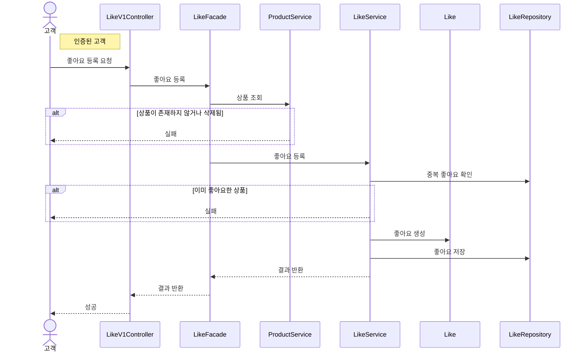
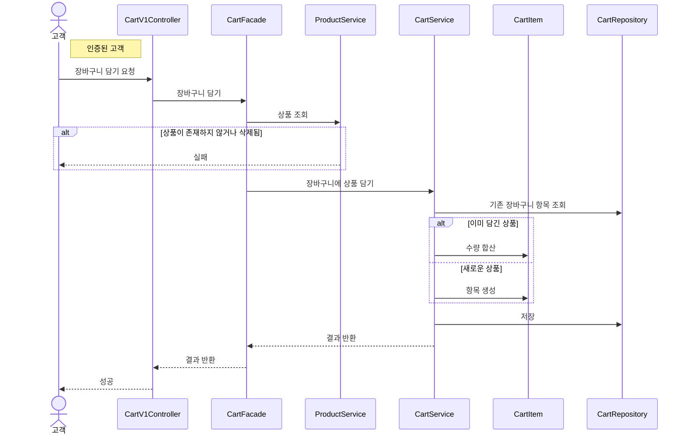
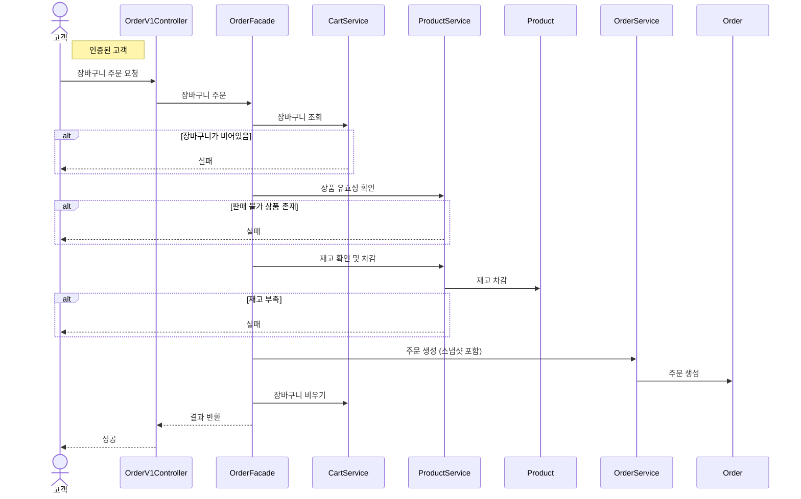
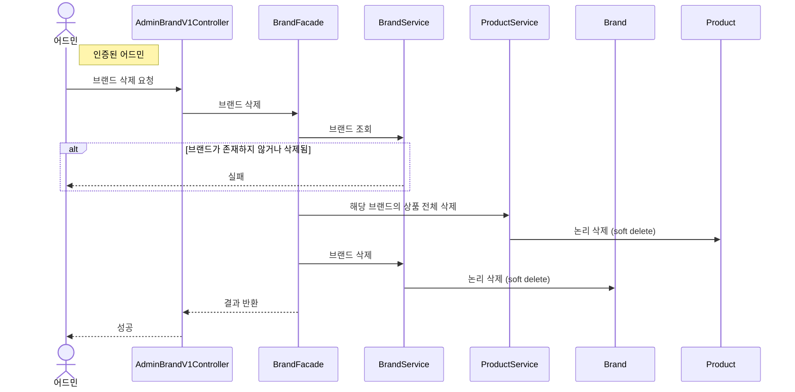
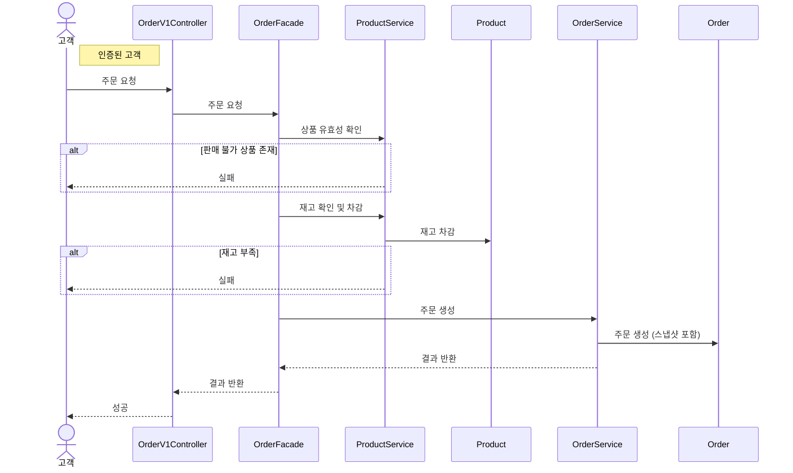

# 시퀀스 다이어그램

> 조건 분기, 도메인 간 협력, 예외 흐름이 존재하는 시나리오만 다이어그램으로 표현한다.
> 단순 CRUD(등록/수정/단건 조회/목록 조회)는 흐름이 자명하므로 생략한다.

---

## 좋아요 등록

> 시나리오 2.2 — 고객이 마음에 드는 상품에 좋아요를 누른다.

> 취소도 같은 흐름이라고 생각하면 된다.

---

## 장바구니 담기

> 시나리오 2.3 — 고객이 마음에 드는 상품을 장바구니에 담는다. 이미 담긴 상품이면 수량이 누적된다.

**다이어그램이 필요한 이유**
- 조건 분기: 상품 유효성 검증 + 중복 여부에 따른 수량 누적/신규 생성
- 도메인 간 협력: Cart가 Product의 상태를 확인해야 한다

---

## 장바구니에서 주문하기

> 시나리오 2.3 / 2.4 — 고객이 장바구니의 모든 항목을 한 번에 주문한다.

**다이어그램이 필요한 이유**
- 도메인 간 협력: Cart → Product → Order 세 도메인이 협력
- 조건 분기: 장바구니 비어있음, 상품 유효성, 재고 부족
- 주문 성공 후 장바구니 비우기까지 하나의 트랜잭션

---

## 브랜드 삭제 (연쇄 삭제)

> 시나리오 2.5 — 어드민이 브랜드를 삭제한다. 이때 해당 브랜드의 모든 상품도 함께 삭제된다.

**다이어그램이 필요한 이유**
- 도메인 간 협력: Brand 삭제가 Product 연쇄 삭제를 트리거한다
- 삭제 순서: 상품을 먼저 삭제한 뒤 브랜드를 삭제해야 정합성이 유지된다

---

### 주문하기

> 시나리오 2.4 - 고객은 여러 상품을 한 번에 주문한다. 주문 후 자신의 주문 내역을 조회할 수 있다.

**다이어그램이 필요한 이유**
- 조건 분기: 상품 유효성 검증, 재고 부족 검증
- 도메인 간 협력: 주문이 상품의 상태/재고를 확인해야 한다
- 도메인 책임: 가격 정보 제공은 Product, 금액 계산은 Order의 책임

