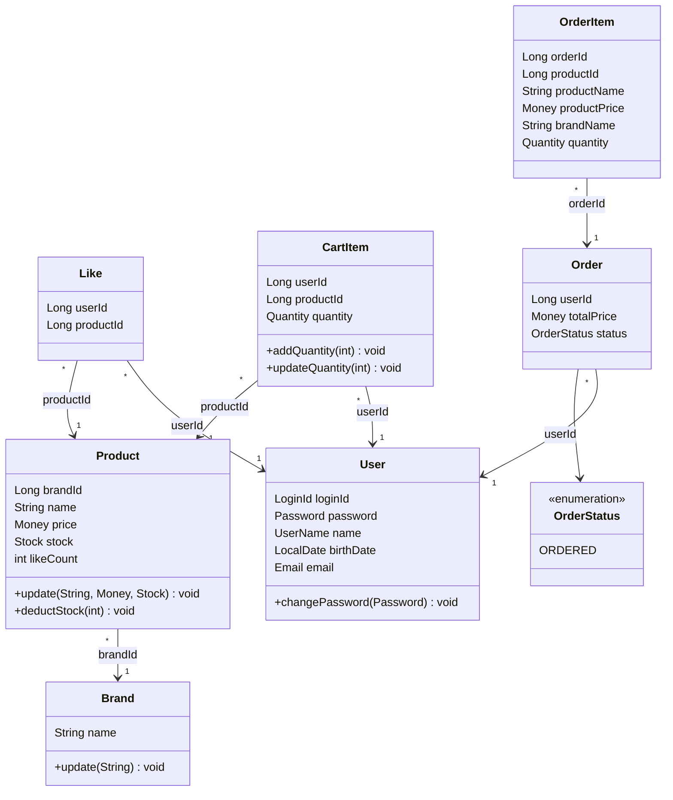

# 클래스 다이어그램

> 도메인 엔티티 중심의 클래스 다이어그램.

---

## 다이어그램

---

## Value Object 규칙

| VO | 검증/행위 | 비즈니스 규칙 |
|---|---|---|
| LoginId | validate() | 영문 + 숫자만 허용 |
| Password | validate(birthDate) | 8~16자, 영문대소문자+숫자+특수문자, 생년월일 포함 불가 |
| Password | matches(rawPassword) | BCrypt로 암호화된 값과 원문 비교 |
| UserName | validate() | 이름 포맷 검증 |
| UserName | mask() | 마지막 글자를 `*`로 마스킹 |
| Email | validate() | 이메일 포맷 검증 |
| Money | validate() | 0 이상이어야 함 |
| Stock | validate() | 0 이상이어야 함 |
| Stock | deduct(quantity) | 재고 부족 시 CoreException(BAD_REQUEST) |
| Quantity | validate() | 1 이상이어야 함 |
| Quantity | add(amount) | 수량 합산, 결과가 유효해야 함 |

---

## 엔티티별 비즈니스 규칙

| 엔티티 | 메서드 | 비즈니스 규칙 |
|---|---|---|
| User | changePassword(Password) | 새 Password VO로 교체 |
| Product | deductStock(int) | 재고 부족 시 CoreException(BAD_REQUEST) |
| CartItem | addQuantity(int) | 이미 담긴 상품 → 수량 합산 |
| CartItem | updateQuantity(int) | 수량 변경, 0 이하 불가 |

---

## 관계 정리

| 관계 | 카디널리티 | 설명 |
|---|---|---|
| Brand → Product | 1 : N | 하나의 브랜드에 여러 상품 |
| User → Like | 1 : N | 한 유저가 여러 좋아요 |
| Product → Like | 1 : N | 한 상품에 여러 좋아요 (Like = 교차 테이블) |
| User → CartItem | 1 : N | 한 유저의 장바구니 항목들 |
| Product → CartItem | 1 : N | 한 상품이 여러 장바구니에 담김 |
| User → Order | 1 : N | 한 유저가 여러 주문 |
| Order → OrderItem | 1 : N | 한 주문에 여러 주문 항목 |

---

## 설계 결정

- **Rich Domain Model**: 비즈니스 로직은 엔티티 메서드에 포함한다. Facade는 오케스트레이션만 담당한다.
- **FK 미사용**: 모든 관계는 ID 참조만. FK 제약조건 없음. 참조 무결성은 애플리케이션 레벨에서 검증한다.
- **Cart 엔티티 없음**: CartItem만 사용. User가 곧 Cart 소유자이다.
- **좋아요 수 비정규화**: Product에 likeCount 필드로 저장. LikeService에서 좋아요 등록/취소 시 원자적 UPDATE(`ProductRepository.incrementLikeCount/decrementLikeCount`)로 카운터를 증감한다.
- **N:M 관계**: Like, CartItem 교차 테이블로 해소한다.
- **likes, cart_items 물리 삭제**: 이력이 필요 없는 토글/임시 데이터이므로 Soft Delete 대신 물리 삭제 처리. UNIQUE 제약조건과의 충돌을 방지한다.
- **order_items의 deleted_at 유지**: 주문 항목은 삭제 시나리오가 없으나, BaseEntity 상속 일관성을 위해 deleted_at을 유지한다.
