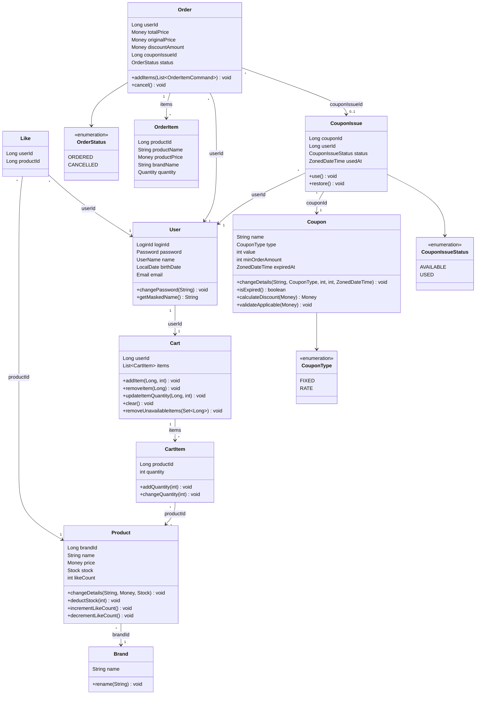

# 클래스 다이어그램

> 도메인 엔티티 중심의 클래스 다이어그램.

---

## 다이어그램

---

## Value Object 규칙

| VO | 검증/행위 | 비즈니스 규칙 |
|---|---|---|
| LoginId | validate() | 영문 + 숫자만 허용 |
| Password | validate(birthDate) | 8~16자, 영문대소문자+숫자+특수문자, 생년월일 포함 불가 |
| Password | matches(rawPassword) | BCrypt로 암호화된 값과 원문 비교 |
| UserName | validate() | 이름 포맷 검증 |
| UserName | mask() | 마지막 글자를 `*`로 마스킹 |
| Email | validate() | 이메일 포맷 검증 |
| Money | validate() | 0 이상이어야 함 |
| Money | plus(Money) | 두 금액의 합산 |
| Money | minus(Money) | 금액 차감, 결과가 음수면 불가 |
| Money | multiply(int) | 금액 × 수량 |
| Money | isGreaterThanOrEqual(Money) | 금액 비교 |
| Stock | validate() | 0 이상이어야 함 |
| Stock | deduct(quantity) | 재고 부족 시 CoreException(BAD_REQUEST) |
| Quantity | validate() | 1 이상이어야 함 |
| Quantity | add(amount) | 수량 합산, 결과가 유효해야 함 |

---

## 엔티티별 비즈니스 규칙

| 엔티티 | 메서드 | 비즈니스 규칙 |
|---|---|---|
| User | changePassword(String) | 암호화된 비밀번호로 교체 |
| User | getMaskedName() | UserName VO의 mask()를 통해 마스킹된 이름 반환 |
| Brand | rename(String) | 브랜드명 변경 |
| Product | changeDetails(String, Money, Stock) | 상품 정보(이름, 가격, 재고) 변경 |
| Product | deductStock(int) | 재고 부족 시 CoreException(BAD_REQUEST) |
| Product | incrementLikeCount() | 좋아요 수 1 증가 |
| Product | decrementLikeCount() | 좋아요 수 1 감소, 0 미만 불가 |
| Cart | addItem(Long, int) | 이미 담긴 상품이면 수량 합산, 새 상품이면 항목 추가 |
| Cart | removeUnavailableItems(Set&lt;Long&gt;) | 유효하지 않은 상품을 장바구니에서 제거 |
| CartItem | addQuantity(int) | 이미 담긴 상품 → 수량 합산 |
| CartItem | changeQuantity(int) | 수량 변경, 0 이하 불가 |
| Order | addItems(List&lt;OrderItemCommand&gt;) | 주문 항목 추가 |
| Order | cancel() | ORDERED 상태에서만 CANCELLED로 전이. 그 외 상태에서는 CoreException(BAD_REQUEST) |
| Coupon | calculateDiscount(Money) | FIXED: min(value, orderAmount), RATE: orderAmount * value / 100 |
| Coupon | validateApplicable(Money) | 만료 검증 + minOrderAmount 검증. 위반 시 CoreException(BAD_REQUEST) |
| Coupon | isExpired() | 현재 시간 기준 만료 여부 판단 |
| Coupon | changeDetails(...) | 쿠폰 정보(이름, 타입, 값, 최소 주문 금액, 만료일) 변경 |
| CouponIssue | use() | AVAILABLE → USED 전이, usedAt 기록. AVAILABLE이 아니면 CoreException(BAD_REQUEST) |
| CouponIssue | restore() | USED → AVAILABLE 전이, usedAt 초기화. USED가 아니면 CoreException(BAD_REQUEST) |

---

## 관계 정리

| 관계 | 카디널리티 | 설명 |
|---|---|---|
| Brand → Product | 1 : N | 하나의 브랜드에 여러 상품 |
| User → Like | 1 : N | 한 유저가 여러 좋아요 |
| Product → Like | 1 : N | 한 상품에 여러 좋아요 (Like = 교차 테이블) |
| User → Cart | 1 : 1 | 한 유저에 하나의 장바구니 |
| Cart → CartItem | 1 : N | 한 장바구니에 여러 항목 (Aggregate 내부) |
| Product → CartItem | 1 : N | 한 상품이 여러 장바구니에 담김 |
| User → Order | 1 : N | 한 유저가 여러 주문 |
| Order → OrderItem | 1 : N | 한 주문에 여러 주문 항목 (Aggregate 내부) |
| Coupon → CouponIssue | 1 : N | 하나의 쿠폰 템플릿에 여러 발급 |
| User → CouponIssue | 1 : N | 한 유저가 여러 쿠폰 발급 |
| Order → CouponIssue | N : 0..1 | 주문에 쿠폰이 적용될 수 있음 (nullable) |

---

## 설계 결정

- **Rich Domain Model**: 비즈니스 로직은 엔티티 메서드에 포함한다. Application Service는 오케스트레이션만 담당한다.
- **FK 미사용**: 모든 관계는 ID 참조만. FK 제약조건 없음. 참조 무결성은 애플리케이션 레벨에서 검증한다.
- **Cart Aggregate Root**: Cart가 Aggregate Root이며, CartItem은 Cart 내부 엔티티이다. User당 하나의 Cart가 존재하며, CartItem 조작은 Cart를 통해서만 이루어진다. Aggregate 내부에서 `@OneToMany`/`@ManyToOne` 매핑을 사용한다 (Aggregate 경계 내 일관성 보장을 위해).
- **Order Aggregate Root**: Order가 Aggregate Root이며, OrderItem은 Order 내부 엔티티이다. Aggregate 내부에서 `@OneToMany`/`@ManyToOne` 매핑을 사용한다.
- **좋아요 수 비정규화**: Product에 likeCount 필드로 저장. LikeApplicationService에서 좋아요 등록/취소 시 비관적 락으로 Product를 조회한 뒤 in-memory에서 카운터를 증감한다.
- **N:M 관계**: Like 교차 테이블로 해소한다.
- **likes, cart_items 물리 삭제**: 이력이 필요 없는 토글/임시 데이터이므로 Soft Delete 대신 물리 삭제 처리. UNIQUE 제약조건과의 충돌을 방지한다.
- **동일 상품 중복 방지**: 장바구니의 동일 상품 중복은 애플리케이션 레벨에서 검증한다 (Cart.addItem()에서 기존 항목이면 수량 합산).
- **order_items의 deleted_at 유지**: 주문 항목은 삭제 시나리오가 없으나, BaseEntity 상속 일관성을 위해 deleted_at을 유지한다.
