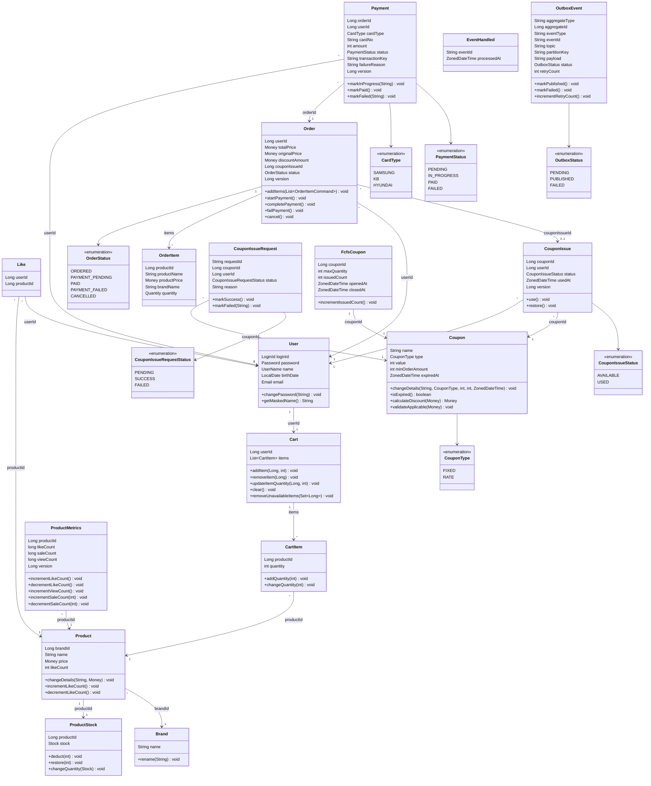

# 클래스 다이어그램

> 도메인 엔티티 중심의 클래스 다이어그램.

---

## 다이어그램

---

## Value Object 규칙

| VO | 검증/행위 | 비즈니스 규칙 |
|---|---|---|
| LoginId | validate() | 영문 + 숫자만 허용 |
| Password | validate(birthDate) | 8~16자, 영문대소문자+숫자+특수문자, 생년월일 포함 불가 |
| Password | matches(rawPassword) | BCrypt로 암호화된 값과 원문 비교 |
| UserName | validate() | 이름 포맷 검증 |
| UserName | mask() | 마지막 글자를 `*`로 마스킹 |
| Email | validate() | 이메일 포맷 검증 |
| Money | validate() | 0 이상이어야 함 |
| Money | plus(Money) | 두 금액의 합산 |
| Money | minus(Money) | 금액 차감, 결과가 음수면 불가 |
| Money | multiply(int) | 금액 × 수량 |
| Money | isGreaterThanOrEqual(Money) | 금액 비교 |
| Stock | validate() | 0 이상이어야 함 |
| Stock | deduct(quantity) | 재고 부족 시 CoreException(BAD_REQUEST) |
| Quantity | validate() | 1 이상이어야 함 |
| Quantity | add(amount) | 수량 합산, 결과가 유효해야 함 |

---

## 엔티티별 비즈니스 규칙

| 엔티티 | 메서드 | 비즈니스 규칙 |
|---|---|---|
| User | changePassword(String) | 암호화된 비밀번호로 교체 |
| User | getMaskedName() | UserName VO의 mask()를 통해 마스킹된 이름 반환 |
| Brand | rename(String) | 브랜드명 변경 |
| Product | changeDetails(String, Money) | 상품 정보(이름, 가격) 변경 |
| Product | incrementLikeCount() | 좋아요 수 1 증가 |
| Product | decrementLikeCount() | 좋아요 수 1 감소, 0 미만 불가 |
| ProductStock | deduct(int) | 재고 부족 시 CoreException(BAD_REQUEST) |
| ProductStock | restore(int) | 주문 취소 시 재고 복원 |
| ProductStock | changeQuantity(Stock) | 어드민 재고 수정 |
| Cart | addItem(Long, int) | 이미 담긴 상품이면 수량 합산, 새 상품이면 항목 추가 |
| Cart | removeUnavailableItems(Set&lt;Long&gt;) | 유효하지 않은 상품을 장바구니에서 제거 |
| CartItem | addQuantity(int) | 이미 담긴 상품 → 수량 합산 |
| CartItem | changeQuantity(int) | 수량 변경, 0 이하 불가 |
| Order | addItems(List&lt;OrderItemCommand&gt;) | 주문 항목 추가 |
| Order | startPayment() | ORDERED 또는 PAYMENT_FAILED에서만 PAYMENT_PENDING으로 전이. 그 외 상태에서는 CoreException(BAD_REQUEST) |
| Order | completePayment() | PAYMENT_PENDING에서만 PAID로 전이. 그 외 상태에서는 CoreException(BAD_REQUEST) |
| Order | failPayment() | PAYMENT_PENDING에서만 PAYMENT_FAILED로 전이. 그 외 상태에서는 CoreException(BAD_REQUEST) |
| Order | cancel() | ORDERED 상태에서만 CANCELLED로 전이. 그 외 상태에서는 CoreException(BAD_REQUEST) |
| Payment | markInProgress(String) | PENDING에서만 IN_PROGRESS로 전이. transactionKey 필수 |
| Payment | markPaid() | IN_PROGRESS에서만 PAID로 전이 |
| Payment | markFailed(String) | PENDING 또는 IN_PROGRESS에서만 FAILED로 전이. failureReason 기록 |
| CouponIssueRequest | markSuccess() | PENDING → SUCCESS 전이 |
| CouponIssueRequest | markFailed(String) | PENDING → FAILED 전이. reason 기록 |
| FcfsCoupon | incrementIssuedCount() | 발급 수량 1 증가 |
| ProductMetrics | incrementLikeCount() | 좋아요 수 1 증가 |
| ProductMetrics | decrementLikeCount() | 좋아요 수 1 감소, 0 미만 불가 |
| ProductMetrics | incrementViewCount() | 조회수 1 증가 |
| ProductMetrics | incrementSaleCount(int) | 판매수 quantity만큼 증가 |
| ProductMetrics | decrementSaleCount(int) | 판매수 quantity만큼 감소, 0 미만 불가 |
| OutboxEvent | markPublished() | PENDING → PUBLISHED 전이. publishedAt 기록 |
| OutboxEvent | markFailed() | PENDING → FAILED 전이 |
| OutboxEvent | incrementRetryCount() | retryCount 1 증가 |
| Coupon | calculateDiscount(Money) | FIXED: min(value, orderAmount), RATE: orderAmount * value / 100 |
| Coupon | validateApplicable(Money) | 만료 검증 + minOrderAmount 검증. 위반 시 CoreException(BAD_REQUEST) |
| Coupon | isExpired() | 현재 시간 기준 만료 여부 판단 |
| Coupon | changeDetails(...) | 쿠폰 정보(이름, 타입, 값, 최소 주문 금액, 만료일) 변경 |
| CouponIssue | use() | AVAILABLE → USED 전이, usedAt 기록. AVAILABLE이 아니면 CoreException(BAD_REQUEST) |
| CouponIssue | restore() | USED → AVAILABLE 전이, usedAt 초기화. USED가 아니면 CoreException(BAD_REQUEST) |

---

## 관계 정리

| 관계 | 카디널리티 | 설명 |
|---|---|---|
| Brand → Product | 1 : N | 하나의 브랜드에 여러 상품 |
| Product → ProductStock | 1 : 1 | 하나의 상품에 하나의 재고 (별도 Aggregate) |
| User → Like | 1 : N | 한 유저가 여러 좋아요 |
| Product → Like | 1 : N | 한 상품에 여러 좋아요 (Like = 교차 테이블) |
| User → Cart | 1 : 1 | 한 유저에 하나의 장바구니 |
| Cart → CartItem | 1 : N | 한 장바구니에 여러 항목 (Aggregate 내부) |
| Product → CartItem | 1 : N | 한 상품이 여러 장바구니에 담김 |
| User → Order | 1 : N | 한 유저가 여러 주문 |
| Order → OrderItem | 1 : N | 한 주문에 여러 주문 항목 (Aggregate 내부) |
| Coupon → CouponIssue | 1 : N | 하나의 쿠폰 템플릿에 여러 발급 |
| User → CouponIssue | 1 : N | 한 유저가 여러 쿠폰 발급 |
| Order → CouponIssue | N : 0..1 | 주문에 쿠폰이 적용될 수 있음 (nullable) |
| Order → Payment | 1 : N | 한 주문에 여러 결제 시도 가능 (재시도) |
| Coupon → FcfsCoupon | 1 : 0..1 | 선착순 쿠폰은 일반 쿠폰에 수량 제한을 추가 |
| Coupon → CouponIssueRequest | 1 : N | 한 쿠폰에 여러 발급 요청 |
| Product → ProductMetrics | 1 : 0..1 | 상품당 하나의 메트릭스 (commerce-streamer DB) |

---

## 설계 결정

- **Rich Domain Model**: 비즈니스 로직은 엔티티 메서드에 포함한다. Application Service는 오케스트레이션만 담당한다.
- **FK 미사용**: 모든 관계는 ID 참조만. FK 제약조건 없음. 참조 무결성은 애플리케이션 레벨에서 검증한다.
- **Cart Aggregate Root**: Cart가 Aggregate Root이며, CartItem은 Cart 내부 엔티티이다. User당 하나의 Cart가 존재하며, CartItem 조작은 Cart를 통해서만 이루어진다. Aggregate 내부에서 `@OneToMany`/`@ManyToOne` 매핑을 사용한다 (Aggregate 경계 내 일관성 보장을 위해).
- **Order Aggregate Root**: Order가 Aggregate Root이며, OrderItem은 Order 내부 엔티티이다. Aggregate 내부에서 `@OneToMany`/`@ManyToOne` 매핑을 사용한다.
- **좋아요 수 비동기 집계**: 좋아요 등록/취소 시 LikeEvent를 Kafka로 발행하고, commerce-streamer의 CatalogEventConsumer가 ProductMetrics에 반영한다 (eventual consistency).
- **N:M 관계**: Like 교차 테이블로 해소한다.
- **likes, cart_items 물리 삭제**: 이력이 필요 없는 토글/임시 데이터이므로 Soft Delete 대신 물리 삭제 처리. UNIQUE 제약조건과의 충돌을 방지한다.
- **동일 상품 중복 방지**: 장바구니의 동일 상품 중복은 애플리케이션 레벨에서 검증한다 (Cart.addItem()에서 기존 항목이면 수량 합산).
- **order_items의 deleted_at 유지**: 주문 항목은 삭제 시나리오가 없으나, BaseEntity 상속 일관성을 위해 deleted_at을 유지한다.
- **Transactional Outbox**: 비즈니스 데이터와 Outbox 이벤트를 같은 트랜잭션에 저장하여 Kafka 발행의 원자성을 보장한다. 별도 스케줄러(OutboxPublisher)가 1초 주기로 polling 후 Kafka로 발행한다.
- **ProductViewedEvent 직접 발행**: 고빈도 + 유실 허용 이벤트이므로 Outbox를 거치지 않고 Kafka에 직접 발행한다.
- **멱등성 보장**: EventHandled 테이블에 처리된 eventId를 저장하여 Consumer의 중복 처리를 방지한다.
- **선착순 쿠폰 Redis INCR gate**: Redis의 원자적 INCR로 수량을 체크하고, DB 커밋 실패 시 DECR 보상한다. Redis는 gate, DB가 source of truth.
- **commerce-streamer 분리**: 메트릭스 집계, 선착순 쿠폰 발급 등 Kafka Consumer 로직은 별도 모듈(commerce-streamer)에서 처리한다.
