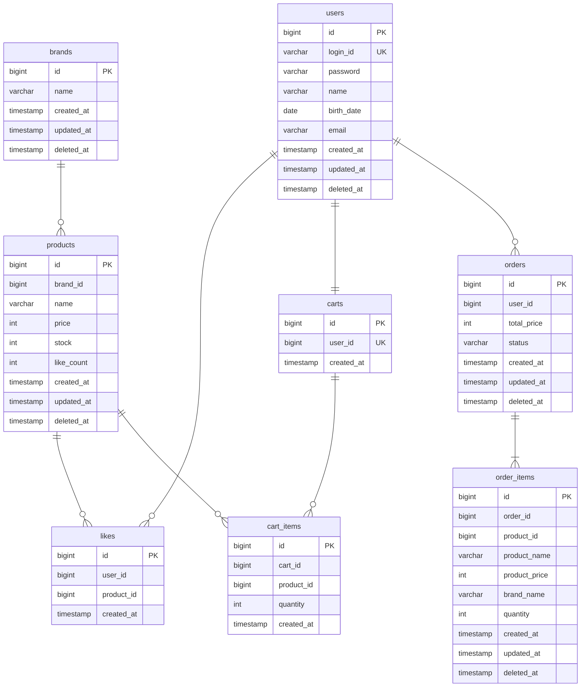

# ERD

> FK 제약조건은 사용하지 않는다. 관계선은 논리적 참조 관계를 나타내며, 실제 DB에서는 ID 컬럼으로만 참조한다.

---

## 다이어그램

---

## 제약조건

| 테이블 | 제약조건 | 설명 |
|---|---|---|
| users | UNIQUE(login_id) | 로그인 ID 중복 방지 |
| likes | UNIQUE(user_id, product_id) | 1인 1좋아요 보장 |
| carts | UNIQUE(user_id) | 1인 1장바구니 보장 |

---

## 인덱스 권장

| 테이블 | 인덱스 컬럼 | 용도 |
|---|---|---|
| products | brand_id | 브랜드별 상품 필터링 |
| likes | user_id | 유저의 좋아요 목록 조회 |
| cart_items | cart_id | 장바구니의 항목 조회 |
| orders | (user_id, created_at) | 유저의 주문 목록 조회 (날짜 범위 필터링) |
| order_items | order_id | 주문의 상세 항목 조회 |

---

## 설계 원칙

- **FK 제약조건 미사용** — ID 컬럼으로 논리적 참조만. 참조 무결성은 애플리케이션 레벨에서 검증한다.
- **Soft Delete** — 모든 테이블에 deleted_at 컬럼으로 논리 삭제. 물리적으로 데이터를 제거하지 않는다.
- **Soft Delete 예외** — likes, cart_items는 이력이 필요 없는 토글/임시 데이터이므로 물리 삭제(Hard Delete). UNIQUE 제약조건과의 충돌을 방지한다.
- **공통 컬럼** — 모든 테이블에 BaseEntity 공통 컬럼(id, created_at, updated_at, deleted_at) 포함.
- **Enum 저장** — OrderStatus(ORDERED, CANCELLED) 등 Enum은 VARCHAR로 저장한다.

---

## 동시성 제어

| 대상 | 방식 | 이유 |
|---|---|---|
| Product.stock | 비관적 락 | 주문 시 재고 차감. 동시 주문에도 재고가 음수가 되어서는 안 된다 |
| Product.like_count | 비관적 락 + in-memory 증감 | 좋아요 등록/취소 시 비관적 락으로 Product를 조회한 뒤 incrementLikeCount()/decrementLikeCount()로 카운터를 증감한다 |

---

## 참조 무결성 검증 (애플리케이션 레벨)

FK 제약조건이 없으므로 다음을 애플리케이션에서 검증해야 한다:

- **상품 등록 시** — brand_id가 유효한(삭제되지 않은) 브랜드인지 확인
- **좋아요/장바구니 담기 시** — product_id가 유효한 상품인지 확인
- **주문 생성 시** — 모든 product_id가 유효하고 재고가 충분한지 확인

---

## OrderItem의 product_id 포함 이유

OrderItem은 스냅샷 데이터(product_name, product_price, brand_name)를 저장하지만, 원본 상품 추적을 위해 product_id도 함께 보관한다. 어드민 주문 조회 등에서 원본 상품 연결에 활용할 수 있다.
