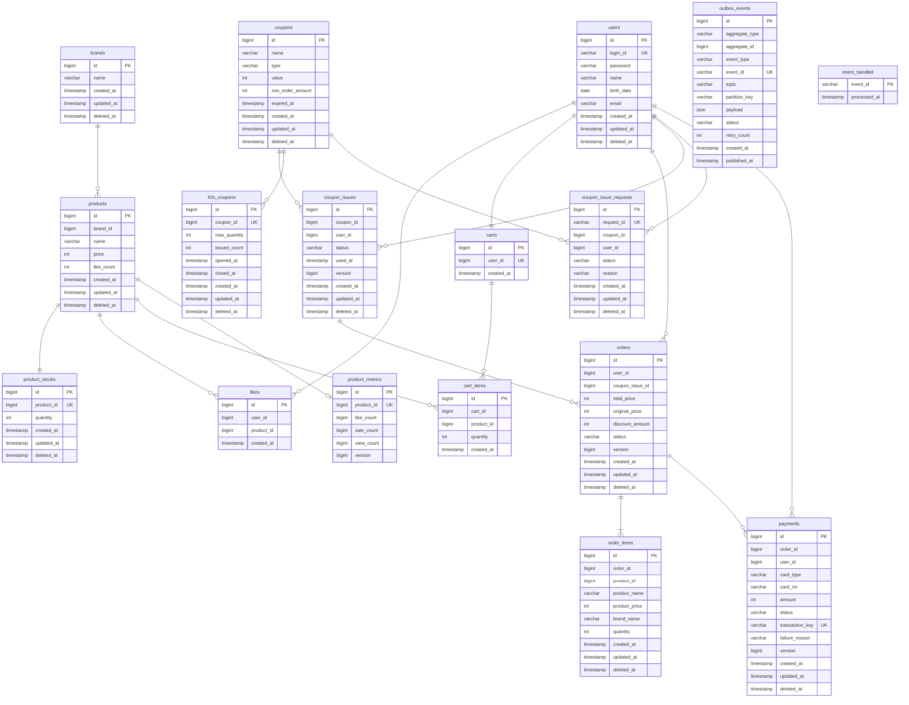

# ERD

> FK 제약조건은 사용하지 않는다. 관계선은 논리적 참조 관계를 나타내며, 실제 DB에서는 ID 컬럼으로만 참조한다.

---

## 다이어그램

---

## 제약조건

| 테이블 | 제약조건 | 설명 |
|---|---|---|
| users | UNIQUE(login_id) | 로그인 ID 중복 방지 |
| likes | UNIQUE(user_id, product_id) | 1인 1좋아요 보장 |
| carts | UNIQUE(user_id) | 1인 1장바구니 보장 |
| product_stocks | UNIQUE(product_id) | 상품당 1개의 재고 보장 |
| coupon_issues | UNIQUE(coupon_id, user_id) | 1인 1발급 보장 |
| payments | UNIQUE(transaction_key) | PG 트랜잭션 키 중복 방지 |
| outbox_events | UNIQUE(event_id) | 이벤트 중복 발행 방지 |
| product_metrics | UNIQUE(product_id) | 상품당 1개의 메트릭스 |
| fcfs_coupons | UNIQUE(coupon_id) | 쿠폰당 1개의 선착순 설정 |
| coupon_issue_requests | UNIQUE(request_id) | 요청 ID 중복 방지 |
| coupon_issue_requests | UNIQUE(coupon_id, user_id) | 1인 1요청 보장 |

---

## 인덱스 권장

| 테이블 | 인덱스 컬럼 | 용도 |
|---|---|---|
| products | brand_id | 브랜드별 상품 필터링 |
| product_stocks | product_id (UK) | 상품별 재고 조회 (UK이므로 자동 인덱스) |
| likes | user_id | 유저의 좋아요 목록 조회 |
| cart_items | cart_id | 장바구니의 항목 조회 |
| orders | (user_id, created_at) | 유저의 주문 목록 조회 (날짜 범위 필터링) |
| order_items | order_id | 주문의 상세 항목 조회 |
| coupon_issues | user_id | 유저의 쿠폰 목록 조회 |
| coupon_issues | coupon_id | 쿠폰별 발급 내역 조회 |
| payments | order_id | 주문별 결제 조회 |
| payments | transaction_key (UK) | PG 콜백 시 트랜잭션 키로 조회 (UK이므로 자동 인덱스) |
| outbox_events | (status, created_at) | Outbox polling — PENDING 이벤트 조회 |
| coupon_issue_requests | (coupon_id, user_id) (UK) | 중복 요청 확인 (UK이므로 자동 인덱스) |
| coupon_issue_requests | request_id (UK) | 발급 결과 조회 (UK이므로 자동 인덱스) |

---

## 설계 원칙

- **FK 제약조건 미사용** — ID 컬럼으로 논리적 참조만. 참조 무결성은 애플리케이션 레벨에서 검증한다.
- **Soft Delete** — 모든 테이블에 deleted_at 컬럼으로 논리 삭제. 물리적으로 데이터를 제거하지 않는다.
- **Soft Delete 예외** — likes, cart_items는 이력이 필요 없는 토글/임시 데이터이므로 물리 삭제(Hard Delete). UNIQUE 제약조건과의 충돌을 방지한다.
- **공통 컬럼** — 모든 테이블에 BaseEntity 공통 컬럼(id, created_at, updated_at, deleted_at) 포함.
- **Enum 저장** — OrderStatus(ORDERED, PAYMENT_PENDING, PAID, PAYMENT_FAILED, CANCELLED) 등 Enum은 VARCHAR로 저장한다.
- **Outbox 테이블** — outbox_events는 BaseEntity를 상속하지 않는 infrastructure 전용 테이블이다. JPA ddl-auto로 스키마 관리.
- **commerce-streamer 테이블** — product_metrics, fcfs_coupons, coupon_issue_requests, event_handled는 commerce-streamer 모듈에서 관리한다.
- **event_handled** — BaseEntity를 상속하지 않으며, eventId를 PK로 사용한다. 멱등성 체크 전용.

---

## 동시성 제어

| 대상 | 방식 | 이유 |
|---|---|---|
| ProductStock.quantity | 비관적 락 (product_stocks 행만 잠금) | 주문 시 재고 차감. 동시 주문에도 재고가 음수가 되어서는 안 된다. Product 행은 잠기지 않는다 |
| Product.like_count | @Modifying 벌크 UPDATE (엔티티 락 불필요) | 좋아요 등록/취소 시 JPQL UPDATE로 직접 증감한다 |
| CouponIssue.status | 낙관적 락 (@Version) | 동일 쿠폰의 동시 사용 방지. 극히 드문 경합이며 실패 시 재시도 불필요 (이미 사용된 쿠폰) |
| Payment.status | 낙관적 락 (@Version) | 콜백 중복 수신 시 충돌 감지 |
| Order.status | 낙관적 락 (@Version) | 결제/취소 동시 요청 시 충돌 감지 |
| ProductMetrics 카운터 | 낙관적 락 (@Version) + 3회 재시도 | Kafka Consumer에서 동시 집계 시 충돌 감지 후 재시도 |
| 선착순 쿠폰 수량 | Redis INCR (원자적) | DB 트랜잭션 외부에서 수량 gate. DB 실패 시 DECR 보상 |
| OutboxEvent 발행 | 비관적 락 (FOR UPDATE SKIP LOCKED) | 다중 인스턴스에서 동일 이벤트 중복 발행 방지 |

---

## 참조 무결성 검증 (애플리케이션 레벨)

FK 제약조건이 없으므로 다음을 애플리케이션에서 검증해야 한다:

- **상품 등록 시** — brand_id가 유효한(삭제되지 않은) 브랜드인지 확인
- **좋아요/장바구니 담기 시** — product_id가 유효한 상품인지 확인
- **주문 생성 시** — 모든 product_id가 유효하고 재고가 충분한지 확인

---

## OrderItem의 product_id 포함 이유

OrderItem은 스냅샷 데이터(product_name, product_price, brand_name)를 저장하지만, 원본 상품 추적을 위해 product_id도 함께 보관한다. 어드민 주문 조회 등에서 원본 상품 연결에 활용할 수 있다.
