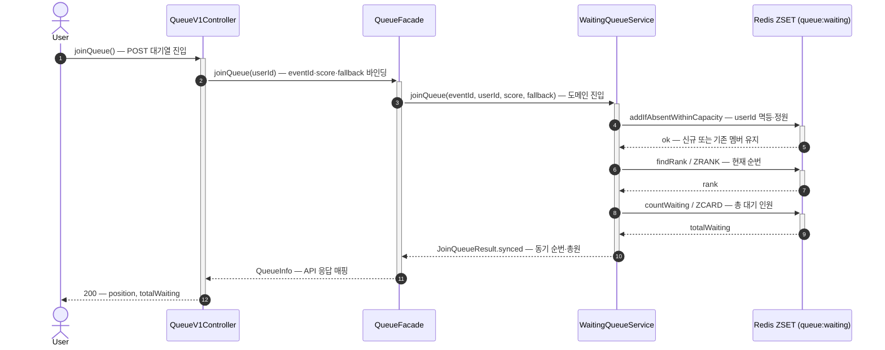
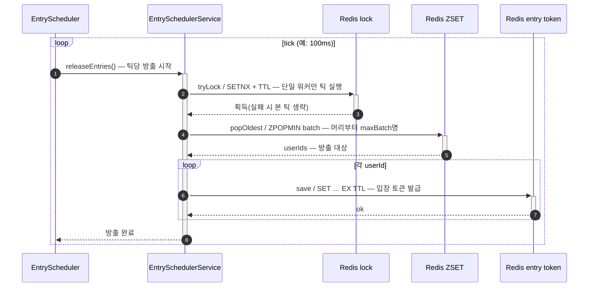
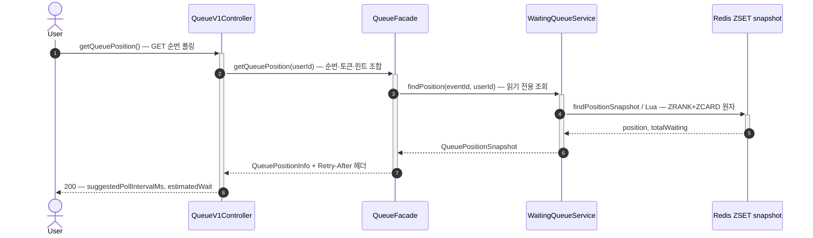
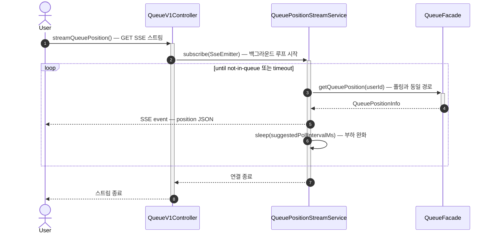
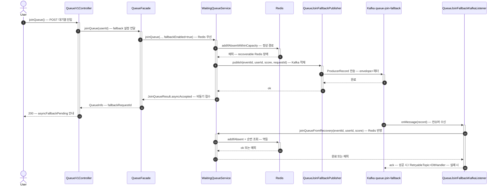

# Round 8 — 대기열 구현 로드맵 (기술·대안·파이프라인·시퀀스)

> 본 문서는 **구현 시 기술 선택**, **트레이드오프**, **파이프라인 단계**, **시퀀스 다이어그램**을 한곳에 모은다.  
> 요구·레이어·Redis 모델의 “정본”은 [08-waiting-queue-redis-design.md](../design/08-waiting-queue-redis-design.md) 를 따른다.

---

## 1. 기술 스택


| 구분        | 선택                                        | 비고                      |
| --------- | ----------------------------------------- | ----------------------- |
| 인메모리 큐    | Redis **Sorted Set**                      | score=시간, member=userId |
| 애플리케이션    | Spring Boot 3.x, `commerce-api`           | Facade·Controller 패턴 유지 |
| Redis 접근  | Spring Data Redis / `StringRedisTemplate` | `modules/redis` 바인딩     |
| 방출        | `@Scheduled` + **Redis 분산락(`SETNX`+TTL)** | 멀티 인스턴스 단일 실행 고정 전략     |
| 클라이언트 피드백 | **HTTP Polling + SSE** (모두 Must-have)     | Polling 기본, SSE 실시간 보완  |


---

## 2. 대안과 트레이드오프

### 2.1 Rate limiting vs Queuing


| 전략                | 적합 상황                        | 트레이드오프                   |
| ----------------- | ---------------------------- | ------------------------ |
| **Rate limiting** | API 보호, 봇, 일상 부하             | 초과 요청 **거부** → 재시도 폭풍·이탈 |
| **Queuing**       | 행사 피크, 유저가 기다릴 의사 있음         | 인프라·구현 복잡, 순번·스케줄 운영 필요  |
| **조합**            | 선제 rate limit → 정상 트래픽만 ZSET | 구현·모니터링 부담 증가            |


**결론(본 라운드)**: 주문 피크에는 **대기열이 본체**, 전역/엔드포인트 Rate limit은 **보조 안전장치**로 둔다.

### 2.2 Kafka 버퍼 vs Redis 대기열 (주문 UX)


| 항목      | Kafka (R7 쿠폰류) | Redis ZSET 대기열 |
| ------- | -------------- | -------------- |
| 유저 인지   | 나중에 결과 확인      | **지금 몇 번째**    |
| 순번 실시간성 | 소비자 처리 기준      | **ZRANK**로 즉시  |
| 멱등·유실   | 토픽 설계 중요       | TTL·방출 원자성 중요  |


주문 **이후** 이벤트는 기존 **ApplicationEvent → Outbox → Kafka** 흐름 유지 ([07](./07-event-driven-architecture-and-kafka-pipeline.md)).

### 2.3 Polling vs SSE


| 항목    | Polling       | SSE                             |
| ----- | ------------- | ------------------------------- |
| 구현    | 단순, LB 친화     | 연결 유지, 타임아웃·프록시 설정 필요(추가 설정 필수) |
| 부하    | 대기 인원 × 폴링률   | 변경 시만 푸시, Polling 부하 상쇄         |
| 본 라운드 | **Must-have** | **Must-have** (실시간 보완 채널)       |


**동적 폴링 간격**(순번 구간별)은 **이번 라운드 필수 구현 범위**로 포함한다. 서버는 `suggestedPollIntervalMs`와 `Retry-After`를 **동시에 제공**한다.


| 순번 구간             | suggestedPollIntervalMs | Retry-After(초) |
| ----------------- | ----------------------- | -------------- |
| `position <= 100` | `1000`                  | `1`            |
| `101 ~ 1000`      | `3000`                  | `3`            |
| `1001 ~ 10000`    | `5000`                  | `5`            |
| `> 10000`         | `10000`                 | `10`           |


토큰 발급 직후 미활성 구간에서는 위 구간과 무관하게 `suggestedPollIntervalMs >= 1000`을 유지한다.

### 2.4 Thundering Herd 완화


| 방법           | 설명                           | 비용                |
| ------------ | ---------------------------- | ----------------- |
| 틱 세분화        | 100ms마다 소량 `ZPOPMIN` (필수)    | 스케줄 오버헤드          |
| Jitter       | 토큰 유효 후 랜덤 지연 표시(클라, **필수**) | UX·구현 복잡 (설계로 명시) |
| 주문 API 최종 RL | 토큰 있어도 TPS 상한 (필수)           | 정책·설정 관리          |


**Jitter (구현)**

- `EntrySchedulerService`: 토큰 `SET` 직전 **`ThreadLocalRandom` 0~300ms(301 미포함)** 지연으로 Redis 쓰기·네트워크 스파이크를 완화한다.
- 별도 “미활성” 토큰 상태나 `RETRY_AFTER`로 주문을 막는 단계는 **두지 않음**(만료·불일치는 주문 관문에서 400).

**토큰 미사용(만료) 틱별 배치 보정** — 문서상 설계안이었으나 **현재 코드에는 없음**. 고정 `queue.scheduler.max-batch-size`만 사용.

### 2.5 Redis 장애 (Graceful Degradation 필수)


| 전략         | 장점       | 단점        |
| ---------- | -------- | --------- |
| 전면 차단      | 하류 보호 확실 | 주문 불가     |
| Bypass     | 서비스 지속   | DB 위험     |
| Fallback 큐 | 중간 타협    | 순서·정확도 저하 |


**결정사항**: Redis 장애 시 기본 전략은 **Fallback 큐(Kafka)** 로 고정한다.  
플래그(Kill switch)로 전면 차단/우회 전환은 가능하게 두되, 기본 모드는 Kafka 적재 후 비동기 처리 경로를 사용한다.

**Kafka Fallback — 대기열 진입(join) 전용 (구현)**

- **애플리케이션**: `commerce-api` (프로듀서·컨슈머 동일 모듈)
- **토픽**: `queue.fallback.topic-name` → 기본 `queue-join-fallback` (Spring Kafka `@RetryableTopic` 이 접미사 재시도·DLT 토픽 생성)
- **컨슈머 그룹**: `queue.fallback.consumer-group` → 기본 `loopers-queue-join-fallback-consumer`
- **페이로드**: `eventId`, `userId`, `score`, `requestId` — 복구 시 `joinQueueFromRecovery`
- **설정**: `apps/commerce-api/src/main/resources/application.yml` 의 `queue.fallback.*` — `local`/`test` 는 보통 `enabled: false`

주문(Place order) 파이프라인용 별도 토픽·`commerce-streamer` 전용 소비는 **본 라운드 구현 범위에 포함되지 않음**.

---

## 3. 처리량·스케줄러 배치 산정 (예시)

**전제(예시 — 실제 값은 운영 DB·앱 설정으로 치환)**

- DB 커넥션 풀 크기: `C = 50`
- 주문 1건 평균 처리 시간(서버+DB): `L = 0.2s`
- 이론 상한: `TPS ≈ C / L = 250`
- 안전 계수 `α = 0.7` → **목표 TPS ≈ 175**

**스케줄러**

- 틱 `Δ = 100ms` → 초당 10틱
- 틱당 방출 `n = ceil(175 / 10) = 18` 명/틱(상한)

**의미**: 한 순간에 “최대 약 18명”에게 토큰이 발급되므로, 동시 `POST /orders` 스파이크가 **175명 전체**보다 분산된다. (실제 주문 TPS는 PG·재고 락에 의해 더 낮을 수 있음 — **병목 재측정** 필요.)

이 표는 구현 시 `application.yml` 또는 Redis 메타 키와 **동기화**하고, 변경 시 로드맵/운영 문서를 갱신한다.

---

## 4. 예상 대기 시간 (클라이언트 표시)

- `throughputTps`: 초당 **토큰 발급 수**(스케줄러 목표)로 근사.
- `estimatedWaitSeconds = ceil(position / max(throughputTps, ε)) + 1` (Jitter 평균 1초 반영)
- UI 문구는 **“약 N초/분”** — 재고·이탈·TTL로 실제 값은 변동.

---

## 5. 구현 파이프라인 (단계)

```mermaid
flowchart LR
  subgraph Client
    A[POST /api/v1/queue/enter]
    B[GET /api/v1/queue/position loop]
    C[POST /api/v1/orders + token]
  end
  subgraph API["commerce-api"]
    F[QueueFacade]
    O[OrderFacade]
  end
  subgraph Redis
    Z[(ZSET waiting)]
    T[(entry token)]
  end
  subgraph Scheduler
    S[@Scheduled tick]
  end
  A --> F
  F --> Z
  B --> F
  F --> Z
  S --> Z
  S --> T
  B --> T
  C --> O
  O --> T
```


**권장 개발 순서 (리스크 최소)**

> 구현 순서: **1 → 3 → 4 → 2 → 5**  
> 이유: 큐 진입/방출/토큰 관문(핵심 보호 경로)을 먼저 안정화하고, 이후 사용자 피드백 채널과 장애 우회 경로를 붙인다.

1. **대기열 진입 구현 (step 1)**
  - 구현: `POST /api/v1/queue/enter` + Lua `addIfAbsentWithinCapacity` + `ZRANK`/`ZCARD`
  - 책임: 공정성(FIFO 근사)·중복 진입 멱등
  - 근거: 하류 보호의 출발점은 “요청을 대기열에 정확히 넣는 것”
  - **핵심 로직**
    - **멤버 = userId, score = 진입 시각(밀리초 등)** 이면 ZSET 정렬이 “먼저 들어온 순”에 가깝게 유지된다(FIFO 근사). 정확한 글로벌 FIFO는 단일 프로세스가 아니면 보장하기 어렵고, 본 설계는 **대기 순서의 상대적 공정성**에 초점을 둔다.
    - **진입 Lua**: 이미 멤버면 기존 score 유지(신규 ZADD 없음), 정원 초과면 거절 → 동일 유저 **멱등**, 정원 초과는 **409**.
    - **순번·총원·정원**: `addIfAbsentWithinCapacity`(Lua)로 신규/기존/정원 초과 처리. 정원 초과는 **409**. `ZRANK`/`ZCARD`는 진입 후 조회; 레이스 시 한 번 더 `addIfAbsentWithinCapacity` 재시도.
    - **애플리케이션 경계**: 도메인은 `JoinQueueResult`(또는 동등 타입)로 동기 순번·비동기 fallback 여부를 표현하고, API 응답 DTO는 Facade에서 매핑한다.
2. **스케줄러 방출/토큰 발급 구현 (Step 3)**
  - 구현: `SETNX` 분산락 → `ZPOPMIN` 배치 방출 → `SET entry token EX ttl`
  - 책임: Back-pressure와 Thundering Herd 완화
  - 근거: 방출 제어가 없으면 대기열만 있고 하류 보호는 성립하지 않음
  - **핵심 로직**
    - **분산락**: 인스턴스가 N개여도 **한 틱에 하나의 워커만** 방출하도록 `SETNX`+TTL(또는 동등)으로 잠금을 잡는다. 락 실패 시 해당 틱은 스킵 → 과도한 동시 `ZPOPMIN`을 막는다.
    - `**ZPOPMIN`**: score가 가장 작은 멤버부터 꺼내므로 **앞선 대기자부터 입장**시킨다. 틱당 상한(`maxBatch`)을 두면 **초당 방출량 ≈ (1/틱간격)×배치**로 목표 TPS를 맞출 수 있다(§3 산정과 연동).
    - **입장 토큰**: 방출된 userId마다 Redis에 **짧은 TTL**의 entry token을 둔다. 이후 주문 API는 이 토큰을 제시해야 하므로, **대기열을 통과한 사용자만** 하류로 진입한다.
    - **Jitter**(§2.4): 토큰 `SET` 전 0~300ms 지연만 적용. 만료 보정 배치는 **미구현**.
3. **주문 관문 토큰 검증/소모 구현 (Step 4)**
  - 구현: **`placeOrder` 본문 전** `OrderEntryTokenGate` → `OrderEntryTokenService` → Lua `consumeIfTokenMatches`
  - 책임: 무단 진입 차단, 토큰 **일회용**(동시 요청 레이스 방지)
  - **핵심 로직**
    - **설정 스위치**: `queue.order.require-entry-token` — `local`/`test` 프로파일에서는 기본 `false`, `dev/qa/prd` 에서 `true` (`application.yml` 프로파일 블록).
    - **원자성**: Redis Lua로 **일치 시에만 DEL**. 주문 트랜잭션 **성공 여부와 무관**하게 토큰은 관문에서 이미 소비됨(실패 시 재입장은 별도 정책).
    - **실패**: 토큰 없음/불일치 → `BAD_REQUEST`(400). Redis 장애 시 토큰 Lua 예외는 저장소 핸들러로 **500** 가능(08-qna 참고).
4. **순번 조회/실시간 피드백 구현 (Step 2)**
  - 구현: `GET /queue/position`, `suggestedPollIntervalMs` + `Retry-After`, SSE push
  - 책임: 대기 UX 개선(가시성), 과도한 조회 완화
  - 근거: 정합성 경로 완성 후 붙여도 핵심 보호 경로에 영향이 적음
  - **핵심 로직**
    - **스냅샷 일관성**: 순번과 총원을 **별도 명령 두 번**으로 읽으면 틱 사이에 값이 어긋날 수 있어, 구현에서는 **Lua 등으로 한 번에 읽는 스냅샷**을 권장한다(`QueuePositionSnapshot` 등).
    - **폴링 힌트**: 순번 구간별로 `suggestedPollIntervalMs`와 HTTP `Retry-After`를 **같은 정책**에서 나오게 하면, 클라이언트가 **불필요한 폴링 폭주**를 줄인다(§2.3 표).
    - **예상 대기**: `throughputTps`(스케줄 목표)와 순번으로 `estimatedWaitSeconds`를 근사한다. 표시 문구는 “약 N초” 수준(§4).
    - **SSE**: 별도 스레드에서 `getQueuePosition`과 동일 스냅샷을 주기적으로 JSON 이벤트로 보내고, 대기열에 없으면 스트림을 종료한다. **정합성 소스는 폴링과 동일(Facade/도메인)**을 쓰면 UX만 실시간으로 보강된다.
5. **Redis 장애 Fallback 구현 (Step 5)**
  - 구현: Redis 장애 시 Kafka fallback publish/consume, retry(5s/30s), DLQ, 멱등 처리
  - 책임: Graceful Degradation, 장애 전파 차단
  - 근거: 정상 경로 안정화 후 장애 경로를 추가하는 것이 운영 리스크가 낮음
  - **핵심 로직**
    - **트리거 조건**: 연결 실패·일시적 Redis 예외 등 **복구 가능한 백엔드 실패**만 fallback으로 보내고, **도메인 규칙 위반**(`CoreException`)은 그대로 상위로 전달한다.
    - **동기 응답**: 진입 API는 **즉시 순번을 줄 수 없을 때** `asyncFallbackPending` + `fallbackRequestId`로 **비동기 접수**를 알린다(클라이언트는 폴링/SSE로 이후 순번을 확인).
    - **Kafka 계약**: Outbox 릴레이와 맞춘 **envelope**(eventType, data, occurredAt 등) + 헤더로 발행해, 컨슈머가 동일 도메인 메서드(`joinQueueFromRecovery`)로 Redis에 반영한다.
    - **재시도·DLT**: `@RetryableTopic` 등으로 백오프 후 실패 시 DLT. 컨슈머는 동일 `joinQueueFromRecovery`로 **진입 Lua**가 멱등 처리.
    - **운영**: `queue.fallback.enabled`로 **로컬/테스트**에서는 Kafka 경로를 끄고, 운영에서만 켠다.

**중복 진입 정책(고정)**  
동일 유저 재진입은 에러 대신 멱등 처리(기존 순번 반환)로 구현한다(진입 Lua + `ZRANK` 조회).

**어뷰징 대응(현재/확장)**

- 현재 라운드: 로그인 유저만 허용(`member=userId`)으로 중복 진입 자연 억제.
- 확장 시: 비로그인 진입 전단에 `ip + ua + deviceId` 기반 rate limiting/challenge 추가.

---

## 6. 시퀀스 다이어그램

구현 순서 **1 → 3 → 4 → 2 → 5**에 맞춰, 단계별 책임이 드러나도록 시퀀스를 나눈다. (API 경로는 실제 구현에 맞게 `/api/v1/queue/...` 프리픽스를 붙인다.)

### 6.1 Step 1 — 대기열 진입 (FIFO 근사·중복 진입 멱등)

**책임**: 요청을 대기열에 정확히 넣는 것.  
**구현 요약**: `POST /api/v1/queue/enter` + 진입 Lua + `ZRANK`/`ZCARD`.

- **한 유저 = ZSET의 한 멤버**: `member=userId`로 두면 동일 유저의 중복 삽입은 `NX`에 걸린다. 이미 있으면 score는 바뀌지 않으므로 **“처음 진입 시각”**이 보존되고, 이후 요청은 **같은 순번 체계 안에서 멱등 응답**만 하면 된다.
- **score**: 요청 시각(밀리초)을 쓰면 정렬이 “먼저 온 사람이 앞”에 가깝다. 서버 시각 기준이므로 클라이언트 조작에 덜 민감하다.
- **응답 조립**: 도메인에서 `ZRANK`·`ZCARD`(또는 동일 정보)까지 읽은 뒤 `JoinQueueResult`로 넘기고, Facade가 `QueueInfo`로 API 계약을 맞춘다. Step 5와 겹치지 않는 한 **이 경로에서 Redis가 성공하면 항상 동기 순번**이 나간다.




| 메서드/연산                                           | 동작                                      |
| ------------------------------------------------ | --------------------------------------- |
| `QueueV1Controller.joinQueue`                    | 사용자 요청을 받아 Facade로 위임                   |
| `QueueFacade.joinQueue`                          | 이벤트 ID/score/fallback 설정을 묶어 도메인 서비스 호출 |
| `WaitingQueueService.joinQueue`                  | 정상 경로면 Redis 진입, 장애면 fallback 분기        |
| `WaitingQueueRepository.addIfAbsentWithinCapacity` (Lua) | 멱등·정원(409) |
| `WaitingQueueRepository.findRank` (`ZRANK`)      | 현재 순번 조회                                |
| `WaitingQueueRepository.countWaiting` (`ZCARD`)  | 총 대기 인원 조회                              |


### 6.2 Step 3 — 스케줄러 방출·입장 토큰 (Back-pressure·Thundering Herd)

**책임**: 방출 속도 제어로 하류 보호.  
**구현 요약**: `SETNX` 분산락 → `ZPOPMIN` 배치 방출 → `SET` entry token `EX` TTL.

- **왜 락인가**: 다중 인스턴스에서 동일 틱에 `ZPOPMIN`이 여러 번 돌면 **초과 방출**이 난다. 락은 “틱당 방출 주체를 하나로” 고정한다.
- `**ZPOPMIN`**: 최소 score 멤버를 제거하고 반환하므로 **대기열의 머리부터** 빼낸다. `maxBatch`로 **한 틱에 처리할 최대 인원**을 제한 → §3의 목표 TPS와 연결.
- **토큰 저장**: userId(또는 규칙화된 키)에 대해 **짧은 TTL**의 값을 넣는다. TTL이 지나면 **미주문자는 다시 대기열에 남거나 재방출 정책**으로 슬롯이 돌아간다(§2.4 만료 보정과 연동).
- **Heartbeat(선택)**: 스케줄러가 살아 있음을 Redis 키로 갱신하면, §7 알림(heartbeat 미갱신)과 연결된다.




| 메서드/연산                                            | 동작                       |
| ------------------------------------------------- | ------------------------ |
| `EntryScheduler.releaseEntries`                   | 고정 틱마다 방출 작업 시작          |
| `EntrySchedulerService.releaseEntries`            | 락 획득/배치 방출/토큰 발급 오케스트레이션 |
| `SchedulerLockRepository.tryLock` (`SETNX + TTL`) | 멀티 인스턴스에서 1개 워커만 틱 실행    |
| `WaitingQueueRepository.popOldest` (`ZPOPMIN`)    | 가장 오래 대기한 유저를 배치로 꺼냄     |
| `EntryTokenRepository.save` (`SET EX`)            | 주문 진입용 토큰 저장 및 TTL 설정    |


### 6.3 Step 4 — 주문 관문 토큰 검증·소모 (무단 진입 차단·일회용)

**책임**: 주문 플로우에 입장 자격을 묶는다.  
**구현 요약**: 주문 진입 전 Lua `consumeIfTokenMatches` 후 `placeOrder` 본문.

- **관문의 위치**: Controller가 아니라 **Facade 초입**에 두어, 주문 유스케이스 전체가 같은 전제(토큰 통과)를 갖게 한다.
- **일회용**: “읽고 지우기”를 분리하면 레이스로 두 번 쓸 수 있으므로, 구현체는 **일치 시 삭제까지 원자적으로** 처리한다(`consumeIfTokenMatches` 등).
- **토큰 미요구 환경**: 플래그로 관문을 끄면 **주문 API 단독 테스트·로컬**이 단순해진다. 운영 대기열 모드에서는 반드시 켠다.
- **실패 시**: 토큰 문제는 보통 **재대기·재발급**이 가능한 4xx로 매핑하고, 재고/쿠폰 등 **도메인 실패**와 구분한다.

```mermaid
sequenceDiagram
    autonumber
    actor User
    participant OC as OrderV1Controller
    participant OF as OrderFacade
    participant G as OrderEntryTokenGate
    participant S as OrderEntryTokenService
    participant T as Redis entry token

    User->>+OC: placeOrder() — HTTP + X-Entry-Token
    OC->>+OF: placeOrder(...) — 주문 유스케이스
    OF->>+G: verifyAndConsumeIfRequired() — 입장 관문
    G->>+S: assertValidAndConsume() — 검증·소모 위임
    S->>+T: consumeIfTokenMatches() — GET/DEL 원자 소비
    alt 토큰 없음·불일치
        T-->>-S: miss — 소비 실패
        S-->>-G: CoreException
        G-->>-OF: 실패
        OF-->>-OC: 실패
        OC-->>-User: 4xx
    else 유효
        T-->>-S: ok — 일회 소비 완료
        S-->>-G: 통과
        G-->>-OF: 관문 통과
        OF->>OF: placeOrder 본문 — 재고·쿠폰 등 도메인
        OF-->>-OC: 주문 결과
        OC-->>-User: 201 + body
    end
```


| 메서드/연산                                                         | 동작                    |
| -------------------------------------------------------------- | --------------------- |
| `OrderV1Controller.placeOrder`                                 | 주문 요청·토큰 헤더 수신        |
| `OrderFacade.placeOrder`                                       | 주문 플로우 시작 전 토큰 관문 호출  |
| `OrderEntryTokenGate.verifyAndConsumeIfRequired`               | 설정에 따라 검증/소모 수행 또는 통과 |
| `OrderEntryTokenService.assertValidAndConsume`                 | 토큰 값 검증 + 일회 소비       |
| `EntryTokenRepository.consumeIfTokenMatches` (`GET/DEL 원자 처리`) | 토큰 재사용 차단             |
| `OrderFacade.placeOrder` (도메인 호출)                              | 토큰 통과 후 실제 주문 생성      |


### 6.4 Step 2 — 순번 조회·실시간 피드백 (가시성·과도한 폴링 완화)

**책임**: 대기 UX·폴링 힌트.  
**구현 요약**: `GET /queue/position`, `suggestedPollIntervalMs` + `Retry-After`, SSE push.

- **읽기 전용**: 이 단계는 ZSET을 **변경하지 않는다**. 진입(Step 1)·방출(Step 3)과 충돌해도 **최대한 스냅샷만 흔들리는** 수준이 되도록, 가능하면 **원자 스냅샷**으로 읽는다.
- **Retry-After**: 브라우저·클라이언트가 다음 폴링 시점을 맞추기 쉽게 HTTP 헤더로도 준다. 본문의 `suggestedPollIntervalMs`와 **동일 정책**이어야 한다.
- **SSE 루프**: 서버는 내부적으로 Facade를 반복 호출해 이벤트를 밀어 넣는다. **비즈니스 규칙은 폴링과 공유**하고, 연결 수·타임아웃만 별도로 관리한다.
- **대기열 이탈**: 스냅샷에 없으면 404 또는 “not-in-queue” 이벤트로 **스트림 종료**를 알린다.




| 메서드/연산                                                        | 동작                         |
| ------------------------------------------------------------- | -------------------------- |
| `QueueV1Controller.getQueuePosition`                          | 순번 조회 API 진입점              |
| `QueueFacade.getQueuePosition`                                | 순번/토큰/폴링 힌트 조합             |
| `WaitingQueueService.findPosition`                            | Redis 스냅샷 조회 위임            |
| `WaitingQueueRepository.findPositionSnapshot` (`ZRANK+ZCARD`) | 현재 순번·총 대기 인원 스냅샷 반환       |
| `QueuePollHintPolicy.suggestedPollIntervalMs`                 | 순번 구간별 권장 폴링 간격 계산         |
| `QueuePollHintPolicy.retryAfterSeconds`                       | HTTP `Retry-After` 헤더 값 계산 |





| 메서드/연산                                  | 동작                      |
| --------------------------------------- | ----------------------- |
| `QueueV1Controller.streamQueuePosition` | SSE 연결 생성               |
| `QueuePositionStreamService.subscribe`  | `SseEmitter` 등록 및 루프 시작 |
| `QueuePositionStreamService.runLoop`    | 주기적으로 위치 조회 후 이벤트 전송    |
| `QueueFacade.getQueuePosition`          | 폴링 API와 동일한 계산 경로 재사용   |
| `QueuePositionStreamService.toJson`     | 이벤트 payload 직렬화         |


### 6.5 Step 5 — Redis 장애 Fallback (Graceful Degradation)

**책임**: Redis 불가 시에도 진입 의도를 유실하지 않고 하류 전파를 차단.  
**구현 요약**: Redis 장애 시 Kafka 비동기 접수 → 컨슈머가 `joinQueueFromRecovery` + `@RetryableTopic` 재시도·DLT, 진입 Lua로 멱등.

- **언제 켜나**: `queue.fallback.enabled=true`이고, 진입 시도 중 **복구 가능한 Redis/데이터 접근 예외**일 때만 Kafka로 넘긴다. 설정이 꺼져 있으면 **동기적으로 5xx/도메인 오류**로 끝낸다.
- **동기 경로와의 차이**: API는 **즉시 순번을 못 준다**는 사실을 `asyncFallbackPending` + `fallbackRequestId`로 표현한다. 클라이언트는 기존 폴링/SSE로 **나중에 순번이 잡혔는지** 확인한다.
- **메시지 내용**: `eventId`, `userId`, `score`(진입 시각), `requestId`를 넣어 **재처리·추적**이 가능하게 한다. 헤더에 eventType을 두면 컨슈머 라우팅이 단순해진다.
- **복구 처리**: 컨슈머는 **일반 진입과 동일한 도메인 메서드**(`joinQueueFromRecovery`)로 Redis에 반영한다. Redis가 아직 죽어 있으면 예외 → **재시도 토픽·DLT**로 빠진다.
- **멱등**: 동일 메시지가 두 번 와도 진입 Lua가 동일 userId를 안전히 처리. `requestId`는 추적용.




| 메서드/연산                                              | 동작                                    |
| --------------------------------------------------- | ------------------------------------- |
| `WaitingQueueService.joinQueue`                     | Redis 장애 감지 후 fallback 분기             |
| `QueueJoinFallbackPublisher.publish`                | Kafka에 fallback 메시지 발행                |
| `KafkaQueueJoinFallbackPublisher.buildEnvelopeJson` | eventType/data/partitionKey 포함 메시지 생성 |
| `QueueJoinFallbackKafkaListener.onMessage`          | 메시지 수신 후 복구 경로 실행                     |
| `WaitingQueueService.joinQueueFromRecovery`         | Redis 복구 반영 (진입 Lua + 순번 조회)       |
| `@RetryableTopic` + `@DltHandler`                   | 재시도(5s/30s) 및 DLQ 처리                  |


---

## 7. 테스트·관측 포인트


| 시나리오    | 기대                      |
| ------- | ----------------------- |
| 동시 진입   | score 순서와 ZRANK 일치      |
| TTL 만료  | 주문 거부, 재진입 정책 확인        |
| 스케줄러 정지 | Queue depth 증가 → 알림(운영) |
| 토큰 미사용  | TTL 후 재방출 가능            |


**알림 임계치** — 설계 문서에 적힌 heartbeat/락 연속 실패 알림은 **운영 연동 시 §9**. 코드는 heartbeat 키 갱신만 수행.

---

## 8. 문서 간 역할


| 문서                                 | 역할                     |
| ---------------------------------- | ---------------------- |
| [08-waiting-queue-redis-design.md](../design/08-waiting-queue-redis-design.md) | 레이어·API·Redis 키·체크리스트  |
| 본 로드맵                              | 기술·트레이드오프·산정·파이프라인·시퀀스 |
| [08-waiting-queue-risk-test-cases.md](../design/08-waiting-queue-risk-test-cases.md) | 테스트 클래스 매핑 |


