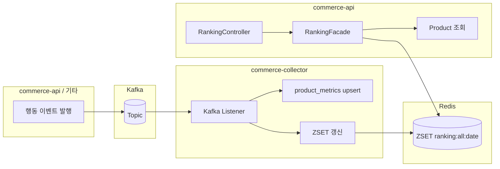
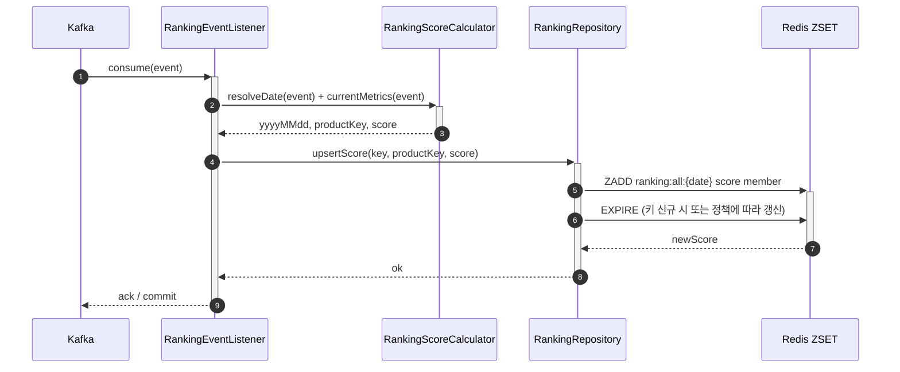
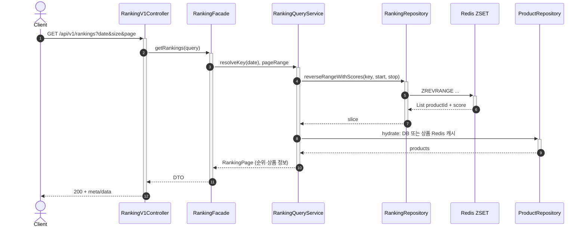
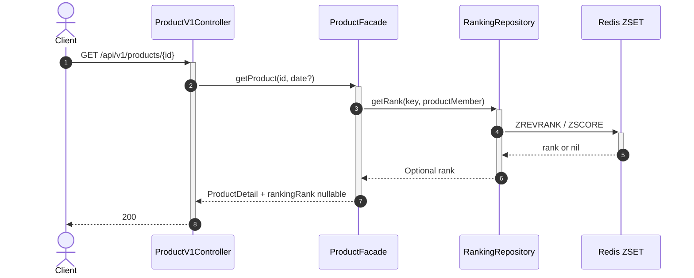

# Round 9 — 랭킹(ZSET) 구현 로드맵 (선택지·트레이드오프·분기별 구현 스케치)

> 본 문서는 **정해진 하나의 구현법**이 아니라, **갈래마다 어떻게 짜면 되는지**를 모은다.  
> quest가 고정한 것(예: 키 패턴·TTL·엔드포인트 형태)은 [09-quest.md](../qna/09-quest.md)를 보고, 개념·분기 표는 [09-ranking-redis-zset-design.md](../design/09-ranking-redis-zset-design.md) §3·§4·§12와 맞춘다. 팀 토론·결정 메모는 [09-qna.md](../qna/09-qna.md)를 참고한다.

---

## 1. quest가 좁히는 것 vs 팀이 고르는 것

| 구분              | 내용                                                                                       |
| --------------- | ---------------------------------------------------------------------------------------- |
| **좁혀짐 (quest)** | Redis ZSET 사용, 키 예시 `ranking:all:{yyyyMMdd}`, TTL 2일, 랭킹 목록·상세 순위 API, 상품 정보 aggregation |
| **팀 선택**        | 쓰기 주체(collector/API/배치), 점수 반영 방식(증분/재계산), 단일 ZSET vs 시그널 분리, 페이지네이션 방식, 멱등 전략, 캐시 여부    |

**공통 기술**: Spring Data Redis(`StringRedisTemplate` 등), `modules/redis`, JUnit/Testcontainers/Kafka는 프로젝트 표준(`AGENTS.md`)을 따른다.

---

## 1.1 `feature/week9-*` 대원칙 (작업 고정 규칙)

본 라운드(`feature/week9-*`)는 아래 원칙을 **고정**한다.

1. 구현은 본 문서의 **총 8단계** 표 및 §5.3a 실행 순서를 기준으로 진행한다(두 표의 단계 번호는 동일).
2. 선택지가 있는 설계 항목은 **해당 단계 직전**에 결정한다.
3. 단, 앞 단계 테스트/구현의 전제가 되는 항목은 미리 결정한다.
4. 결정하지 않은 항목은 코드에 암묵적으로 먼저 구현하지 않고, 사용자에게 의견을 물은 뒤 승인이 있고 나서 결정하고, 문서/테스트로 의도를 남긴다.
5. [TDD.md](../TDD.md) 기준으로 테스트 코드를 먼저 작성 후 구현을 진행한다.
6. [AGENTS.md](../AGENTS.md) 기준을 항상 준수하며 구현을 진행한다.
7. 구현후 javadoc으로 클래스 수준, 메서드 수준에서 주석을 작성한다.
8. 구현 후 설명 아래에 이전 커밋 형식 참고해서 계층별 커밋 제목 및 본문 메시지도 함께 보여준다.

근거:

- design 문서가 “고정값(키/TTL/API)”과 “팀 선택값(쓰기/점수/구조)”을 분리하고 있음.
- roadmap 마일스톤도 “계약 고정 → 쓰기/읽기 → E2E → 확장”의 의존 구조를 전제함.

## 1.2 확정 결정 반영 (design 기준)

`09-ranking-redis-zset-design.md`에 기록된 결정을 본 로드맵에 반영한다.

1. **쓰기 주체**: `Collector(Kafka Consumer)` 중심으로 진행, 배치 리스너 활용
  - 근거: design §3.1 기본 파이프라인이 `api emit -> kafka -> collector -> redis`를 기본 흐름으로 고정.
2. **점수 반영 방식**: **매트릭 기반의 ZADD (정규화 및 자가 보정)**
  - 실시간 경로: 이벤트 처리 시 Redis 점수 반영  
  - 보정 경로: DB 원장 기반 주기 보정 배치 수행  
  - 근거: design §4.1의 “매트릭 기반 `ZADD` 보정 제언”, §5.3 보완책 2(정합성 보정) 명시.
3. **날짜 귀속 기준**: `occurredAt + Asia/Seoul` 채택 (**KST 자정 기준 + 스코어 캐리오버)**
  - 근거: design §5.3 결정 항목에 명시.

위 3가지는 week9 구현의 선결정으로 취급하며, 별도 변경 시 문서와 테스트를 동시에 갱신한다.

1. **읽기 경로 (design §4.2 반영)**
  - ZSET에는 **상품 ID·score만** 저장하고, 목록 응답의 상세 필드는 **Hydration**(현재 구현: DB 배치 조회; 상품 Redis String 캐시는 선택).  
  - **페이지 캐시**는 기본적으로 두지 않는다.  
  - 조회 키는 `**ranking:all:{yyyyMMdd}`** 동적 일자 키(기본 오늘, Asia/Seoul). Carry-over는 **쓰기**가 당일 키를 채우는 전제로 **읽기는 동일 키**만 본다.

## **전체 구현 단계 (총 8단계)**

1. **계약 고정 단계**
  - 유저 행동: 오늘/특정일 랭킹 조회
  - 구현: 키 규칙, 타임존, member 형식, TTL(2일), `date` 기본값 확정
  - 근거: design §4, §5 / roadmap §5(계약 고정)
2. **점수 규칙 단계**
  - 유저 행동: 조회/좋아요/주문 발생
  - 구현: 이벤트별 delta 계산식(선형/log/cap 중 선택), 테스트 값 고정
  - 근거: design §6 / roadmap §3.6
3. **쓰기 경로(트랜잭션 동기화) 단계**
  - 유저 행동: 행동 이벤트가 랭킹 점수로 반영됨
  - 구현: Collector/API/배치 중 하나 선택해 ZSET 갱신 파이프라인 구축
  - 근거: design §3.2, §12 / roadmap §3.3
4. **랭킹 목록 API 단계**
  - 유저 행동: `/api/v1/rankings?date&page&size` 조회
  - 구현: `ZREVRANGE` + `ZCARD` + 상품 정보 aggregation
  - 근거: design §8 / roadmap §2.1, §7.2
5. **랭킹 상세 순위 API 단계**
  - 유저 행동: 상품 상세 진입 시 “오늘 N위” 확인
  - 구현: `ZREVRANK`, 미존재 시 null 처리
  - 근거: design §4.2, §8 / roadmap §2.2, §7.3
6. **랭킹 페이지/일관성 단계**
  - 유저 행동: 다음 페이지 이동, 재조회
  - 구현: 오프셋(기본) 또는 커서(선택), 동점/실시간 변동 정책 명시. **완화(구현됨)**: `POST /api/v1/rankings/snapshots`로 일간 ZSET 복제본(`ranking:snap:{yyyyMMdd}:{uuid}`) 생성 후 `GET ...&rankingSnapshotId=`로 다중 페이지 시 순서 고정 — design §4.3, `RankingSnapshotRepository`, `RedisRankingSnapshotRepository`, `app.ranking.snapshot-ttl-seconds`
  - 근거: design §4.2.6(API·운영 고지), §4.3, §8(페이지 선택지), §13.7 / roadmap §6
7. **콜드스타트/운영 단계 (옵션)**
  - 유저 행동: 자정 직후 랭킹 화면
  - 구현: Carry-Over/무시/DB 시드 중 선택
  - 근거: design §7 / roadmap §8
8. **검증 단계 (TDD 기반)**
  - 유저 행동: 발행→반영→조회 전체 정상 동작
  - 구현: 단위(키·delta), 통합(Redis), E2E(이벤트→API) 완성
  - 근거: design §10 / roadmap §9

---

## 2. 유저 시나리오 (기능 ↔ 언제 쓰이나)

아래는 **엔드유저·화면 관점**에서 “어떤 구현이 왜 필요한지” 연결하기 위한 시나리오다. (백그라운드 파이프라인은 사용자가 직접 호출하지 않는다.)

### 2.1 랭킹 목록 API `GET /api/v1/rankings`

| 시나리오          | 사용자 행동                      | 기대 화면·결과               | 구현과의 연결                                                                                                                                                                 |
| ------------- | --------------------------- | ---------------------- | ----------------------------------------------------------------------------------------------------------------------------------------------------------------------- |
| **오늘의 인기**    | 앱 홈·카테고리 탭에서 “오늘의 인기 상품” 진입 | 오늘 기준 상위 N개가 카드 형태로 나열 | `date` 생략 또는 오늘 `yyyyMMdd` → `ZREVRANGE` + 상품 enrichment                                                                                                                |
| **어제/특정일 보기** | “어제 인기” 링크, 또는 날짜 피커로 과거 조회 | 해당 일자의 인기 순위           | 동일 API에 `date=yyyyMMdd` → **일간 키** `ranking:all:{date}` 조회 (TTL 내에만 유효)                                                                                                 |
| **더 보기·페이지**  | 목록 하단 “다음” 또는 페이지 번호        | 다음 구간 상품 (순위 이어짐)      | `page`·`size` → Redis `start`·`stop`. **라이브 키만 쓰면** 실시간 갱신으로 같은 `page` 재요청 시 항목이 바뀔 수 있음([design §4.2.6](../design/09-ranking-redis-zset-design.md)). **스냅샷**: `POST .../rankings/snapshots` 후 `rankingSnapshotId`로 조회하면 페이지 넘김 동안 순서 고정([design §4.3](../design/09-ranking-redis-zset-design.md)) |
| **빈 랭킹**      | 새벽·이벤트 전, 아직 점수가 거의 없을 때    | 빈 목록 또는 “집계 중” 메시지     | ZSET이 비어 있으면 빈 배열·`totalElements=0` 등 **정책을 API 계약에 맞춤**. 빈 화면을 **장애로 느끼는 UX**라면 Carry-Over·어제 인기 혼합 등 **Nice-to-have** 검토([09-qna.md](../qna/09-qna.md) Q4, design §7) |

### 2.2 상품 상세의 “순위” 필드

| 시나리오       | 사용자 행동               | 기대 화면·결과          | 구현과의 연결                                                         |
| ---------- | -------------------- | ----------------- | --------------------------------------------------------------- |
| **순위 뱃지**  | 상품 상세 진입             | “오늘 **N**위” 같은 표시 | `ZREVRANK`(또는 동등)로 순위. 목록과 **같은 일자 규칙**(오늘/쿼리 `date`)을 쓰면 UX 일관 |
| **비랭킹 상품** | 롱테일·신상 등 ZSET에 아직 없음 | 뱃지 숨김 또는 “순위 없음”  | Redis에 멤버 없음 → **null** (quest 체크리스트)                           |

### 2.3 점수가 쌓이는 흐름 (사용자는 Kafka를 모름)

| 시나리오      | 사용자 행동                | 백엔드에서 일어나는 일 (개념)                                             | 구현과의 연결                                   |
| --------- | --------------------- | ------------------------------------------------------------- | ----------------------------------------- |
| **조회 반영** | 상품 목록·상세를 **여러 번** 본다 | 조회 이벤트가 Kafka로 가면 collector가 DB 매트릭을 갱신하고 총점을 재계산해 `ZADD` 업서트 | **쓰기 경로** §3.3·§3.4 (collector / 배치 등 선택) |
| **좋아요**   | 찜하기                   | 좋아요 이벤트도 동일하게 DB 매트릭 기반 재계산 후 `ZADD` 반영                       | 동일                                        |
| **주문**    | 결제 완료                 | 주문 이벤트도 상품별 매트릭(판매량 포함) 재계산 후 `ZADD` 반영                       | 주문 점수 규칙 §3.6                             |
| **반영 지연** | 방금 주문했는데 순위가 안 바뀐다    | 컨슈머 lag·배치 윈도우                                                | lag 모니터링, UX 문구 “잠시 후 반영” 등 **운영 선택**     |

### 2.4 Nice-to-have·운영 시나리오 (참고)

| 시나리오        | 맥락               | 연결                                                                           |
| ----------- | ---------------- | ---------------------------------------------------------------------------- |
| **자정 직후 홈** | 어제와 오늘 랭킹이 갈린다   | Carry-Over·콜드 스타트 §8, [design §7](../design/09-ranking-redis-zset-design.md) |
| **행사 시간대**  | 조회·주문 폭주         | 배치 컨슈머·pipeline §3.4                                                         |
| **가중치 조정**  | PM이 “주문 비중을 올리자” | 가중치 외부화·재배포 또는 배치 재계산                                                        |

---

## 3. 대안과 트레이드오프 (+ 분기별 구현 스케치)

> 아래 분기 설명은 학습/비교용으로 유지한다.  
> **week9 실제 구현은 §1.2 확정 결정(Collector + 혼합 보정 + occurredAt/Seoul)을 우선 적용**한다.

### 3.1 단일 ZSET vs 시그널별 ZSET

| 방식            | 장점                         | 단점                            |
| ------------- | -------------------------- | ----------------------------- |
| **단일 ZSET**   | `ZREVRANGE` 한 번, API·쓰기 단순 | 시그널별 “왜 이 순위인지”는 메트릭·로그 보강 필요 |
| **시그널별 ZSET** | 원인 분해·튜닝 용이                | 조회 시 합성 비용, 키·TTL 관리 증가       |

**단일 ZSET을 택하면**: 컨슈머에서 이벤트 처리 후 DB 매트릭을 조회해 총점을 계산하고 `upsertScore(ranking:all:{d}, productId, score)`를 호출. 목록 API는 `reverseRangeWithScores` + `ZCARD`.

**시그널별을 택하면** (예시):

- 쓰기: `ranking:view:{d}`, `ranking:like:{d}`, `ranking:order:{d}`에 각각 `ZINCRBY`.
- 읽기 A — **서버에서 합산**: 세 ZSET을 읽어 앱 메모리에서 가중 합 후 정렬(상품 수가 매우 클 때 **Redis 읽기·메모리 부담**이 커질 수 있음).
- 읽기 B — `**ZUNIONSTORE`**: `ZUNIONSTORE tmp:{uuid} 3 k1 k2 k3 WEIGHTS w1 w2 w3 AGGREGATE SUM` → `ZREVRANGE tmp` → `DEL tmp` 또는 짧은 TTL. 합산 키로 Top-N만 읽기 쉬움. 합성 **주기·임시 키 TTL**은 운영 규칙으로 관리([09-qna.md](../qna/09-qna.md) Q1).
- **설명 가능성**: 시그널별 점수는 원본 ZSET에 남고, 합성 키는 총점 위주 — CS용으로는 원본 키 추가 조회·대시보드 등을 병행하는 경우가 많다.

---

### 3.2 랭킹 소스: Redis만 vs DB 직접 vs 하이브리드

| 항목    | Redis ZSET (quest 전제) | DB 매 요청 집계 | 하이브리드             |
| ----- | --------------------- | ---------- | ----------------- |
| 읽기 부하 | 메모리, 정렬 선계산           | 쿼리 무거움     | Redis 우선, 실패 시 DB |
| 실시간성  | 높음                    | 낮음(배치)     | 정책에 따라            |

**Redis만 본다면**: `RankingRepository`가 `ZREVRANGE`/`ZREVRANK`만 제공. Redis 다운 시 500 또는 빈 랭킹(정책 선택).

**하이브리드를 택하면**: Facade에서 Redis 예외 또는 empty일 때 `product_metrics` 등에서 “어제 인기” 쿼리로 fallback. **두 소스의 의미(일자·정의)가 달라질 수 있음**을 API 문서에 적는다.

---

### 3.3 쓰기 경로: Collector vs API 동기 vs 배치 재생성

| 방식                   | 트레이드오프                              |
| -------------------- | ----------------------------------- |
| **Collector(Kafka)** | subject 그림과 동일. lag 시 점수 지연.        |
| **API 동시 쓰기**        | Kafka 우회 시에도 점수 반영 가능. 이중 쓰기·멱등 이슈. |
| **배치 재생성**           | 멱등·감사에 유리. “실시간”과의 거리를 정의해야 함.      |

**Collector를 택하면**: `@KafkaListener` → 기존 R7 핸들러에서 `product_metrics`를 갱신하고, DB 커밋 후 `findById`로 최신 매트릭을 읽어 `rankingWriter.upsertScore(date, productId, score)`를 호출한다. Redis 실패는 로그 후 skip/DLQ 정책을 따른다.

**API 동시 쓰기를 택하면**: 예) 주문 확정 Facade 끝에서 `RankingEvent` 발행과 **별도로** `ZINCRBY` 호출 시, 동일 주문이 Kafka에도 가면 **중복**. → Kafka만 쓰기 **또는** API만 쓰기 **또는** 이벤트에 `source`/`dedupKey`로 한쪽만 처리.

**배치 재생성을 택하면**: `@Scheduled` 또는 Spring Batch로 N분마다 DB 집계 → 새 ZSET 키에 `ZADD` 다건 → `RENAME`으로 스왑. 실시간 이벤트 경로는 끄거나 “배치 사이만 증분” 같은 타협을 문서화한다.

---

### 3.4 컨슈머: 레코드당 처리 vs 배치 리스너

| 방식                  | 장점                    | 단점               |
| ------------------- | --------------------- | ---------------- |
| **레코드당 재계산+`ZADD`** | DB 기준 자가 보정 유리, 구현 명확 | 이벤트당 DB 조회/계산 비용 |
| **배치**              | 합산 후 pipeline         | 버퍼 타임아웃·부분 실패 처리 |

**레코드당을 택하면**: `listen` 본문에서 DB 매트릭 갱신 → 커밋 후 `findById` 재조회 → score 계산 → `upsertScore` → offset commit.

**배치를 택하면**: 청크(시간 또는 개수)마다 `Map<ProductKey, Double> acc`에 누적 → `redisTemplate.executePipelined`로 `ZINCRBY` 연속 전송 → 단일 commit. **청크 중 예외** 시 재시도 정책(전체 청크 재처리 vs 이미 반영분)을 정한다.

---

### 3.5 점수 갱신: 재계산 `ZADD` vs 전량 재작성

| 방식               | 멱등·레이스                | 구현 요약                     |
| ---------------- | --------------------- | ------------------------- |
| `**재계산 + ZADD`** | 중복 합산 위험 낮음, 자가 보정 유리 | 이벤트마다 매트릭 조회/계산 필요.       |
| **전량 `ZADD`**    | 입력 같으면 멱등에 가깝음        | 배치가 전체 score 맵 계산 후 키 교체. |

**전량 재작성을 택하면**: `ranking:all:{d}:staging`에 `DEL` 후 `ZADD` 다건 또는 `ZADD`만(멤버 덮어쓰기) → `RENAME` staging→본키. 읽기 API는 스왑 중 이전 키를 보도록 **이중 버퍼** 패턴을 쓸 수 있다.

---

### 3.6 주문 delta: 선형 vs log·캡

| 방식                      | 구현 스케치                                                     |
| ----------------------- | ---------------------------------------------------------- |
| 선형 `w * price * amount` | 주문 페이로드에서 계산한 값을 포함해 최종 점수를 재계산 후 `ZADD` 업서트.              |
| `w * log1p(revenue)`    | `Math.log1p(price * amount)` 후 가중. 단위 테스트에 큰 주문·작은 주문 케이스. |
| 상한 캡                    | `delta = min(computed, CAP)`로 팀이 정한 상한.                    |

---

### 3.7 Top-N: 매 요청 Redis vs (선택) 캐시

ZSET `ZREVRANGE`·`ZCARD`는 단일 커맨드로 빠르므로, **랭킹 페이지 결과 전체를 다시 캐싱하는 페이지 캐시는 보통 불필요**하다([design §4.2.3](../design/09-ranking-redis-zset-design.md)). 상품 상세는 **상품 단위 Redis String 캐시** 등으로 Hydration 쪽에서 히트율을 노린다.

| 방식                | 구현 스케치                                                                                     |
| ----------------- | ------------------------------------------------------------------------------------------ |
| 매 요청(ZSET)        | Facade → `reverseRangeWithScores` + `ZCARD` — **기본 권장**                                    |
| 애플리케이션 페이지 캐시     | Caffeine/`@Cacheable` 키 `(date, page, size)` — 트래픽·운영상 필요할 때만. 무효화·정합성 비용을 감수할 때.          |
| Redis에 목록 JSON 캐시 | `STRING ranking:page:{d}:{page}` — ZSET 갱신 시 무효화가 **쓰기 경로와 결합**되어 복잡해지기 쉬움. **기본 권장하지 않음** |

---

### 3.8 페이지네이션: 오프셋 vs 커서

| 방식                      | 구현 스케치                                                                                                                                     |
| ----------------------- | ------------------------------------------------------------------------------------------------------------------------------------------ |
| **오프셋 (`page`·`size`)** | quest 그대로. `start=(page-1)*size`, `end=start+size-1`. 동점 많으면 순위가 “흔들려” 보일 수 있음.                                                            |
| **커서**                  | API에 `afterScore`, `afterMember`(또는 opaque cursor) 추가. `ZREVRANGEBYSCORE`/`ZREVRANGE`에서 다음 구간 조회. quest와 병행하려면 **별 엔드포인트** 또는 옵션 파라미터로 분리. |

---

## 4. 모듈·레이어 배치 (DIP) — 배치별 예시

### 4.1 subject 그림: collector 쓰기 + api 읽기

| 레이어                | commerce-collector                                                           | commerce-api                                            |
| ------------------ | ---------------------------------------------------------------------------- | ------------------------------------------------------- |
| **interfaces**     | Kafka 리스너                                                                    | `RankingV1Controller`                                   |
| **application**    | 이벤트→랭킹 갱신 조율                                                                 | `RankingFacade`                                         |
| **domain**         | `RankingScoreCalculator`, `RankingKeyResolver`, `RankingWriteRepository`(포트) | `RankingQueryService`, `RankingReadRepository`(포트)      |
| **infrastructure** | `RedisRankingWriter` (`ZADD` upsert, `EXPIRE`)                               | `RedisRankingReader` (`ZREVRANGE`, `ZCARD`, `ZREVRANK`) |

**포트를 한 인터페이스로 묶을지 쪼갤지**: 읽기/쓰기 이원화는 **collector에 읽기 구현을 안 넣기** 쉬워진다. 반면 한 클래스에 모으면 파일 수는 줄고, 모듈 경계가 흐려질 수 있다.

### 4.2 키 규칙 공유 방법

| 방법                                                    | 이 방향일 때                                                           |
| ----------------------------------------------------- | ----------------------------------------------------------------- |
| **공유 작은 모듈** (예: `supports/ranking-core` 또는 기존 공유 모듈) | `RankingRedisKey.forAll(LocalDate)` 정적 팩토리 한 곳. collector·api 의존. |
| **문서로만 맞춤**                                           | 모듈 의존 없음. 키 규칙 불일치 리스크가 있다.                                       |
| **설정으로 prefix만 주입**                                   | `application.yml`의 `ranking.redis.key-prefix`로 환경별 변경 가능.         |

### 4.3 상품 aggregation (Hydration)

quest는 “ID만이 아닌 상품 정보”를 요구한다. [design §4.2](../design/09-ranking-redis-zset-design.md)와 같이 **ZSET에는 상품 ID·스코어만** 두고, 표시용 필드는 **별도 단계에서 결합**한다.

공통 패턴:

1. **ZSET에서 ID·score만** `ZREVRANGE … WITHSCORES` 등으로 슬라이스 (member에 이름·가격을 넣지 않음)
2. `member` → `productId` 파싱
3. **Hydration**: Redis **상품 String 캐시**가 있으면 우선 조회, 없으면 `ProductRepository` 등 **DB 배치 조회** — 다른 도메인(검색·추천)과 동일 캐시 키를 쓰면 히트율 극대화
4. 없는 상품은 응답에서 제외 vs placeholder — **정책 선택** 후 E2E 고정

**읽기 측 추가 지침** (design §4.2.3):

- **페이지 캐시**(랭킹 JSON 전체 재캐싱)는 ZSET 단건 조회가 이미 빠르므로 **기본적으로 두지 않는다**.
- **날짜 키**는 `ranking:all:{yyyyMMdd}`로 **요청 일자·오늘(Asia/Seoul)**에 맞춘 **동적 키**를 본다.
- **Carry-over**가 있으면 쓰기 경로가 당일 키에 시드를 넣고, 읽기는 동일 키만 조회하면 된다.

---

### 4.4 API가 쓰기까지 하는 분기

collector 없이 또는 보완으로 API가 랭킹 쓰기를 호출한다면, **동일 레이어 규칙**을 깨지 않도록 `ProductFacade`/`OrderFacade`에서 `RankingWritePort`만 호출하고, Redis 템플릿은 infrastructure에 둔다.

---

## 5. 구현 파이프라인 (참고 다이어그램 + 의존 관계)

### 5.1 subject 기본 흐름 (Collector 쓰기)

### 5.2 배치 재생성만 쓰는 흐름 (대안)

Kafka 실시간 경로 없이 **스케줄러만** ZSET을 채우는 경우: `DB → 집계 서비스 → Redis` 화살표만 남고, API는 동일하게 ZSET을 읽는다.

### 5.3 “무엇이 무엇에 의존하는가” (순서는 팀이 쪼개도 됨)

| 마일스톤      | 포함 가능한 산출                                | 비고                  |
| --------- | ---------------------------------------- | ------------------- |
| **계약 고정** | 키·TTL·타임존·member 형식·delta 규칙 문서 + 단위 테스트 | 쓰기/읽기/배치 **공통**     |
| **쓰기 경로** | 선택한 주체(collector/API/배치)에 맞는 통합 테스트      | ZSET에 점수가 쌓이는지      |
| **읽기 경로** | Ranking API + 상품 조합 + 상세 순위              | quest 체크리스트         |
| **E2E**   | 이벤트→(중간 단계)→HTTP                         | 경로마다 스텝이 다름         |
| **확장**    | 배치 리스너, Carry-Over, 캐시, 시그널 분리           | Must-have와 분리 커밋 권장 |

**의존**: 읽기 API는 “ZSET에 의미 있는 데이터가 있다”는 전제가 필요하므로, **통합/E2E**를 먼저 돌리려면 쓰기 경로 중 하나는 최소 구현되어 있어야 한다. 반대로 **Redis를 수동으로 시드**해 읽기만 먼저 개발하는 것도 가능하다.

### 5.3a 확정 결정 기반 구현 단계 (실행 순서)

아래는 §1.2 결정을 반영한 week9 실제 실행 순서이며, 상단 **[전체 구현 단계 (총 8단계)]** 와 **단계 번호·명칭을 동일**하게 맞춘다.

| 단계  | 구현 목표              | 유저 행동 관점                | 필수 산출물                                                                                                                                 |
| --- | ------------------ | ----------------------- | -------------------------------------------------------------------------------------------------------------------------------------- |
| 1   | 계약 고정 단계           | 오늘/특정일 랭킹 조회 시 날짜 의미 일관 | `RankingKeyResolver(occurredAt, Asia/Seoul)`, 키/TTL 규칙 테스트                                                                             |
| 2   | 점수 규칙 단계           | 조회/좋아요/주문이 기대 비중으로 반영   | `RankingScoreCalculator` 단위 테스트(가중치·경계값)                                                                                               |
| 3   | 쓰기 경로(트랜잭션 동기화) 단계 | 행동 이벤트가 랭킹 점수로 반영됨      | **(a)** Kafka Collector → Redis 실시간 반영 통합 테스트 **(b)** DB metrics 재계산 → `ZADD` 보정 배치 + 통합 테스트(유실·정합성 보정) — 설계상 (a)(b) 모두 쓰기 경로에 속함      |
| 4   | 랭킹 목록 API 단계       | 홈/카테고리에서 인기 목록 조회       | `GET /api/v1/rankings` (오프셋 페이지) + 상품 aggregation E2E; 선택 `POST /api/v1/rankings/snapshots` + `rankingSnapshotId` 조회                                                                                  |
| 5   | 랭킹 상세 순위 API 단계    | 상세 진입 시 “오늘 N위” 확인      | 상세 응답 rank 필드(null 포함) E2E, `ZREVRANK`·미존재 시 null                                                                                      |
| 6   | 랭킹 페이지/일관성 단계      | 다음 페이지 이동, 재조회          | [design §4.2.6](../design/09-ranking-redis-zset-design.md)·[§4.3](../design/09-ranking-redis-zset-design.md) API·운영 고지(오프셋·재조회·동점·SSOT/`ZADD`·**REST 스냅샷 완화**). 커서 도입 시 별 계약. 멱등·재수신 운영 규칙 정리 |
| 7   | 콜드스타트/운영 단계 (옵션)   | 자정 직후 랭킹 화면             | Carry-Over/무시/DB 시드 중 선택, 스케줄·운영 테스트(선택 시)                                                                                             |
| 8   | 검증 단계 (TDD 기반)     | 발행→반영→조회 전체 정상 동작       | 단위(키·delta), 통합(Redis·쓰기 경로), E2E(이벤트→API), 중복 이벤트 처리 정책 테스트, 모니터링 포인트 문서화                                                             |

### 5.3b 결정 반영 후 “지금 당장” 작업 범위

Must-have(이번 구현 범위):

1. 단계 1~5 완료 (계약 고정 ~ 랭킹 상세 순위 API)
2. 단계 6(페이지/일관성)은 정책·계약 명시 및 필요한 최소 테스트
3. 단계 8(검증)에서 TDD·E2E·멱등 관련 테스트 등 **검증 산출물**을 갖춤
4. 단계 7(콜드스타트/운영 옵션)은 Must-have와 분리해 옵션 커밋 가능

### 5.4 단계별 “결정 시점” 가이드 (지금 다 정해야 하는가?)

결론: **아니다.** 전부 지금 확정할 필요는 없다.  
다만, 아래 항목은 **해당 단계 시작 전에 반드시** 정해야 테스트와 구현이 흔들리지 않는다.

| 단계        | 시작 전 반드시 정할 것                                                | 왜 지금(해당 단계 전) 정해야 하나                          |
| --------- | ------------------------------------------------------------ | --------------------------------------------- |
| **계약 고정** | 타임존/날짜 기준(`occurredAt` vs 처리시각), member 형식, 빈 랭킹 정책(에러/빈 목록) | 키·조회 결과·E2E 기대값이 달라져 테스트 픽스처가 전부 영향을 받음       |
| **쓰기 경로** | 쓰기 주체(collector/API/배치), 점수 반영 방식(증분/재계산)                    | 동일 이벤트 흐름/실시간성/실패 처리 코드가 완전히 달라짐              |
| **읽기 경로** | 페이지 방식(오프셋 우선 여부), 상품 미존재 처리(제외/placeholder)                 | API 스펙·DTO·쿼리 파라미터가 달라져 클라이언트 계약이 바뀜          |
| **E2E 전** | 멱등 전략(중복 허용/차단)                                              | “동일 이벤트 재수신” 시 기대 결과가 반대로 달라져 테스트 oracle이 달라짐 |
| **확장 단계** | Carry-Over, 캐시, 시그널 분리                                       | Must-have와 독립적으로 추가 가능하므로 후순위 결정 가능           |

### 5.5 “지금 정해야 한다면” 우선순위

아래 순서로 정하면 재작업 비용이 가장 작다.

1. **쓰기 주체 (Collector/API/배치)**
  - 이유: 시스템 뼈대(모듈·레이어·실시간성·실패 경로)를 결정한다.
2. **점수 반영 방식 (재계산 `ZADD` vs 전량 재생성)**
  - 이유: 저장/멱등/처리량 전략이 결정되어 컨슈머·배치 구조가 고정된다.
3. **타임존·날짜 귀속 기준**
  - 이유: 어떤 키에 적재할지 고정되어 자정 경계 버그와 테스트 케이스가 확정된다.
4. **페이지 방식 (오프셋 only vs 커서 병행)**
  - 이유: API 계약(파라미터/응답)이 고정된다.
5. **멱등 정책**
  - 이유: 중복 허용 여부가 운영 비용과 정확도의 교환을 결정한다.
6. **콜드스타트(Carry-Over)**
  - 이유: 기능 동작에는 필수 아님. UX/운영 최적화 성격이라 후순위로 가능.

### 5.6 핵심 선택지 트레이드오프 (결정 참고표)

| 선택 항목 | 옵션         | 장점                     | 단점/비용             |
| ----- | ---------- | ---------------------- | ----------------- |
| 쓰기 주체 | Collector  | 관심사 분리, subject 그림과 정합 | lag 시 반영 지연       |
|       | API 동시 쓰기  | 즉시성 높음                 | 이중 쓰기·중복 반영 위험    |
|       | 배치 재생성     | 멱등·감사에 유리              | 실시간성 저하           |
| 점수 반영 | 재계산 `ZADD` | 최신 매트릭 기준 보정 용이        | DB 조회/계산 비용 증가    |
|       | 전량 재작성     | 같은 입력이면 결과 안정          | 배치 비용·지연 증가       |
| 저장 구조 | 단일 ZSET    | 읽기 단순, 운영 쉬움           | 시그널별 설명력 낮음       |
|       | 시그널별 + 합성  | 분석/튜닝 유리               | 합성 비용·키 관리 증가     |
| 페이지   | 오프셋        | quest와 직접 일치, 단순       | 실시간 변동 시 중복/누락 체감 |
|       | 커서         | 긴 스크롤 안정적              | 계약 복잡도 증가         |
| 멱등    | 중복 허용      | 구현 단순                  | 점수 과대 가능          |
|       | dedup 차단   | 정확도 개선                 | 저장소/TTL 운영 비용     |
| 콜드스타트 | Carry-Over | 자정 직후 UX 개선            | 신규 상품 부스팅 약화 가능   |
|       | 미적용        | 구현 단순                  | 새벽 빈 랭킹 노출        |

---

## 6. 페이지네이션과 Redis 인덱스

quest: `GET /api/v1/rankings?date=yyyyMMdd&size=20&page=1`

### 6.1 오프셋 페이지 (quest 직결)

- **정렬**: 점수 내림차순 → Spring Data `ZSetOperations.reverseRangeWithScores(key, start, end)`.
- **1-based `page`**: `start = (page - 1) * size`, `stop = start + size - 1`.
- `**totalPages**`: `ceil(ZCARD / size)` 등, 빈 집합은 0페이지로 통일할지 정한다.

### 6.2 커서 방식을 추가로 택한 경우

- 응답에 `nextCursor` 포함(opaque: Base64(score+member) 등).
- 다음 요청: `ZREVRANGEBYSCORE`로 `(score < lastScore) OR (score == lastScore AND member > lastMember)` 구간을 조회하거나, 전체 `ZREVRANGE`에서 선형 탐색(비효율) 대신 **Lex 옵션**이 가능한 Redis 버전을 전제로 설계.

---

## 7. 시퀀스 다이어그램

### 7.1 이벤트 소비 → Redis 랭킹 반영

**책임**: Kafka 메시지 1건(또는 배치)이 **올바른 일자 키**에 **최신 매트릭 기반 점수**로 반영된다.

- **product_metrics**: 기존 R7 흐름대로 upsert 후 또는 트랜잭션 경계 밖에서 ZSET 갱신 — **실패 시 재시도·DLQ** 정책을 팀에서 한 가지로 정한다.
- **멱등**: 동일 이벤트 재전송 시에도 재계산 `ZADD`는 최종 점수 덮어쓰기로 동작해 중복 합산 위험을 낮춘다. 다만 DB 이벤트 멱등(event_handled)과 함께 운영한다.

### 7.1b 배치 컨슈머를 택한 경우 (요약 시퀀스)

1. 리스너가 N건 또는 T ms 동안 버퍼에 이벤트 적재.
2. `RankingScoreCalculator`로 각 이벤트의 `(date, member, score)`를 구하거나, 이벤트 처리 후 DB 집계 결과로 score를 계산한다.
3. `executePipelined`로 `ZADD`·필요 시 한 번 `EXPIRE` 호출.
4. 성공 시에만 Kafka **일괄 offset commit** (또는 청크 단위). 실패 시 **전체 청크 재시도** vs **부분 성공 허용** 중 하나를 코드·문서에 고정.

### 7.2 랭킹 목록 API (Top-N + 상품 aggregation)

- **ZSET**: member는 **상품 ID만**, score만 저장 — 이름·가격은 Hydration 단계에서만 결합([design §4.2](../design/09-ranking-redis-zset-design.md)).
- **키**: `ranking:all:{date}`는 **요청 일자(기본 오늘, Asia/Seoul)**에 대한 **동적 키**. Carry-over는 쓰기가 당일 키를 채우는 방식으로 맞춘다.
- **순위 표시**: 현재 페이지의 각 항목에 **전역 순위** = `start + 1 + index` (0-based index)로 부여하면 UI와 맞추기 쉽다.

**시그널별 ZSET + `ZUNIONSTORE`를 택한 경우**: `RankingQueryService`가 먼저 임시 키에 `ZUNIONSTORE` 실행 → 그 키에 대해 `reverseRangeWithScores` → 응답 후 `DEL` 또는 TTL. Facade 지연·Redis 부하가 늘므로 모니터링한다.

### 7.3 상품 상세 + 순위

- **날짜**: 쿼리 파라미터 `date` 또는 “오늘” 기본값을 **목록 API와 동일 규칙**으로 맞춘다.

---

## 8. Carry-Over 스케줄 (Nice-to-have) — 분기

| 항목        | Carry-Over 택함                                                      | 안 택함          |
| --------- | ------------------------------------------------------------------ | ------------- |
| 스케줄       | `@Scheduled(cron=…, zone="Asia/Seoul")`에서 `ZUNIONSTORE` + `EXPIRE` | 없음            |
| collector | 자정 이후 `ZADD` 업서트가 새 일자 키에 반영되는지 확인                                 | 자정 직후 빈 랭킹 가능 |
| 구현 디테일    | `tomorrow` 날짜 키는 **로컬 날짜** 기준으로 계산. 스케줄 실패 시 알림.                   | —             |

**전일 Top-N만 복사**를 택하면: `ZREVRANGE`로 N개만 가져와 `ZADD`로 내일 키에 α배 score 적용. `ZUNIONSTORE`보다 가벼울 수 있으나 롱테일은 시드에 없음.

---

## 9. 체크리스트 매핑 (quest)

| 체크리스트 항목   | 검증 포인트                             |
| ---------- | ---------------------------------- |
| TTL·키 전략   | 통합 테스트: 키 패턴·`TTL` 대략 2일           |
| 날짜별 키 계산   | 단위 테스트: 타임존·자정 경계                  |
| 이벤트 → ZSET | Consumer 테스트 또는 E2E                |
| 랭킹 페이지     | E2E: `date`, `page`, `size`, 상품 필드 |
| 상세 순위 null | E2E: ZSET 미등록 상품                   |
| 일자 변경 조회   | `date=어제` 로 조회 성공                  |
| 가중치        | 단위 테스트로 순서 고정                      |

---

## 10. 관련 문서

- [09-ranking-redis-zset-design.md](../design/09-ranking-redis-zset-design.md)
- [07-event-driven-architecture-and-kafka-pipeline.md](../design/07-event-driven-architecture-and-kafka-pipeline.md)
- [09-quest.md](../qna/09-quest.md)
- [09-qna.md](../qna/09-qna.md) (설계 QnA·결정 메모)

