# Round 10 - Batch 랭킹 구현 로드맵 (주간/월간 MV + API 확장)

> 본 문서는 Round 10 구현 순서를 고정한다.  
> 설계 근거는 [10-batch-ranking-mv-design.md](../design/10-batch-ranking-mv-design.md), 결정 로그는 [10-qna.md](../qna/10-qna.md)를 따른다.

---

## 1. 구현 원칙

1. 대원칙은 항상 AGENTS.md, TDD.md를 먼저 읽고 해당 문서를 따라 구현한다.
2. TDD 순서: Unit -> Integration -> E2E
3. QnA 확정사항 우선 적용:
  - Option A(staging -> switch)
  - ISO week + KST
  - TOP100 클램프(초과 시 빈 목록 + total)
4. 기존 `GET /api/v1/rankings?date=...` 하위호환을 깨지 않는다.

---

## 2. 단계별 구현 계획


| 단계  | 목표           | 주요 산출물                                                               |
| --- | ------------ | -------------------------------------------------------------------- |
| 1   | 기간/키 계약 고정   | week/month key resolver, ISO/KST 경계 테스트                              |
| 2   | MV 스키마 확정    | `mv_product_rank_weekly`, `mv_product_rank_monthly`, 인덱스/제약          |
| 3   | Batch Job 골격 | Job/Step 구성, 파라미터(`period`,`periodKey`)                              |
| 4   | Chunk 집계 구현  | Reader(`product_metrics`) / Processor(score, rank) / Writer(staging) |
| 5   | Option A 전환  | staging 검증 + active switch Tasklet                                   |
| 6   | API 확장       | day/week/month 조회 분기 + 하위호환 + TOP100 클램프                             |
| 7   | 관측/알림        | 실패 카운트, stale age, last success 시간 메트릭/알림                            |
| 8   | 테스트 완성       | Unit 4, Integration 3, E2E 3 고정 세트                                   |


---

## 3. 상세 작업 순서

## 3.1 단계 - 기간 계산 유틸과 계약 테스트

- `Asia/Seoul` 기준 날짜 변환 유틸 작성
- week key: ISO week-based-year 규칙 적용
- month key: `yyyyMM`
- 테스트:
  - `2026-01-01` 연초 경계 week key 검증
  - 월요일 시작 규칙 검증

## 3.2 단계 - MV DDL과 접근 레이어

- 주간/월간 MV 테이블 생성
- `UNIQUE(period_key, product_id)` 보장
- 
- 조회 인덱스 `(period_key, rank)` 추가
- repository 포트/구현 분리

## 3.3 단계 - Batch Job 파라미터화

- Job 파라미터:
  - `period`: `WEEKLY` or `MONTHLY`
  - `periodKey`: 예) `2026W15`, `202604`
- Step 구성:
  - (필수) period lock Step: `period_type + period_key` 락 획득, 실패 시 `SKIP/중단`
  - cleanup Tasklet (staging 초기화)
  - aggregate Chunk Step
  - publish Tasklet (switch)

## 3.4 단계 - Chunk 집계

- Reader: `product_metrics` 페이지 단위 조회
- Processor: period 집계 score 계산 + rank 후보 데이터 생성
- Writer: staging에 upsert
- Top 100 제한은 Writer 직전/후 정렬 기준으로 고정

## 3.5 단계 - Option A publish

- 검증 항목:
  - row 수/순위 연속성/period 일치
- 성공:
  - active 버전 포인터 switch
- 실패:
  - active 유지, 배치 실패 메트릭 증가
- 동시 실행 충돌 방지:
  - active switch는 **period lock 보유 실행만** 수행 가능

## 3.6 단계 - Ranking API 확장

- 하위호환:
  - `date`만 오면 day 조회 유지
- 확장:
  - `period + periodKey`로 week/month 조회
- (필수) 요청 단위 active version 고정:
  - 요청 시작 시 `activeVersion`을 1회 결정하고, 해당 요청의 `total`/`rows`는 동일 version으로만 조회
- TOP100 클램프:
  - `total=100` 상한
  - 대고객 API: 범위 초과 페이지는 **빈 목록 + total 유지**, 서버 로그/메트릭에 "page 범위 초과" 기록
  - 내부/관리 API(필요 시 별도 경로): 동일 조건에서 **400 BAD_REQUEST**

## 3.7 단계 - 모니터링

QnA 기준 우선순위:

- P1: job failure count (1회 warning, 연속 3회 critical)
- P2: stale snapshot age (주기 2배/3배)
- P3: last successful time (24h/48h)

메트릭 예시:

- `batch.rank.job.failure.count`
- `batch.rank.snapshot.stale.seconds`
- `batch.rank.job.last.success.epoch`

## 3.8 단계 - 테스트 고정 세트

- Unit(4)
  1. ISO 연초 week key
  2. month key
  3. TOP100 클램프 판정
  4. period 파라미터 검증
- Integration(3)
  1. 동일 period 재실행 멱등
  2. 실패 시 active 유지(half-written 비노출)
  3. 성공 시 switch 원자성
- Integration(추가 권장)
  - period lock 경합 시 후행 실행이 switch를 수행하지 못하고 SKIP되는지 검증
- E2E(3)
  1. 기존 `date` 하위호환
  2. week/month 응답 계약
  3. TOP100 초과 페이지 빈 목록 + total
- E2E(추가 권장)
  - 요청 단위 active version 고정: 스위칭 타이밍과 무관하게 `total`/`rows`가 동일 version 기반으로 내려오는지 검증

---

## 4. 유즈케이스별 구현 흐름

```mermaid
flowchart TD
  U0[User / Client]

  U0 --> U1[UC1 기존 일간 조회<br/>GET rankings?date]
  U1 --> I1[하위호환 분기<br/>period 없으면 DAY]
  I1 --> O1[일간 응답 유지]

  U0 --> U2[UC2 주간 TOP100 조회<br/>period=WEEKLY]
  U2 --> I2[ISO+KST week key 계산]
  I2 --> B1[Batch 집계<br/>product_metrics -> weekly MV]
  B1 --> P1[Option A switch]
  P1 --> O2[주간 랭킹 응답]

  U0 --> U3[UC3 월간 페이지 이동<br/>period=MONTHLY]
  U3 --> I3[monthly MV 조회]
  I3 --> C1{page 범위 <= total(100)?}
  C1 -->|Yes| O3[정상 rows + total]
  C1 -->|No| O4[빈 목록 + total=100]

  U0 --> U4[UC4 배치 실패 시 조회]
  U4 --> C2{검증 성공?}
  C2 -->|No| O5[active 이전 스냅 유지]
  C2 -->|Yes| O6[active 새 버전 노출]

  U0 --> U5[UC5 동일 period 재실행]
  U5 --> I5[원장 재계산 + UNIQUE 제약]
  I5 --> T1[결과 비교 test]
  T1 --> O7[row/rank/score 동일]
```


### 4.1 기존 일간 랭킹 하위호환

- 유즈케이스
  - 기존 클라이언트가 `GET /api/v1/rankings?date=yyyyMMdd&page=1&size=20` 호출
- 기대
  - 업그레이드 후에도 동일한 일간 랭킹 화면 유지
- 구현 연결
  - 단계 6: `period` 파라미터가 없으면 day로 해석
  - 단계 8(E2E): 기존 `date` 요청이 그대로 동작하는지 회귀 테스트

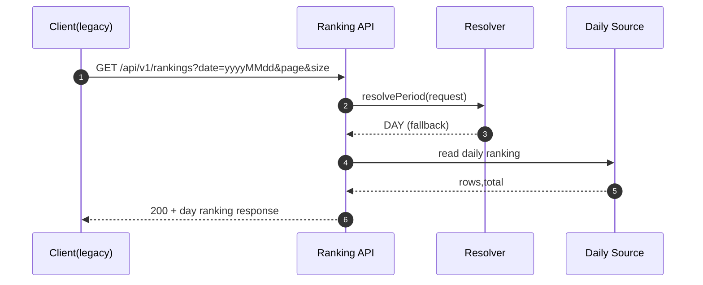


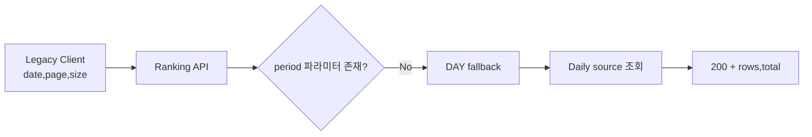


### 4.2 주간 TOP100 조회

- 유즈케이스
  - 사용자가 “주간 인기” 탭/섹션을 통해 주간 랭킹 조회
- 기대
  - KST + ISO 주차 기준으로 정해진 주의 TOP100을 빠르게 조회
- 구현 연결
  - 단계 1: `Asia/Seoul` + ISO week-based-year + Monday 규칙으로 week key 계산
  - 단계 2: `mv_product_rank_weekly` MV 테이블/인덱스
  - 단계 3~5: 배치가 `product_metrics`를 읽어 staging → 검증 → active 스위치
  - 단계 6: `period=WEEKLY&periodKey=...`로 주간 MV에서 조회

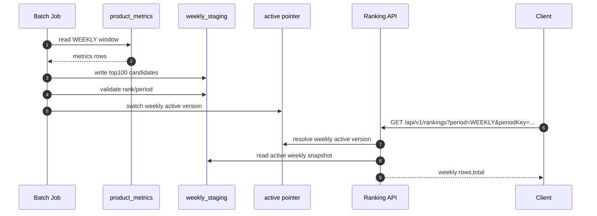


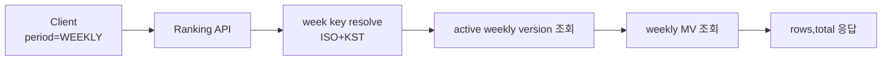


### 4.3 월간 TOP100 페이지 이동 (경계 포함)

- 유즈케이스
  - 사용자가 월간 인기에서 페이지 이동 (`page=2,size=20`) 또는 과도한 page 요청
- 기대
  - 1~100위 범위 내에서는 정상 페이지 이동
  - TOP100 범위를 넘어서는 요청은 정책대로 처리
- 구현 연결
  - 단계 2: `mv_product_rank_monthly`에 TOP100 저장
  - 단계 6: `total=100` 상한, 범위 초과 시 대고객 API는 빈 목록 + total 유지
  - 단계 8(E2E): 마지막 정상 페이지와 초과 페이지 동작을 테스트로 고정

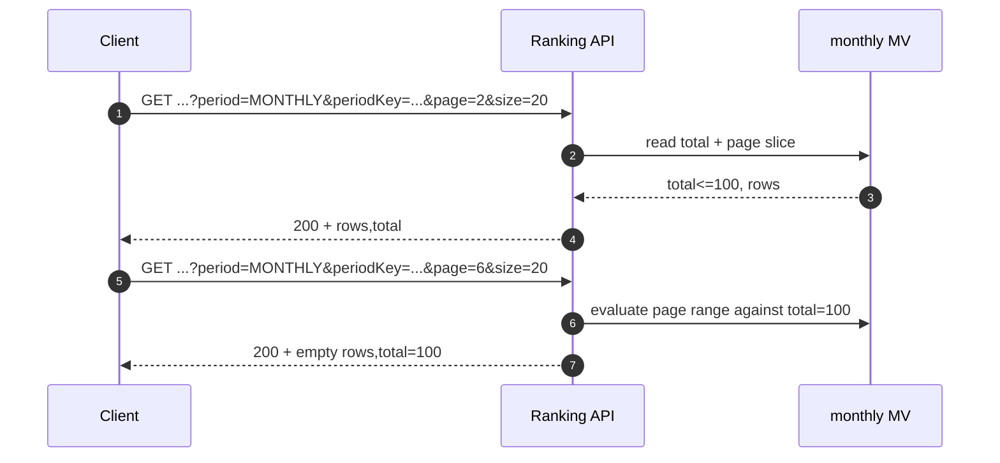


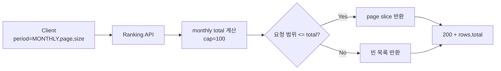


### 4.4 배치 실패 시 깨지지 않는 랭킹(Option A)

- 유즈케이스
  - 배치가 실행 중/실패했더라도 사용자는 “반쯤 들어간 랭킹”을 보지 않음
- 기대
  - 새 버전이 완전히 준비되기 전까지는 이전 정상 결과만 노출
- 구현 연결
  - 단계 5: Option A - staging에서 완성 후 검증 성공 시에만 active 스위치, 실패 시 active 유지
  - 단계 7: 실패 카운트/노후화 메트릭으로 운영자에게 알림
  - 단계 8(Integration): 실패 시에도 active 버전이 이전 상태로 유지되는지 검증

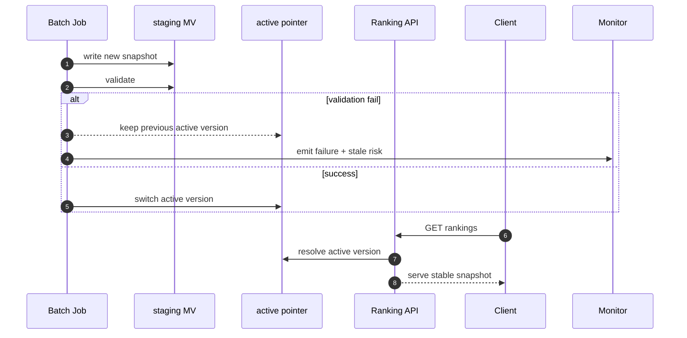


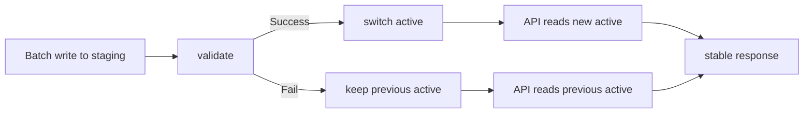


### 4.5 동일 period 재실행 멱등성

- 유즈케이스
  - 운영자가 동일 `period_type + period_key`로 배치를 재실행(복구/재집계)
- 기대
  - 재실행 전후 MV 내용이 동일 (`row 수`, `rank`, `score`)
- 구현 연결
  - 단계 2: `UNIQUE(period_key, product_id)` 제약으로 중복 행 방지
  - 단계 4~5: `product_metrics` 원장 기준 재계산 + staging → active 스위치
  - 단계 8(Integration): 동일 period 2회 실행 결과가 완전히 동일한지 검증

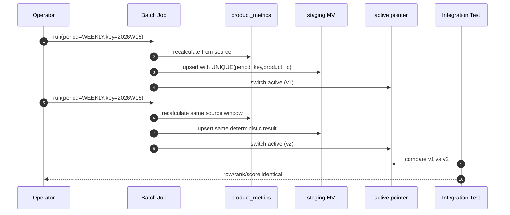


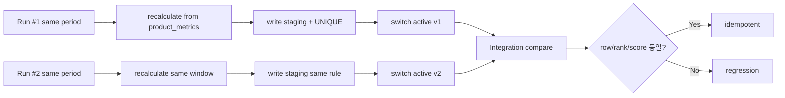


---

## 5. 시퀀스(Option A)

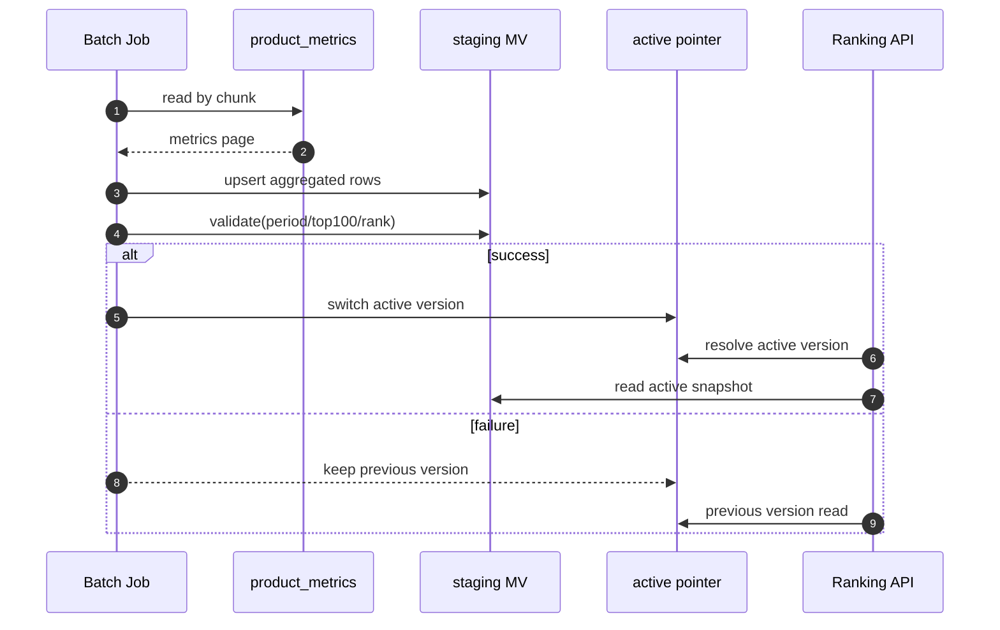


---

## 6. Done 기준

- 배치 파라미터 기반 주/월 집계 성공
- MV에 TOP100 저장 및 재실행 멱등 보장
- API가 day/week/month 제공 + 기존 `date` 하위호환 유지
- half-written 노출 없음
- QnA에서 정한 모니터링 임계치 반영
- 테스트 세트(Unit 4 / Integration 3 / E2E 3) 통과

