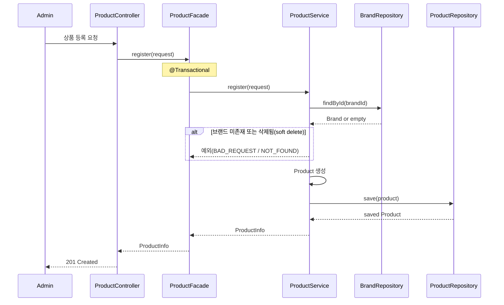
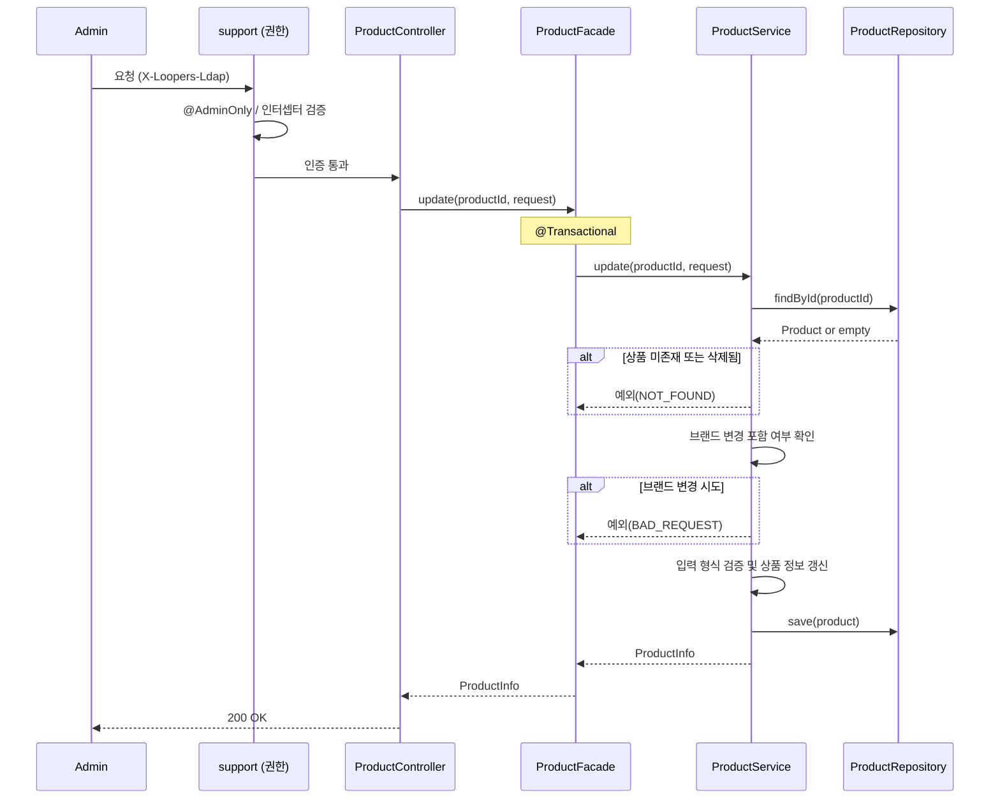
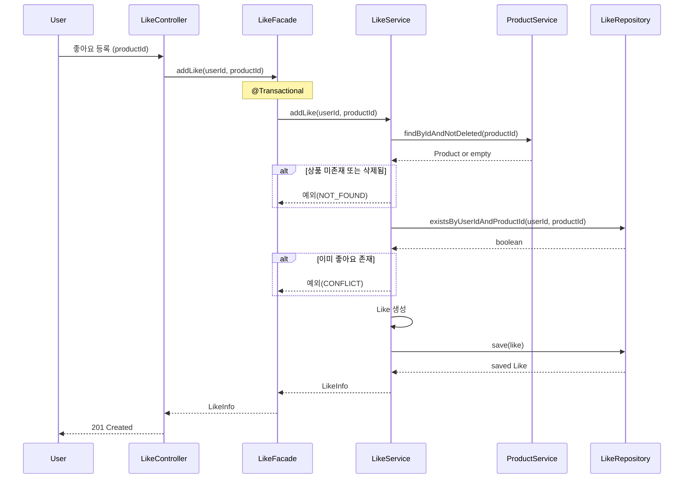
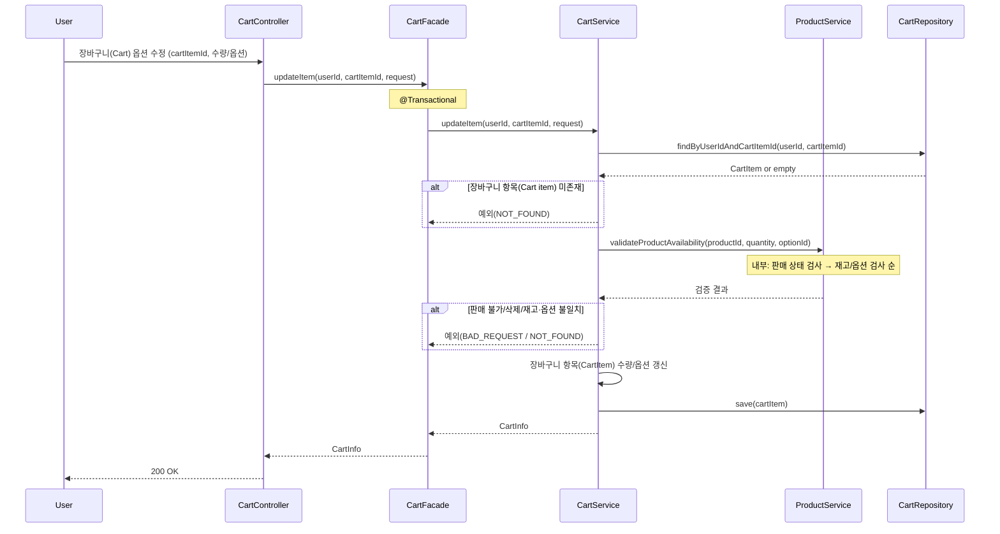
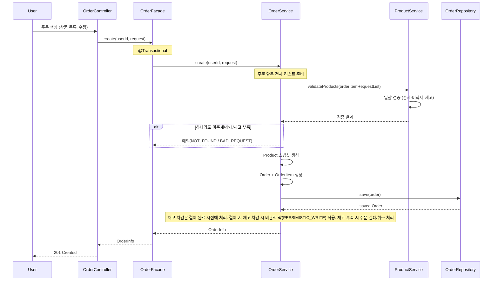
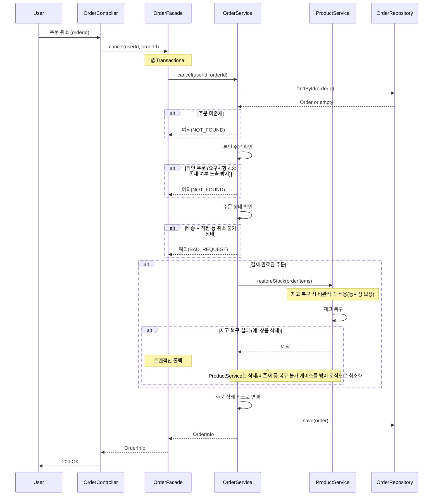

# 시퀀스 다이어그램 (도메인: Brands, Products, Likes, Cart, Orders)

> 본 문서는 **책임 분리**, **호출 순서**, **트랜잭션 경계** 확인을 위해 시퀀스 다이어그램을 사용한다.  
> 각 다이어그램은 **이유 → 다이어그램 → 해석 → 잠재 리스크** 순서로 제시한다.  
> 참조: [00-ubiquitous-language.md](./00-ubiquitous-language.md)

---

## 1. Brands · Products — 상품 등록 (Product ↔ Brand)

- 상품 등록 시 Brands 도메인(브랜드)과의 경계, Controller → Facade → Service 호출 순서, 트랜잭션 경계가 한 요청 안에서 어떻게 유지되는지 검증하기 위함.
- 브랜드 유효성(존재·미삭제) 검사 후 상품 생성이 단일 트랜잭션으로 이루어지는지, 실패 시 롤백이 기대대로 동작하는지 검증하기 위함.

### 다이어그램

### 해석

- **봐야 할 포인트**: 트랜잭션은 Facade에서 시작되므로, 브랜드 조회·상품 생성·저장이 한 단위로 커밋/롤백된다. 브랜드가 없거나 삭제된 경우 예외로 빠져 나가며 DB 변경 없이 끝난다.
- **설계 의도**: 상품은 반드시 유효한 브랜드에만 속한다는 도메인 규칙을 Service에서 한 번에 검증·생성하도록 했다.

### 잠재 리스크

- **리스크**: BrandRepository가 soft delete를 구분하지 않으면, 삭제된 브랜드에 상품이 등록될 수 있다.
- **선택지**: (A) Repository에 `findByIdAndNotDeleted` 등 삭제 제외 조회를 두고 사용. (B) Service에서 조회된 Brand 엔티티의 삭제 플래그를 검사 후 진행.

---

## 2. Products — 상품 수정 (관리자 권한, 브랜드 검증)

- 어드민 상품 수정 시 권한 검증이 support에서 선행되고, 그 다음 도메인(Products)만 다루는지 호출 순서를 명확히 하기 위함.
- 인증/권한이 Controller 이전(support)에서 처리되는지, 브랜드 변경 불가·삭제된 상품 수정 불가가 Service에서 일관되게 적용되는지 검증하기 위함.

### 다이어그램

### 해석

- **봐야 할 포인트**: 권한 실패 시 Support 단에서 차단되므로 ProductController·Facade·Service는 호출되지 않는다. 상품 수정 비즈니스 규칙(브랜드 변경 불가, 삭제된 상품 404)은 모두 Service에만 있다.
- **설계 의도**: 권한은 support, 리소스는 각 도메인에 맞게, Products 도메인은 “수정 가능 여부”만 판단하고 “누가 요청했는지”는 보지 않는다.

### 잠재 리스크

- **리스크**: Support와 도메인 레이어의 테스트가 분리되어 있어, 권한 실패 + 상품 수정 실패 조합 시나리오를 E2E에서만 검증하게 될 수 있다.
- **선택지**: (A) 어드민 E2E에서 권한 없음 → 401, 권한 있음 + 잘못된 상품 → 404를 각각 한 번씩 검증. (B) Support 권한 필터/인터셉터 단위 테스트로 401 케이스를 고정하고, 도메인 E2E는 유효한 어드민 헤더만 사용.

---

## 3. Likes — 좋아요 등록 (Product ↔ Likes)

- Likes가 Products에 의존하는 경계(상품 존재·미삭제, 1인 1좋아요)와 호출 순서·트랜잭션 경계를 보이기 위함.
- 삭제된 상품에는 좋아요가 불가한지, 중복 좋아요 시 CONFLICT로 실패하는지, 한 트랜잭션 안에서 검증·생성·저장이 이루어지는지 검증하기 위함.

### 다이어그램

### 해석

- **봐야 할 포인트**: 상품 검증 → 중복 검사 → Like 생성·저장이 한 트랜잭션으로 묶여 있어, 동시에 같은 사용자가 같은 상품에 좋아요를 두 번 요청해도 한 건만 성공하고 나머지는 CONFLICT로 처리할 수 있다(DB unique 제약과 함께).
- **설계 의도**: “삭제된 상품 좋아요 불가”, “1인 1좋아요”를 Service에서 순서대로 검증하고, Facade는 트랜잭션 경계만 담당한다.

### 잠재 리스크

- **리스크**: Likes가 ProductService에 직접 의존하므로, Products의 조회 스펙(findByIdAndNotDeleted)이 바뀌면 Likes 쪽이 영향을 받는다.
- **선택지**: (A) 현재처럼 ProductService 메서드로 조회(단순, 결합 명시적). (B) 이벤트/캐시로 상품 상태를 공유해 결합 완화(복잡도·일관성 부담 증가).

---

## 4. Cart — 장바구니 옵션 수정 (Cart ↔ Product)

- 장바구니 수정 시 Cart 도메인과 Product 도메인(판매 상태·재고·옵션)이 어떻게 협력하는지, 검증 순서와 트랜잭션 경계를 확인하기 위함.
- 판매 중지·삭제된 상품 → 재고/옵션 순으로 검증하는지, 실패 시 롤백이 되는지 검증하기 위함.

### 다이어그램

### 해석

- **봐야 할 포인트**: 장바구니 항목(CartItem) 소유 확인 후, ProductService의 `validateProductAvailability` 한 번 호출로 판매 상태·재고·옵션을 원자적으로 검증한다. 검증 순서(상태 → 재고/옵션)는 ProductService 내부에서 유지되며, 호출 1회로 트랜잭션 길이와 레이스 조건 가능성을 줄인다. 모든 변경은 Facade 트랜잭션 안에서만 커밋된다.
- **설계 의도**: 요구사항(추가·수정 시 판매 상태 및 재고 확인)을 단일 검증 메서드로 묶어 정합성과 성능을 함께 확보했다.

### 잠재 리스크

- **리스크**: ProductService의 validateProductAvailability 내부 스펙(검증 순서, 에러 타입 구분)이 바뀌면 Cart 도메인이 영향을 받는다.
- **선택지**: (A) ProductService에서 실패 원인별 구체적인 예외/에러 코드를 반환해 클라이언트 메시지 구분 가능하게 유지한다. (B) 단순히 BAD_REQUEST/NOT_FOUND만 반환하고 메시지는 공통 문구로 처리한다.

---

## 5. Orders — 주문 생성 (Order ↔ Product, 재고 확인/스냅샷)

- 주문 생성 시 여러 상품에 대한 검증·스냅샷·저장의 호출 순서와, 재고 차감은 결제 완료 시점이라는 정책이 시퀀스에 드러나도록 하기 위함.
- 삭제된 상품 주문 불가, 재고 확인 후 주문만 생성·재고는 나중에 차감하는 흐름, 트랜잭션 경계가 주문 저장까지임을 확인하기 위함.

### 다이어그램

### 해석

- **봐야 할 포인트**: 주문 항목 전체를 `validateProducts(orderItemRequestList)` 한 번으로 검증하여 N번 조회를 피하고, 트랜잭션 길이를 줄인다. 주문 생성 트랜잭션에는 “재고 확인”만 들어가고 “재고 차감”은 없으며, Note대로 결제 완료 시점에 처리한다. 그 시점에 재고 부족이면 주문 실패/취소로 정합성을 맞추는 설계이다.
- **설계 의도**: 주문 생성과 결제를 분리해 두었고, 삭제된 상품·재고 부족은 Bulk 검증 단계에서 NOT_FOUND/BAD_REQUEST로 처리한다.

### 잠재 리스크

- **리스크**: 주문 생성 후 결제 전에 다른 주문으로 재고가 소진되면, 결제 완료 시 재고 부족으로 실패할 수 있다(결제·주문 보상 처리 필요).
- **선택지**: (A) 주문 생성 시 재고 예약(선점) 후 결제 완료 시 예약→차감, 미결제 타임아웃 시 예약 해제. (B) 현재처럼 주문은 재고 확인만 하고, 결제 완료 시 차감 실패하면 주문 실패/취소로 처리.

---

## 6. Orders — 주문 취소 (Order ↔ Product, 상태 검증)

- 주문 취소 시 본인/타인 구분(404 통일), 상태 검증, 결제 완료 건의 재고 복구가 한 트랜잭션으로 처리되는지 확인하기 위함.
- 타인 주문 접근 시 NOT_FOUND로 응답하는지, 재고 복구 실패 시 취소 전체가 롤백되는지 검증하기 위함.

### 다이어그램

### 해석

- **봐야 할 포인트**: 주문 조회/취소/수정 시, “주문 없음”과 “타인 주문”은 서비스 레이어에서 구분하지 않고 동일하게 NOT_FOUND로 반환하여 요구사항 4.3(존재 여부 비노출)을 준수한다. 결제 완료 주문은 재고 복구 후 상태를 취소로 바꾸며, 재고 복구 실패 시 예외로 트랜잭션이 롤백되어 취소가 반영되지 않는다. 구현 시 ProductService에서 상품/옵션 삭제 등으로 복구가 불가한 경우를 최소화하는 방어 로직(예: Soft Delete만 사용, 삭제된 상품은 복구 스킵 등)을 두고, 그래도 실패하는 예외 케이스는 로그 및 운영 대응 정책으로 정의한다.
- **설계 의도**: 본인/상태/재고 복구를 Service에서 순서대로 검증하고, Facade는 트랜잭션 경계만 담당한다. 재고 복구 실패 시 전체 롤백으로 주문·재고 정합성을 유지한다.

### 잠재 리스크

- **리스크**: 재고 복구 중 상품이 삭제되었거나 옵션이 없어지면 복구 실패가 나고, 사용자 입장에서는 “취소가 안 된다”는 인지가 필요하다(에러 메시지 설계 필요).
- **선택지**: (A) 재고 복구 실패 시에도 주문 상태만 CANCELLED로 두고, 재고는 수동/배치로 보정. (B) 현재처럼 재고 복구 실패 시 전체 롤백해 “취소 실패”로 응답하고, ProductService에 재고 복구 실패 케이스(완전 삭제 등)를 최소화하는 방어 로직을 두어 롤백이 발생하는 상황을 줄인다.
