# Sequence Diagrams

LAST UPDATED: 2026-03-01

## 목차
- [개요](#개요)
  - [참여 컴포넌트 정의](#참여-컴포넌트-정의)
  - [의존성 방향](#의존성-방향)
- [Authentication (대고객 인증)](#authentication-대고객-인증)
- [Authentication (어드민 인증)](#authentication-어드민-인증)
- [Brand (브랜드)](#brand-브랜드)
  - [[어드민] 브랜드 등록](#어드민-브랜드-등록)
  - [[어드민] 브랜드 목록 조회](#어드민-브랜드-목록-조회)
  - [[어드민] 브랜드 상세 조회](#어드민-브랜드-상세-조회)
  - [[어드민] 브랜드 정보 수정](#어드민-브랜드-정보-수정)
  - [[어드민] 브랜드 삭제](#어드민-브랜드-삭제)
  - [[대고객] 브랜드 상세 조회](#대고객-브랜드-상세-조회)
- [Product (상품)](#product-상품)
  - [[어드민] 상품 등록](#어드민-상품-등록)
  - [[어드민] 상품 목록 조회](#어드민-상품-목록-조회)
  - [[어드민] 상품 상세 조회](#어드민-상품-상세-조회)
  - [[어드민] 상품 정보 수정](#어드민-상품-정보-수정)
  - [[어드민] 상품 삭제](#어드민-상품-삭제)
  - [[대고객] 상품 목록 조회](#대고객-상품-목록-조회)
  - [[대고객] 상품 상세 조회](#대고객-상품-상세-조회)
- [Like (좋아요)](#like-좋아요)
  - [[대고객] 상품 좋아요 등록](#대고객-상품-좋아요-등록)
  - [[대고객] 상품 좋아요 취소](#대고객-상품-좋아요-취소)
  - [[대고객] 내가 좋아요한 상품 목록 조회](#대고객-내가-좋아요한-상품-목록-조회)
- [Coupon (쿠폰)](#coupon-쿠폰)
  - [[어드민] 쿠폰 등록](#어드민-쿠폰-등록)
  - [[어드민] 쿠폰 목록 조회](#어드민-쿠폰-목록-조회)
  - [[어드민] 쿠폰 상세 조회](#어드민-쿠폰-상세-조회)
  - [[어드민] 쿠폰 수정](#어드민-쿠폰-수정)
  - [[어드민] 쿠폰 삭제](#어드민-쿠폰-삭제)
  - [[어드민] 쿠폰 발급 내역 조회](#어드민-쿠폰-발급-내역-조회)
  - [[대고객] 쿠폰 발급](#대고객-쿠폰-발급)
  - [[대고객] 내 쿠폰 목록 조회](#대고객-내-쿠폰-목록-조회)
- [Order (주문)](#order-주문)
  - [[어드민] 주문 목록 조회](#어드민-주문-목록-조회)
  - [[어드민] 주문 상세 조회](#어드민-주문-상세-조회)
  - [[대고객] 주문 요청](#대고객-주문-요청)
  - [[대고객] 주문 목록 조회](#대고객-주문-목록-조회)
  - [[대고객] 주문 상세 조회](#대고객-주문-상세-조회)

## 개요

이 문서는 감성 이커머스 플랫폼의 주요 API 흐름을 시퀀스 다이어그램으로 정의한다.
[01-requirements.md](./01-requirements.md)의 요구사항을 기반으로, 각 기능의 클라이언트-서버 간 상호작용을 Mermaid 시퀀스 다이어그램으로 표현한다.

- 대상 도메인: 인증, 브랜드, 상품, 좋아요, 쿠폰, 주문

### 다이어그램 작성 원칙

- **핵심 컴포넌트만 표현**: 각 API 흐름의 주요 참여자(Api, UseCase, DomainService, Repository)만 다이어그램에 포함한다.
- **크로스 도메인은 UseCase가 오케스트레이션**: 여러 도메인 조율 시 UseCase가 각 도메인의 DomainService를 호출한다. (예: 좋아요 등록 시 `LikeProductUseCase`가 `ProductService`, `LikeService`를 순차 호출)
- **단순 조회는 Repository 직접 접근**: UseCase가 DomainService 없이 Repository를 직접 호출하는 것도 허용한다. DomainService가 단순히 Repository 호출을 감싸는 것에 불과하다면 UseCase가 Repository를 직접 사용하는 것이 더 낫다.
- **인증 흐름 분리**: 인증(Interceptor → UserService) 흐름은 별도 섹션에서 정의하며, 각 API 다이어그램에서는 생략한다.
- **Actor 구분**: 어드민 API는 `Admin`, 대고객 API는 `Client` actor로 구분한다.
- **예외 흐름 포함**: 정상 흐름(happy path)과 주요 예외 흐름(break)을 함께 표현한다. 예외 발생 시 나머지 흐름을 건너뛰는 경우 `break`를, 여러 대안 중 하나를 선택하는 경우 `alt`를 사용한다.
- **액티베이션바**: 동기 호출 시 대상 참여자의 활성 상태를 `activate`/`deactivate`(또는 `+`/`-` 접미사)로 표현한다. 자기 호출 및 반환 없는 호출에는 적용하지 않는다.

### 참여 컴포넌트 정의

| 컴포넌트 | 역할 |
|----------|------|
| Api (Controller) | 클라이언트 요청 수신, 응답 반환 |
| UseCase (`@UseCase`) | 트랜잭션 관리, 크로스 도메인 오케스트레이션, DTO 변환 |
| DomainService (`@DomainService`) | 자기 도메인의 Repository + Entity를 조작하는 완결된 오퍼레이션 |
| Repository | 데이터 영속화 |

### 의존성 방향

```
Api → UseCase → DomainService → Repository
                 └→ Repository (단순 조회 시 직접 접근 가능)
```

- 의존성은 항상 상위 → 하위 방향이며, 역방향 의존은 허용하지 않는다.
- 여러 도메인을 조율할 때 UseCase가 각 도메인의 DomainService를 호출하여 오케스트레이션한다.
- DomainService는 자기 도메인의 Repository만 의존한다.

## Authentication (대고객 인증)

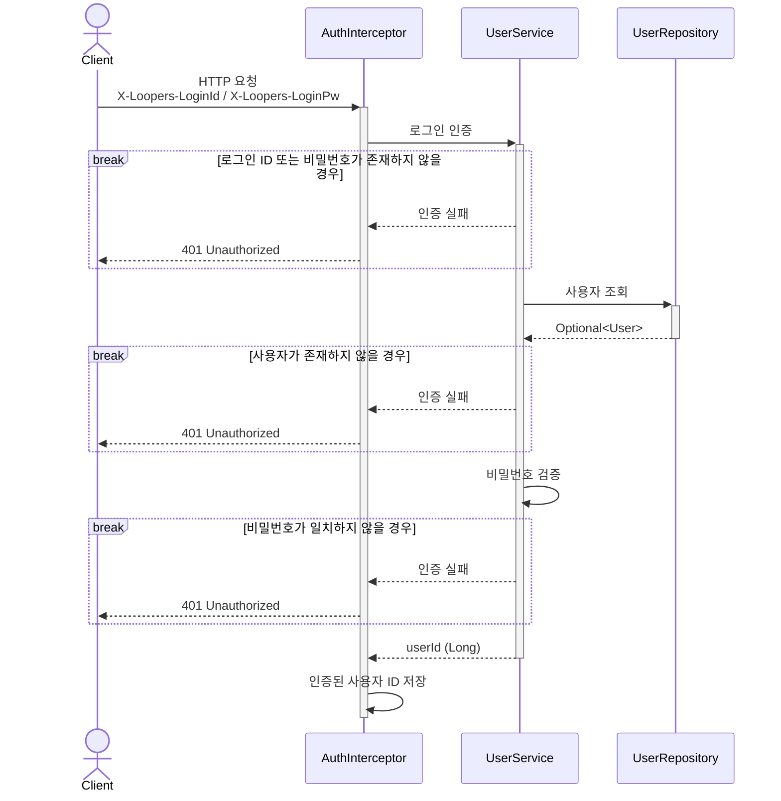
```mermaid
sequenceDiagram
    actor Client
    participant AuthInterceptor
    participant UserService
    participant UserRepository

    Client ->>+ AuthInterceptor: HTTP 요청<br/>X-Loopers-LoginId / X-Loopers-LoginPw

    AuthInterceptor ->>+ UserService: 로그인 인증

    break 로그인 ID 또는 비밀번호가 존재하지 않을 경우
        UserService -->> AuthInterceptor: 인증 실패
        AuthInterceptor -->> Client: 401 Unauthorized
    end

    UserService ->>+ UserRepository: 사용자 조회
    UserRepository -->>- UserService: Optional<User>

    break 사용자가 존재하지 않을 경우
        UserService -->> AuthInterceptor: 인증 실패
        AuthInterceptor -->> Client: 401 Unauthorized
    end

    UserService ->> UserService: 비밀번호 검증

    break 비밀번호가 일치하지 않을 경우
        UserService -->> AuthInterceptor: 인증 실패
        AuthInterceptor -->> Client: 401 Unauthorized
    end

    UserService -->>- AuthInterceptor: userId (Long)
    AuthInterceptor ->> AuthInterceptor: 인증된 사용자 ID 저장
    deactivate AuthInterceptor
```

## Authentication (어드민 인증)

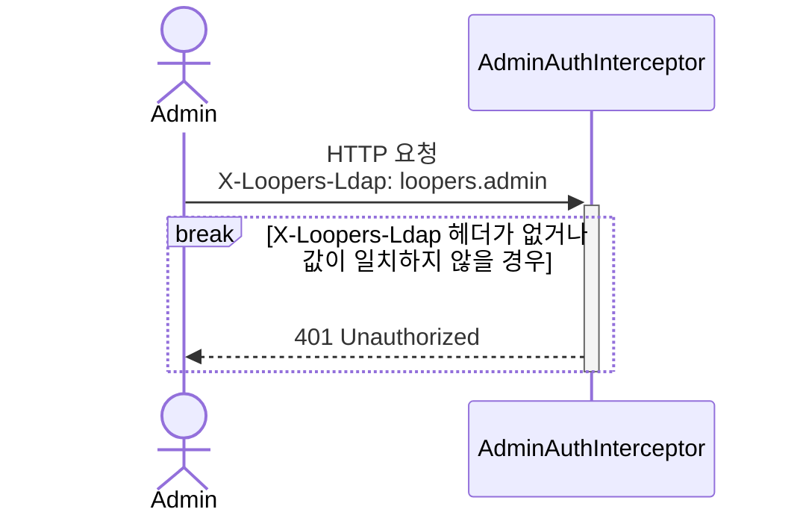
```mermaid
sequenceDiagram
    actor Admin
    participant AdminAuthInterceptor

    Admin ->>+ AdminAuthInterceptor: HTTP 요청<br/>X-Loopers-Ldap: loopers.admin

    break X-Loopers-Ldap 헤더가 없거나 값이 일치하지 않을 경우
        AdminAuthInterceptor -->> Admin: 401 Unauthorized
    end

    deactivate AdminAuthInterceptor
```

## Brand (브랜드)

### [어드민] 브랜드 등록

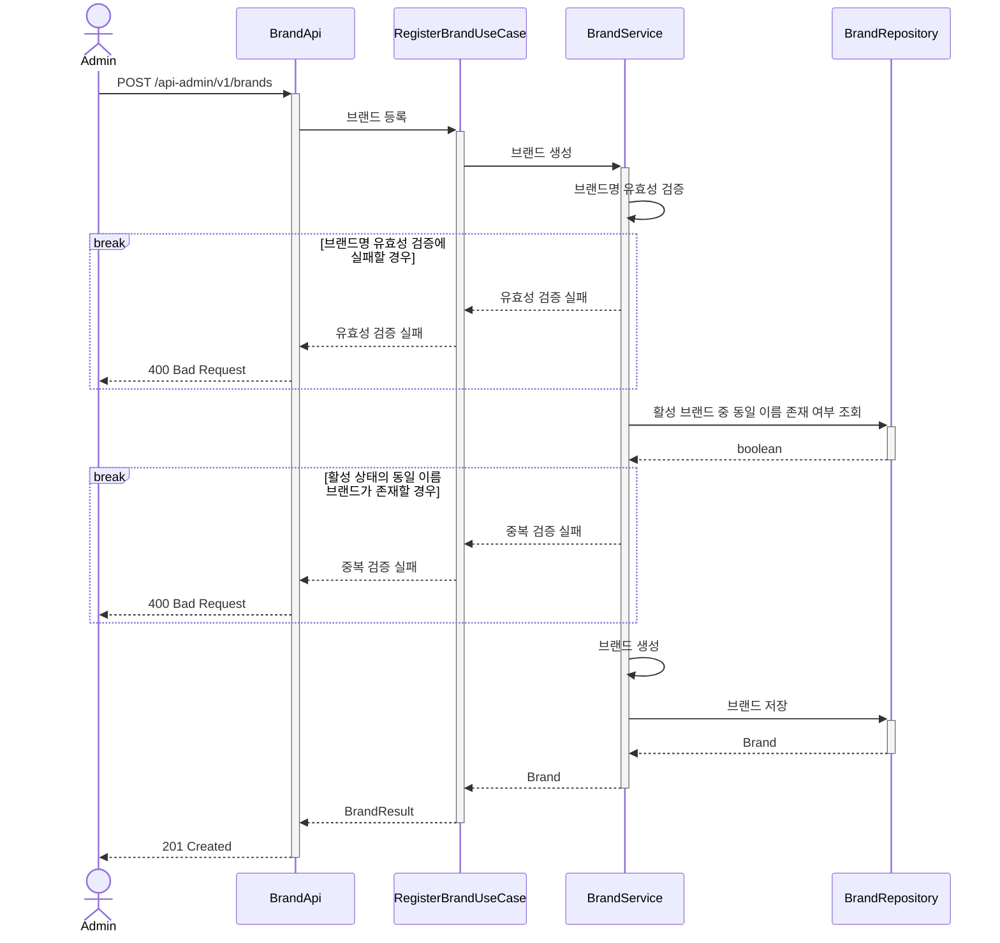
```mermaid
sequenceDiagram
    actor Admin
    participant BrandApi
    participant RegisterBrandUseCase
    participant BrandService
    participant BrandRepository

    Admin ->>+ BrandApi: POST /api-admin/v1/brands
    BrandApi ->>+ RegisterBrandUseCase: 브랜드 등록
    RegisterBrandUseCase ->>+ BrandService: 브랜드 생성
    BrandService ->> BrandService: 브랜드명 유효성 검증

    break 브랜드명 유효성 검증에 실패할 경우
        BrandService -->> RegisterBrandUseCase: 유효성 검증 실패
        RegisterBrandUseCase -->> BrandApi: 유효성 검증 실패
        BrandApi -->> Admin: 400 Bad Request
    end

    BrandService ->>+ BrandRepository: 활성 브랜드 중 동일 이름 존재 여부 조회
    BrandRepository -->>- BrandService: boolean

    break 활성 상태의 동일 이름 브랜드가 존재할 경우
        BrandService -->> RegisterBrandUseCase: 중복 검증 실패
        RegisterBrandUseCase -->> BrandApi: 중복 검증 실패
        BrandApi -->> Admin: 400 Bad Request
    end

    BrandService ->> BrandService: 브랜드 생성
    BrandService ->>+ BrandRepository: 브랜드 저장
    BrandRepository -->>- BrandService: Brand
    BrandService -->>- RegisterBrandUseCase: Brand
    RegisterBrandUseCase -->>- BrandApi: BrandResult
    BrandApi -->>- Admin: 201 Created
```

### [어드민] 브랜드 목록 조회

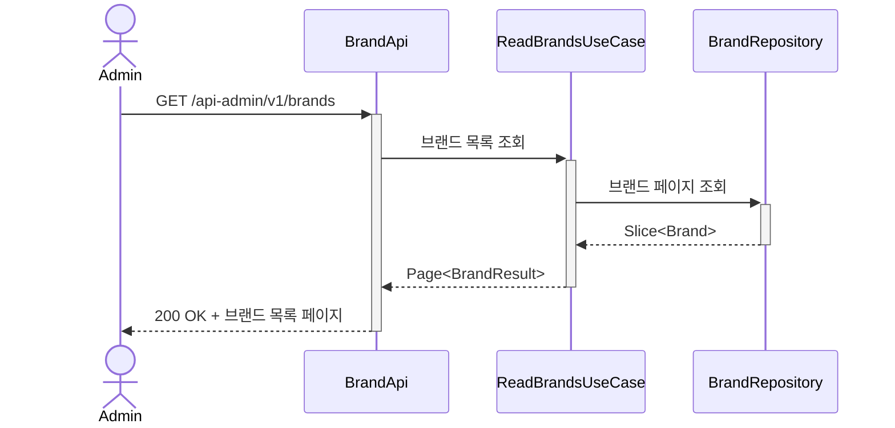
```mermaid
sequenceDiagram
    actor Admin
    participant BrandApi
    participant ReadBrandsUseCase
    participant BrandRepository

    Admin ->>+ BrandApi: GET /api-admin/v1/brands
    BrandApi ->>+ ReadBrandsUseCase: 브랜드 목록 조회
    ReadBrandsUseCase ->>+ BrandRepository: 브랜드 페이지 조회
    BrandRepository -->>- ReadBrandsUseCase: Slice<Brand>
    ReadBrandsUseCase -->>- BrandApi: Page<BrandResult>
    BrandApi -->>- Admin: 200 OK + 브랜드 목록 페이지
```

### [어드민] 브랜드 상세 조회

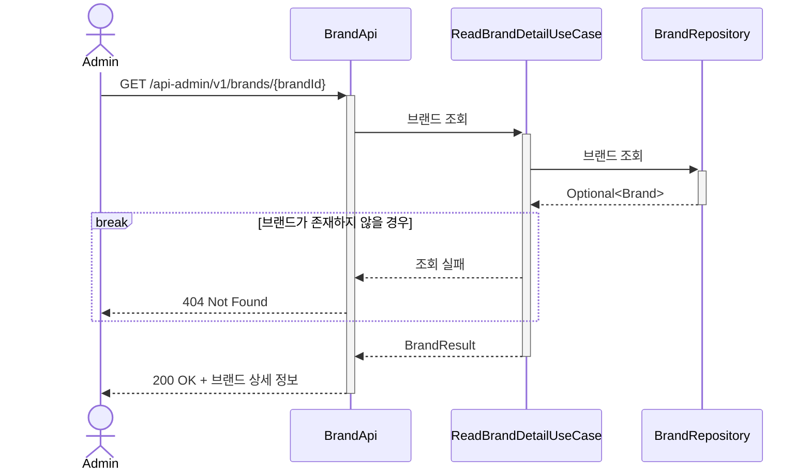
```mermaid
sequenceDiagram
    actor Admin
    participant BrandApi
    participant ReadBrandDetailUseCase
    participant BrandRepository

    Admin ->>+ BrandApi: GET /api-admin/v1/brands/{brandId}
    BrandApi ->>+ ReadBrandDetailUseCase: 브랜드 조회
    ReadBrandDetailUseCase ->>+ BrandRepository: 브랜드 조회
    BrandRepository -->>- ReadBrandDetailUseCase: Optional<Brand>

    break 브랜드가 존재하지 않을 경우
        ReadBrandDetailUseCase -->> BrandApi: 조회 실패
        BrandApi -->> Admin: 404 Not Found
    end

    ReadBrandDetailUseCase -->>- BrandApi: BrandResult
    BrandApi -->>- Admin: 200 OK + 브랜드 상세 정보
```

### [어드민] 브랜드 정보 수정

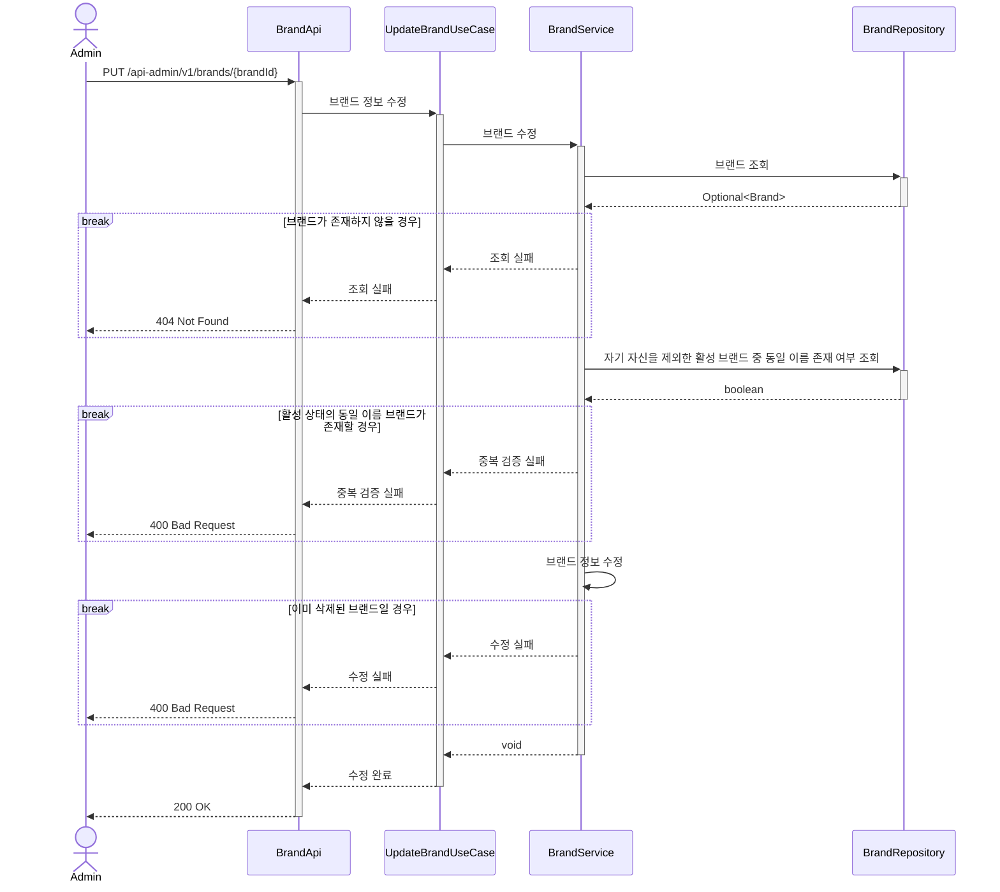
```mermaid
sequenceDiagram
    actor Admin
    participant BrandApi
    participant UpdateBrandUseCase
    participant BrandService
    participant BrandRepository

    Admin ->>+ BrandApi: PUT /api-admin/v1/brands/{brandId}
    BrandApi ->>+ UpdateBrandUseCase: 브랜드 정보 수정
    UpdateBrandUseCase ->>+ BrandService: 브랜드 수정
    BrandService ->>+ BrandRepository: 브랜드 조회
    BrandRepository -->>- BrandService: Optional<Brand>

    break 브랜드가 존재하지 않을 경우
        BrandService -->> UpdateBrandUseCase: 조회 실패
        UpdateBrandUseCase -->> BrandApi: 조회 실패
        BrandApi -->> Admin: 404 Not Found
    end

    BrandService ->>+ BrandRepository: 자기 자신을 제외한 활성 브랜드 중 동일 이름 존재 여부 조회
    BrandRepository -->>- BrandService: boolean

    break 활성 상태의 동일 이름 브랜드가 존재할 경우
        BrandService -->> UpdateBrandUseCase: 중복 검증 실패
        UpdateBrandUseCase -->> BrandApi: 중복 검증 실패
        BrandApi -->> Admin: 400 Bad Request
    end

    BrandService ->> BrandService: 브랜드 정보 수정

    break 이미 삭제된 브랜드일 경우
        BrandService -->> UpdateBrandUseCase: 수정 실패
        UpdateBrandUseCase -->> BrandApi: 수정 실패
        BrandApi -->> Admin: 400 Bad Request
    end

    BrandService -->>- UpdateBrandUseCase: void
    UpdateBrandUseCase -->>- BrandApi: 수정 완료
    BrandApi -->>- Admin: 200 OK
```

### [어드민] 브랜드 삭제

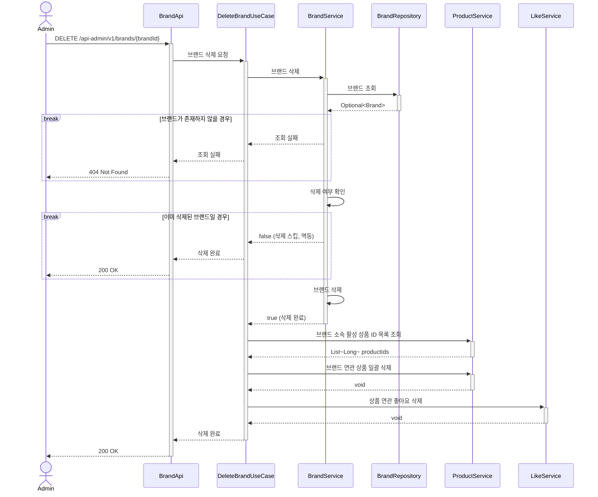
```mermaid
sequenceDiagram
    actor Admin
    participant BrandApi
    participant DeleteBrandUseCase
    participant BrandService
    participant BrandRepository
    participant ProductService
    participant LikeService

    Admin ->>+ BrandApi: DELETE /api-admin/v1/brands/{brandId}
    BrandApi ->>+ DeleteBrandUseCase: 브랜드 삭제 요청

    DeleteBrandUseCase ->>+ BrandService: 브랜드 삭제
    BrandService ->>+ BrandRepository: 브랜드 조회
    BrandRepository -->>- BrandService: Optional<Brand>

    break 브랜드가 존재하지 않을 경우
        BrandService -->> DeleteBrandUseCase: 조회 실패
        DeleteBrandUseCase -->> BrandApi: 조회 실패
        BrandApi -->> Admin: 404 Not Found
    end

    BrandService ->> BrandService: 삭제 여부 확인

    break 이미 삭제된 브랜드일 경우
        BrandService -->> DeleteBrandUseCase: false (삭제 스킵, 멱등)
        DeleteBrandUseCase -->> BrandApi: 삭제 완료
        BrandApi -->> Admin: 200 OK
    end

    BrandService ->> BrandService: 브랜드 삭제
    BrandService -->>- DeleteBrandUseCase: true (삭제 완료)

    DeleteBrandUseCase ->>+ ProductService: 브랜드 소속 활성 상품 ID 목록 조회
    ProductService -->>- DeleteBrandUseCase: List~Long~ productIds
    DeleteBrandUseCase ->>+ ProductService: 브랜드 연관 상품 일괄 삭제
    ProductService -->>- DeleteBrandUseCase: void
    DeleteBrandUseCase ->>+ LikeService: 상품 연관 좋아요 삭제
    LikeService -->>- DeleteBrandUseCase: void
    DeleteBrandUseCase -->>- BrandApi: 삭제 완료
    BrandApi -->>- Admin: 200 OK
```

### [대고객] 브랜드 상세 조회

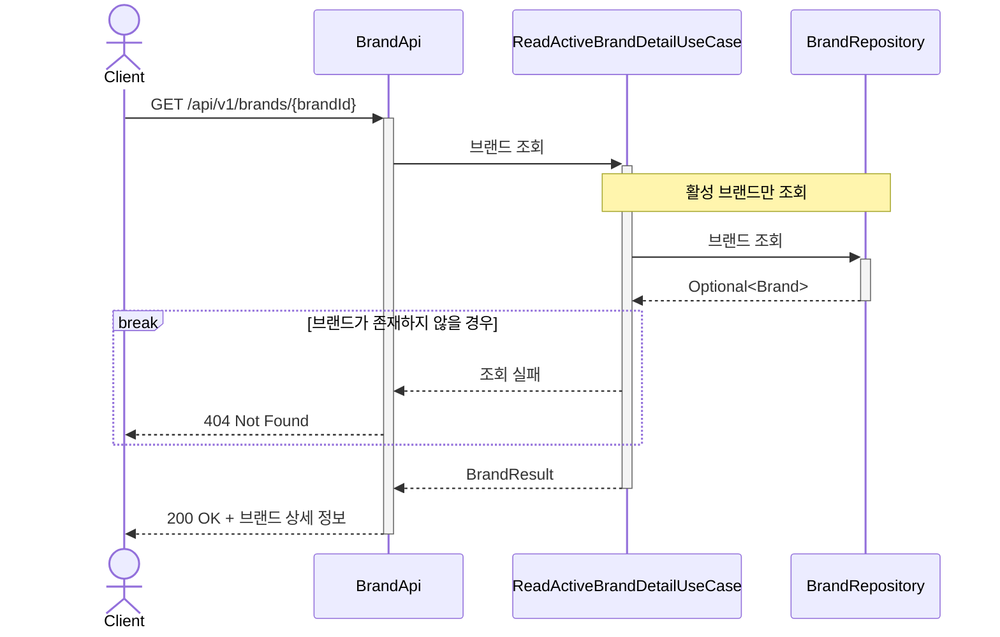
```mermaid
sequenceDiagram
    actor Client
    participant BrandApi
    participant ReadActiveBrandDetailUseCase
    participant BrandRepository

    Client ->>+ BrandApi: GET /api/v1/brands/{brandId}
    BrandApi ->>+ ReadActiveBrandDetailUseCase: 브랜드 조회

    Note over ReadActiveBrandDetailUseCase, BrandRepository: 활성 브랜드만 조회
    ReadActiveBrandDetailUseCase ->>+ BrandRepository: 브랜드 조회
    BrandRepository -->>- ReadActiveBrandDetailUseCase: Optional<Brand>

    break 브랜드가 존재하지 않을 경우
        ReadActiveBrandDetailUseCase -->> BrandApi: 조회 실패
        BrandApi -->> Client: 404 Not Found
    end

    ReadActiveBrandDetailUseCase -->>- BrandApi: BrandResult
    BrandApi -->>- Client: 200 OK + 브랜드 상세 정보
```

## Product (상품)

### [어드민] 상품 등록

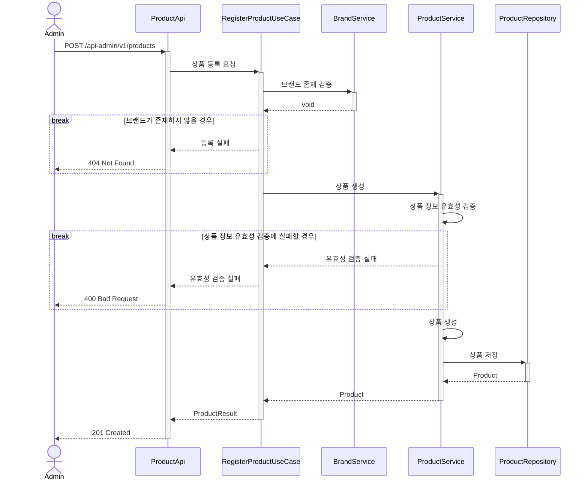
```mermaid
sequenceDiagram
    actor Admin
    participant ProductApi
    participant RegisterProductUseCase
    participant BrandService
    participant ProductService
    participant ProductRepository

    Admin ->>+ ProductApi: POST /api-admin/v1/products
    ProductApi ->>+ RegisterProductUseCase: 상품 등록 요청

    RegisterProductUseCase ->>+ BrandService: 브랜드 존재 검증
    BrandService -->>- RegisterProductUseCase: void

    break 브랜드가 존재하지 않을 경우
        RegisterProductUseCase -->> ProductApi: 등록 실패
        ProductApi -->> Admin: 404 Not Found
    end

    RegisterProductUseCase ->>+ ProductService: 상품 생성
    ProductService ->> ProductService: 상품 정보 유효성 검증

    break 상품 정보 유효성 검증에 실패할 경우
        ProductService -->> RegisterProductUseCase: 유효성 검증 실패
        RegisterProductUseCase -->> ProductApi: 유효성 검증 실패
        ProductApi -->> Admin: 400 Bad Request
    end

    ProductService ->> ProductService: 상품 생성
    ProductService ->>+ ProductRepository: 상품 저장
    ProductRepository -->>- ProductService: Product
    ProductService -->>- RegisterProductUseCase: Product
    RegisterProductUseCase -->>- ProductApi: ProductResult
    ProductApi -->>- Admin: 201 Created
```

### [어드민] 상품 목록 조회

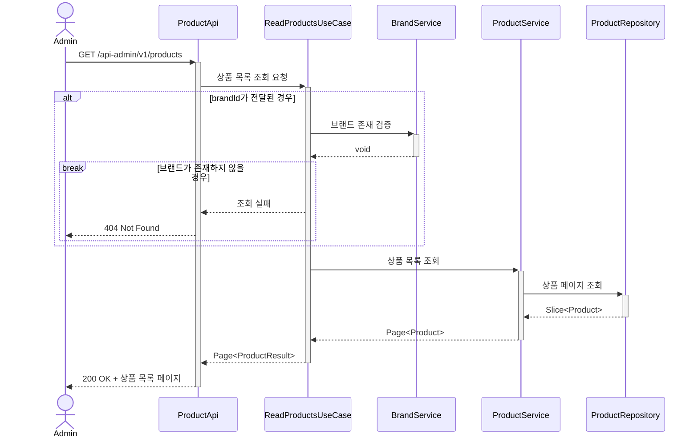
```mermaid
sequenceDiagram
    actor Admin
    participant ProductApi
    participant ReadProductsUseCase
    participant BrandService
    participant ProductService
    participant ProductRepository

    Admin ->>+ ProductApi: GET /api-admin/v1/products
    ProductApi ->>+ ReadProductsUseCase: 상품 목록 조회 요청

    alt brandId가 전달된 경우
        ReadProductsUseCase ->>+ BrandService: 브랜드 존재 검증
        BrandService -->>- ReadProductsUseCase: void

        break 브랜드가 존재하지 않을 경우
            ReadProductsUseCase -->> ProductApi: 조회 실패
            ProductApi -->> Admin: 404 Not Found
        end
    end

    ReadProductsUseCase ->>+ ProductService: 상품 목록 조회
    ProductService ->>+ ProductRepository: 상품 페이지 조회
    ProductRepository -->>- ProductService: Slice<Product>
    ProductService -->>- ReadProductsUseCase: Page<Product>

    ReadProductsUseCase -->>- ProductApi: Page<ProductResult>
    ProductApi -->>- Admin: 200 OK + 상품 목록 페이지
```

### [어드민] 상품 상세 조회

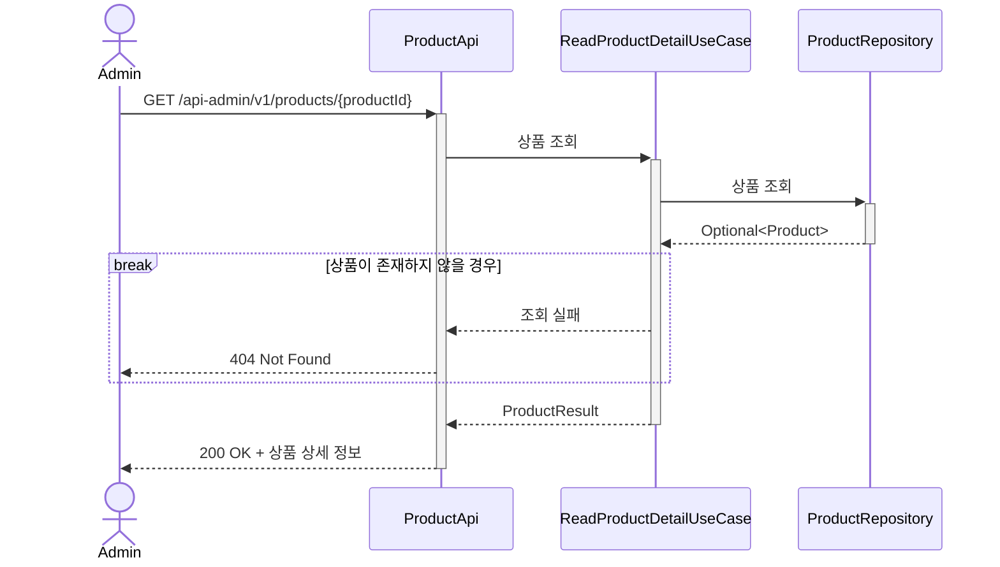
```mermaid
sequenceDiagram
    actor Admin
    participant ProductApi
    participant ReadProductDetailUseCase
    participant ProductRepository

    Admin ->>+ ProductApi: GET /api-admin/v1/products/{productId}
    ProductApi ->>+ ReadProductDetailUseCase: 상품 조회
    ReadProductDetailUseCase ->>+ ProductRepository: 상품 조회
    ProductRepository -->>- ReadProductDetailUseCase: Optional<Product>

    break 상품이 존재하지 않을 경우
        ReadProductDetailUseCase -->> ProductApi: 조회 실패
        ProductApi -->> Admin: 404 Not Found
    end

    ReadProductDetailUseCase -->>- ProductApi: ProductResult
    ProductApi -->>- Admin: 200 OK + 상품 상세 정보
```

### [어드민] 상품 정보 수정

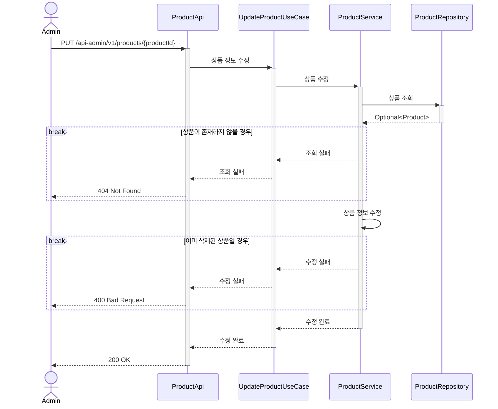
```mermaid
sequenceDiagram
    actor Admin
    participant ProductApi
    participant UpdateProductUseCase
    participant ProductService
    participant ProductRepository

    Admin ->>+ ProductApi: PUT /api-admin/v1/products/{productId}
    ProductApi ->>+ UpdateProductUseCase: 상품 정보 수정
    UpdateProductUseCase ->>+ ProductService: 상품 수정
    ProductService ->>+ ProductRepository: 상품 조회
    ProductRepository -->>- ProductService: Optional<Product>

    break 상품이 존재하지 않을 경우
        ProductService -->> UpdateProductUseCase: 조회 실패
        UpdateProductUseCase -->> ProductApi: 조회 실패
        ProductApi -->> Admin: 404 Not Found
    end

    ProductService ->> ProductService: 상품 정보 수정

    break 이미 삭제된 상품일 경우
        ProductService -->> UpdateProductUseCase: 수정 실패
        UpdateProductUseCase -->> ProductApi: 수정 실패
        ProductApi -->> Admin: 400 Bad Request
    end

    ProductService -->>- UpdateProductUseCase: 수정 완료
    UpdateProductUseCase -->>- ProductApi: 수정 완료
    ProductApi -->>- Admin: 200 OK
```

### [어드민] 상품 삭제

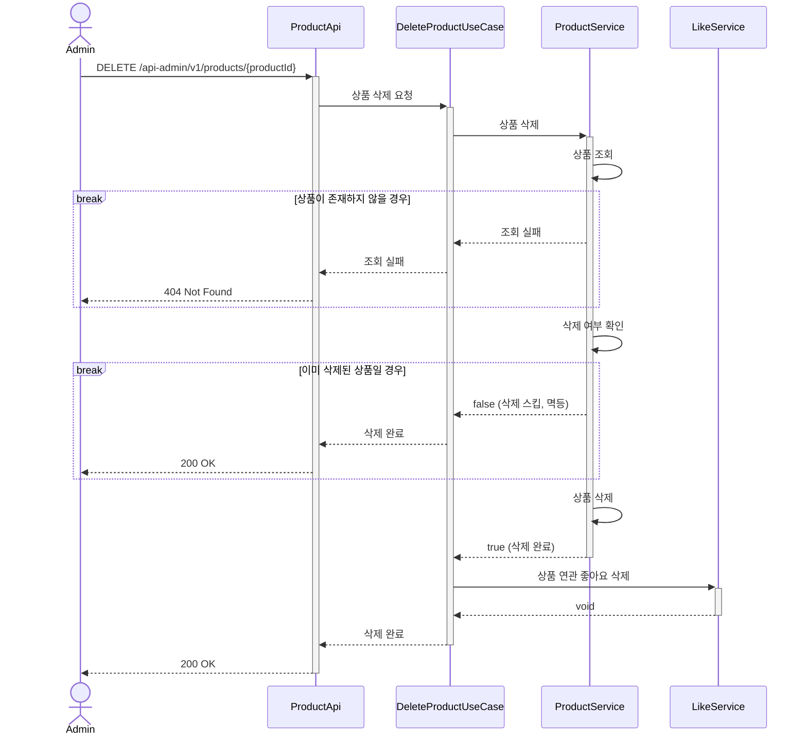
```mermaid
sequenceDiagram
    actor Admin
    participant ProductApi
    participant DeleteProductUseCase
    participant ProductService
    participant LikeService

    Admin ->>+ ProductApi: DELETE /api-admin/v1/products/{productId}
    ProductApi ->>+ DeleteProductUseCase: 상품 삭제 요청

    DeleteProductUseCase ->>+ ProductService: 상품 삭제
    ProductService ->> ProductService: 상품 조회

    break 상품이 존재하지 않을 경우
        ProductService -->> DeleteProductUseCase: 조회 실패
        DeleteProductUseCase -->> ProductApi: 조회 실패
        ProductApi -->> Admin: 404 Not Found
    end

    ProductService ->> ProductService: 삭제 여부 확인

    break 이미 삭제된 상품일 경우
        ProductService -->> DeleteProductUseCase: false (삭제 스킵, 멱등)
        DeleteProductUseCase -->> ProductApi: 삭제 완료
        ProductApi -->> Admin: 200 OK
    end

    ProductService ->> ProductService: 상품 삭제
    ProductService -->>- DeleteProductUseCase: true (삭제 완료)

    DeleteProductUseCase ->>+ LikeService: 상품 연관 좋아요 삭제
    LikeService -->>- DeleteProductUseCase: void
    DeleteProductUseCase -->>- ProductApi: 삭제 완료
    ProductApi -->>- Admin: 200 OK
```

### [대고객] 상품 목록 조회

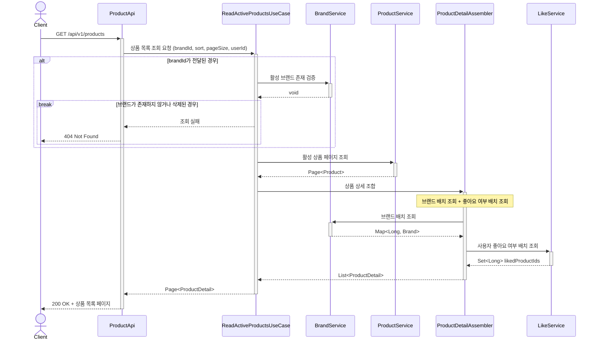
```mermaid
sequenceDiagram
    actor Client
    participant ProductApi
    participant ReadActiveProductsUseCase
    participant BrandService
    participant ProductService
    participant ProductDetailAssembler
    participant LikeService

    Client ->>+ ProductApi: GET /api/v1/products
    ProductApi ->>+ ReadActiveProductsUseCase: 상품 목록 조회 요청 (brandId, sort, pageSize, userId)

    alt brandId가 전달된 경우
        ReadActiveProductsUseCase ->>+ BrandService: 활성 브랜드 존재 검증
        BrandService -->>- ReadActiveProductsUseCase: void

        break 브랜드가 존재하지 않거나 삭제된 경우
            ReadActiveProductsUseCase -->> ProductApi: 조회 실패
            ProductApi -->> Client: 404 Not Found
        end
    end

    ReadActiveProductsUseCase ->>+ ProductService: 활성 상품 페이지 조회
    ProductService -->>- ReadActiveProductsUseCase: Page<Product>

    ReadActiveProductsUseCase ->>+ ProductDetailAssembler: 상품 상세 조합
    Note over ProductDetailAssembler: 브랜드 배치 조회 + 좋아요 여부 배치 조회
    ProductDetailAssembler ->>+ BrandService: 브랜드 배치 조회
    BrandService -->>- ProductDetailAssembler: Map<Long, Brand>
    ProductDetailAssembler ->>+ LikeService: 사용자 좋아요 여부 배치 조회
    LikeService -->>- ProductDetailAssembler: Set<Long> likedProductIds
    ProductDetailAssembler -->>- ReadActiveProductsUseCase: List<ProductDetail>

    ReadActiveProductsUseCase -->>- ProductApi: Page<ProductDetail>
    ProductApi -->>- Client: 200 OK + 상품 목록 페이지
```

### [대고객] 상품 상세 조회

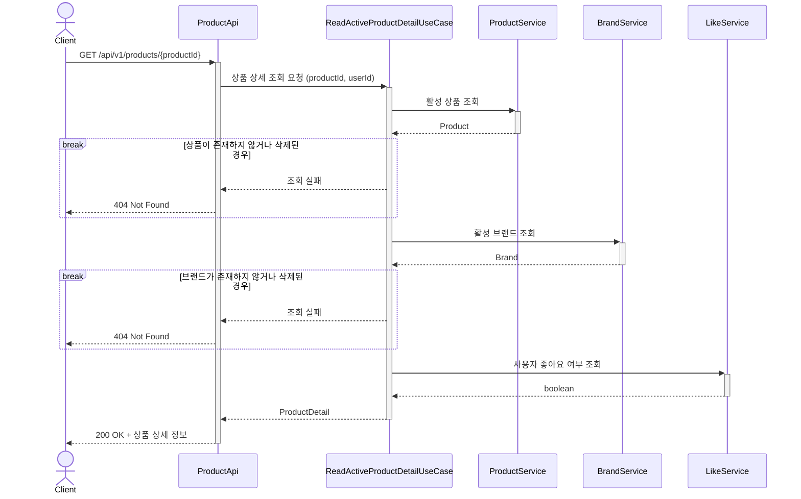
```mermaid
sequenceDiagram
    actor Client
    participant ProductApi
    participant ReadActiveProductDetailUseCase
    participant ProductService
    participant BrandService
    participant LikeService

    Client ->>+ ProductApi: GET /api/v1/products/{productId}
    ProductApi ->>+ ReadActiveProductDetailUseCase: 상품 상세 조회 요청 (productId, userId)

    ReadActiveProductDetailUseCase ->>+ ProductService: 활성 상품 조회
    ProductService -->>- ReadActiveProductDetailUseCase: Product

    break 상품이 존재하지 않거나 삭제된 경우
        ReadActiveProductDetailUseCase -->> ProductApi: 조회 실패
        ProductApi -->> Client: 404 Not Found
    end

    ReadActiveProductDetailUseCase ->>+ BrandService: 활성 브랜드 조회
    BrandService -->>- ReadActiveProductDetailUseCase: Brand

    break 브랜드가 존재하지 않거나 삭제된 경우
        ReadActiveProductDetailUseCase -->> ProductApi: 조회 실패
        ProductApi -->> Client: 404 Not Found
    end

    ReadActiveProductDetailUseCase ->>+ LikeService: 사용자 좋아요 여부 조회
    LikeService -->>- ReadActiveProductDetailUseCase: boolean

    ReadActiveProductDetailUseCase -->>- ProductApi: ProductDetail
    ProductApi -->>- Client: 200 OK + 상품 상세 정보
```

## Like (좋아요)

### [대고객] 상품 좋아요 등록

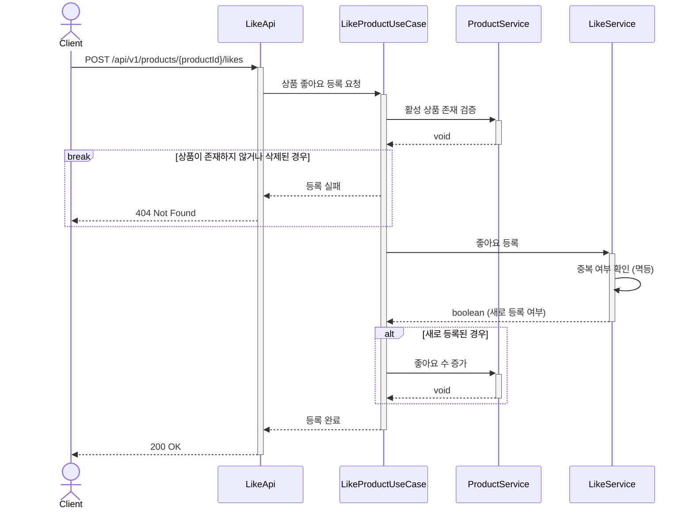
```mermaid
sequenceDiagram
    actor Client
    participant LikeApi
    participant LikeProductUseCase
    participant ProductService
    participant LikeService

    Client ->>+ LikeApi: POST /api/v1/products/{productId}/likes
    LikeApi ->>+ LikeProductUseCase: 상품 좋아요 등록 요청

    LikeProductUseCase ->>+ ProductService: 활성 상품 존재 검증
    ProductService -->>- LikeProductUseCase: void

    break 상품이 존재하지 않거나 삭제된 경우
        LikeProductUseCase -->> LikeApi: 등록 실패
        LikeApi -->> Client: 404 Not Found
    end

    LikeProductUseCase ->>+ LikeService: 좋아요 등록
    LikeService ->> LikeService: 중복 여부 확인 (멱등)
    LikeService -->>- LikeProductUseCase: boolean (새로 등록 여부)

    alt 새로 등록된 경우
        LikeProductUseCase ->>+ ProductService: 좋아요 수 증가
        ProductService -->>- LikeProductUseCase: void
    end

    LikeProductUseCase -->>- LikeApi: 등록 완료
    LikeApi -->>- Client: 200 OK
```

### [대고객] 상품 좋아요 취소

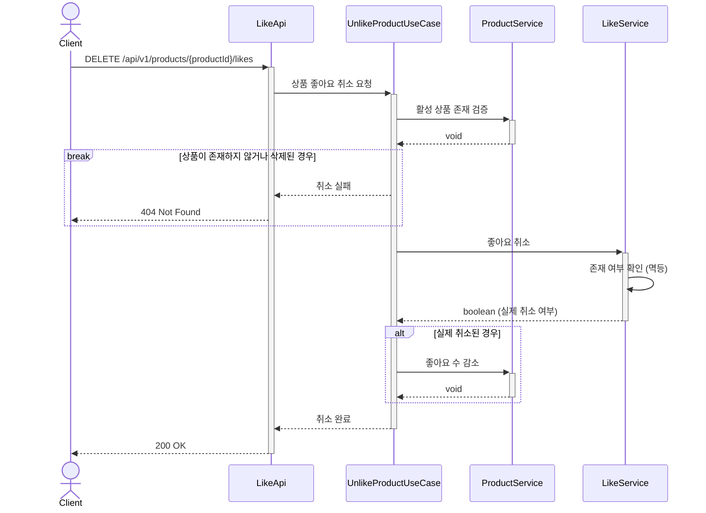
```mermaid
sequenceDiagram
    actor Client
    participant LikeApi
    participant UnlikeProductUseCase
    participant ProductService
    participant LikeService

    Client ->>+ LikeApi: DELETE /api/v1/products/{productId}/likes
    LikeApi ->>+ UnlikeProductUseCase: 상품 좋아요 취소 요청

    UnlikeProductUseCase ->>+ ProductService: 활성 상품 존재 검증
    ProductService -->>- UnlikeProductUseCase: void

    break 상품이 존재하지 않거나 삭제된 경우
        UnlikeProductUseCase -->> LikeApi: 취소 실패
        LikeApi -->> Client: 404 Not Found
    end

    UnlikeProductUseCase ->>+ LikeService: 좋아요 취소
    LikeService ->> LikeService: 존재 여부 확인 (멱등)
    LikeService -->>- UnlikeProductUseCase: boolean (실제 취소 여부)

    alt 실제 취소된 경우
        UnlikeProductUseCase ->>+ ProductService: 좋아요 수 감소
        ProductService -->>- UnlikeProductUseCase: void
    end

    UnlikeProductUseCase -->>- LikeApi: 취소 완료
    LikeApi -->>- Client: 200 OK
```

### [대고객] 내가 좋아요한 상품 목록 조회

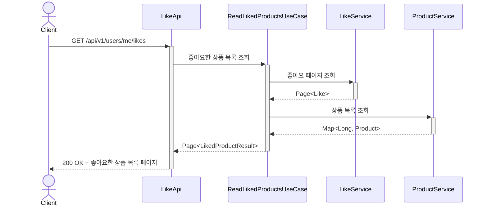
```mermaid
sequenceDiagram
    actor Client
    participant LikeApi
    participant ReadLikedProductsUseCase
    participant LikeService
    participant ProductService

    Client ->>+ LikeApi: GET /api/v1/users/me/likes
    LikeApi ->>+ ReadLikedProductsUseCase: 좋아요한 상품 목록 조회

    ReadLikedProductsUseCase ->>+ LikeService: 좋아요 페이지 조회
    LikeService -->>- ReadLikedProductsUseCase: Page<Like>

    ReadLikedProductsUseCase ->>+ ProductService: 상품 목록 조회
    ProductService -->>- ReadLikedProductsUseCase: Map<Long, Product>

    ReadLikedProductsUseCase -->>- LikeApi: Page<LikedProductResult>
    LikeApi -->>- Client: 200 OK + 좋아요한 상품 목록 페이지
```

## Coupon (쿠폰)

### [어드민] 쿠폰 등록

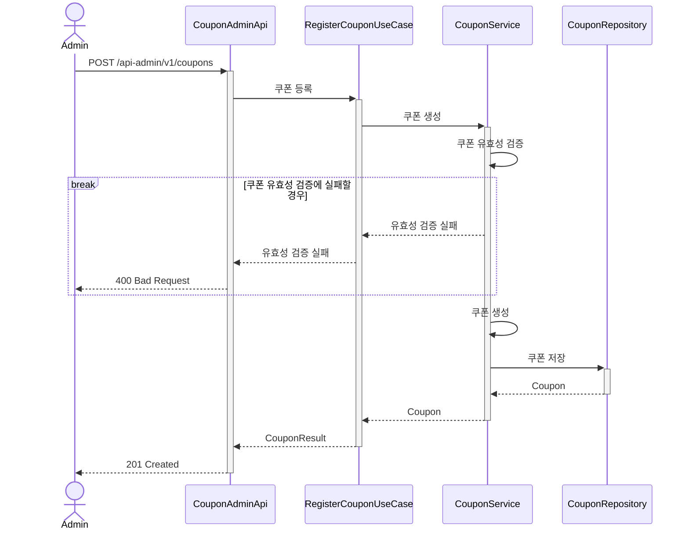
```mermaid
sequenceDiagram
    actor Admin
    participant CouponAdminApi
    participant RegisterCouponUseCase
    participant CouponService
    participant CouponRepository

    Admin ->>+ CouponAdminApi: POST /api-admin/v1/coupons
    CouponAdminApi ->>+ RegisterCouponUseCase: 쿠폰 등록
    RegisterCouponUseCase ->>+ CouponService: 쿠폰 생성
    CouponService ->> CouponService: 쿠폰 유효성 검증

    break 쿠폰 유효성 검증에 실패할 경우
        CouponService -->> RegisterCouponUseCase: 유효성 검증 실패
        RegisterCouponUseCase -->> CouponAdminApi: 유효성 검증 실패
        CouponAdminApi -->> Admin: 400 Bad Request
    end

    CouponService ->> CouponService: 쿠폰 생성
    CouponService ->>+ CouponRepository: 쿠폰 저장
    CouponRepository -->>- CouponService: Coupon
    CouponService -->>- RegisterCouponUseCase: Coupon
    RegisterCouponUseCase -->>- CouponAdminApi: CouponResult
    CouponAdminApi -->>- Admin: 201 Created
```

### [어드민] 쿠폰 목록 조회

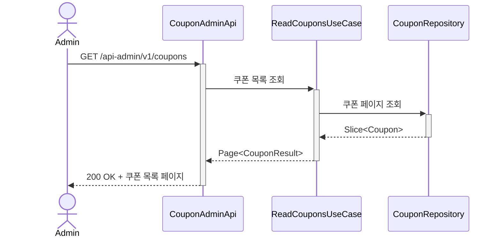
```mermaid
sequenceDiagram
    actor Admin
    participant CouponAdminApi
    participant ReadCouponsUseCase
    participant CouponRepository

    Admin ->>+ CouponAdminApi: GET /api-admin/v1/coupons
    CouponAdminApi ->>+ ReadCouponsUseCase: 쿠폰 목록 조회
    ReadCouponsUseCase ->>+ CouponRepository: 쿠폰 페이지 조회
    CouponRepository -->>- ReadCouponsUseCase: Slice<Coupon>
    ReadCouponsUseCase -->>- CouponAdminApi: Page<CouponResult>
    CouponAdminApi -->>- Admin: 200 OK + 쿠폰 목록 페이지
```

### [어드민] 쿠폰 상세 조회

```mermaid
sequenceDiagram
    actor Admin
    participant CouponAdminApi
    participant ReadCouponDetailUseCase
    participant CouponRepository

    Admin ->>+ CouponAdminApi: GET /api-admin/v1/coupons/{couponId}
    CouponAdminApi ->>+ ReadCouponDetailUseCase: 쿠폰 조회
    ReadCouponDetailUseCase ->>+ CouponRepository: 쿠폰 조회
    CouponRepository -->>- ReadCouponDetailUseCase: Optional<Coupon>

    break 쿠폰이 존재하지 않을 경우
        ReadCouponDetailUseCase -->> CouponAdminApi: 조회 실패
        CouponAdminApi -->> Admin: 404 Not Found
    end

    ReadCouponDetailUseCase -->>- CouponAdminApi: CouponDetailResult
    CouponAdminApi -->>- Admin: 200 OK + 쿠폰 상세 정보
```

### [어드민] 쿠폰 수정

```mermaid
sequenceDiagram
    actor Admin
    participant CouponAdminApi
    participant UpdateCouponUseCase
    participant CouponService
    participant CouponRepository

    Admin ->>+ CouponAdminApi: PUT /api-admin/v1/coupons/{couponId}
    CouponAdminApi ->>+ UpdateCouponUseCase: 쿠폰 수정
    UpdateCouponUseCase ->>+ CouponService: 쿠폰 수정
    CouponService ->>+ CouponRepository: 쿠폰 조회
    CouponRepository -->>- CouponService: Optional<Coupon>

    break 쿠폰이 존재하지 않을 경우
        CouponService -->> UpdateCouponUseCase: 조회 실패
        UpdateCouponUseCase -->> CouponAdminApi: 조회 실패
        CouponAdminApi -->> Admin: 404 Not Found
    end

    CouponService ->> CouponService: 쿠폰 정보 수정

    break 이미 삭제된 쿠폰일 경우
        CouponService -->> UpdateCouponUseCase: 수정 실패
        UpdateCouponUseCase -->> CouponAdminApi: 수정 실패
        CouponAdminApi -->> Admin: 400 Bad Request
    end

    CouponService -->>- UpdateCouponUseCase: void
    UpdateCouponUseCase -->>- CouponAdminApi: 수정 완료
    CouponAdminApi -->>- Admin: 200 OK
```

### [어드민] 쿠폰 삭제

```mermaid
sequenceDiagram
    actor Admin
    participant CouponAdminApi
    participant DeleteCouponUseCase
    participant CouponService
    participant CouponRepository

    Admin ->>+ CouponAdminApi: DELETE /api-admin/v1/coupons/{couponId}
    CouponAdminApi ->>+ DeleteCouponUseCase: 쿠폰 삭제 요청

    DeleteCouponUseCase ->>+ CouponService: 쿠폰 삭제
    CouponService ->>+ CouponRepository: 쿠폰 조회
    CouponRepository -->>- CouponService: Optional<Coupon>

    break 쿠폰이 존재하지 않을 경우
        CouponService -->> DeleteCouponUseCase: 조회 실패
        DeleteCouponUseCase -->> CouponAdminApi: 조회 실패
        CouponAdminApi -->> Admin: 404 Not Found
    end

    CouponService ->> CouponService: 삭제 여부 확인

    break 이미 삭제된 쿠폰일 경우
        CouponService -->> DeleteCouponUseCase: false (삭제 스킵, 멱등)
        DeleteCouponUseCase -->> CouponAdminApi: 삭제 완료
        CouponAdminApi -->> Admin: 200 OK
    end

    CouponService ->> CouponService: 쿠폰 삭제 (soft delete)
    CouponService -->>- DeleteCouponUseCase: true (삭제 완료)
    DeleteCouponUseCase -->>- CouponAdminApi: 삭제 완료
    CouponAdminApi -->>- Admin: 200 OK
```

### [어드민] 쿠폰 발급 내역 조회

```mermaid
sequenceDiagram
    actor Admin
    participant CouponAdminApi
    participant ReadCouponIssuesUseCase
    participant CouponRepository
    participant OwnedCouponRepository

    Admin ->>+ CouponAdminApi: GET /api-admin/v1/coupons/{couponId}/issues
    CouponAdminApi ->>+ ReadCouponIssuesUseCase: 발급 내역 조회

    ReadCouponIssuesUseCase ->>+ CouponRepository: 쿠폰 존재 확인
    CouponRepository -->>- ReadCouponIssuesUseCase: Optional<Coupon>

    break 쿠폰이 존재하지 않을 경우
        ReadCouponIssuesUseCase -->> CouponAdminApi: 조회 실패
        CouponAdminApi -->> Admin: 404 Not Found
    end

    ReadCouponIssuesUseCase ->>+ OwnedCouponRepository: 발급 내역 페이지 조회
    OwnedCouponRepository -->>- ReadCouponIssuesUseCase: Slice<OwnedCoupon>

    ReadCouponIssuesUseCase -->>- CouponAdminApi: Page<CouponIssueResult>
    CouponAdminApi -->>- Admin: 200 OK + 발급 내역 페이지
```

### [대고객] 쿠폰 발급

```mermaid
sequenceDiagram
    actor Client
    participant CouponApi
    participant IssueCouponUseCase
    participant CouponService
    participant CouponRepository
    participant OwnedCouponRepository

    Client ->>+ CouponApi: POST /api/v1/coupons/{couponId}/issue
    CouponApi ->>+ IssueCouponUseCase: 쿠폰 발급 요청

    IssueCouponUseCase ->>+ CouponService: 쿠폰 발급
    CouponService ->>+ CouponRepository: 쿠폰 조회
    CouponRepository -->>- CouponService: Optional<Coupon>

    break 쿠폰이 존재하지 않거나 삭제된 경우
        CouponService -->> IssueCouponUseCase: 발급 실패
        IssueCouponUseCase -->> CouponApi: 발급 실패
        CouponApi -->> Client: 400 Bad Request
    end

    break 쿠폰이 만료된 경우
        CouponService -->> IssueCouponUseCase: 발급 실패
        IssueCouponUseCase -->> CouponApi: 발급 실패
        CouponApi -->> Client: 400 Bad Request
    end

    CouponService ->>+ OwnedCouponRepository: 중복 발급 검증
    OwnedCouponRepository -->>- CouponService: boolean

    break 중복 발급인 경우
        CouponService -->> IssueCouponUseCase: 발급 실패
        IssueCouponUseCase -->> CouponApi: 발급 실패
        CouponApi -->> Client: 400 Bad Request
    end

    CouponService ->> CouponService: OwnedCoupon 생성
    CouponService ->>+ OwnedCouponRepository: 보유 쿠폰 저장
    OwnedCouponRepository -->>- CouponService: OwnedCoupon

    CouponService -->>- IssueCouponUseCase: OwnedCoupon
    IssueCouponUseCase -->>- CouponApi: 발급 완료
    CouponApi -->>- Client: 201 Created
```

### [대고객] 내 쿠폰 목록 조회

```mermaid
sequenceDiagram
    actor Client
    participant CouponApi
    participant ReadMyCouponsUseCase
    participant OwnedCouponRepository

    Client ->>+ CouponApi: GET /api/v1/users/me/coupons
    CouponApi ->>+ ReadMyCouponsUseCase: 내 쿠폰 목록 조회

    ReadMyCouponsUseCase ->>+ OwnedCouponRepository: 보유 쿠폰 조회 (쿠폰 정보 포함)
    OwnedCouponRepository -->>- ReadMyCouponsUseCase: List<OwnedCoupon>

    ReadMyCouponsUseCase -->>- CouponApi: List<MyCouponResult>
    CouponApi -->>- Client: 200 OK + 내 쿠폰 목록
```

## Order (주문)

### [어드민] 주문 목록 조회

```mermaid
sequenceDiagram
    actor Admin
    participant OrderApi
    participant ReadOrdersUseCase
    participant OrderRepository

    Admin ->>+ OrderApi: GET /api-admin/v1/orders
    OrderApi ->>+ ReadOrdersUseCase: 주문 목록 조회
    ReadOrdersUseCase ->>+ OrderRepository: 주문 페이지 조회
    OrderRepository -->>- ReadOrdersUseCase: Slice<Order>
    ReadOrdersUseCase -->>- OrderApi: Page<OrderResult>
    OrderApi -->>- Admin: 200 OK + 주문 목록 페이지
```

### [어드민] 주문 상세 조회

```mermaid
sequenceDiagram
    actor Admin
    participant OrderApi
    participant ReadOrderDetailUseCase
    participant OrderRepository
    participant UserRepository

    Admin ->>+ OrderApi: GET /api-admin/v1/orders/{orderId}
    OrderApi ->>+ ReadOrderDetailUseCase: 주문 조회

    ReadOrderDetailUseCase ->>+ OrderRepository: 주문 조회
    OrderRepository -->>- ReadOrderDetailUseCase: Optional<Order>

    break 주문이 존재하지 않을 경우
        ReadOrderDetailUseCase -->> OrderApi: 조회 실패
        OrderApi -->> Admin: 404 Not Found
    end

    ReadOrderDetailUseCase ->>+ UserRepository: 주문자 조회
    UserRepository -->>- ReadOrderDetailUseCase: Optional<User>

    break 주문자가 존재하지 않을 경우
        ReadOrderDetailUseCase -->> OrderApi: 조회 실패
        OrderApi -->> Admin: 404 Not Found
    end

    ReadOrderDetailUseCase -->>- OrderApi: AdminOrderDetailResult
    OrderApi -->>- Admin: 200 OK + 주문 상세 정보
```

### [대고객] 주문 요청

```mermaid
sequenceDiagram
    actor Client
    participant OrderApi
    participant PlaceOrderUseCase
    participant ProductService
    participant OrderService
    participant OrderRepository

    Client ->>+ OrderApi: POST /api/v1/orders
    OrderApi ->>+ PlaceOrderUseCase: 주문 요청

    PlaceOrderUseCase ->>+ ProductService: 주문 상품 조회
    ProductService -->>- PlaceOrderUseCase: Map<Long, Product>

    break 유효하지 않은 상품이 포함된 경우
        PlaceOrderUseCase -->> OrderApi: 주문 실패
        OrderApi -->> Client: 400 Bad Request
    end

    Note over PlaceOrderUseCase, ProductService: 비관적 락으로 상품별 순차 재고 차감

    PlaceOrderUseCase ->>+ ProductService: 재고 차감 (상품별 순차)
    ProductService -->>- PlaceOrderUseCase: void

    break 품절 또는 재고 부족인 경우
        PlaceOrderUseCase -->> OrderApi: 주문 실패
        OrderApi -->> Client: 400 Bad Request
    end

    PlaceOrderUseCase ->>+ OrderService: 주문 생성
    OrderService ->> OrderService: 주문 유효성 검증

    break 주문 유효성 검증에 실패할 경우
        OrderService -->> PlaceOrderUseCase: 주문 실패
        PlaceOrderUseCase -->> OrderApi: 주문 실패
        OrderApi -->> Client: 400 Bad Request
    end

    OrderService ->>+ OrderRepository: 주문 저장
    OrderRepository -->>- OrderService: Order
    OrderService -->>- PlaceOrderUseCase: Order

    PlaceOrderUseCase -->>- OrderApi: Long (orderId)
    OrderApi -->>- Client: 201 Created
```

### [대고객] 주문 목록 조회

```mermaid
sequenceDiagram
    actor Client
    participant OrderApi
    participant ReadMyOrdersUseCase
    participant OrderRepository

    Client ->>+ OrderApi: GET /api/v1/orders
    OrderApi ->>+ ReadMyOrdersUseCase: 주문 목록 조회
    ReadMyOrdersUseCase ->>+ OrderRepository: 주문 페이지 조회
    OrderRepository -->>- ReadMyOrdersUseCase: Slice<Order>
    ReadMyOrdersUseCase -->>- OrderApi: Page<OrderResult>
    OrderApi -->>- Client: 200 OK + 주문 목록 페이지
```

### [대고객] 주문 상세 조회

```mermaid
sequenceDiagram
    actor Client
    participant OrderApi
    participant ReadMyOrderDetailUseCase
    participant OrderService
    participant OrderRepository

    Client ->>+ OrderApi: GET /api/v1/orders/{orderId}
    OrderApi ->>+ ReadMyOrderDetailUseCase: 주문 조회

    ReadMyOrderDetailUseCase ->>+ OrderService: 내 주문 조회
    OrderService ->>+ OrderRepository: 주문 조회
    OrderRepository -->>- OrderService: Optional<Order>

    break 주문이 존재하지 않을 경우
        OrderService -->> ReadMyOrderDetailUseCase: 조회 실패
        ReadMyOrderDetailUseCase -->> OrderApi: 조회 실패
        OrderApi -->> Client: 404 Not Found
    end

    OrderService ->> OrderService: 주문 소유권 검증

    break 본인의 주문이 아닐 경우
        OrderService -->> ReadMyOrderDetailUseCase: 소유권 검증 실패
        ReadMyOrderDetailUseCase -->> OrderApi: 소유권 검증 실패
        OrderApi -->> Client: 403 Forbidden
    end

    OrderService -->>- ReadMyOrderDetailUseCase: Order
    ReadMyOrderDetailUseCase -->>- OrderApi: OrderDetailResult
    OrderApi -->>- Client: 200 OK + 주문 상세 정보
```
