# 시퀀스 다이어그램

## 공통 사항

### 인증/인가

- 회원 전용 기능(좋아요, 주문)과 관리자 전용 기능(브랜드/상품 관리)은 AuthInterceptor에서 인증을 선처리한다.
- 인증 실패 시 Controller에 도달하기 전에 요청이 거부된다.
- 아래 다이어그램은 **인증이 통과된 이후의 흐름**만 표현한다.

### 계층 간 데이터 흐름

- 각 계층 경계에서 DTO가 변환된다 (Request DTO → Command, Entity → Info → Response DTO).
- DTO 변환은 각 컴포넌트의 내부 책임이므로 시퀀스 다이어그램에 표현하지 않는다.

---

## 2.1 브랜드 (Brand)

### US-B01: 브랜드 정보 조회 (고객)

#### 검증 목적

고객의 브랜드 조회 요청이 각 계층을 통과하는 순서와, "브랜드가 없다"를 예외로 판단하는 책임이 어느 계층에 있는지 확인한다.

#### 시퀀스 다이어그램

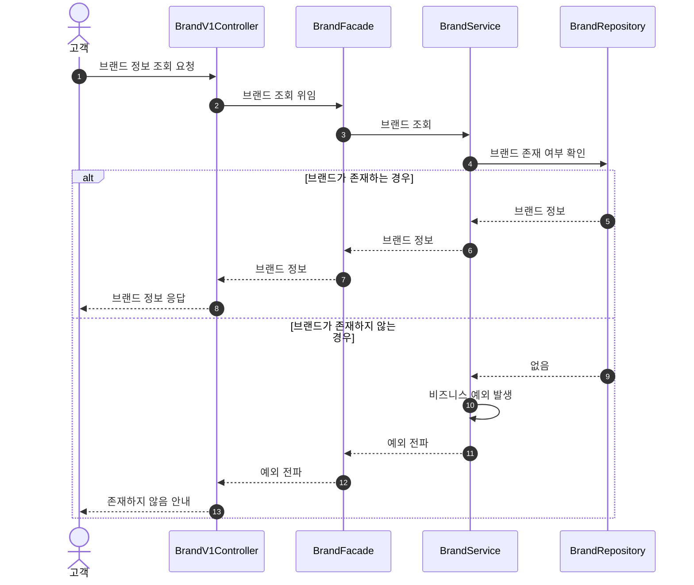
```mermaid
sequenceDiagram
    autonumber
    actor 고객
    participant Controller as BrandV1Controller
    participant Facade as BrandFacade
    participant Service as BrandService
    participant Repository as BrandRepository

    고객->>Controller: 브랜드 정보 조회 요청
    Controller->>Facade: 브랜드 조회 위임
    Facade->>Service: 브랜드 조회
    Service->>Repository: 브랜드 존재 여부 확인

    alt 브랜드가 존재하는 경우
        Repository-->>Service: 브랜드 정보
        Service-->>Facade: 브랜드 정보
        Facade-->>Controller: 브랜드 정보
        Controller-->>고객: 브랜드 정보 응답
    else 브랜드가 존재하지 않는 경우
        Repository-->>Service: 없음
        Service->>Service: 비즈니스 예외 발생
        Service-->>Facade: 예외 전파
        Facade-->>Controller: 예외 전파
        Controller-->>고객: 존재하지 않음 안내
    end
```

#### 봐야 할 포인트

1. **예외 발생 위치**: Repository는 "없음"만 반환하고, 비즈니스 예외로 변환하는 책임은 Service에 있다.
2. **Facade의 역할**: 단일 도메인 조회이므로 Facade는 Service 호출을 위임만 한다.

---

### US-B02: 브랜드 목록 조회 (관리자)

#### 검증 목적

목록 조회는 결과가 비어있어도 정상 응답이므로 예외 분기가 없다. 단건 조회와의 차이를 확인한다.

#### 시퀀스 다이어그램

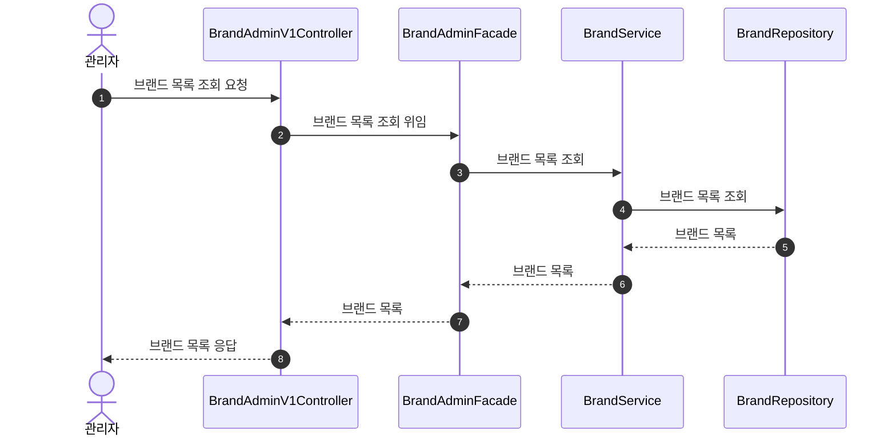
```mermaid
sequenceDiagram
    autonumber
    actor 관리자
    participant Controller as BrandAdminV1Controller
    participant Facade as BrandAdminFacade
    participant Service as BrandService
    participant Repository as BrandRepository

    관리자->>Controller: 브랜드 목록 조회 요청
    Controller->>Facade: 브랜드 목록 조회 위임
    Facade->>Service: 브랜드 목록 조회
    Service->>Repository: 브랜드 목록 조회
    Repository-->>Service: 브랜드 목록
    Service-->>Facade: 브랜드 목록
    Facade-->>Controller: 브랜드 목록
    Controller-->>관리자: 브랜드 목록 응답
```

#### 봐야 할 포인트

1. **예외 분기 없음**: 결과가 비어있어도 빈 목록으로 정상 응답한다.
2. **BR-B02**: 관리자용 브랜드 정보는 고객용과 다를 수 있다. 차이는 Controller의 DTO 변환에서 결정된다.

---

### US-B03: 브랜드 상세 조회 (관리자)

#### 검증 목적

관리자 단건 조회가 고객 조회(US-B01)와 동일한 계층 흐름을 따르되, 응답 범위만 다른지 확인한다.

#### 시퀀스 다이어그램

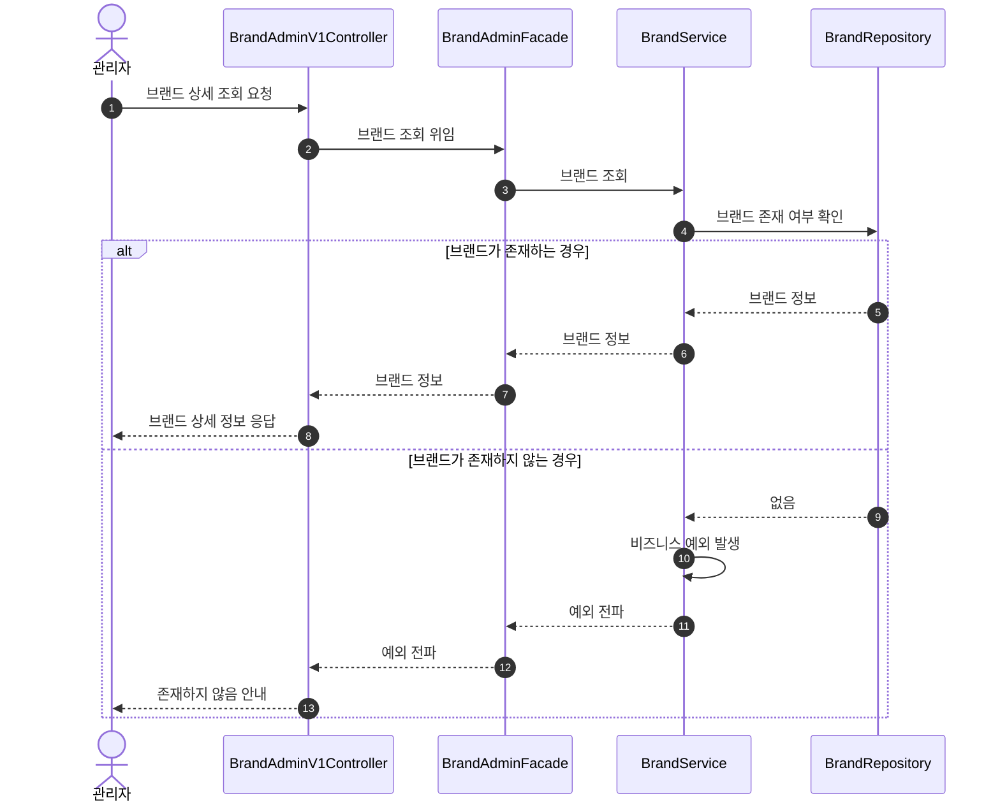
```mermaid
sequenceDiagram
    autonumber
    actor 관리자
    participant Controller as BrandAdminV1Controller
    participant Facade as BrandAdminFacade
    participant Service as BrandService
    participant Repository as BrandRepository

    관리자->>Controller: 브랜드 상세 조회 요청
    Controller->>Facade: 브랜드 조회 위임
    Facade->>Service: 브랜드 조회
    Service->>Repository: 브랜드 존재 여부 확인

    alt 브랜드가 존재하는 경우
        Repository-->>Service: 브랜드 정보
        Service-->>Facade: 브랜드 정보
        Facade-->>Controller: 브랜드 정보
        Controller-->>관리자: 브랜드 상세 정보 응답
    else 브랜드가 존재하지 않는 경우
        Repository-->>Service: 없음
        Service->>Service: 비즈니스 예외 발생
        Service-->>Facade: 예외 전파
        Facade-->>Controller: 예외 전파
        Controller-->>관리자: 존재하지 않음 안내
    end
```

#### 봐야 할 포인트

1. **US-B01과 동일한 흐름**: 차이는 액터(관리자)와 응답 DTO의 범위뿐이다. BR-B02에 따라 관리자용 정보가 더 상세할 수 있다.

---

### US-B04: 브랜드 등록 (관리자)

#### 검증 목적

브랜드 등록 시 브랜드명 중복 여부를 확인한 후 저장하는 흐름을 검증한다. 다른 도메인에 대한 의존은 없지만, 도메인 내부 유일성 제약이 존재한다.

#### 시퀀스 다이어그램

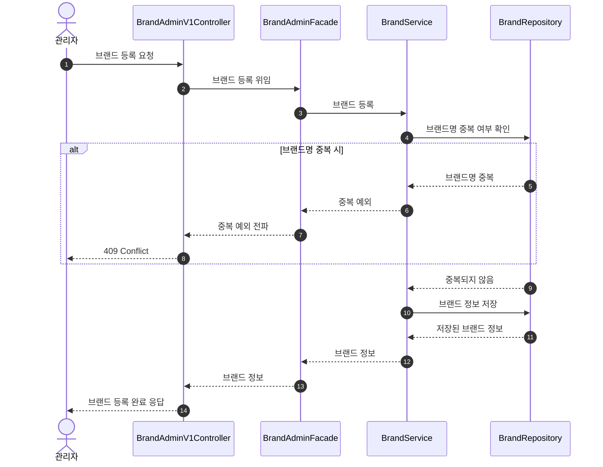
```mermaid
sequenceDiagram
    autonumber
    actor 관리자
    participant Controller as BrandAdminV1Controller
    participant Facade as BrandAdminFacade
    participant Service as BrandService
    participant Repository as BrandRepository

    관리자->>Controller: 브랜드 등록 요청
    Controller->>Facade: 브랜드 등록 위임
    Facade->>Service: 브랜드 등록
    Service->>Repository: 브랜드명 중복 여부 확인

    alt 브랜드명 중복 시
        Repository-->>Service: 브랜드명 중복
        Service-->>Facade: 중복 예외
        Facade-->>Controller: 중복 예외 전파
        Controller-->>관리자: 409 Conflict
    end

    Repository-->>Service: 중복되지 않음
    Service->>Repository: 브랜드 정보 저장
    Repository-->>Service: 저장된 브랜드 정보
    Service-->>Facade: 브랜드 정보
    Facade-->>Controller: 브랜드 정보
    Controller-->>관리자: 브랜드 등록 완료 응답
```

#### 봐야 할 포인트

1. **브랜드명 중복 검증**: Service가 저장 전에 동일 브랜드명의 존재 여부를 확인한다. 중복 시 CONFLICT(409)로 응답한다.
2. **early-return 패턴**: 중복 검증 실패 시 즉시 예외를 반환하고, 정상 흐름은 `alt` 블록 이후에 계속된다.

---

### US-B05: 브랜드 정보 수정 (관리자)

#### 검증 목적

브랜드 수정 시 "존재 여부 확인 → 브랜드명 중복 확인 → 수정" 순서를 확인한다. US-B04와 마찬가지로 브랜드명 유일성 제약이 적용된다.

#### 시퀀스 다이어그램

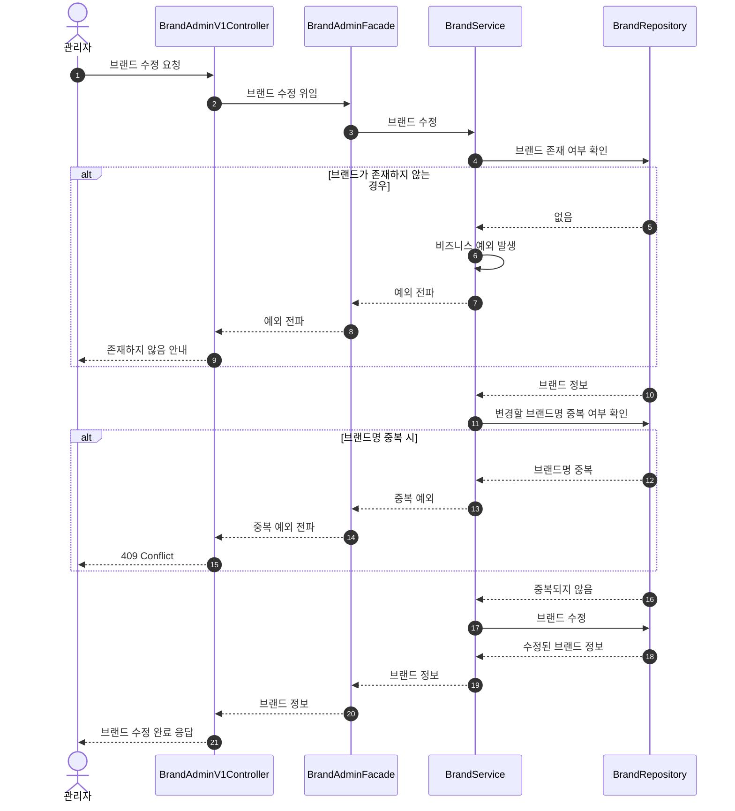
```mermaid
sequenceDiagram
    autonumber
    actor 관리자
    participant Controller as BrandAdminV1Controller
    participant Facade as BrandAdminFacade
    participant Service as BrandService
    participant Repository as BrandRepository

    관리자->>Controller: 브랜드 수정 요청
    Controller->>Facade: 브랜드 수정 위임
    Facade->>Service: 브랜드 수정
    Service->>Repository: 브랜드 존재 여부 확인

    alt 브랜드가 존재하지 않는 경우
        Repository-->>Service: 없음
        Service->>Service: 비즈니스 예외 발생
        Service-->>Facade: 예외 전파
        Facade-->>Controller: 예외 전파
        Controller-->>관리자: 존재하지 않음 안내
    end

    Repository-->>Service: 브랜드 정보
    Service->>Repository: 변경할 브랜드명 중복 여부 확인

    alt 브랜드명 중복 시
        Repository-->>Service: 브랜드명 중복
        Service-->>Facade: 중복 예외
        Facade-->>Controller: 중복 예외 전파
        Controller-->>관리자: 409 Conflict
    end

    Repository-->>Service: 중복되지 않음
    Service->>Repository: 브랜드 수정
    Repository-->>Service: 수정된 브랜드 정보
    Service-->>Facade: 브랜드 정보
    Facade-->>Controller: 브랜드 정보
    Controller-->>관리자: 브랜드 수정 완료 응답
```

#### 봐야 할 포인트

1. **이중 검증**: 존재 확인 → 브랜드명 중복 확인 → 수정의 3단계. US-B04(등록)의 단일 검증보다 한 단계가 추가된다.
2. **자기 자신 제외**: 수정 시 브랜드명 중복 확인은 자기 자신을 제외한 다른 브랜드와 비교해야 한다. 이 구분은 Repository 쿼리에서 처리된다.

---

### US-B06: 브랜드 삭제 (관리자)

#### 검증 목적

BR-B01(연쇄 삭제)의 책임이 어느 계층에 있는지 확인한다. 브랜드 삭제 → 좋아요 삭제 → 상품 삭제의 3단계 연쇄가 발생하며, Facade가 BrandService, ProductService, LikeService를 조율한다.

#### 시퀀스 다이어그램

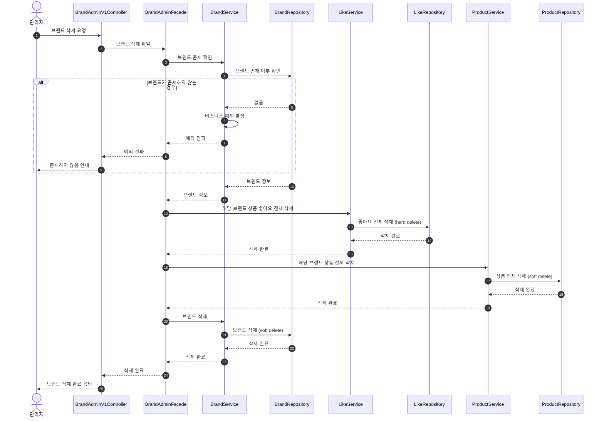
```mermaid
sequenceDiagram
    autonumber
    actor 관리자
    participant Controller as BrandAdminV1Controller
    participant Facade as BrandAdminFacade
    participant BrandService
    participant BrandRepository
    participant LikeService
    participant LikeRepository
    participant ProductService
    participant ProductRepository

    관리자->>Controller: 브랜드 삭제 요청
    Controller->>Facade: 브랜드 삭제 위임
    Facade->>BrandService: 브랜드 존재 확인
    BrandService->>BrandRepository: 브랜드 존재 여부 확인

    alt 브랜드가 존재하지 않는 경우
        BrandRepository-->>BrandService: 없음
        BrandService->>BrandService: 비즈니스 예외 발생
        BrandService-->>Facade: 예외 전파
        Facade-->>Controller: 예외 전파
        Controller-->>관리자: 존재하지 않음 안내
    end

    BrandRepository-->>BrandService: 브랜드 정보
    BrandService-->>Facade: 브랜드 정보
    Facade->>LikeService: 해당 브랜드 상품 좋아요 전체 삭제
    LikeService->>LikeRepository: 좋아요 전체 삭제 (hard delete)
    LikeRepository-->>LikeService: 삭제 완료
    LikeService-->>Facade: 삭제 완료
    Facade->>ProductService: 해당 브랜드 상품 전체 삭제
    ProductService->>ProductRepository: 상품 전체 삭제 (soft delete)
    ProductRepository-->>ProductService: 삭제 완료
    ProductService-->>Facade: 삭제 완료
    Facade->>BrandService: 브랜드 삭제
    BrandService->>BrandRepository: 브랜드 삭제 (soft delete)
    BrandRepository-->>BrandService: 삭제 완료
    BrandService-->>Facade: 삭제 완료
    Facade-->>Controller: 삭제 완료
    Controller-->>관리자: 브랜드 삭제 완료 응답
```

#### 봐야 할 포인트

1. **Facade의 3-서비스 조율**: BrandService, LikeService, ProductService는 서로를 모른다. 도메인 간 삭제 순서를 Facade가 결정한다.
2. **삭제 순서와 정책**: 좋아요(hard delete) → 상품(soft delete) → 브랜드(soft delete). 종속 데이터를 먼저 정리해야 상위 엔티티 삭제 후 고아 데이터가 남지 않는다.

#### 잠재 리스크

- **트랜잭션 범위**: 좋아요 삭제, 상품 삭제, 브랜드 삭제가 하나의 트랜잭션으로 묶여야 한다. 3개 서비스를 포함하므로 트랜잭션이 넓다.
- **Soft Delete 연쇄 정책**: 브랜드 복원 시 상품도 함께 복원해야 하는지, 복원된 상품의 좋아요는 이미 hard delete되어 복원 불가능한 점을 어떻게 다룰지 정책 결정이 필요하다.

---

## 2.2 상품 (Product)

### US-P01: 상품 목록 조회 (고객)

#### 검증 목적

상품 목록 조회에는 브랜드 필터링, 정렬(BR-P03, BR-P04), 페이징이 포함된다. 필터/정렬 조건의 처리 책임이 어느 계층에 있는지 확인한다.

#### 시퀀스 다이어그램

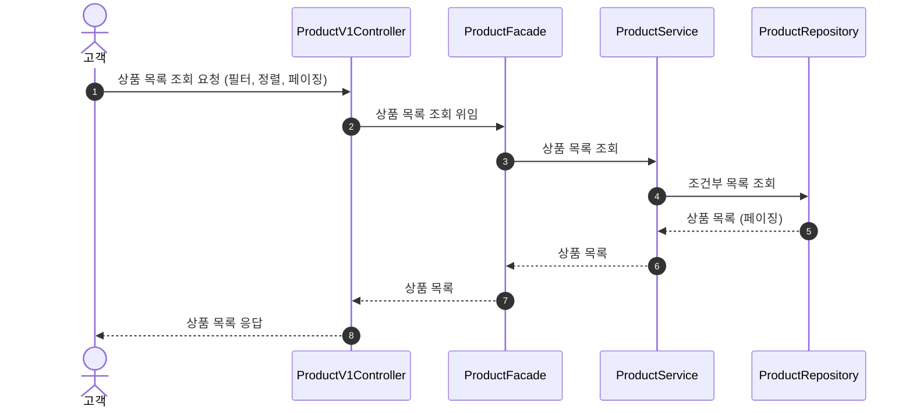
```mermaid
sequenceDiagram
    autonumber
    actor 고객
    participant Controller as ProductV1Controller
    participant Facade as ProductFacade
    participant Service as ProductService
    participant Repository as ProductRepository

    고객->>Controller: 상품 목록 조회 요청 (필터, 정렬, 페이징)
    Controller->>Facade: 상품 목록 조회 위임
    Facade->>Service: 상품 목록 조회
    Service->>Repository: 조건부 목록 조회
    Repository-->>Service: 상품 목록 (페이징)
    Service-->>Facade: 상품 목록
    Facade-->>Controller: 상품 목록
    Controller-->>고객: 상품 목록 응답
```

#### 봐야 할 포인트

1. **필터/정렬 책임**: 브랜드 필터링과 정렬 조건은 Repository 계층의 쿼리로 처리된다. Service는 조건을 전달만 한다.
2. **BR-P05**: 고객에게는 재고 여부(있음/없음)만 노출하고, 구체적 재고 수량은 숨긴다. DTO 변환에서 결정된다.

---

### US-P02: 상품 상세 조회 (고객)

#### 검증 목적

단건 조회의 정상/예외 분기를 확인한다. 브랜드 조회(US-B01)와 동일한 패턴을 따른다.

#### 시퀀스 다이어그램

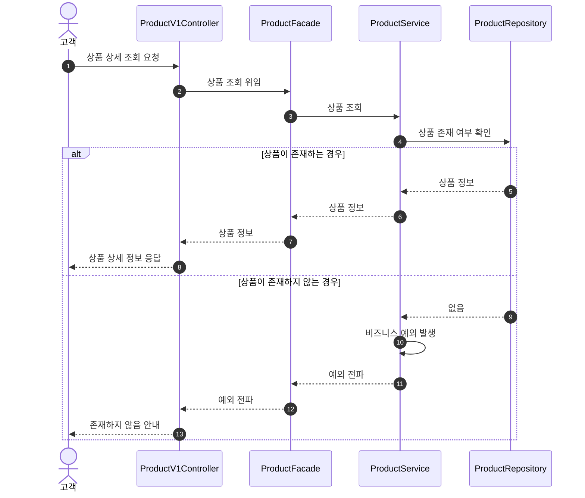
```mermaid
sequenceDiagram
    autonumber
    actor 고객
    participant Controller as ProductV1Controller
    participant Facade as ProductFacade
    participant Service as ProductService
    participant Repository as ProductRepository

    고객->>Controller: 상품 상세 조회 요청
    Controller->>Facade: 상품 조회 위임
    Facade->>Service: 상품 조회
    Service->>Repository: 상품 존재 여부 확인

    alt 상품이 존재하는 경우
        Repository-->>Service: 상품 정보
        Service-->>Facade: 상품 정보
        Facade-->>Controller: 상품 정보
        Controller-->>고객: 상품 상세 정보 응답
    else 상품이 존재하지 않는 경우
        Repository-->>Service: 없음
        Service->>Service: 비즈니스 예외 발생
        Service-->>Facade: 예외 전파
        Facade-->>Controller: 예외 전파
        Controller-->>고객: 존재하지 않음 안내
    end
```

#### 봐야 할 포인트

1. **US-B01과 동일한 패턴**: 단건 조회의 존재/부재 분기는 모든 도메인에서 동일하게 적용된다.

---

### US-P03: 상품 목록 조회 (관리자)

#### 검증 목적

관리자 목록 조회가 고객 목록 조회(US-P01)와 동일한 흐름을 따르되, 응답 정보의 범위만 다른지 확인한다.

#### 시퀀스 다이어그램

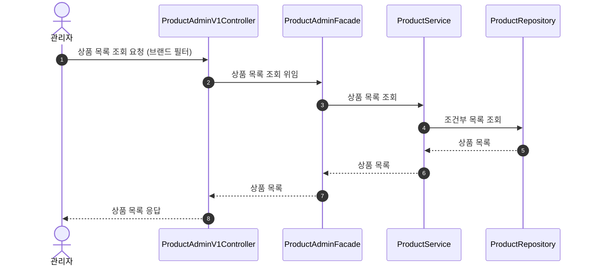
```mermaid
sequenceDiagram
    autonumber
    actor 관리자
    participant Controller as ProductAdminV1Controller
    participant Facade as ProductAdminFacade
    participant Service as ProductService
    participant Repository as ProductRepository

    관리자->>Controller: 상품 목록 조회 요청 (브랜드 필터)
    Controller->>Facade: 상품 목록 조회 위임
    Facade->>Service: 상품 목록 조회
    Service->>Repository: 조건부 목록 조회
    Repository-->>Service: 상품 목록
    Service-->>Facade: 상품 목록
    Facade-->>Controller: 상품 목록
    Controller-->>관리자: 상품 목록 응답
```

#### 봐야 할 포인트

1. **BR-P05**: 관리자에게는 재고 수량까지 노출된다. 고객용/관리자용 차이는 Controller의 DTO 변환에서 결정된다.

---

### US-P04: 상품 상세 조회 (관리자)

#### 검증 목적

관리자 단건 조회가 US-P02와 동일한 흐름을 따르는지 확인한다.

#### 시퀀스 다이어그램

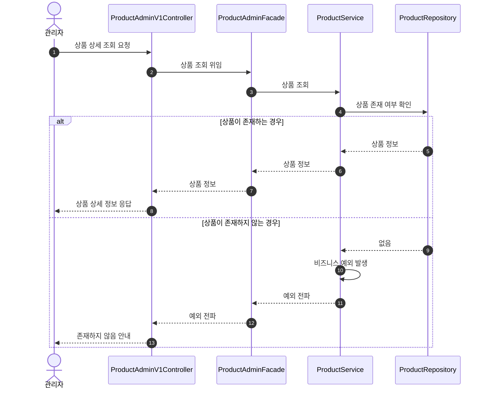
```mermaid
sequenceDiagram
    autonumber
    actor 관리자
    participant Controller as ProductAdminV1Controller
    participant Facade as ProductAdminFacade
    participant Service as ProductService
    participant Repository as ProductRepository

    관리자->>Controller: 상품 상세 조회 요청
    Controller->>Facade: 상품 조회 위임
    Facade->>Service: 상품 조회
    Service->>Repository: 상품 존재 여부 확인

    alt 상품이 존재하는 경우
        Repository-->>Service: 상품 정보
        Service-->>Facade: 상품 정보
        Facade-->>Controller: 상품 정보
        Controller-->>관리자: 상품 상세 정보 응답
    else 상품이 존재하지 않는 경우
        Repository-->>Service: 없음
        Service->>Service: 비즈니스 예외 발생
        Service-->>Facade: 예외 전파
        Facade-->>Controller: 예외 전파
        Controller-->>관리자: 존재하지 않음 안내
    end
```

#### 봐야 할 포인트

1. **US-P02와 동일한 흐름**: 액터와 응답 DTO 범위만 다르다.

---

### US-P05: 상품 등록 (관리자)

#### 검증 목적

상품 등록 시 두 가지를 검증한다: BR-P01(브랜드 존재 여부)은 Facade가 도메인 간 조율로 처리하고, 같은 브랜드 내 상품명 중복은 ProductService가 내부에서 처리한다.

#### 시퀀스 다이어그램

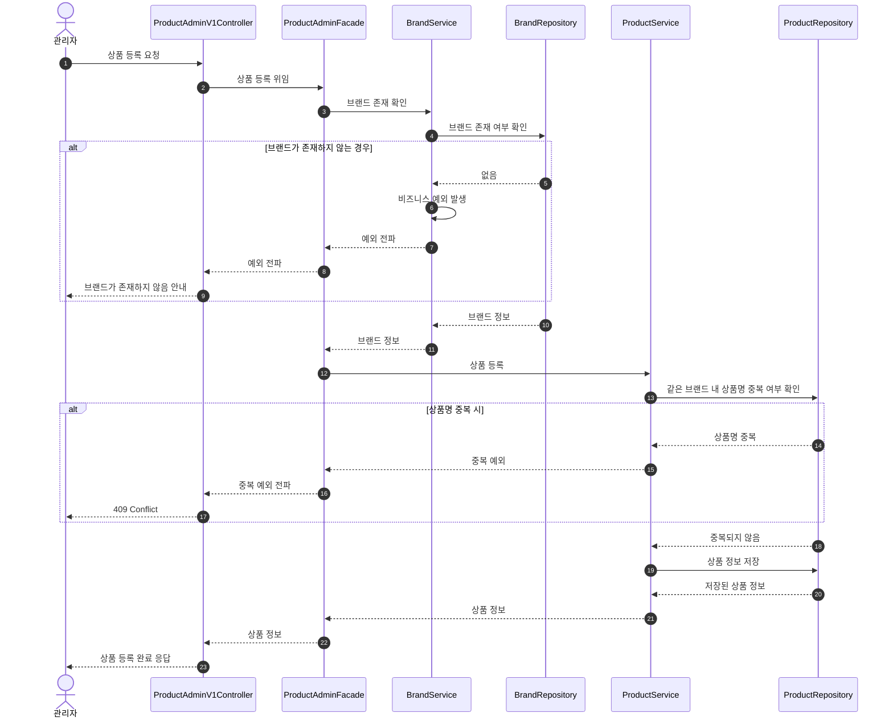
```mermaid
sequenceDiagram
    autonumber
    actor 관리자
    participant Controller as ProductAdminV1Controller
    participant Facade as ProductAdminFacade
    participant BrandService
    participant BrandRepository
    participant ProductService
    participant ProductRepository

    관리자->>Controller: 상품 등록 요청
    Controller->>Facade: 상품 등록 위임
    Facade->>BrandService: 브랜드 존재 확인
    BrandService->>BrandRepository: 브랜드 존재 여부 확인

    alt 브랜드가 존재하지 않는 경우
        BrandRepository-->>BrandService: 없음
        BrandService->>BrandService: 비즈니스 예외 발생
        BrandService-->>Facade: 예외 전파
        Facade-->>Controller: 예외 전파
        Controller-->>관리자: 브랜드가 존재하지 않음 안내
    end

    BrandRepository-->>BrandService: 브랜드 정보
    BrandService-->>Facade: 브랜드 정보
    Facade->>ProductService: 상품 등록
    ProductService->>ProductRepository: 같은 브랜드 내 상품명 중복 여부 확인

    alt 상품명 중복 시
        ProductRepository-->>ProductService: 상품명 중복
        ProductService-->>Facade: 중복 예외
        Facade-->>Controller: 중복 예외 전파
        Controller-->>관리자: 409 Conflict
    end

    ProductRepository-->>ProductService: 중복되지 않음
    ProductService->>ProductRepository: 상품 정보 저장
    ProductRepository-->>ProductService: 저장된 상품 정보
    ProductService-->>Facade: 상품 정보
    Facade-->>Controller: 상품 정보
    Controller-->>관리자: 상품 등록 완료 응답
```

#### 봐야 할 포인트

1. **검증 책임의 분리**: 브랜드 존재 확인(도메인 간)은 Facade가, 상품명 중복 확인(도메인 내)은 ProductService가 처리한다. US-B04의 브랜드명 중복 검증과 동일한 패턴.
2. **중복 범위**: 상품명 중복은 전체가 아닌 **같은 브랜드 내**에서만 확인한다. 다른 브랜드에 동일한 상품명이 존재하는 것은 허용된다.

---

### US-P06: 상품 정보 수정 (관리자)

#### 검증 목적

상품 수정 시 "존재 여부 확인 → 같은 브랜드 내 상품명 중복 확인 → 수정" 순서를 확인한다. BR-P02(소속 브랜드 변경 불가)는 도메인 모델 수준에서 보장된다.

#### 시퀀스 다이어그램

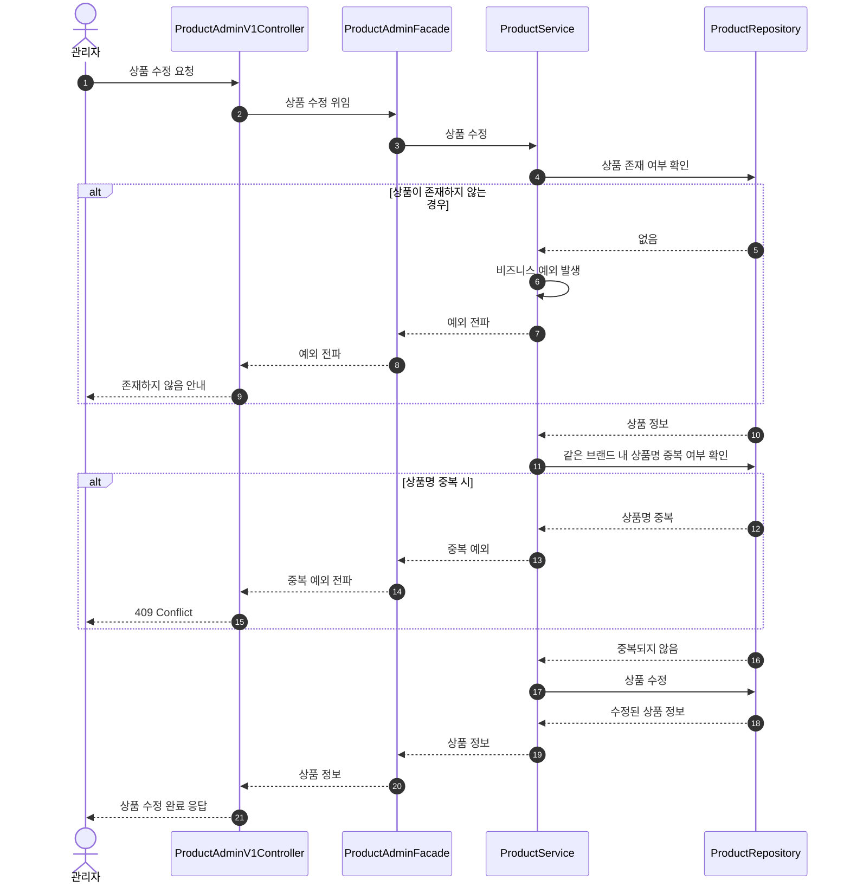
```mermaid
sequenceDiagram
    autonumber
    actor 관리자
    participant Controller as ProductAdminV1Controller
    participant Facade as ProductAdminFacade
    participant Service as ProductService
    participant Repository as ProductRepository

    관리자->>Controller: 상품 수정 요청
    Controller->>Facade: 상품 수정 위임
    Facade->>Service: 상품 수정
    Service->>Repository: 상품 존재 여부 확인

    alt 상품이 존재하지 않는 경우
        Repository-->>Service: 없음
        Service->>Service: 비즈니스 예외 발생
        Service-->>Facade: 예외 전파
        Facade-->>Controller: 예외 전파
        Controller-->>관리자: 존재하지 않음 안내
    end

    Repository-->>Service: 상품 정보
    Service->>Repository: 같은 브랜드 내 상품명 중복 여부 확인

    alt 상품명 중복 시
        Repository-->>Service: 상품명 중복
        Service-->>Facade: 중복 예외
        Facade-->>Controller: 중복 예외 전파
        Controller-->>관리자: 409 Conflict
    end

    Repository-->>Service: 중복되지 않음
    Service->>Repository: 상품 수정
    Repository-->>Service: 수정된 상품 정보
    Service-->>Facade: 상품 정보
    Facade-->>Controller: 상품 정보
    Controller-->>관리자: 상품 수정 완료 응답
```

#### 봐야 할 포인트

1. **이중 검증**: US-B05(브랜드 수정)와 동일한 패턴. 존재 확인 → 상품명 중복 확인 → 수정.
2. **자기 자신 제외**: 상품명 중복 확인 시 자기 자신은 제외해야 한다. Repository 쿼리에서 처리.
3. **BR-P02 브랜드 불변성**: 소속 브랜드 변경은 도메인 모델이 브랜드 변경 setter를 제공하지 않는 방식으로 보장한다. 시퀀스 다이어그램의 관심사(컴포넌트 간 흐름)가 아닌 모델 설계의 관심사이다.

---

### US-P07: 상품 삭제 (관리자)

#### 검증 목적

상품 삭제 시 해당 상품의 좋아요도 함께 정리해야 한다. 상품은 soft delete, 좋아요는 hard delete로 삭제 정책이 다르므로 Facade가 ProductService와 LikeService를 조율하는 cross-domain 처리이다.

#### 시퀀스 다이어그램

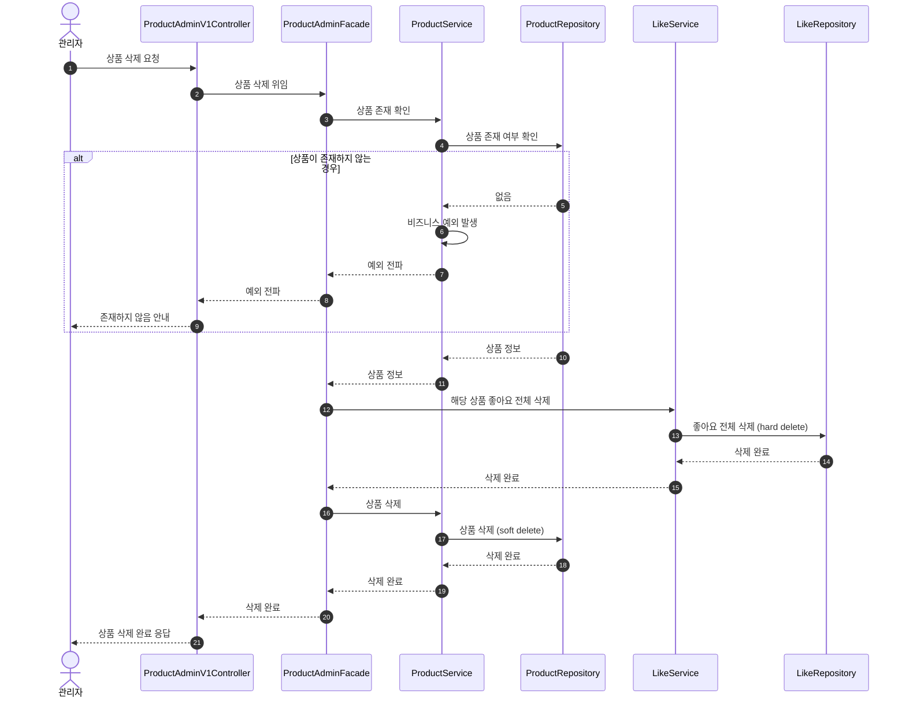
```mermaid
sequenceDiagram
    autonumber
    actor 관리자
    participant Controller as ProductAdminV1Controller
    participant Facade as ProductAdminFacade
    participant ProductService
    participant ProductRepository
    participant LikeService
    participant LikeRepository

    관리자->>Controller: 상품 삭제 요청
    Controller->>Facade: 상품 삭제 위임
    Facade->>ProductService: 상품 존재 확인
    ProductService->>ProductRepository: 상품 존재 여부 확인

    alt 상품이 존재하지 않는 경우
        ProductRepository-->>ProductService: 없음
        ProductService->>ProductService: 비즈니스 예외 발생
        ProductService-->>Facade: 예외 전파
        Facade-->>Controller: 예외 전파
        Controller-->>관리자: 존재하지 않음 안내
    end

    ProductRepository-->>ProductService: 상품 정보
    ProductService-->>Facade: 상품 정보
    Facade->>LikeService: 해당 상품 좋아요 전체 삭제
    LikeService->>LikeRepository: 좋아요 전체 삭제 (hard delete)
    LikeRepository-->>LikeService: 삭제 완료
    LikeService-->>Facade: 삭제 완료
    Facade->>ProductService: 상품 삭제
    ProductService->>ProductRepository: 상품 삭제 (soft delete)
    ProductRepository-->>ProductService: 삭제 완료
    ProductService-->>Facade: 삭제 완료
    Facade-->>Controller: 삭제 완료
    Controller-->>관리자: 상품 삭제 완료 응답
```

#### 봐야 할 포인트

1. **삭제 정책의 혼합**: 좋아요(hard delete) → 상품(soft delete) 순서로 처리한다. 종속 데이터를 먼저 정리해야 soft delete된 상품에 고아 데이터가 남는 불일치를 방지한다.
2. **US-B06과 동일한 패턴**: 브랜드 삭제 시 상품을 정리하듯, 상품 삭제 시 좋아요를 정리한다. Facade가 도메인 간 삭제 순서를 결정한다.

#### 상품 도메인 잠재 리스크

- **검증 위치의 기준**: 도메인 간 검증(브랜드 존재 확인)은 Facade가, 도메인 내부 규칙(상품명 중복, 브랜드 불변성)은 Service/Model이 처리한다.

---

## 2.3 좋아요 (Like)

> **삭제 정책**: 좋아요는 **hard delete**를 사용한다. 브랜드/상품과 달리 이력으로서 보존할 가치가 없으므로 물리적으로 삭제한다.

### US-L01: 상품 좋아요 등록

#### 검증 목적

좋아요 등록 시 세 가지를 처리한다: 상품 존재 확인(도메인 간), 중복 좋아요 확인(BR-L01), 그리고 상품의 좋아요 수 업데이트. Facade가 LikeService와 ProductService를 조율하는 흐름을 확인한다.

#### 시퀀스 다이어그램

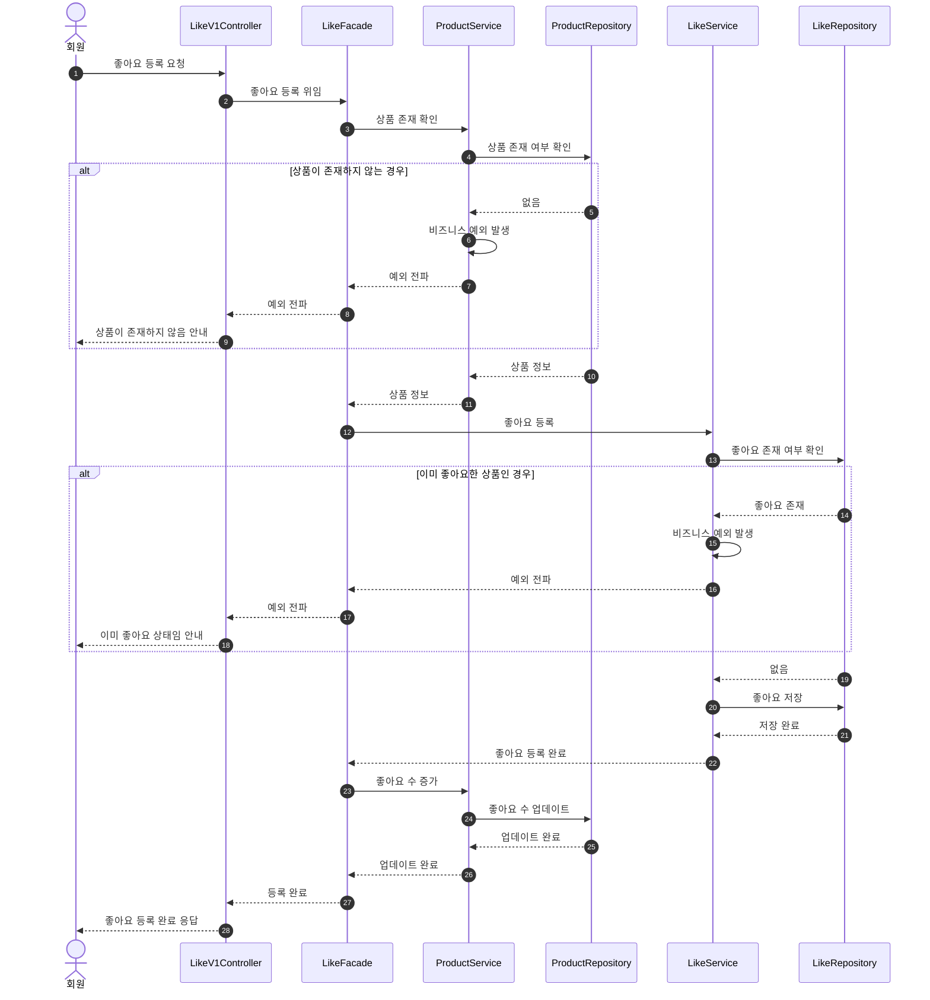
```mermaid
sequenceDiagram
    autonumber
    actor 회원
    participant Controller as LikeV1Controller
    participant Facade as LikeFacade
    participant ProductService
    participant ProductRepository
    participant LikeService
    participant LikeRepository

    회원->>Controller: 좋아요 등록 요청
    Controller->>Facade: 좋아요 등록 위임
    Facade->>ProductService: 상품 존재 확인
    ProductService->>ProductRepository: 상품 존재 여부 확인

    alt 상품이 존재하지 않는 경우
        ProductRepository-->>ProductService: 없음
        ProductService->>ProductService: 비즈니스 예외 발생
        ProductService-->>Facade: 예외 전파
        Facade-->>Controller: 예외 전파
        Controller-->>회원: 상품이 존재하지 않음 안내
    end

    ProductRepository-->>ProductService: 상품 정보
    ProductService-->>Facade: 상품 정보
    Facade->>LikeService: 좋아요 등록
    LikeService->>LikeRepository: 좋아요 존재 여부 확인

    alt 이미 좋아요한 상품인 경우
        LikeRepository-->>LikeService: 좋아요 존재
        LikeService->>LikeService: 비즈니스 예외 발생
        LikeService-->>Facade: 예외 전파
        Facade-->>Controller: 예외 전파
        Controller-->>회원: 이미 좋아요 상태임 안내
    end

    LikeRepository-->>LikeService: 없음
    LikeService->>LikeRepository: 좋아요 저장
    LikeRepository-->>LikeService: 저장 완료
    LikeService-->>Facade: 좋아요 등록 완료
    Facade->>ProductService: 좋아요 수 증가
    ProductService->>ProductRepository: 좋아요 수 업데이트
    ProductRepository-->>ProductService: 업데이트 완료
    ProductService-->>Facade: 업데이트 완료
    Facade-->>Controller: 등록 완료
    Controller-->>회원: 좋아요 등록 완료 응답
```

#### 봐야 할 포인트

1. **Facade의 3단계 조율**: 상품 존재 확인(ProductService) → 좋아요 등록(LikeService) → 좋아요 수 증가(ProductService). 세 단계를 하나의 트랜잭션으로 묶어야 한다.
2. **좋아요 수 업데이트 시점**: 좋아요 등록이 성공한 후에 수를 증가시킨다. 등록 실패(중복) 시에는 수를 변경하지 않는다.

---

### US-L02: 상품 좋아요 취소

#### 검증 목적

좋아요 취소 시 좋아요 레코드를 hard delete하고, 상품의 좋아요 수를 감소시키는 흐름을 확인한다. 좋아요 취소는 도메인 간 조율이 필요한 cross-domain 처리이다.

#### 시퀀스 다이어그램

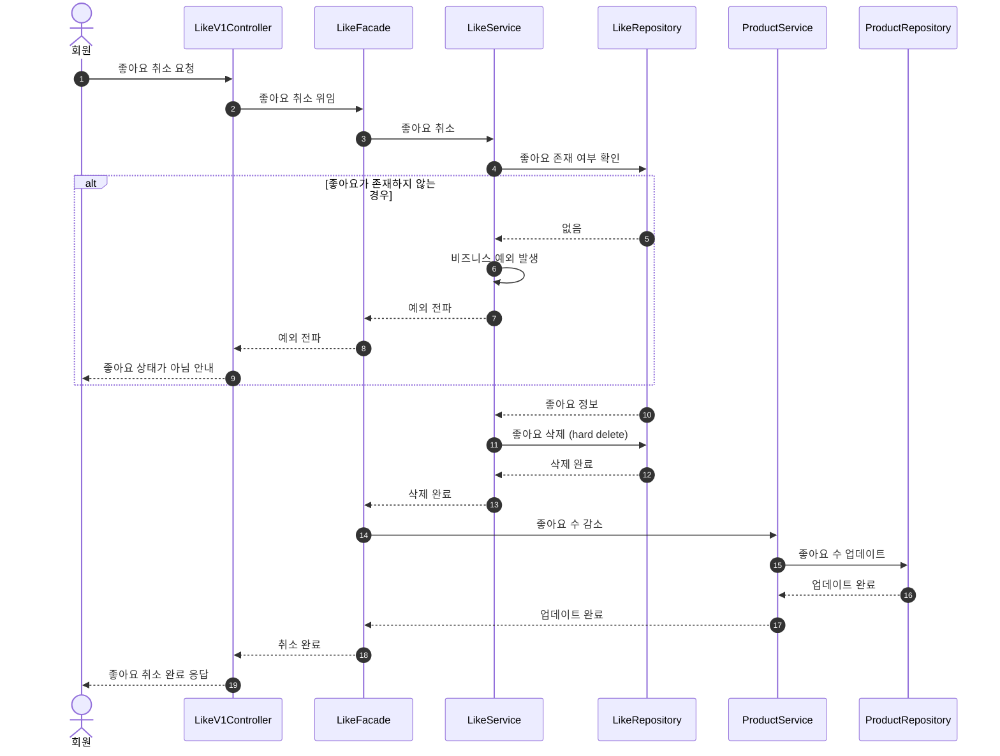
```mermaid
sequenceDiagram
    autonumber
    actor 회원
    participant Controller as LikeV1Controller
    participant Facade as LikeFacade
    participant LikeService
    participant LikeRepository
    participant ProductService
    participant ProductRepository

    회원->>Controller: 좋아요 취소 요청
    Controller->>Facade: 좋아요 취소 위임
    Facade->>LikeService: 좋아요 취소
    LikeService->>LikeRepository: 좋아요 존재 여부 확인

    alt 좋아요가 존재하지 않는 경우
        LikeRepository-->>LikeService: 없음
        LikeService->>LikeService: 비즈니스 예외 발생
        LikeService-->>Facade: 예외 전파
        Facade-->>Controller: 예외 전파
        Controller-->>회원: 좋아요 상태가 아님 안내
    end

    LikeRepository-->>LikeService: 좋아요 정보
    LikeService->>LikeRepository: 좋아요 삭제 (hard delete)
    LikeRepository-->>LikeService: 삭제 완료
    LikeService-->>Facade: 삭제 완료
    Facade->>ProductService: 좋아요 수 감소
    ProductService->>ProductRepository: 좋아요 수 업데이트
    ProductRepository-->>ProductService: 업데이트 완료
    ProductService-->>Facade: 업데이트 완료
    Facade-->>Controller: 취소 완료
    Controller-->>회원: 좋아요 취소 완료 응답
```

#### 봐야 할 포인트

1. **hard delete**: 좋아요 레코드는 물리적으로 삭제된다. soft delete와 달리 복원이 불가능하지만, 좋아요는 이력 보존이 불필요하다.
2. **좋아요 수 감소**: 삭제 성공 후 상품의 좋아요 수를 감소시킨다. US-L01의 역연산.

---

### US-L03: 좋아요한 상품 목록 조회

#### 검증 목적

회원이 자신의 좋아요 목록만 조회할 수 있는지(BR-L03) 확인한다. 목록 조회이므로 예외 분기가 없다.

#### 시퀀스 다이어그램

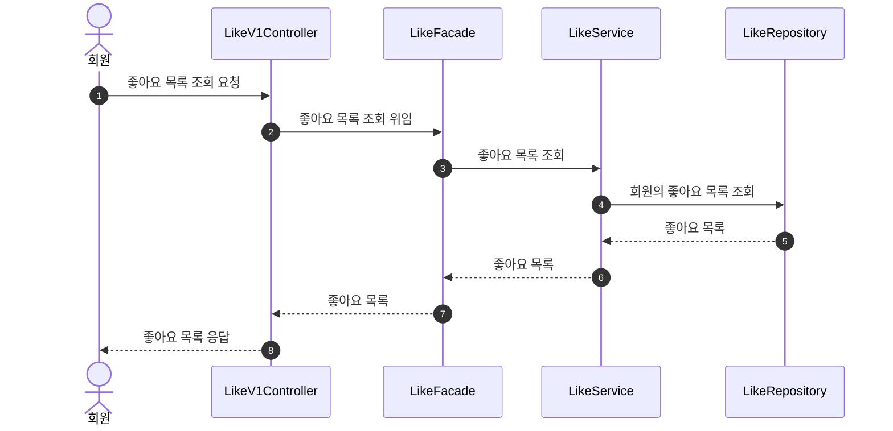
```mermaid
sequenceDiagram
    autonumber
    actor 회원
    participant Controller as LikeV1Controller
    participant Facade as LikeFacade
    participant Service as LikeService
    participant Repository as LikeRepository

    회원->>Controller: 좋아요 목록 조회 요청
    Controller->>Facade: 좋아요 목록 조회 위임
    Facade->>Service: 좋아요 목록 조회
    Service->>Repository: 회원의 좋아요 목록 조회
    Repository-->>Service: 좋아요 목록
    Service-->>Facade: 좋아요 목록
    Facade-->>Controller: 좋아요 목록
    Controller-->>회원: 좋아요 목록 응답
```

#### 봐야 할 포인트

1. **BR-L03 소유권 제한**: 인증된 회원 ID를 기준으로 자신의 좋아요만 조회한다. Controller에서 인증 정보를 추출하여 전달한다.

#### 좋아요 도메인 잠재 리스크

- **좋아요 수와 실제 레코드의 정합성**: 좋아요 수(Product 컬럼)와 실제 Like 레코드 수가 어긋날 수 있다. 트랜잭션 내에서 원자적으로 처리하되, 장기적으로는 배치로 보정하는 방어 전략도 고려할 수 있다.
- **좋아요 수 동시성**: 동일 상품에 여러 회원이 동시에 좋아요하면 좋아요 수 컬럼에 경합이 발생한다. 낙관적 잠금(@Version) 또는 원자적 증감(UPDATE SET count = count + 1)으로 방어가 필요하다.
- **동시 좋아요 요청**: 같은 회원이 동일 상품에 동시에 좋아요 요청을 보내면 중복이 발생할 수 있다. 유니크 제약 조건(DB 레벨)으로 방어하는 것이 안전하다.

---

## 2.4 주문 (Order)

### US-O01: 주문 생성

#### 검증 목적

가장 복잡한 흐름이다. BR-O01~O05, BR-O09~O13이 모두 적용된다. 비관적 락으로 재고 동시성을 제어하고, 재고 확인/차감 + 쿠폰 사용 + 주문 생성이 하나의 트랜잭션으로 원자적으로 처리되어야 함을 확인한다.

#### 시퀀스 다이어그램

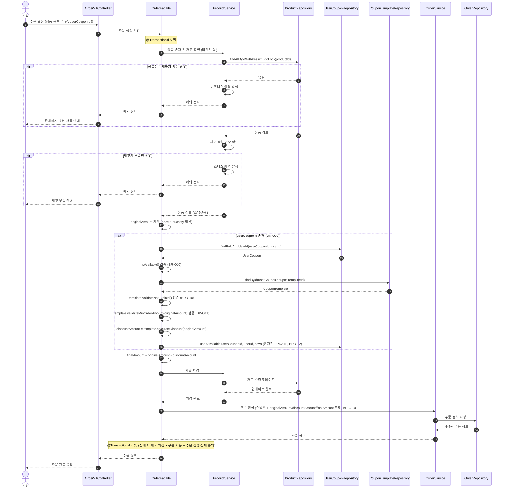
```mermaid
sequenceDiagram
    autonumber
    actor 회원
    participant Controller as OrderV1Controller
    participant Facade as OrderFacade
    participant ProductService
    participant ProductRepository
    participant UserCouponRepository
    participant CouponTemplateRepository
    participant OrderService
    participant OrderRepository

    회원->>Controller: 주문 요청 (상품 목록, 수량, userCouponId?)
    Controller->>Facade: 주문 생성 위임

    Note over Facade: @Transactional 시작

    Facade->>ProductService: 상품 존재 및 재고 확인 (비관적 락)
    ProductService->>ProductRepository: findAllByIdWithPessimisticLock(productIds)

    alt 상품이 존재하지 않는 경우
        ProductRepository-->>ProductService: 없음
        ProductService->>ProductService: 비즈니스 예외 발생
        ProductService-->>Facade: 예외 전파
        Facade-->>Controller: 예외 전파
        Controller-->>회원: 존재하지 않는 상품 안내
    end

    ProductRepository-->>ProductService: 상품 정보
    ProductService->>ProductService: 재고 충분 여부 확인

    alt 재고가 부족한 경우
        ProductService->>ProductService: 비즈니스 예외 발생
        ProductService-->>Facade: 예외 전파
        Facade-->>Controller: 예외 전파
        Controller-->>회원: 재고 부족 안내
    end

    ProductService-->>Facade: 상품 정보 (스냅샷용)
    Facade->>Facade: originalAmount 계산 (price × quantity 합산)

    alt userCouponId 존재 (BR-O09)
        Facade->>UserCouponRepository: findByIdAndUserId(userCouponId, userId)
        UserCouponRepository-->>Facade: UserCoupon
        Facade->>Facade: isAvailable() 검증 (BR-O10)
        Facade->>CouponTemplateRepository: findById(userCoupon.couponTemplateId)
        CouponTemplateRepository-->>Facade: CouponTemplate
        Facade->>Facade: template.validateNotExpired() 검증 (BR-O10)
        Facade->>Facade: template.validateMinOrderAmount(originalAmount) 검증 (BR-O11)
        Facade->>Facade: discountAmount = template.calculateDiscount(originalAmount)
        Facade->>UserCouponRepository: useIfAvailable(userCouponId, userId, now) (원자적 UPDATE, BR-O12)
    end

    Facade->>Facade: finalAmount = originalAmount - discountAmount
    Facade->>ProductService: 재고 차감
    ProductService->>ProductRepository: 재고 수량 업데이트
    ProductRepository-->>ProductService: 업데이트 완료
    ProductService-->>Facade: 차감 완료
    Facade->>OrderService: 주문 생성 (스냅샷 + originalAmount/discountAmount/finalAmount 포함, BR-O13)
    OrderService->>OrderRepository: 주문 정보 저장
    OrderRepository-->>OrderService: 저장된 주문 정보
    OrderService-->>Facade: 주문 정보

    Note over Facade: @Transactional 커밋 (실패 시 재고 차감 + 쿠폰 사용 + 주문 생성 전체 롤백)

    Facade-->>Controller: 주문 정보
    Controller-->>회원: 주문 완료 응답
```

#### 봐야 할 포인트

1. **비관적 락 배치**: 상품 조회 시 `SELECT FOR UPDATE`로 동시 주문에 의한 재고 초과 차감을 방지한다. 락이 필요한 작업을 트랜잭션 앞부분에 배치하여 락 보유 시간 내에 모든 작업을 완료한다.
2. **쿠폰 적용 선택성**: `alt userCouponId 존재` 블록으로 표현. 쿠폰 미적용 시 `discountAmount = 0`, `finalAmount = originalAmount`로 처리된다.
3. **원자적 트랜잭션 경계**: 재고 차감 + 쿠폰 사용 + 주문 생성이 하나의 트랜잭션. 어느 단계에서 실패해도 전체가 롤백된다.
4. **스냅샷 생성 시점**: ProductService에서 받은 상품 정보를 OrderService에 전달하여 스냅샷으로 보존한다 (BR-O05). 주문 금액 3종도 Order에 스냅샷으로 저장된다 (BR-O13).

---

### US-O02: 주문 목록 조회 (회원)

#### 검증 목적

BR-O06(자신의 주문만 조회)과 BR-O08(기간 필터)이 적용되는 흐름을 확인한다.

#### 시퀀스 다이어그램

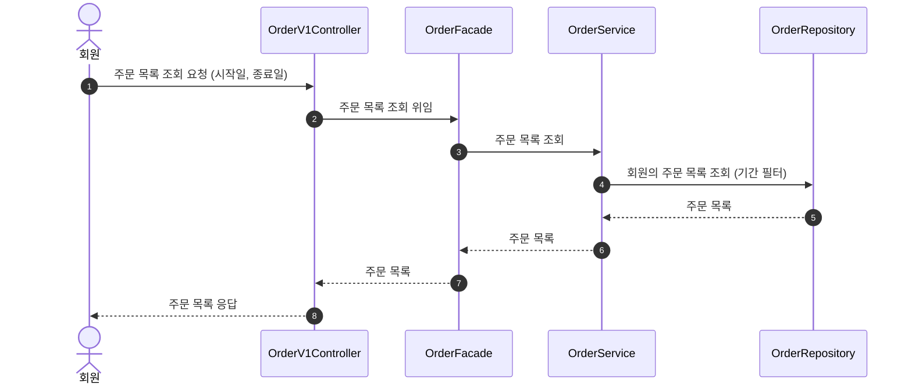
```mermaid
sequenceDiagram
    autonumber
    actor 회원
    participant Controller as OrderV1Controller
    participant Facade as OrderFacade
    participant Service as OrderService
    participant Repository as OrderRepository

    회원->>Controller: 주문 목록 조회 요청 (시작일, 종료일)
    Controller->>Facade: 주문 목록 조회 위임
    Facade->>Service: 주문 목록 조회
    Service->>Repository: 회원의 주문 목록 조회 (기간 필터)
    Repository-->>Service: 주문 목록
    Service-->>Facade: 주문 목록
    Facade-->>Controller: 주문 목록
    Controller-->>회원: 주문 목록 응답
```

#### 봐야 할 포인트

1. **BR-O06 + BR-O08**: 인증된 회원 ID와 기간 조건을 조합하여 조회한다. 기간이 지정되지 않은 경우의 기본값 정책도 결정이 필요하다.

---

### US-O03: 주문 상세 조회 (회원)

#### 검증 목적

회원이 자신의 주문만 조회할 수 있는지(BR-O06), 타인의 주문 접근 시 거부되는지 확인한다.

#### 시퀀스 다이어그램

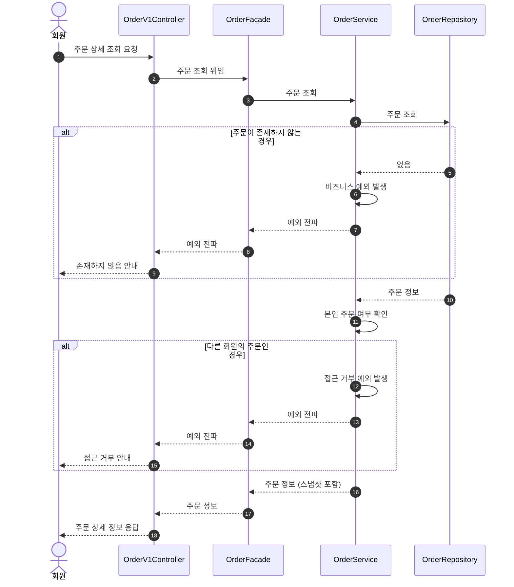
```mermaid
sequenceDiagram
    autonumber
    actor 회원
    participant Controller as OrderV1Controller
    participant Facade as OrderFacade
    participant Service as OrderService
    participant Repository as OrderRepository

    회원->>Controller: 주문 상세 조회 요청
    Controller->>Facade: 주문 조회 위임
    Facade->>Service: 주문 조회
    Service->>Repository: 주문 조회

    alt 주문이 존재하지 않는 경우
        Repository-->>Service: 없음
        Service->>Service: 비즈니스 예외 발생
        Service-->>Facade: 예외 전파
        Facade-->>Controller: 예외 전파
        Controller-->>회원: 존재하지 않음 안내
    end

    Repository-->>Service: 주문 정보
    Service->>Service: 본인 주문 여부 확인

    alt 다른 회원의 주문인 경우
        Service->>Service: 접근 거부 예외 발생
        Service-->>Facade: 예외 전파
        Facade-->>Controller: 예외 전파
        Controller-->>회원: 접근 거부 안내
    end

    Service-->>Facade: 주문 정보 (스냅샷 포함)
    Facade-->>Controller: 주문 정보
    Controller-->>회원: 주문 상세 정보 응답
```

#### 봐야 할 포인트

1. **이중 검증**: 존재 확인 → 소유권 확인의 2단계 early-return. "존재하지 않음"(NOT_FOUND)과 "접근 거부"(FORBIDDEN)는 다른 예외 타입이다.
2. **스냅샷 정보 포함**: 주문 상세에는 주문 당시의 상품/브랜드 정보(스냅샷)가 포함된다.

---

### US-O04: 주문 목록 조회 (관리자)

#### 검증 목적

관리자가 전체 주문을 페이지 단위로 조회하는 흐름(BR-O07)을 확인한다.

#### 시퀀스 다이어그램

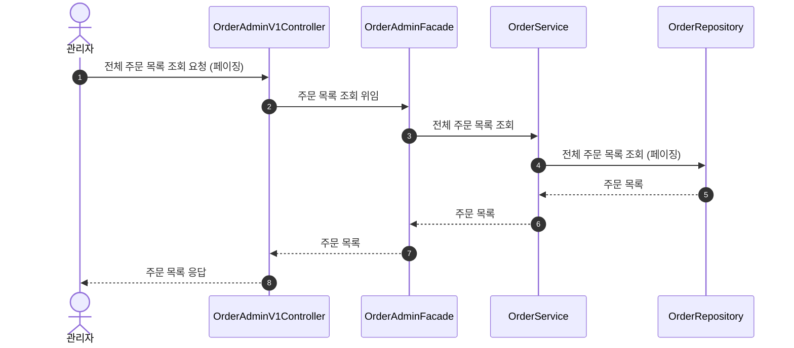
```mermaid
sequenceDiagram
    autonumber
    actor 관리자
    participant Controller as OrderAdminV1Controller
    participant Facade as OrderAdminFacade
    participant Service as OrderService
    participant Repository as OrderRepository

    관리자->>Controller: 전체 주문 목록 조회 요청 (페이징)
    Controller->>Facade: 주문 목록 조회 위임
    Facade->>Service: 전체 주문 목록 조회
    Service->>Repository: 전체 주문 목록 조회 (페이징)
    Repository-->>Service: 주문 목록
    Service-->>Facade: 주문 목록
    Facade-->>Controller: 주문 목록
    Controller-->>관리자: 주문 목록 응답
```

#### 봐야 할 포인트

1. **소유권 제한 없음**: 관리자는 BR-O07에 따라 전체 주문을 조회할 수 있다. 회원 조회(US-O02)와 달리 소유권 필터가 없다.

---

### US-O05: 주문 상세 조회 (관리자)

#### 검증 목적

관리자의 단건 주문 조회를 확인한다. 회원 조회(US-O03)와 달리 소유권 확인이 불필요하다.

#### 시퀀스 다이어그램

```mermaid
sequenceDiagram
    autonumber
    actor 관리자
    participant Controller as OrderAdminV1Controller
    participant Facade as OrderAdminFacade
    participant Service as OrderService
    participant Repository as OrderRepository

    관리자->>Controller: 주문 상세 조회 요청
    Controller->>Facade: 주문 조회 위임
    Facade->>Service: 주문 조회
    Service->>Repository: 주문 조회

    alt 주문이 존재하지 않는 경우
        Repository-->>Service: 없음
        Service->>Service: 비즈니스 예외 발생
        Service-->>Facade: 예외 전파
        Facade-->>Controller: 예외 전파
        Controller-->>관리자: 존재하지 않음 안내
    end

    Repository-->>Service: 주문 정보
    Service-->>Facade: 주문 정보 (스냅샷 포함)
    Facade-->>Controller: 주문 정보
    Controller-->>관리자: 주문 상세 정보 응답
```

#### 봐야 할 포인트

1. **US-O03과의 차이**: 소유권 검증이 없다. 관리자는 모든 주문에 접근 가능하다. US-O03의 이중 검증과 달리 존재 확인만 수행한다.

#### 주문 도메인 잠재 리스크

- **재고 차감의 원자성**: US-O01에서 재고 확인 → 주문 생성 → 재고 차감이 하나의 트랜잭션이어야 한다. 비관적 락(`SELECT FOR UPDATE`)으로 동시 주문에 의한 재고 초과 차감을 방지한다.
- **트랜잭션 범위의 비대화**: 주문 생성 트랜잭션이 ProductService(재고 확인/차감), 쿠폰 서비스(유효성 검증/사용), OrderService(주문 생성)를 모두 포함하므로 범위가 넓다. 락 보유 시간을 줄이기 위해 락이 필요한 작업(상품 조회)을 앞부분에 배치한다.
- **스냅샷 데이터의 정합성**: 스냅샷은 주문 시점의 데이터 사본이다. ProductService에서 상품 정보를 조회한 시점과 실제 저장 시점 사이에 상품 정보가 변경될 가능성은 트랜잭션으로 방어한다.

---

## 2.5 쿠폰 (Coupon)

> **삭제 정책**: 쿠폰 템플릿과 발급 쿠폰(UserCoupon) 모두 **soft delete**를 사용한다. 발급 이력 보존 및 주문(`orders.user_coupon_id`) 참조 무결성 유지를 위해 물리적 삭제를 하지 않는다.
> **동시성**: 재고 차감에는 **비관적 락**을 적용한다.

### US-C01: 쿠폰 발급 요청 (고객)

#### 검증 목적

중복 발급 방지(BR-C03) 흐름과 만료 상태 계산 방식(정규화, expiredAt 미저장)을 확인한다.

#### 시퀀스 다이어그램

```mermaid
sequenceDiagram
    autonumber
    actor 회원
    participant Controller as CouponV1Controller
    participant Facade as CouponFacade
    participant UserCouponRepository
    participant CouponTemplateRepository

    회원->>Controller: 쿠폰 발급 요청 (couponId)
    Controller->>Facade: 쿠폰 발급 위임

    Note over Facade: @Transactional 시작

    Facade->>UserCouponRepository: existsByUserIdAndCouponTemplateId(userId, couponId)

    alt 이미 발급받은 쿠폰인 경우 (BR-C03)
        UserCouponRepository-->>Facade: 중복 발급
        Facade->>Facade: 비즈니스 예외 발생
        Facade-->>Controller: 예외 전파
        Controller-->>회원: 409 Conflict (중복 발급)
    end

    UserCouponRepository-->>Facade: 발급 이력 없음
    Facade->>CouponTemplateRepository: findById(couponId)

    alt 쿠폰 템플릿이 존재하지 않는 경우
        CouponTemplateRepository-->>Facade: 없음
        Facade->>Facade: 비즈니스 예외 발생
        Facade-->>Controller: 예외 전파
        Controller-->>회원: 404 Not Found
    end

    CouponTemplateRepository-->>Facade: CouponTemplate
    Facade->>UserCouponRepository: save(new UserCoupon)
    UserCouponRepository-->>Facade: 발급된 UserCoupon

    Facade-->>Controller: UserCouponInfo (expiredAt은 template.expiredAt에서 계산)
    Controller-->>회원: 쿠폰 발급 완료 응답
```

#### 봐야 할 포인트

1. **중복 발급 선행 검증**: 템플릿 조회 이전에 중복 여부를 먼저 확인하여 조기에 거부할 수 있다.
2. **expiredAt 미저장(정규화)**: UserCoupon에 `expiredAt`을 저장하지 않는다. 만료일은 CouponTemplate에서 항상 읽어온다. 스냅샷이 불필요한 경우 정규화로 데이터 중복을 제거할 수 있다.

---

### US-C02: 내 쿠폰 목록 조회 (고객)

#### 검증 목적

DB에 저장되지 않은 `EXPIRED` 상태가 Application Layer에서 어떻게 계산되어 응답에 포함되는지 확인한다 (BR-C04).

#### 시퀀스 다이어그램

```mermaid
sequenceDiagram
    autonumber
    actor 회원
    participant Controller as CouponV1Controller
    participant Facade as CouponFacade
    participant UserCouponRepository
    participant CouponTemplateRepository

    회원->>Controller: 내 쿠폰 목록 조회 요청
    Controller->>Facade: 쿠폰 목록 조회 위임
    Facade->>UserCouponRepository: findAllByUserId(userId)
    UserCouponRepository-->>Facade: List~UserCoupon~
    Facade->>CouponTemplateRepository: findAllByIds(templateIds) (N+1 방지 배치 조회)
    CouponTemplateRepository-->>Facade: Map~Long, CouponTemplate~
    Facade->>Facade: stream().map(uc → UserCouponInfo.from(uc, template.expiredAt, now))<br/>usedAt != null → USED, expiredAt < now → EXPIRED, 그 외 → AVAILABLE
    Facade-->>Controller: List~UserCouponInfo~ (AVAILABLE / USED / EXPIRED 포함)
    Controller-->>회원: 내 쿠폰 목록 응답
```

#### 봐야 할 포인트

1. **EXPIRED는 DB에 저장되지 않는다**: DB에는 `AVAILABLE` / `USED`만 존재한다. Facade에서 `expiredAt < LocalDateTime.now()` 조건으로 `EXPIRED`를 계산하여 응답 DTO에서만 반영한다.
2. **UserCouponInfo.from()의 역할**: 상태 계산 책임이 여기에 집중된다. UserCoupon, template.expiredAt, 조회 시각을 함께 받아 최종 상태를 결정한다.
3. **N+1 방지**: UserCoupon 목록의 templateId를 Set으로 수집 → `findAllByIds()`로 배치 조회 → Map으로 변환하여 UserCoupon마다 개별 조회를 방지한다.

---

### US-C03: 쿠폰 템플릿 목록 조회 (관리자)

#### 검증 목적

페이징 기반 목록 조회의 기본 흐름을 확인한다.

#### 시퀀스 다이어그램

```mermaid
sequenceDiagram
    autonumber
    actor 관리자
    participant Controller as CouponAdminV1Controller
    participant Facade as CouponAdminFacade
    participant Repository as CouponTemplateRepository

    관리자->>Controller: 쿠폰 템플릿 목록 조회 요청 (page, size)
    Controller->>Facade: 쿠폰 템플릿 목록 조회 위임
    Facade->>Repository: 쿠폰 템플릿 목록 조회 (페이징)
    Repository-->>Facade: Page~CouponTemplate~
    Facade-->>Controller: 쿠폰 템플릿 목록
    Controller-->>관리자: 쿠폰 템플릿 목록 응답
```

#### 봐야 할 포인트

1. **예외 분기 없음**: 결과가 비어있어도 빈 목록으로 정상 응답한다.

---

### US-C04: 쿠폰 템플릿 상세 조회 (관리자)

#### 검증 목적

단건 조회의 존재/부재 분기를 확인한다.

#### 시퀀스 다이어그램

```mermaid
sequenceDiagram
    autonumber
    actor 관리자
    participant Controller as CouponAdminV1Controller
    participant Facade as CouponAdminFacade
    participant Repository as CouponTemplateRepository

    관리자->>Controller: 쿠폰 템플릿 상세 조회 요청
    Controller->>Facade: 쿠폰 템플릿 조회 위임
    Facade->>Repository: 쿠폰 템플릿 존재 여부 확인

    alt 쿠폰 템플릿이 존재하는 경우
        Repository-->>Facade: 쿠폰 템플릿 정보
        Facade-->>Controller: 쿠폰 템플릿 정보
        Controller-->>관리자: 쿠폰 템플릿 상세 응답
    else 쿠폰 템플릿이 존재하지 않는 경우
        Repository-->>Facade: 없음
        Facade->>Facade: 비즈니스 예외 발생
        Facade-->>Controller: 예외 전파
        Controller-->>관리자: 404 Not Found
    end
```

#### 봐야 할 포인트

1. **기존 단건 조회 패턴과 동일**: US-B01(브랜드 조회)과 동일한 흐름이다.

---

### US-C05: 쿠폰 템플릿 등록 (관리자)

#### 검증 목적

관리자가 쿠폰 템플릿을 등록하는 흐름을 확인한다.

#### 시퀀스 다이어그램

```mermaid
sequenceDiagram
    autonumber
    actor 관리자
    participant Controller as CouponAdminV1Controller
    participant Facade as CouponAdminFacade
    participant Repository as CouponTemplateRepository

    관리자->>Controller: 쿠폰 템플릿 등록 요청 (name, type, value, minOrderAmount?, expiredAt)
    Controller->>Facade: 쿠폰 템플릿 등록 위임
    Facade->>Repository: 쿠폰 템플릿 저장
    Repository-->>Facade: 저장된 쿠폰 템플릿
    Facade-->>Controller: 쿠폰 템플릿 정보
    Controller-->>관리자: 쿠폰 템플릿 등록 완료 응답
```

#### 봐야 할 포인트

1. **도메인 내 이름 유일성 제약 없음**: 동일한 이름의 쿠폰 템플릿을 여러 개 등록할 수 있다. 각 템플릿은 독립적인 발급 수량과 만료일을 가진다.

---

### US-C06: 쿠폰 템플릿 수정 (관리자)

#### 검증 목적

존재 확인 → 수정의 흐름과, 스냅샷 패턴으로 인해 기발급 쿠폰에 영향이 없음을 확인한다.

#### 시퀀스 다이어그램

```mermaid
sequenceDiagram
    autonumber
    actor 관리자
    participant Controller as CouponAdminV1Controller
    participant Facade as CouponAdminFacade
    participant Repository as CouponTemplateRepository

    관리자->>Controller: 쿠폰 템플릿 수정 요청
    Controller->>Facade: 쿠폰 템플릿 수정 위임
    Facade->>Repository: 쿠폰 템플릿 존재 여부 확인

    alt 쿠폰 템플릿이 존재하지 않는 경우
        Repository-->>Facade: 없음
        Facade->>Facade: 비즈니스 예외 발생
        Facade-->>Controller: 예외 전파
        Controller-->>관리자: 404 Not Found
    end

    Repository-->>Facade: 쿠폰 템플릿 정보
    Facade->>Facade: 템플릿 수정 (dirty checking)
    Facade-->>Controller: 수정된 쿠폰 템플릿 정보
    Controller-->>관리자: 쿠폰 템플릿 수정 완료 응답
```

#### 봐야 할 포인트

1. **정규화 설계의 장점**: UserCoupon에 `expiredAt`을 저장하지 않으므로 템플릿 만료일 수정 시 별도 동기화 불필요. 만료일은 항상 CouponTemplate에서 단일 출처로 관리된다.

---

### US-C07: 쿠폰 템플릿 삭제 (관리자)

#### 검증 목적

BR-C05(연쇄 삭제)의 책임이 어느 계층에 있는지 확인한다. UserCoupon 전체 삭제 → CouponTemplate 삭제의 2단계 연쇄를 확인한다.

#### 시퀀스 다이어그램

```mermaid
sequenceDiagram
    autonumber
    actor 관리자
    participant Controller as CouponAdminV1Controller
    participant Facade as CouponAdminFacade
    participant CouponTemplateRepository
    participant UserCouponRepository

    관리자->>Controller: 쿠폰 템플릿 삭제 요청
    Controller->>Facade: 쿠폰 템플릿 삭제 위임
    Facade->>CouponTemplateRepository: 쿠폰 템플릿 존재 여부 확인

    alt 쿠폰 템플릿이 존재하지 않는 경우
        CouponTemplateRepository-->>Facade: 없음
        Facade->>Facade: 비즈니스 예외 발생
        Facade-->>Controller: 예외 전파
        Controller-->>관리자: 404 Not Found
    end

    CouponTemplateRepository-->>Facade: 쿠폰 템플릿 정보
    Facade->>UserCouponRepository: 해당 템플릿의 발급 쿠폰 전체 soft delete (BR-C05)
    UserCouponRepository-->>Facade: 삭제 완료
    Facade->>CouponTemplateRepository: 쿠폰 템플릿 삭제 (soft delete)
    CouponTemplateRepository-->>Facade: 삭제 완료
    Facade-->>Controller: 삭제 완료
    Controller-->>관리자: 쿠폰 템플릿 삭제 완료 응답
```

#### 봐야 할 포인트

1. **삭제 순서**: UserCoupon(soft delete) → CouponTemplate(soft delete). 두 엔티티 모두 soft delete로 이력을 보존한다. 종속 데이터를 먼저 처리하는 패턴은 US-P07(상품 삭제)과 동일하다.
2. **UserCoupon도 soft delete**: 발급 이력은 물리 삭제 없이 보존된다. `orders.user_coupon_id` FK 참조 무결성 유지 및 회계/감사 이력 보존이 목적이다. (Like의 hard delete와는 달리 주문 참조 대상이므로 soft delete가 필수적이다.)

---

### US-C08: 특정 쿠폰의 발급 내역 조회 (관리자)

#### 검증 목적

특정 템플릿에 속한 발급 내역을 페이징으로 조회하는 흐름과, 템플릿 존재 선행 확인을 확인한다.

#### 시퀀스 다이어그램

```mermaid
sequenceDiagram
    autonumber
    actor 관리자
    participant Controller as CouponAdminV1Controller
    participant Facade as CouponAdminFacade
    participant CouponTemplateRepository
    participant UserCouponRepository

    관리자->>Controller: 발급 내역 조회 요청 (couponId, page, size)
    Controller->>Facade: 발급 내역 조회 위임
    Facade->>CouponTemplateRepository: 쿠폰 템플릿 존재 여부 확인

    alt 쿠폰 템플릿이 존재하지 않는 경우
        CouponTemplateRepository-->>Facade: 없음
        Facade->>Facade: 비즈니스 예외 발생
        Facade-->>Controller: 예외 전파
        Controller-->>관리자: 404 Not Found
    end

    CouponTemplateRepository-->>Facade: 쿠폰 템플릿 정보 (expiredAt 포함)
    Facade->>UserCouponRepository: 발급 내역 조회 (couponTemplateId, 페이징)
    UserCouponRepository-->>Facade: Page~UserCoupon~
    Facade->>Facade: page.map(uc → UserCouponInfo.from(uc, template.expiredAt, now))
    Facade-->>Controller: 발급 내역 목록
    Controller-->>관리자: 발급 내역 응답
```

#### 봐야 할 포인트

1. **템플릿 존재 선행 확인**: 발급 내역 조회 전에 템플릿 존재 여부를 먼저 확인한다. 존재하지 않는 템플릿 ID로 조회 시 빈 목록이 아닌 404를 반환한다.

#### 쿠폰 도메인 잠재 리스크

- **EXPIRED 이중 검증**: DB에는 `AVAILABLE`이지만 실제로는 만료된 쿠폰이 존재할 수 있다. 주문 시 `CouponService.applyCoupon()`에서 `template.validateNotExpired(now)`가 반드시 수행되어야 한다.
