# Sequence Diagrams

LAST UPDATED: 2026-02-15

## 목차
- [개요](#개요)
  - [참여 컴포넌트 정의](#참여-컴포넌트-정의)
  - [의존성 방향](#의존성-방향)
- [Authentication (대고객 인증)](#authentication-대고객-인증)
- [Authentication (어드민 인증)](#authentication-어드민-인증)
- [Brand (브랜드)](#brand-브랜드)
  - [[어드민] 브랜드 등록](#어드민-브랜드-등록)
  - [[어드민] 브랜드 목록 조회](#어드민-브랜드-목록-조회)
  - [[어드민] 브랜드 상세 조회](#어드민-브랜드-상세-조회)
  - [[어드민] 브랜드 정보 수정](#어드민-브랜드-정보-수정)
  - [[어드민] 브랜드 삭제](#어드민-브랜드-삭제)
  - [[대고객] 브랜드 상세 조회](#대고객-브랜드-상세-조회)
- [Product (상품)](#product-상품)
  - [[어드민] 상품 등록](#어드민-상품-등록)
  - [[어드민] 상품 목록 조회](#어드민-상품-목록-조회)
  - [[어드민] 상품 상세 조회](#어드민-상품-상세-조회)
  - [[어드민] 상품 정보 수정](#어드민-상품-정보-수정)
  - [[어드민] 상품 삭제](#어드민-상품-삭제)
  - [[대고객] 상품 목록 조회](#대고객-상품-목록-조회)
  - [[대고객] 상품 상세 조회](#대고객-상품-상세-조회)
- [Like (좋아요)](#like-좋아요)
  - [[대고객] 상품 좋아요 등록](#대고객-상품-좋아요-등록)
  - [[대고객] 상품 좋아요 취소](#대고객-상품-좋아요-취소)
  - [[대고객] 내가 좋아요한 상품 목록 조회](#대고객-내가-좋아요한-상품-목록-조회)
- [Order (주문)](#order-주문)
  - [[어드민] 주문 목록 조회](#어드민-주문-목록-조회)
  - [[어드민] 주문 상세 조회](#어드민-주문-상세-조회)
  - [[대고객] 주문 요청](#대고객-주문-요청)
  - [[대고객] 주문 목록 조회](#대고객-주문-목록-조회)
  - [[대고객] 주문 상세 조회](#대고객-주문-상세-조회)

## 개요

이 문서는 감성 이커머스 플랫폼의 주요 API 흐름을 시퀀스 다이어그램으로 정의한다.
[01-requirements.md](./01-requirements.md)의 요구사항을 기반으로, 각 기능의 클라이언트-서버 간 상호작용을 Mermaid 시퀀스 다이어그램으로 표현한다.

- 대상 도메인: 인증, 브랜드, 상품, 좋아요, 주문

### 다이어그램 작성 원칙

- **핵심 컴포넌트만 표현**: 각 API 흐름의 주요 참여자(Api, Service, Repository)만 다이어그램에 포함한다.
- **연관 도메인은 Repository 레벨로 표현**: 여러 도메인 조율 시 주 Service가 타 도메인의 Repository를 직접 사용한다. (예: 브랜드 삭제 시 `BrandService`가 `ProductRepository`, `LikeRepository`를 직접 호출)
- **인증 흐름 분리**: 인증(Interceptor → UserService) 흐름은 별도 섹션에서 정의하며, 각 API 다이어그램에서는 생략한다.
- **Actor 구분**: 어드민 API는 `Admin`, 대고객 API는 `Client` actor로 구분한다.
- **예외 흐름 포함**: 정상 흐름(happy path)과 주요 예외 흐름(break)을 함께 표현한다. 예외 발생 시 나머지 흐름을 건너뛰는 경우 `break`를, 여러 대안 중 하나를 선택하는 경우 `alt`를 사용한다.
- **액티베이션바**: 동기 호출 시 대상 참여자의 활성 상태를 `activate`/`deactivate`(또는 `+`/`-` 접미사)로 표현한다. 자기 호출 및 반환 없는 호출에는 적용하지 않는다.

### 참여 컴포넌트 정의

| 컴포넌트             | 역할                                   |
|------------------|--------------------------------------|
| Api (Controller) | 클라이언트 요청 수신, 응답 반환                   |
| Service          | 비즈니스 로직 수행 (여러 도메인 조율 포함)            |
| Repository       | 데이터 영속화                              |

### 의존성 방향

```
Api → Service → Repository
```

- 의존성은 항상 상위 → 하위 방향이며, 역방향 의존은 허용하지 않는다.
- 여러 도메인을 조율할 때 주 Service가 타 도메인의 Repository를 직접 사용한다 (Service 간 의존 없음).

## Authentication (대고객 인증)

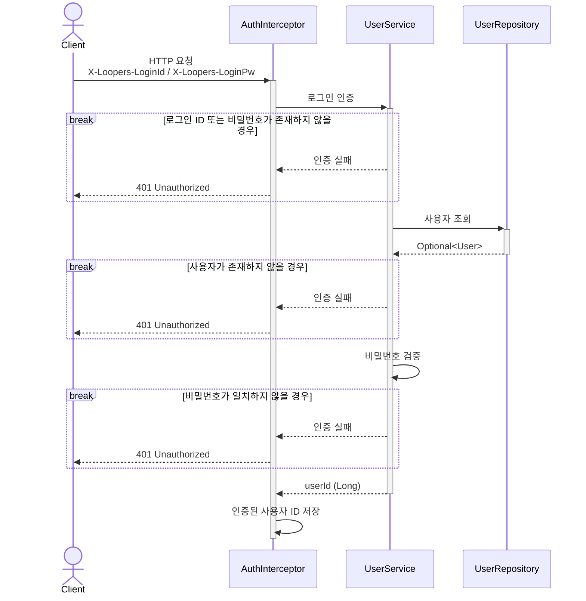
```mermaid
sequenceDiagram
    actor Client
    participant AuthInterceptor
    participant UserService
    participant UserRepository

    Client ->>+ AuthInterceptor: HTTP 요청<br/>X-Loopers-LoginId / X-Loopers-LoginPw

    AuthInterceptor ->>+ UserService: 로그인 인증

    break 로그인 ID 또는 비밀번호가 존재하지 않을 경우
        UserService -->> AuthInterceptor: 인증 실패
        AuthInterceptor -->> Client: 401 Unauthorized
    end

    UserService ->>+ UserRepository: 사용자 조회
    UserRepository -->>- UserService: Optional<User>

    break 사용자가 존재하지 않을 경우
        UserService -->> AuthInterceptor: 인증 실패
        AuthInterceptor -->> Client: 401 Unauthorized
    end

    UserService ->> UserService: 비밀번호 검증

    break 비밀번호가 일치하지 않을 경우
        UserService -->> AuthInterceptor: 인증 실패
        AuthInterceptor -->> Client: 401 Unauthorized
    end

    UserService -->>- AuthInterceptor: userId (Long)
    AuthInterceptor ->> AuthInterceptor: 인증된 사용자 ID 저장
    deactivate AuthInterceptor
```

## Authentication (어드민 인증)

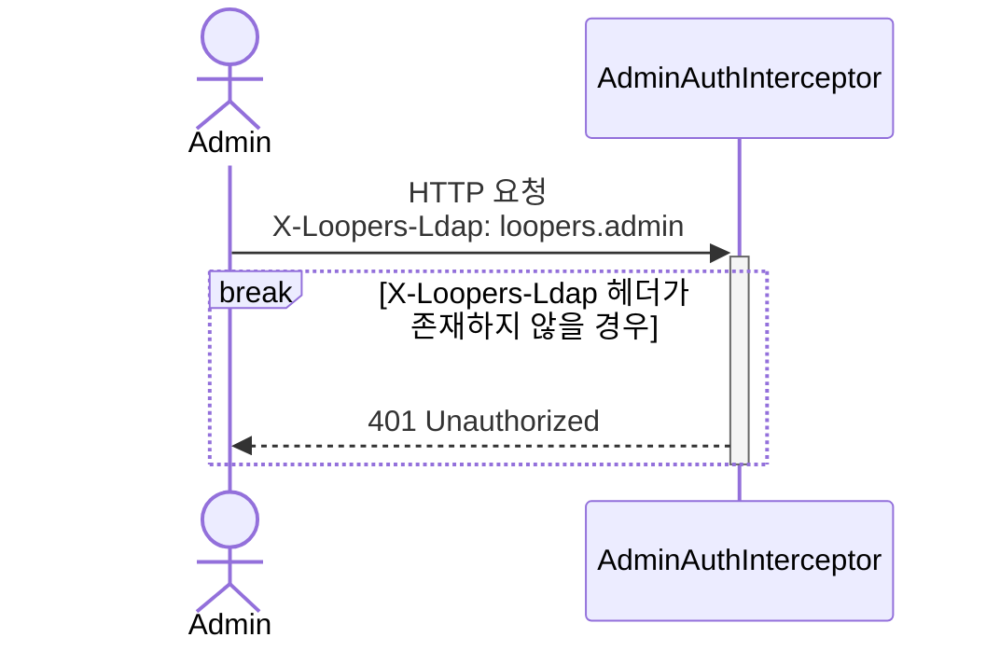
```mermaid
sequenceDiagram
    actor Admin
    participant AdminAuthInterceptor

    Admin ->>+ AdminAuthInterceptor: HTTP 요청<br/>X-Loopers-Ldap: loopers.admin

    break X-Loopers-Ldap 헤더가 존재하지 않을 경우
        AdminAuthInterceptor -->> Admin: 401 Unauthorized
    end

    deactivate AdminAuthInterceptor
```

## Brand (브랜드)

### [어드민] 브랜드 등록

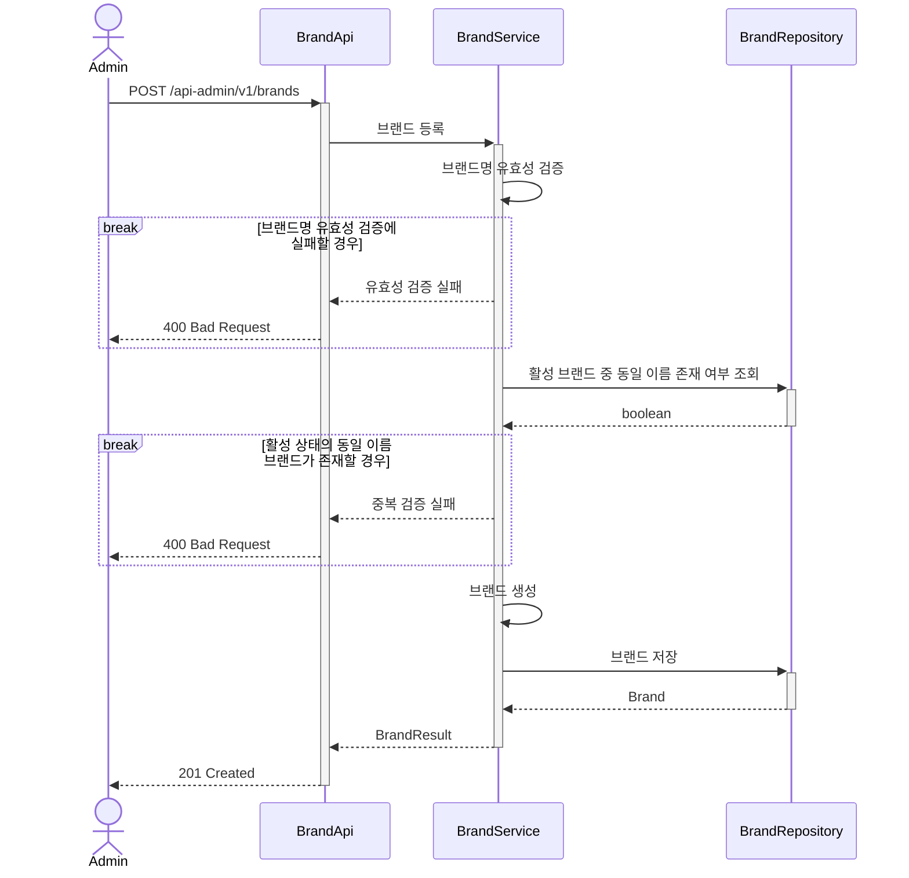
```mermaid
sequenceDiagram
    actor Admin
    participant BrandApi
    participant BrandService
    participant BrandRepository

    Admin ->>+ BrandApi: POST /api-admin/v1/brands
    BrandApi ->>+ BrandService: 브랜드 등록
    BrandService ->> BrandService: 브랜드명 유효성 검증

    break 브랜드명 유효성 검증에 실패할 경우
        BrandService -->> BrandApi: 유효성 검증 실패
        BrandApi -->> Admin: 400 Bad Request
    end

    BrandService ->>+ BrandRepository: 활성 브랜드 중 동일 이름 존재 여부 조회
    BrandRepository -->>- BrandService: boolean

    break 활성 상태의 동일 이름 브랜드가 존재할 경우
        BrandService -->> BrandApi: 중복 검증 실패
        BrandApi -->> Admin: 400 Bad Request
    end

    BrandService ->> BrandService: 브랜드 생성
    BrandService ->>+ BrandRepository: 브랜드 저장
    BrandRepository -->>- BrandService: Brand
    BrandService -->>- BrandApi: BrandResult
    BrandApi -->>- Admin: 201 Created
```

### [어드민] 브랜드 목록 조회

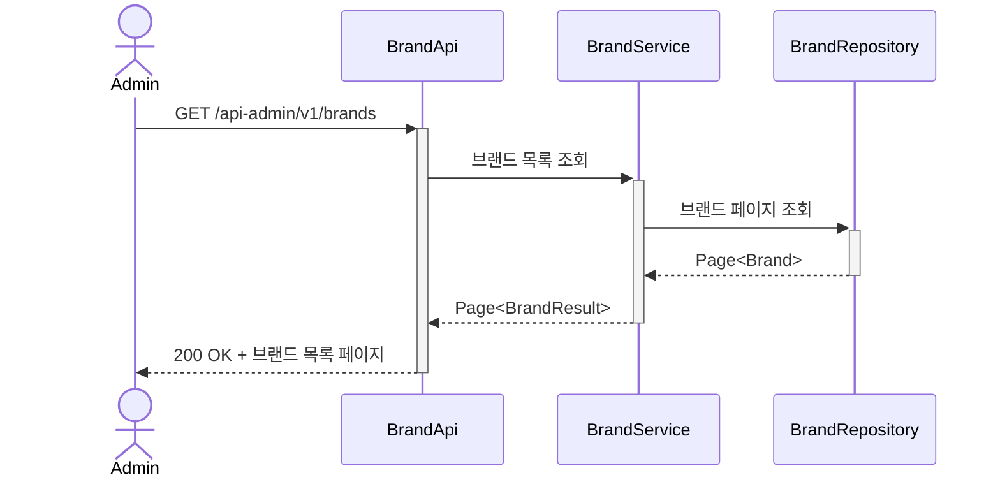
```mermaid
sequenceDiagram
    actor Admin
    participant BrandApi
    participant BrandService
    participant BrandRepository

    Admin ->>+ BrandApi: GET /api-admin/v1/brands
    BrandApi ->>+ BrandService: 브랜드 목록 조회
    BrandService ->>+ BrandRepository: 브랜드 페이지 조회
    BrandRepository -->>- BrandService: Page<Brand>
    BrandService -->>- BrandApi: Page<BrandResult>
    BrandApi -->>- Admin: 200 OK + 브랜드 목록 페이지
```

### [어드민] 브랜드 상세 조회

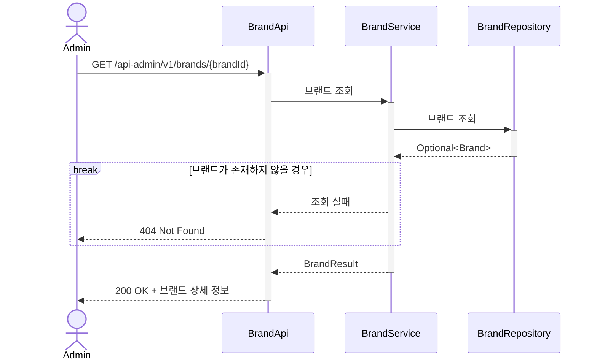
```mermaid
sequenceDiagram
    actor Admin
    participant BrandApi
    participant BrandService
    participant BrandRepository

    Admin ->>+ BrandApi: GET /api-admin/v1/brands/{brandId}
    BrandApi ->>+ BrandService: 브랜드 조회
    BrandService ->>+ BrandRepository: 브랜드 조회
    BrandRepository -->>- BrandService: Optional<Brand>

    break 브랜드가 존재하지 않을 경우
        BrandService -->> BrandApi: 조회 실패
        BrandApi -->> Admin: 404 Not Found
    end

    BrandService -->>- BrandApi: BrandResult
    BrandApi -->>- Admin: 200 OK + 브랜드 상세 정보
```

### [어드민] 브랜드 정보 수정

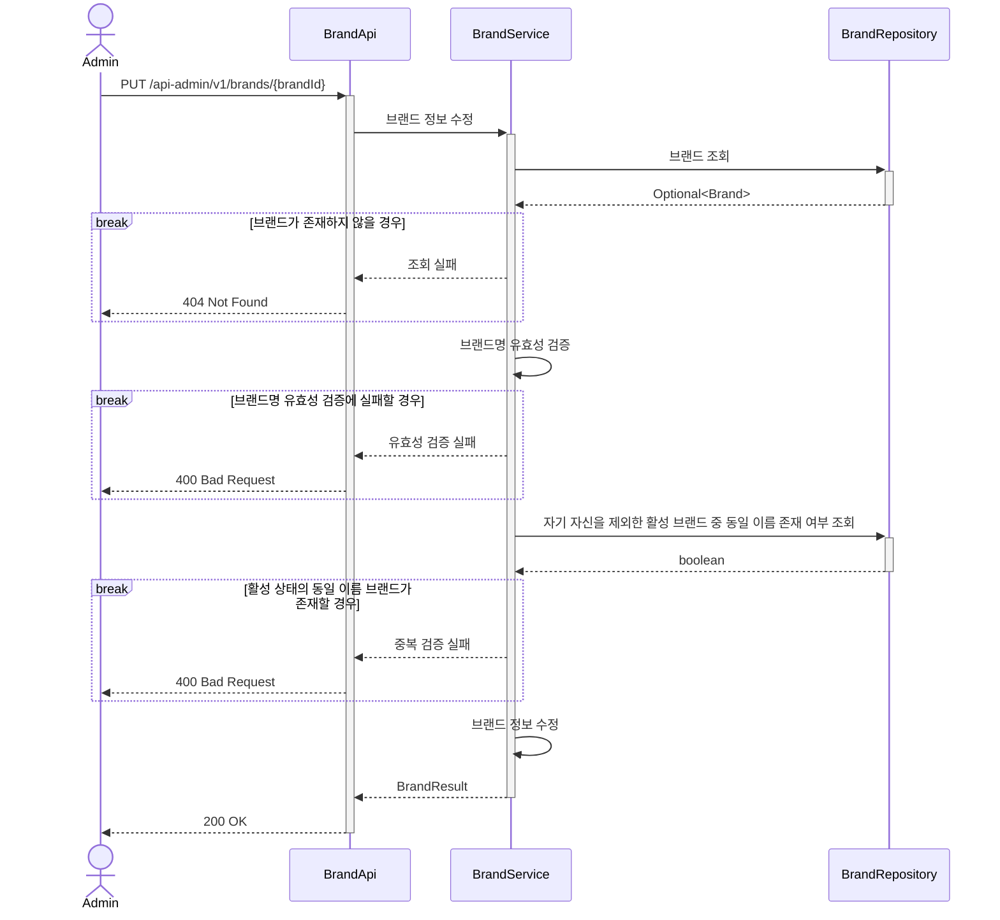
```mermaid
sequenceDiagram
    actor Admin
    participant BrandApi
    participant BrandService
    participant BrandRepository

    Admin ->>+ BrandApi: PUT /api-admin/v1/brands/{brandId}
    BrandApi ->>+ BrandService: 브랜드 정보 수정
    BrandService ->>+ BrandRepository: 브랜드 조회
    BrandRepository -->>- BrandService: Optional<Brand>

    break 브랜드가 존재하지 않을 경우
        BrandService -->> BrandApi: 조회 실패
        BrandApi -->> Admin: 404 Not Found
    end

    BrandService ->> BrandService: 브랜드명 유효성 검증

    break 브랜드명 유효성 검증에 실패할 경우
        BrandService -->> BrandApi: 유효성 검증 실패
        BrandApi -->> Admin: 400 Bad Request
    end

    BrandService ->>+ BrandRepository: 자기 자신을 제외한 활성 브랜드 중 동일 이름 존재 여부 조회
    BrandRepository -->>- BrandService: boolean

    break 활성 상태의 동일 이름 브랜드가 존재할 경우
        BrandService -->> BrandApi: 중복 검증 실패
        BrandApi -->> Admin: 400 Bad Request
    end

    BrandService ->> BrandService: 브랜드 정보 수정
    BrandService -->>- BrandApi: BrandResult
    BrandApi -->>- Admin: 200 OK
```

### [어드민] 브랜드 삭제

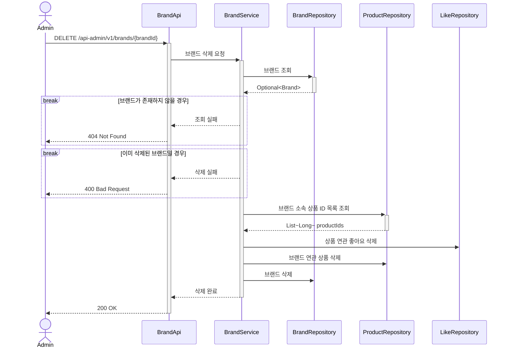
```mermaid
sequenceDiagram
    actor Admin
    participant BrandApi
    participant BrandService
    participant BrandRepository
    participant ProductRepository
    participant LikeRepository

    Admin ->>+ BrandApi: DELETE /api-admin/v1/brands/{brandId}
    BrandApi ->>+ BrandService: 브랜드 삭제 요청

    BrandService ->>+ BrandRepository: 브랜드 조회
    BrandRepository -->>- BrandService: Optional<Brand>

    break 브랜드가 존재하지 않을 경우
        BrandService -->> BrandApi: 조회 실패
        BrandApi -->> Admin: 404 Not Found
    end

    break 이미 삭제된 브랜드일 경우
        BrandService -->> BrandApi: 삭제 실패
        BrandApi -->> Admin: 400 Bad Request
    end

    BrandService ->>+ ProductRepository: 브랜드 소속 상품 ID 목록 조회
    ProductRepository -->>- BrandService: List~Long~ productIds
    BrandService ->> LikeRepository: 상품 연관 좋아요 삭제
    BrandService ->> ProductRepository: 브랜드 연관 상품 삭제
    BrandService ->> BrandRepository: 브랜드 삭제
    BrandService -->>- BrandApi: 삭제 완료
    BrandApi -->>- Admin: 200 OK
```

### [대고객] 브랜드 상세 조회

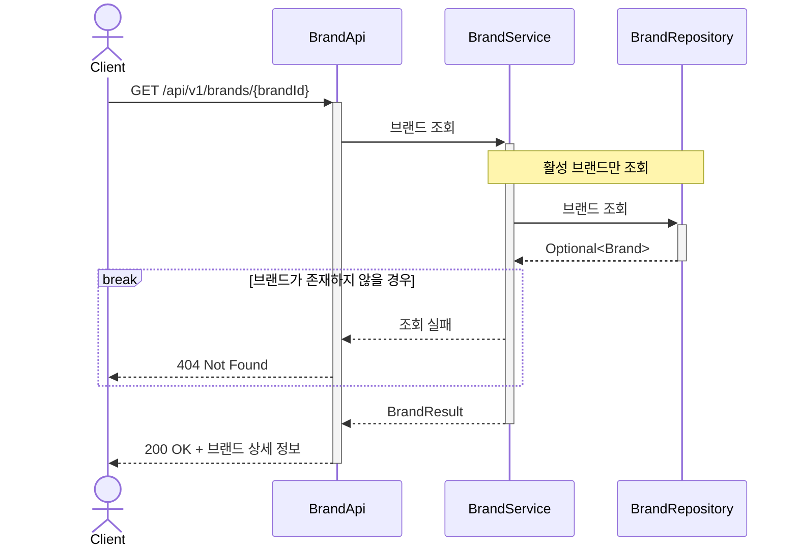
```mermaid
sequenceDiagram
    actor Client
    participant BrandApi
    participant BrandService
    participant BrandRepository

    Client ->>+ BrandApi: GET /api/v1/brands/{brandId}
    BrandApi ->>+ BrandService: 브랜드 조회

    Note over BrandService, BrandRepository: 활성 브랜드만 조회
    BrandService ->>+ BrandRepository: 브랜드 조회
    BrandRepository -->>- BrandService: Optional<Brand>

    break 브랜드가 존재하지 않을 경우
        BrandService -->> BrandApi: 조회 실패
        BrandApi -->> Client: 404 Not Found
    end

    BrandService -->>- BrandApi: BrandResult
    BrandApi -->>- Client: 200 OK + 브랜드 상세 정보
```

## Product (상품)

### [어드민] 상품 등록

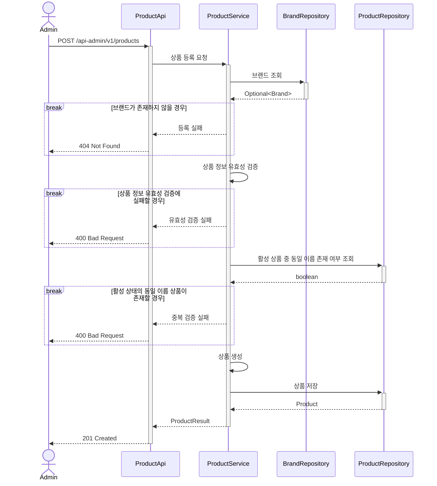
```mermaid
sequenceDiagram
    actor Admin
    participant ProductApi
    participant ProductService
    participant BrandRepository
    participant ProductRepository

    Admin ->>+ ProductApi: POST /api-admin/v1/products
    ProductApi ->>+ ProductService: 상품 등록 요청

    ProductService ->>+ BrandRepository: 브랜드 조회
    BrandRepository -->>- ProductService: Optional<Brand>

    break 브랜드가 존재하지 않을 경우
        ProductService -->> ProductApi: 등록 실패
        ProductApi -->> Admin: 404 Not Found
    end

    ProductService ->> ProductService: 상품 정보 유효성 검증

    break 상품 정보 유효성 검증에 실패할 경우
        ProductService -->> ProductApi: 유효성 검증 실패
        ProductApi -->> Admin: 400 Bad Request
    end

    ProductService ->>+ ProductRepository: 활성 상품 중 동일 이름 존재 여부 조회
    ProductRepository -->>- ProductService: boolean

    break 활성 상태의 동일 이름 상품이 존재할 경우
        ProductService -->> ProductApi: 중복 검증 실패
        ProductApi -->> Admin: 400 Bad Request
    end

    ProductService ->> ProductService: 상품 생성
    ProductService ->>+ ProductRepository: 상품 저장
    ProductRepository -->>- ProductService: Product
    ProductService -->>- ProductApi: ProductResult
    ProductApi -->>- Admin: 201 Created
```

### [어드민] 상품 목록 조회

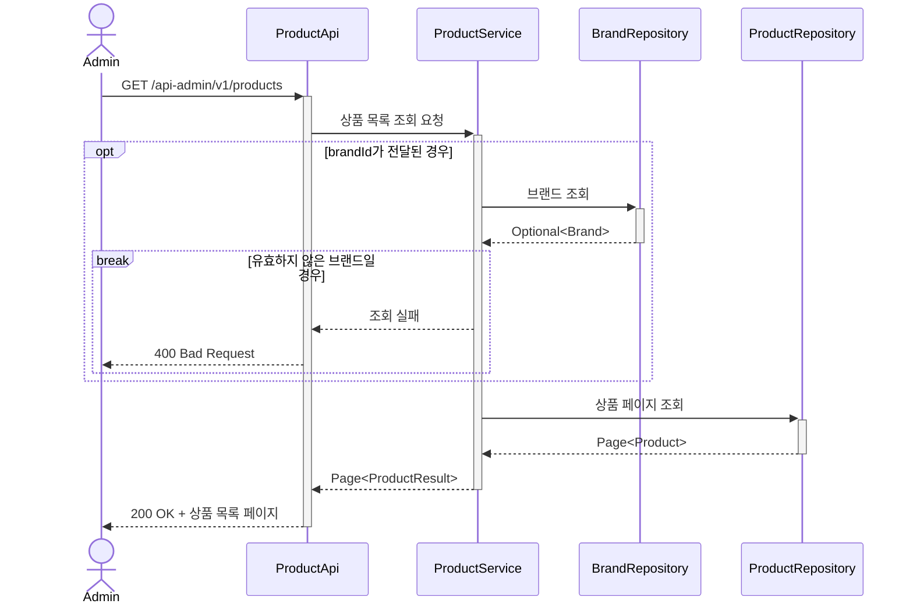
```mermaid
sequenceDiagram
    actor Admin
    participant ProductApi
    participant ProductService
    participant BrandRepository
    participant ProductRepository

    Admin ->>+ ProductApi: GET /api-admin/v1/products
    ProductApi ->>+ ProductService: 상품 목록 조회 요청

    opt brandId가 전달된 경우
        ProductService ->>+ BrandRepository: 브랜드 조회
        BrandRepository -->>- ProductService: Optional<Brand>

        break 유효하지 않은 브랜드일 경우
            ProductService -->> ProductApi: 조회 실패
            ProductApi -->> Admin: 400 Bad Request
        end
    end

    ProductService ->>+ ProductRepository: 상품 페이지 조회
    ProductRepository -->>- ProductService: Page<Product>
    ProductService -->>- ProductApi: Page<ProductResult>
    ProductApi -->>- Admin: 200 OK + 상품 목록 페이지
```

### [어드민] 상품 상세 조회

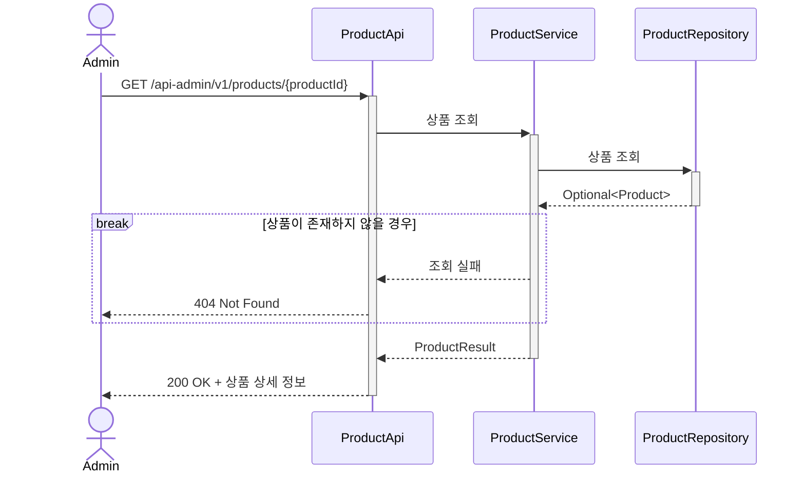
```mermaid
sequenceDiagram
    actor Admin
    participant ProductApi
    participant ProductService
    participant ProductRepository

    Admin ->>+ ProductApi: GET /api-admin/v1/products/{productId}
    ProductApi ->>+ ProductService: 상품 조회
    ProductService ->>+ ProductRepository: 상품 조회
    ProductRepository -->>- ProductService: Optional<Product>

    break 상품이 존재하지 않을 경우
        ProductService -->> ProductApi: 조회 실패
        ProductApi -->> Admin: 404 Not Found
    end

    ProductService -->>- ProductApi: ProductResult
    ProductApi -->>- Admin: 200 OK + 상품 상세 정보
```

### [어드민] 상품 정보 수정

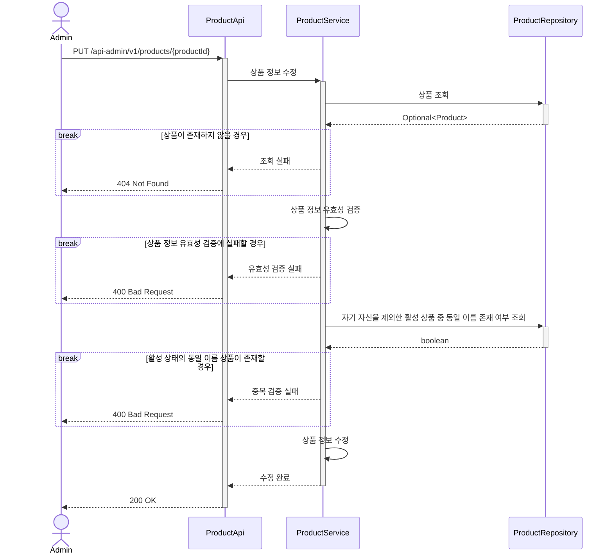
```mermaid
sequenceDiagram
    actor Admin
    participant ProductApi
    participant ProductService
    participant ProductRepository

    Admin ->>+ ProductApi: PUT /api-admin/v1/products/{productId}
    ProductApi ->>+ ProductService: 상품 정보 수정
    ProductService ->>+ ProductRepository: 상품 조회
    ProductRepository -->>- ProductService: Optional<Product>

    break 상품이 존재하지 않을 경우
        ProductService -->> ProductApi: 조회 실패
        ProductApi -->> Admin: 404 Not Found
    end

    ProductService ->> ProductService: 상품 정보 유효성 검증

    break 상품 정보 유효성 검증에 실패할 경우
        ProductService -->> ProductApi: 유효성 검증 실패
        ProductApi -->> Admin: 400 Bad Request
    end

    ProductService ->>+ ProductRepository: 자기 자신을 제외한 활성 상품 중 동일 이름 존재 여부 조회
    ProductRepository -->>- ProductService: boolean

    break 활성 상태의 동일 이름 상품이 존재할 경우
        ProductService -->> ProductApi: 중복 검증 실패
        ProductApi -->> Admin: 400 Bad Request
    end

    ProductService ->> ProductService: 상품 정보 수정
    ProductService -->>- ProductApi: 수정 완료
    ProductApi -->>- Admin: 200 OK
```

### [어드민] 상품 삭제

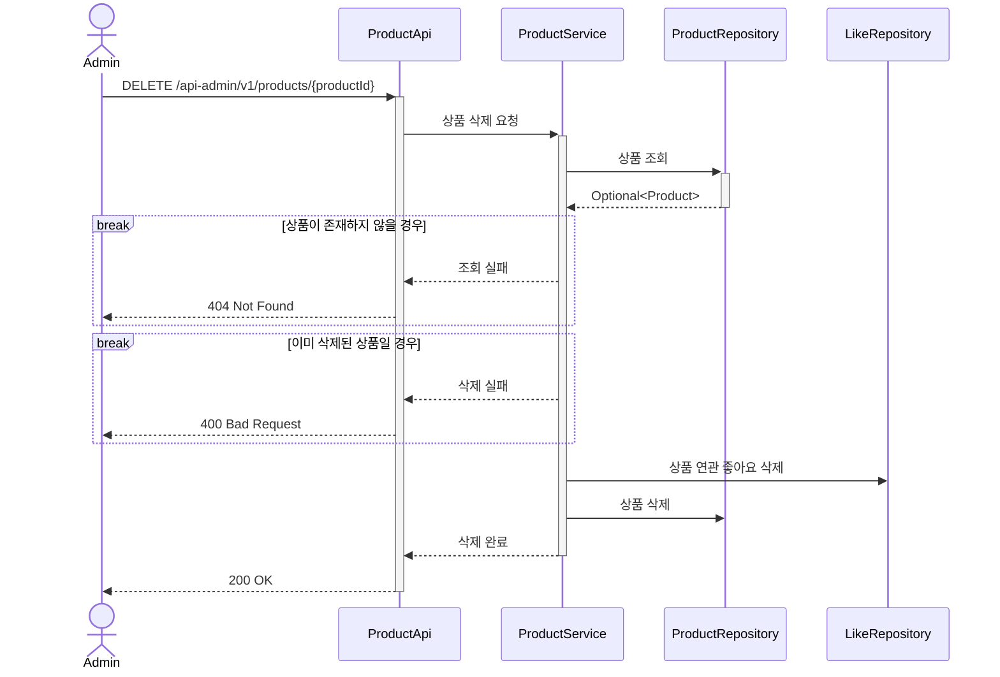
```mermaid
sequenceDiagram
    actor Admin
    participant ProductApi
    participant ProductService
    participant ProductRepository
    participant LikeRepository

    Admin ->>+ ProductApi: DELETE /api-admin/v1/products/{productId}
    ProductApi ->>+ ProductService: 상품 삭제 요청

    ProductService ->>+ ProductRepository: 상품 조회
    ProductRepository -->>- ProductService: Optional<Product>

    break 상품이 존재하지 않을 경우
        ProductService -->> ProductApi: 조회 실패
        ProductApi -->> Admin: 404 Not Found
    end

    break 이미 삭제된 상품일 경우
        ProductService -->> ProductApi: 삭제 실패
        ProductApi -->> Admin: 400 Bad Request
    end

    ProductService ->> LikeRepository: 상품 연관 좋아요 삭제
    ProductService ->> ProductRepository: 상품 삭제
    ProductService -->>- ProductApi: 삭제 완료
    ProductApi -->>- Admin: 200 OK
```

### [대고객] 상품 목록 조회

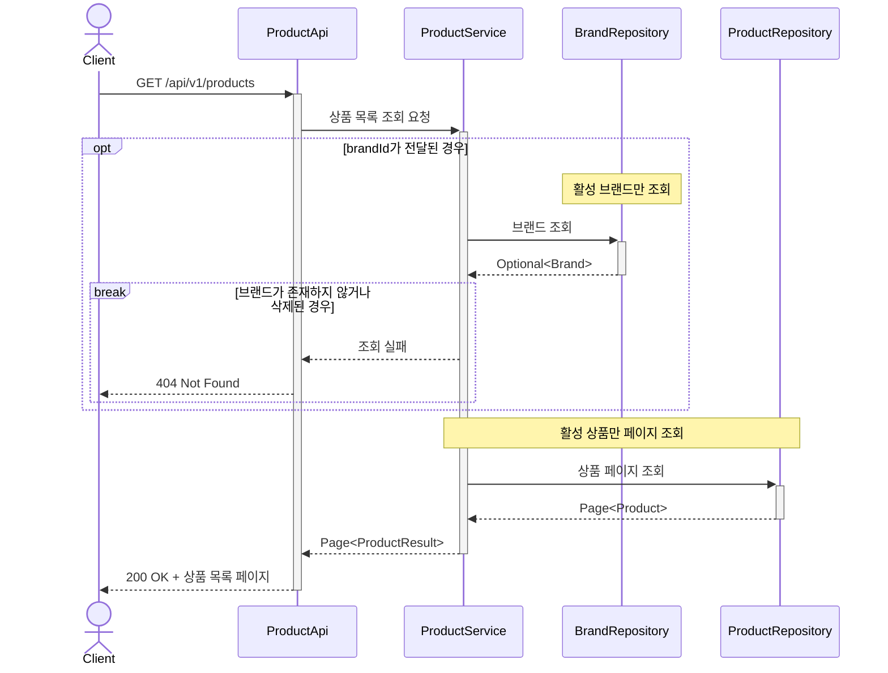
```mermaid
sequenceDiagram
    actor Client
    participant ProductApi
    participant ProductService
    participant BrandRepository
    participant ProductRepository

    Client ->>+ ProductApi: GET /api/v1/products
    ProductApi ->>+ ProductService: 상품 목록 조회 요청

    opt brandId가 전달된 경우
        Note over BrandRepository: 활성 브랜드만 조회
        ProductService ->>+ BrandRepository: 브랜드 조회
        BrandRepository -->>- ProductService: Optional<Brand>

        break 브랜드가 존재하지 않거나 삭제된 경우
            ProductService -->> ProductApi: 조회 실패
            ProductApi -->> Client: 404 Not Found
        end
    end

    Note over ProductService, ProductRepository: 활성 상품만 페이지 조회
    ProductService ->>+ ProductRepository: 상품 페이지 조회
    ProductRepository -->>- ProductService: Page<Product>
    ProductService -->>- ProductApi: Page<ProductResult>
    ProductApi -->>- Client: 200 OK + 상품 목록 페이지
```

### [대고객] 상품 상세 조회

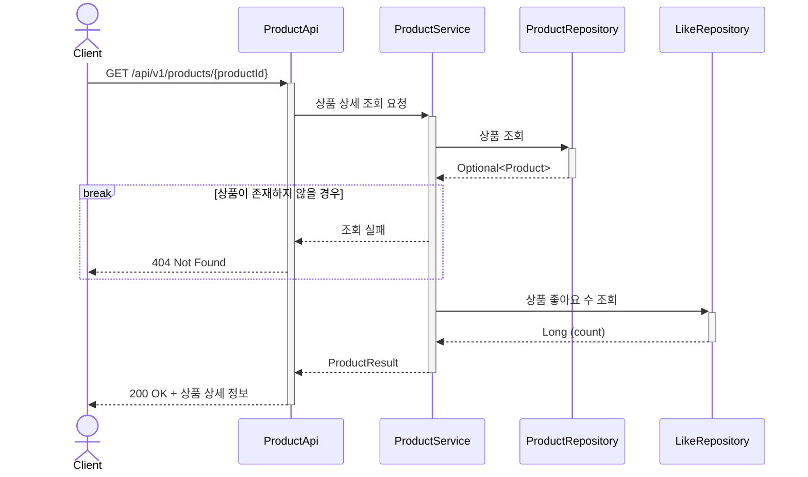
```mermaid
sequenceDiagram
    actor Client
    participant ProductApi
    participant ProductService
    participant ProductRepository
    participant LikeRepository

    Client ->>+ ProductApi: GET /api/v1/products/{productId}
    ProductApi ->>+ ProductService: 상품 상세 조회 요청

    ProductService ->>+ ProductRepository: 상품 조회
    ProductRepository -->>- ProductService: Optional<Product>

    break 상품이 존재하지 않을 경우
        ProductService -->> ProductApi: 조회 실패
        ProductApi -->> Client: 404 Not Found
    end

    ProductService ->>+ LikeRepository: 상품 좋아요 수 조회
    LikeRepository -->>- ProductService: Long (count)

    ProductService -->>- ProductApi: ProductResult
    ProductApi -->>- Client: 200 OK + 상품 상세 정보
```

## Like (좋아요)

### [대고객] 상품 좋아요 등록

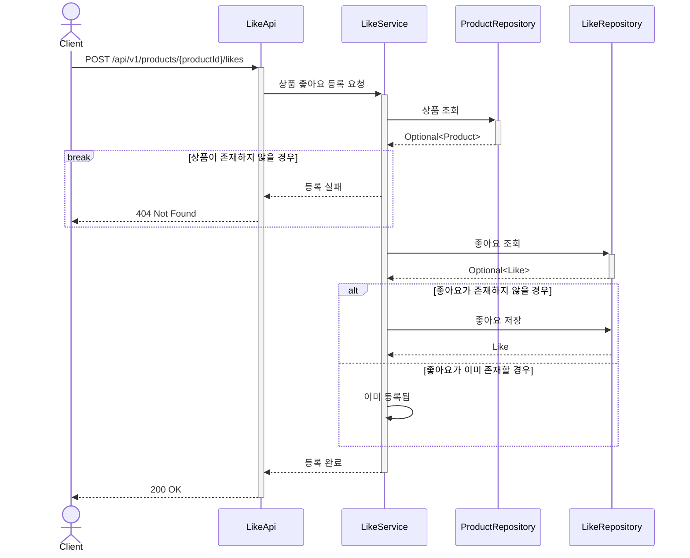
```mermaid
sequenceDiagram
    actor Client
    participant LikeApi
    participant LikeService
    participant ProductRepository
    participant LikeRepository

    Client ->>+ LikeApi: POST /api/v1/products/{productId}/likes
    LikeApi ->>+ LikeService: 상품 좋아요 등록 요청

    LikeService ->>+ ProductRepository: 상품 조회
    ProductRepository -->>- LikeService: Optional<Product>

    break 상품이 존재하지 않을 경우
        LikeService -->> LikeApi: 등록 실패
        LikeApi -->> Client: 404 Not Found
    end

    LikeService ->>+ LikeRepository: 좋아요 조회
    LikeRepository -->>- LikeService: Optional<Like>

    alt 좋아요가 존재하지 않을 경우
        LikeService ->> LikeRepository: 좋아요 저장
        LikeRepository -->> LikeService: Like
    else 좋아요가 이미 존재할 경우
        LikeService ->> LikeService: 이미 등록됨
    end

    LikeService -->>- LikeApi: 등록 완료
    LikeApi -->>- Client: 200 OK
```

### [대고객] 상품 좋아요 취소

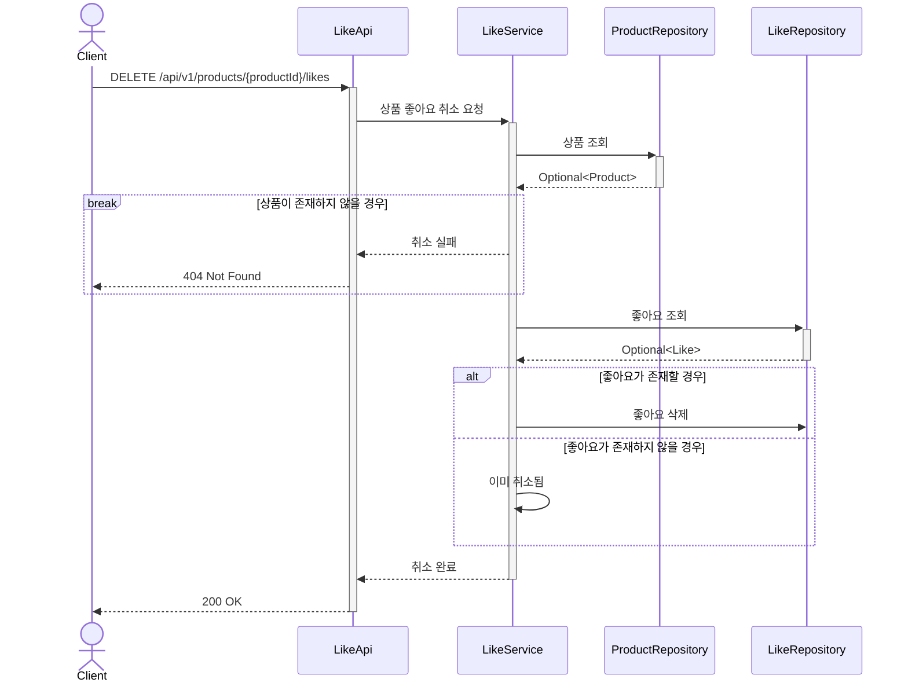
```mermaid
sequenceDiagram
    actor Client
    participant LikeApi
    participant LikeService
    participant ProductRepository
    participant LikeRepository

    Client ->>+ LikeApi: DELETE /api/v1/products/{productId}/likes
    LikeApi ->>+ LikeService: 상품 좋아요 취소 요청

    LikeService ->>+ ProductRepository: 상품 조회
    ProductRepository -->>- LikeService: Optional<Product>

    break 상품이 존재하지 않을 경우
        LikeService -->> LikeApi: 취소 실패
        LikeApi -->> Client: 404 Not Found
    end

    LikeService ->>+ LikeRepository: 좋아요 조회
    LikeRepository -->>- LikeService: Optional<Like>

    alt 좋아요가 존재할 경우
        LikeService ->> LikeRepository: 좋아요 삭제
    else 좋아요가 존재하지 않을 경우
        LikeService ->> LikeService: 이미 취소됨
    end

    LikeService -->>- LikeApi: 취소 완료
    LikeApi -->>- Client: 200 OK
```

### [대고객] 내가 좋아요한 상품 목록 조회

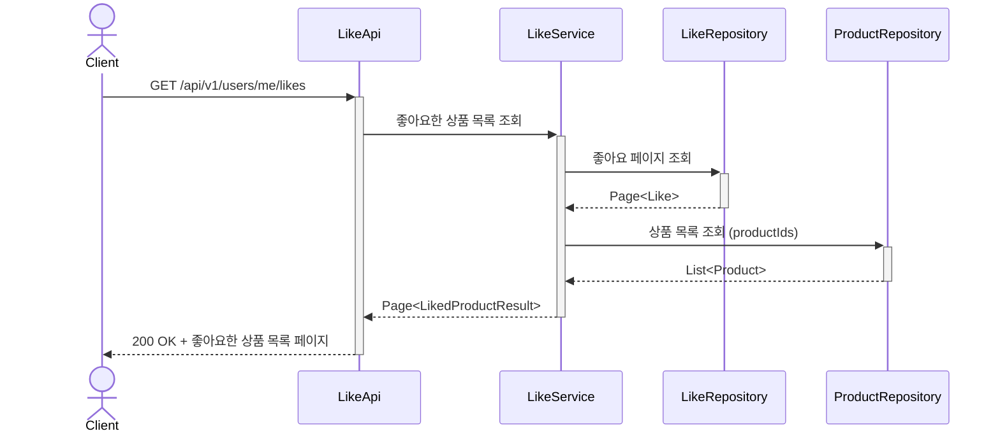
```mermaid
sequenceDiagram
    actor Client
    participant LikeApi
    participant LikeService
    participant LikeRepository
    participant ProductRepository

    Client ->>+ LikeApi: GET /api/v1/users/me/likes
    LikeApi ->>+ LikeService: 좋아요한 상품 목록 조회

    LikeService ->>+ LikeRepository: 좋아요 페이지 조회
    LikeRepository -->>- LikeService: Page<Like>

    LikeService ->>+ ProductRepository: 상품 목록 조회 (productIds)
    ProductRepository -->>- LikeService: List<Product>

    LikeService -->>- LikeApi: Page<LikedProductResult>
    LikeApi -->>- Client: 200 OK + 좋아요한 상품 목록 페이지
```

## Order (주문)

### [어드민] 주문 목록 조회

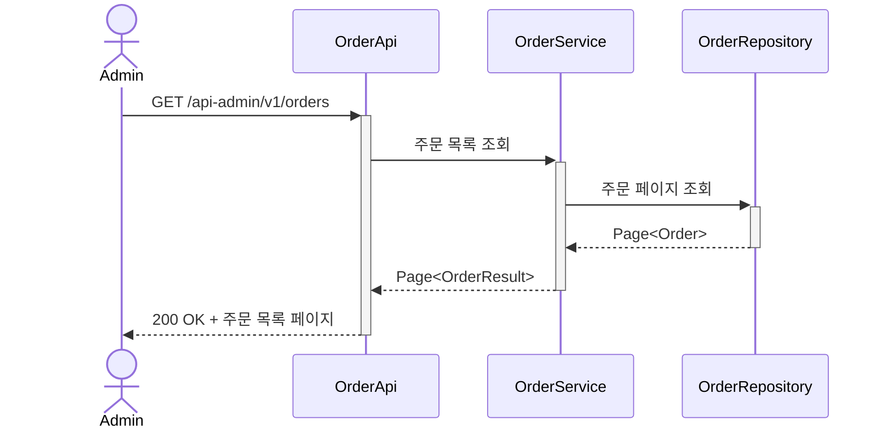
```mermaid
sequenceDiagram
    actor Admin
    participant OrderApi
    participant OrderService
    participant OrderRepository

    Admin ->>+ OrderApi: GET /api-admin/v1/orders
    OrderApi ->>+ OrderService: 주문 목록 조회
    OrderService ->>+ OrderRepository: 주문 페이지 조회
    OrderRepository -->>- OrderService: Page<Order>
    OrderService -->>- OrderApi: Page<OrderResult>
    OrderApi -->>- Admin: 200 OK + 주문 목록 페이지
```

### [어드민] 주문 상세 조회

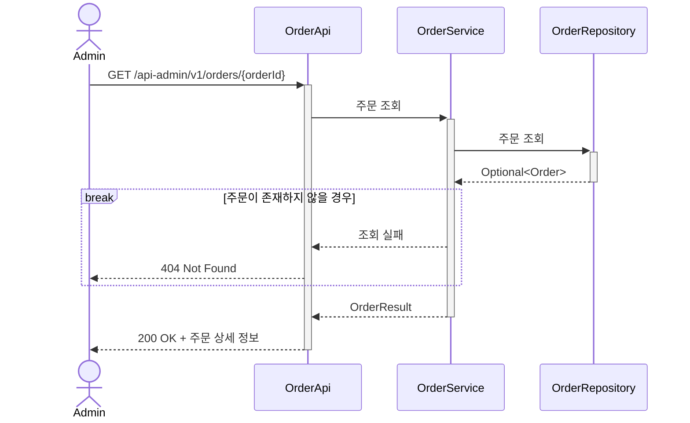
```mermaid
sequenceDiagram
    actor Admin
    participant OrderApi
    participant OrderService
    participant OrderRepository

    Admin ->>+ OrderApi: GET /api-admin/v1/orders/{orderId}
    OrderApi ->>+ OrderService: 주문 조회

    OrderService ->>+ OrderRepository: 주문 조회
    OrderRepository -->>- OrderService: Optional<Order>

    break 주문이 존재하지 않을 경우
        OrderService -->> OrderApi: 조회 실패
        OrderApi -->> Admin: 404 Not Found
    end

    OrderService -->>- OrderApi: OrderResult
    OrderApi -->>- Admin: 200 OK + 주문 상세 정보
```

### [대고객] 주문 요청

```mermaid
sequenceDiagram
    actor Client
    participant OrderApi
    participant OrderService
    participant ProductRepository
    participant OrderRepository

    Client ->>+ OrderApi: POST /api/v1/orders
    OrderApi ->>+ OrderService: 주문 요청

    OrderService ->>+ ProductRepository: 주문 상품 조회
    ProductRepository -->>- OrderService: List<Product>

    break 유효하지 않은 상품이 포함된 경우
        OrderService -->> OrderApi: 주문 실패
        OrderApi -->> Client: 400 Bad Request
    end

    break 재고가 부족한 상품이 존재할 경우
        OrderService -->> OrderApi: 주문 실패
        OrderApi -->> Client: 400 Bad Request
    end

    OrderService ->> OrderService: 재고 차감
    OrderService ->> OrderService: 주문 유효성 검증

    break 주문 유효성 검증에 실패할 경우
        OrderService -->> OrderApi: 주문 실패
        OrderApi -->> Client: 400 Bad Request
    end

    OrderService ->> OrderService: 주문 생성
    OrderService ->>+ OrderRepository: 주문 저장
    OrderRepository -->>- OrderService: Order
    OrderService -->>- OrderApi: OrderResult
    OrderApi -->>- Client: 201 Created
```

### [대고객] 주문 목록 조회

```mermaid
sequenceDiagram
    actor Client
    participant OrderApi
    participant OrderService
    participant OrderRepository

    Client ->>+ OrderApi: GET /api/v1/orders
    OrderApi ->>+ OrderService: 주문 목록 조회
    OrderService ->>+ OrderRepository: 주문 페이지 조회
    OrderRepository -->>- OrderService: Page<Order>
    OrderService -->>- OrderApi: Page<OrderResult>
    OrderApi -->>- Client: 200 OK + 주문 목록 페이지
```

### [대고객] 주문 상세 조회

```mermaid
sequenceDiagram
    actor Client
    participant OrderApi
    participant OrderService
    participant OrderRepository

    Client ->>+ OrderApi: GET /api/v1/orders/{orderId}
    OrderApi ->>+ OrderService: 주문 조회

    OrderService ->>+ OrderRepository: 주문 조회
    OrderRepository -->>- OrderService: Optional<Order>

    break 주문이 존재하지 않을 경우
        OrderService -->> OrderApi: 조회 실패
        OrderApi -->> Client: 404 Not Found
    end

    OrderService ->> OrderService: 주문 소유권 검증

    break 본인의 주문이 아닐 경우
        OrderService -->> OrderApi: 소유권 검증 실패
        OrderApi -->> Client: 403 Forbidden
    end

    OrderService -->>- OrderApi: OrderResult
    OrderApi -->>- Client: 200 OK + 주문 상세 정보
```