# 02. 시퀀스 다이어그램

---

## 작성 원칙

- 기능 하나당 하나의 시퀀스
- 최소 레이어: User → Controller → Service/Facade → Domain(Entity/Policy) → Repository
- 존재 여부 체크, 분기(alt/else), 상태 변경, 이벤트 발행을 표현
- 도메인 객체가 "빈 껍데기"가 되지 않도록, 검증/상태 전이 책임을 도메인에 부여
- 01-requirements.md에 정의된 API URI 기준으로 작성

## 시퀀스 선별 기준

단순 CRUD(조회, 등록, 수정)는 시퀀스를 생략하고, **상태 전이/동시성 제어/연쇄 처리** 등 설계 의도가 드러나는 핵심 흐름만 선별하여 작성한다.

| # | 시퀀스 | 선별 이유 |
|---|--------|----------|
| 1 | 상품 좋아요 등록 | 중복 방지(UK) + like_count 동기 증감 |
| 2 | 상품 좋아요 취소 | soft delete + like_count 감소 흐름 |
| 3 | 주문 생성 | 원자적 재고 차감 + 스냅샷 저장 (가장 복잡한 트랜잭션) |
| 4 | 브랜드 삭제 | 연쇄 상품 소프트 삭제 (Aggregate 간 조율) |
| 5 | 상품 목록 조회 | 필터/정렬/페이징 조합 + 고객 노출 정보 매핑 |
| 6 | 어드민 상품 등록 | 브랜드 활성 검증 선행 조건 |

---

## 1) 상품 좋아요 등록

핵심: 로그인 확인 → 상품 존재/노출 확인 → 중복 좋아요 확인 → 생성 → like_count 반영

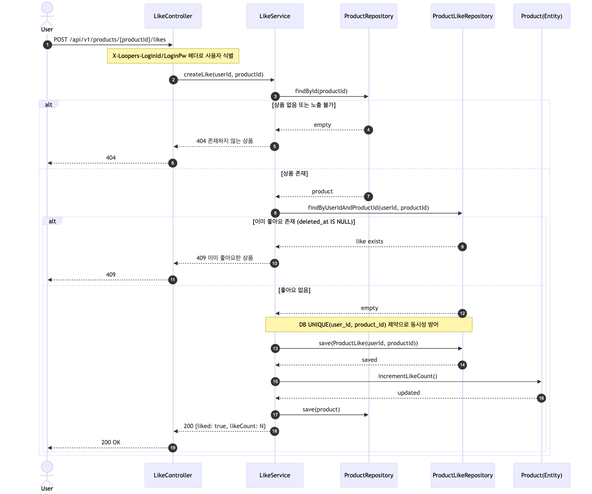

Mermaid 원본

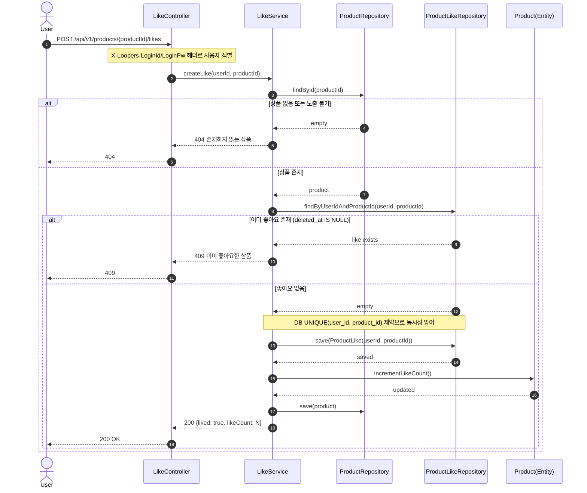

**책임 분리 포인트**:
- `LikeService`: 존재 확인 + 중복 검증 (애플리케이션 규칙)
- `Product(Entity)`: like_count 증감 (도메인 규칙 - 카운트는 상품의 속성)
- `ProductLikeRepository`: 유니크 제약으로 동시성 최종 방어 (인프라)

---

## 2) 상품 좋아요 취소

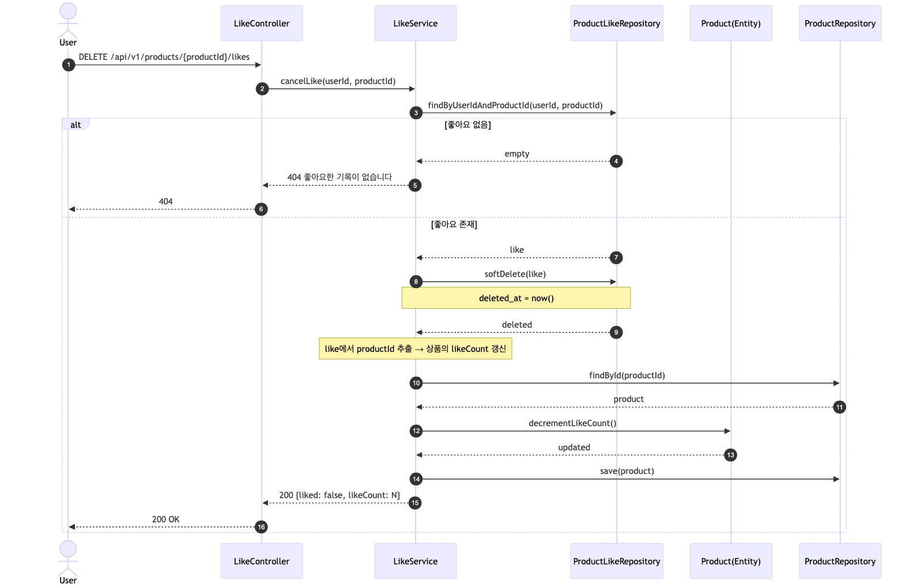

Mermaid 원본

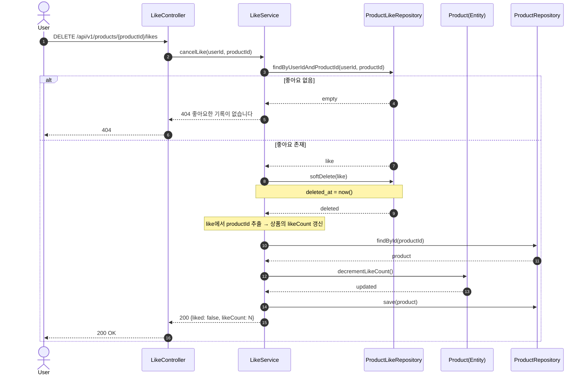

---

## 3) 주문 생성 (핵심: 재고 확인/차감 + 스냅샷 저장)

핵심: 복수 상품 주문 → 전체 재고 확인 → **원자적 재고 차감** → Order + OrderItem(스냅샷) 생성

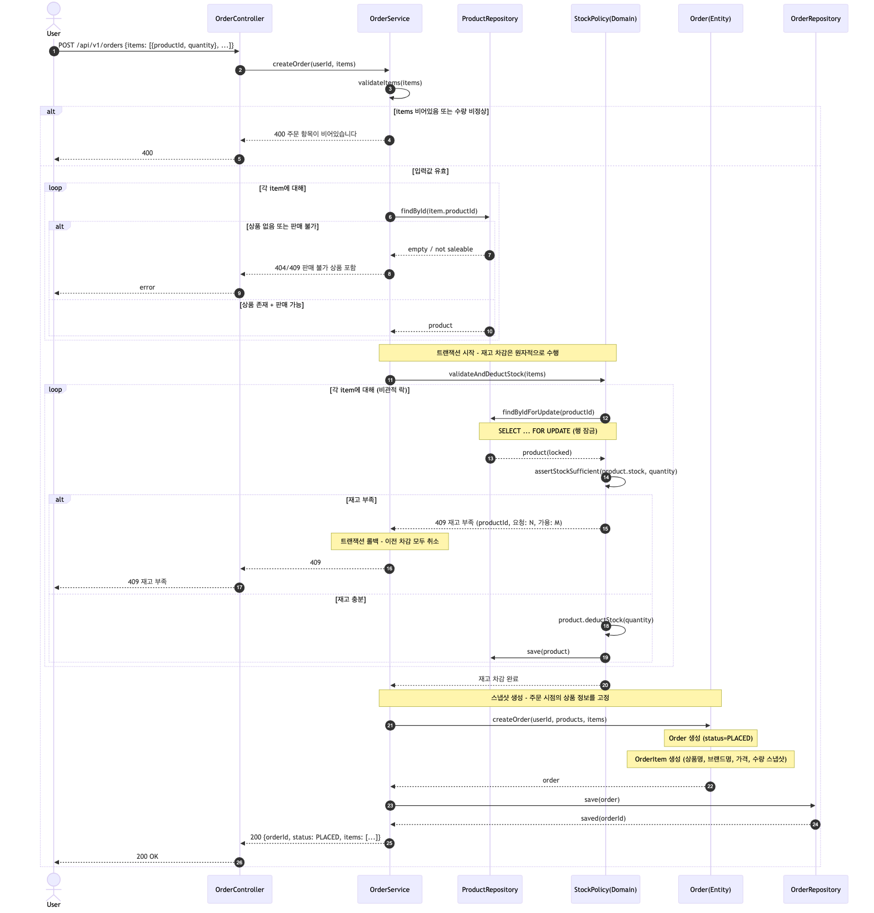

Mermaid 원본

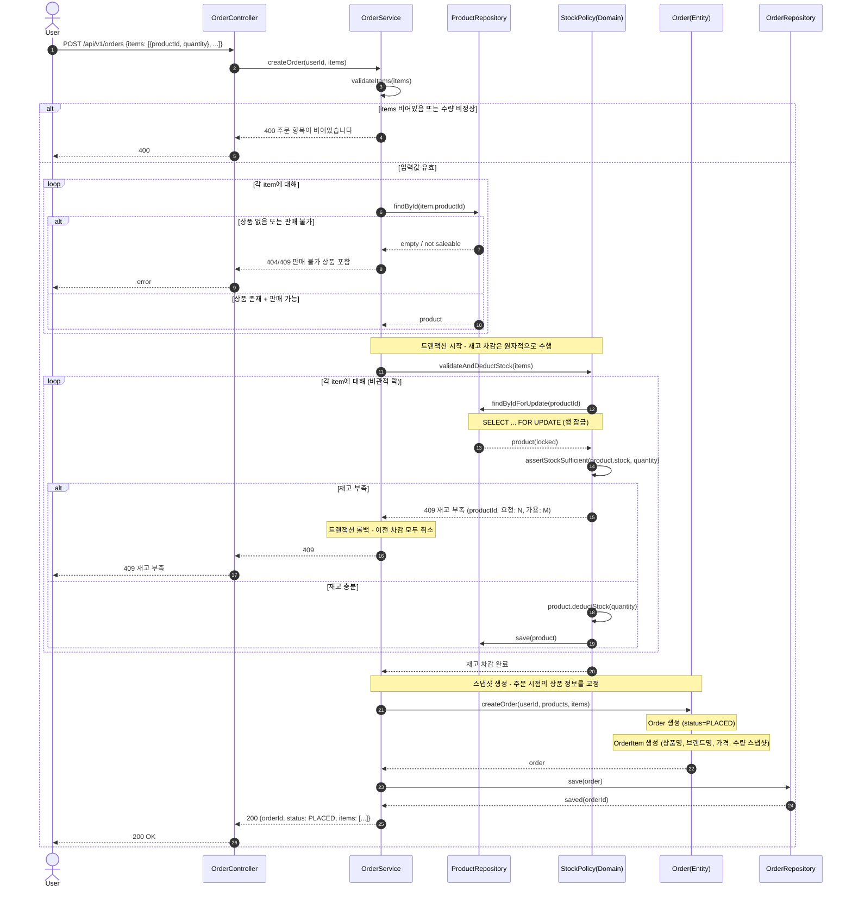

**책임 분리 포인트**:
- `OrderService`: 흐름 조율 (애플리케이션 서비스)
- `StockPolicy(Domain)`: 재고 검증/차감 규칙 (도메인 정책 - "재고가 충분한가?", "차감 가능한가?")
- `Order(Entity)`: 주문 생성 + OrderItem 스냅샷 조립 (도메인 - 스냅샷은 주문의 책임)
- `ProductRepository`: 비관적 락 + 영속화 (인프라)

**트랜잭션 경계**: `createOrder` 전체가 하나의 `@Transactional`

---

## 4) 브랜드 삭제 (연쇄 상품 삭제)

핵심: 브랜드 삭제 시 소속 상품 일괄 소프트 삭제

Mermaid 원본

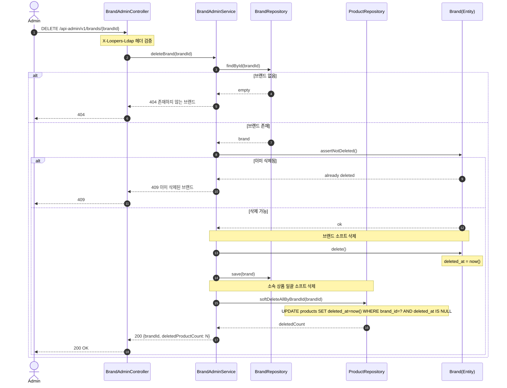

**설계 의도**:
- 브랜드 삭제와 상품 삭제는 하나의 트랜잭션으로 수행 (정합성 보장)
- 기존 주문의 OrderItem 스냅샷에는 영향 없음 (스냅샷은 주문 시점에 고정됨)

---

## 5) 상품 목록 조회 (필터/정렬)

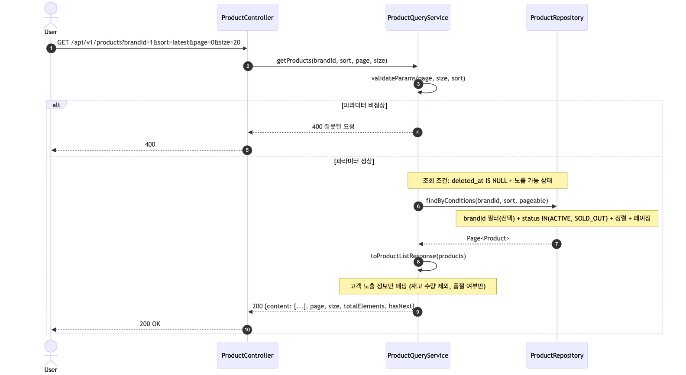

Mermaid 원본

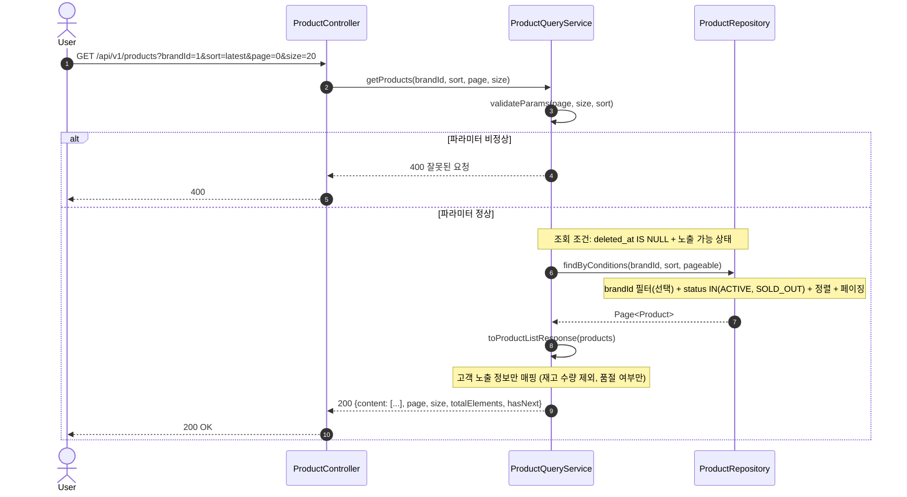

---

## 6) 어드민 상품 등록 (브랜드 검증 포함)

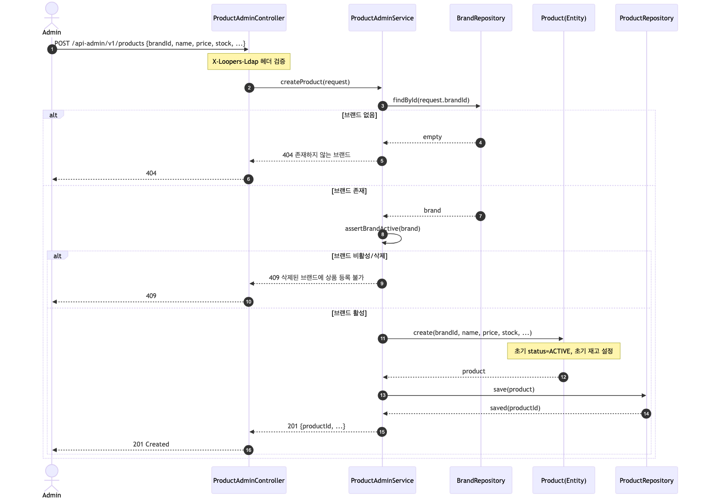

Mermaid 원본

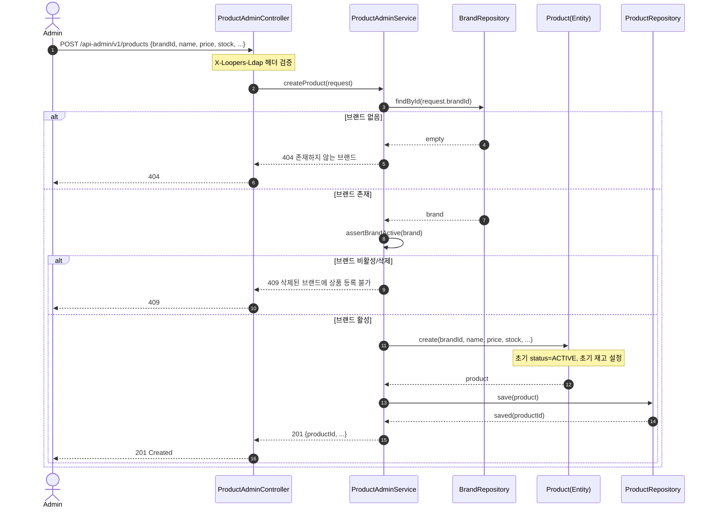

---

> 향후 확장 시퀀스(재고 예약 + 쿠폰 홀드 + 결제, 결제 콜백 멱등 처리)는 [`future/02-sequence-diagrams-expansion.md`](./future/02-sequence-diagrams-expansion.md) 참조
