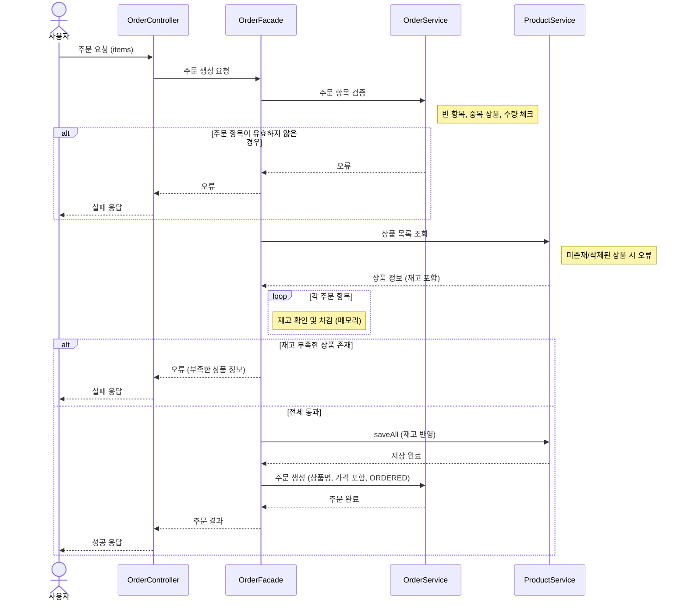
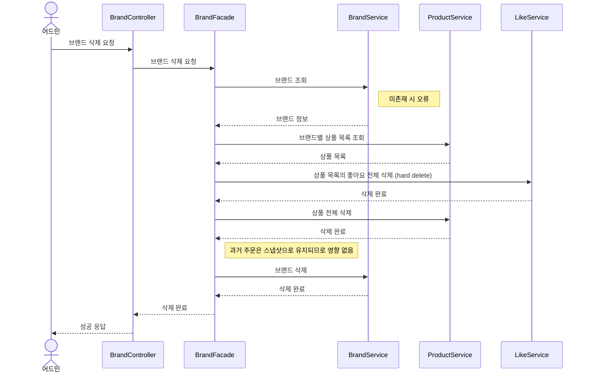
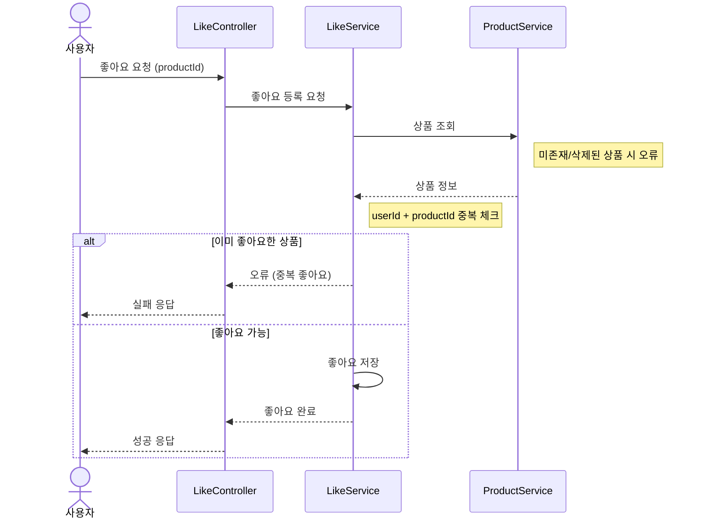
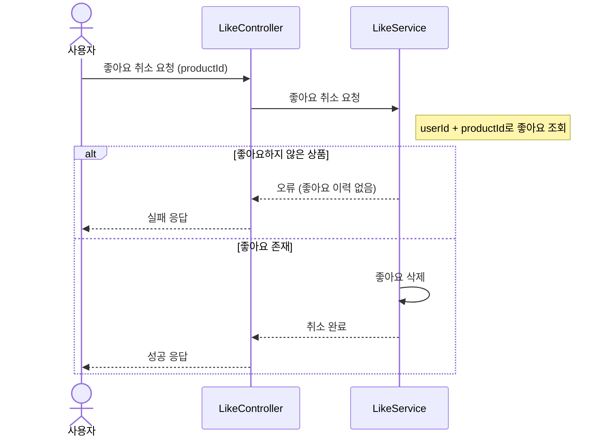

# 02. 시퀀스 다이어그램

## 1. 주문 생성

```mermaid
sequenceDiagram
    actor User as 사용자
    participant OrderController
    participant OrderFacade
    participant OrderService
    participant ProductService

    User->>OrderController: 주문 요청 (items)
    OrderController->>OrderFacade: 주문 생성 요청

    %% 1. 주문 구조 검증 (Order 책임)
    OrderFacade->>OrderService: 주문 항목 검증
    Note right of OrderService: 빈 항목, 중복 상품, 수량 체크

    alt 주문 항목이 유효하지 않은 경우
        OrderService-->>OrderFacade: 오류
        OrderFacade-->>OrderController: 오류
        OrderController-->>User: 실패 응답
    end

    %% 2. 상품 조회 (Product 책임)
    OrderFacade->>ProductService: 상품 목록 조회
    Note right of ProductService: 미존재/삭제된 상품 시 오류
    ProductService-->>OrderFacade: 상품 정보 (재고 포함)

    %% 3. 재고 검증 + 차감 (메모리)
    loop 각 주문 항목
        Note right of OrderFacade: 재고 확인 및 차감 (메모리)
    end

    alt 재고 부족한 상품 존재
        OrderFacade-->>OrderController: 오류 (부족한 상품 정보)
        OrderController-->>User: 실패 응답
    else 전체 통과
        %% 4. 재고 반영
        OrderFacade->>ProductService: saveAll (재고 반영)
        ProductService-->>OrderFacade: 저장 완료

        %% 5. 주문 저장 (스냅샷 포함)
        OrderFacade->>OrderService: 주문 생성 (상품명, 가격 포함, ORDERED)
        OrderService-->>OrderFacade: 주문 완료

        OrderFacade-->>OrderController: 주문 결과
        OrderController-->>User: 성공 응답
    end
```

---

## 2. 브랜드 삭제 (연쇄 삭제)

```mermaid
sequenceDiagram
    actor Admin as 어드민
    participant BrandController
    participant BrandFacade
    participant BrandService
    participant ProductService
    participant LikeService

    Admin->>BrandController: 브랜드 삭제 요청
    BrandController->>BrandFacade: 브랜드 삭제 요청

    %% 1. 브랜드 존재 확인
    BrandFacade->>BrandService: 브랜드 조회
    Note right of BrandService: 미존재 시 오류
    BrandService-->>BrandFacade: 브랜드 정보

    %% 2. 해당 브랜드의 상품 조회
    BrandFacade->>ProductService: 브랜드별 상품 목록 조회
    ProductService-->>BrandFacade: 상품 목록

    %% 3. 좋아요 제거 → 상품 삭제
    BrandFacade->>LikeService: 상품 목록의 좋아요 전체 삭제 (hard delete)
    LikeService-->>BrandFacade: 삭제 완료

    BrandFacade->>ProductService: 상품 전체 삭제
    ProductService-->>BrandFacade: 삭제 완료

    Note right of BrandFacade: 과거 주문은 스냅샷으로 유지되므로 영향 없음

    %% 4. 브랜드 삭제
    BrandFacade->>BrandService: 브랜드 삭제
    BrandService-->>BrandFacade: 삭제 완료

    BrandFacade-->>BrandController: 삭제 완료
    BrandController-->>Admin: 성공 응답
```

---

## 3. 좋아요 등록

```mermaid
sequenceDiagram
    actor User as 사용자
    participant LikeController
    participant LikeService
    participant ProductService

    User->>LikeController: 좋아요 요청 (productId)
    LikeController->>LikeService: 좋아요 등록 요청

    %% 1. 상품 존재 확인 (Product 책임)
    LikeService->>ProductService: 상품 조회
    Note right of ProductService: 미존재/삭제된 상품 시 오류
    ProductService-->>LikeService: 상품 정보

    %% 2. 중복 좋아요 확인 (Like 책임)
    Note right of LikeService: userId + productId 중복 체크

    alt 이미 좋아요한 상품
        LikeService-->>LikeController: 오류 (중복 좋아요)
        LikeController-->>User: 실패 응답
    else 좋아요 가능
        %% 3. 좋아요 저장
        LikeService->>LikeService: 좋아요 저장
        LikeService-->>LikeController: 좋아요 완료
        LikeController-->>User: 성공 응답
    end
```

---

## 4. 좋아요 취소

```mermaid
sequenceDiagram
    actor User as 사용자
    participant LikeController
    participant LikeService

    User->>LikeController: 좋아요 취소 요청 (productId)
    LikeController->>LikeService: 좋아요 취소 요청

    %% 1. 좋아요 존재 확인 (Like 책임)
    Note right of LikeService: userId + productId로 좋아요 조회

    alt 좋아요하지 않은 상품
        LikeService-->>LikeController: 오류 (좋아요 이력 없음)
        LikeController-->>User: 실패 응답
    else 좋아요 존재
        %% 2. 좋아요 삭제 (hard delete)
        LikeService->>LikeService: 좋아요 삭제
        LikeService-->>LikeController: 취소 완료
        LikeController-->>User: 성공 응답
    end
```
