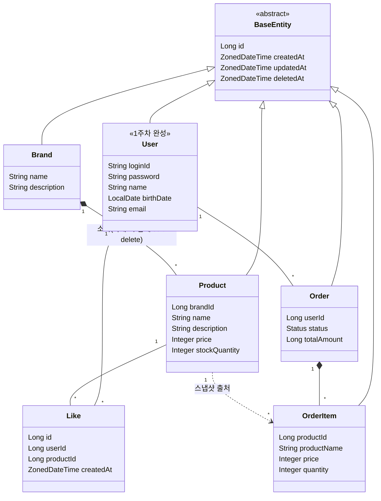

# 03. 도메인 객체 설계

## 클래스 다이어그램

## 도메인 규칙

### Brand

1. name은 필수값이며, 공백 또는 null을 허용하지 않는다.
2. Brand는 soft delete 정책을 따른다.
3. Brand가 삭제되면 소속된 Product 역시 함께 soft delete 처리된다.

### Product

1. name, price, stockQuantity는 필수값이다.
2. 반드시 이미 등록된 Brand에 소속되어야 한다.
3. 한 번 등록되면 소속 Brand를 변경할 수 없다.
4. price는 원 단위 정수로 관리한다.
5. stockQuantity는 0 이상이어야 한다.
6. Product는 soft delete 정책을 따른다.
7. 삭제 시 해당 상품의 좋아요도 함께 제거된다.

### Like

1. userId + productId 조합은 유니크해야 한다. (중복 좋아요 방지)
2. 좋아요 및 취소는 본인만 할 수 있다.
3. **hard delete** 정책을 따른다. (BaseEntity를 상속하지 않음)
4. 취소 시 이력을 보존하지 않고 완전히 제거한다.

### Order

1. status는 Order의 inner enum(`Order.Status`)으로 관리한다. 현재 값은 `ORDERED`이며, 추후 결제 연동 시 상태를 확장한다.
2. 생성 시 즉시 ORDERED 상태가 된다.
3. totalAmount는 주문 시점의 최종 결제 금액이다. 현재는 OrderItem 합산 금액과 동일하며, 추후 쿠폰 연동 시 할인이 반영된 금액이 된다.

### OrderItem

1. 주문 시점의 상품 정보(productName, price)를 스냅샷으로 저장한다.
2. 원본 상품이 변경/삭제되어도 주문 내역에는 영향이 없다.
3. quantity는 1 이상이어야 한다.
4. Order와 컴포지션 관계이며, Order 없이 단독 존재할 수 없다.