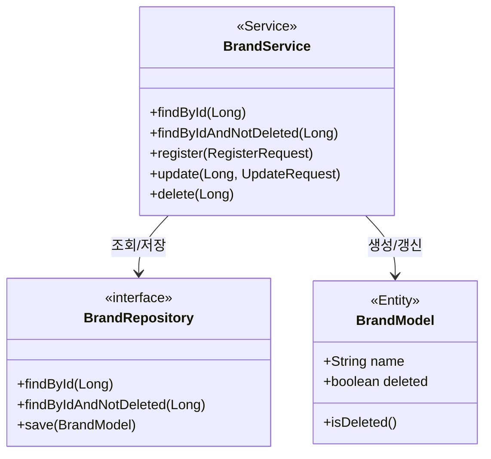
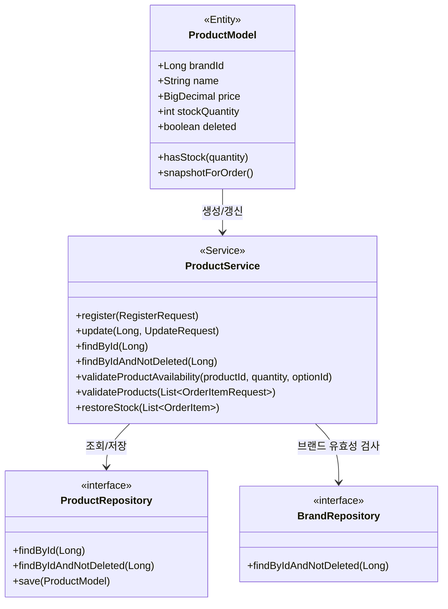
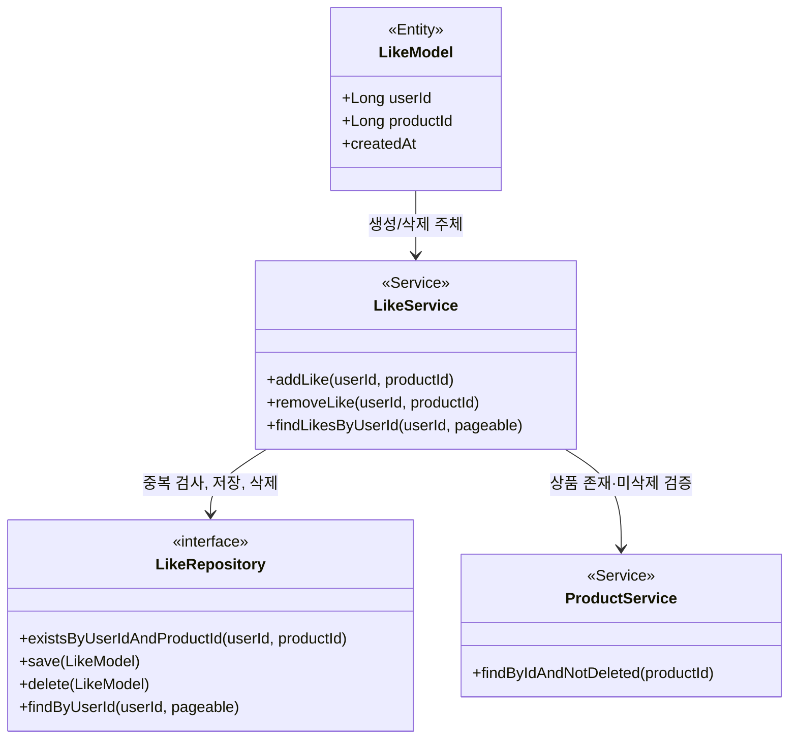
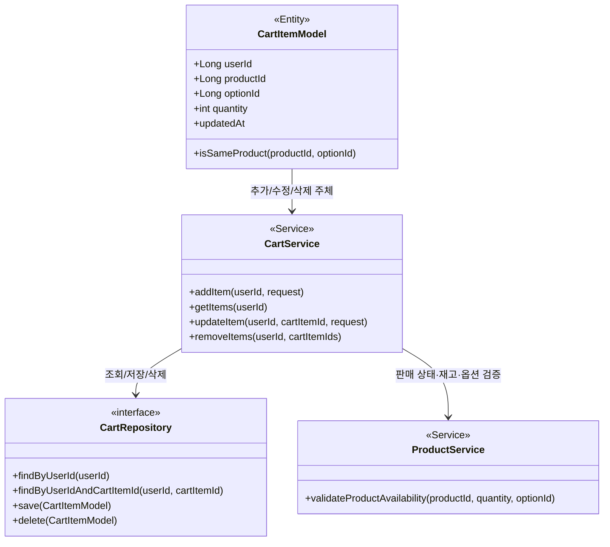
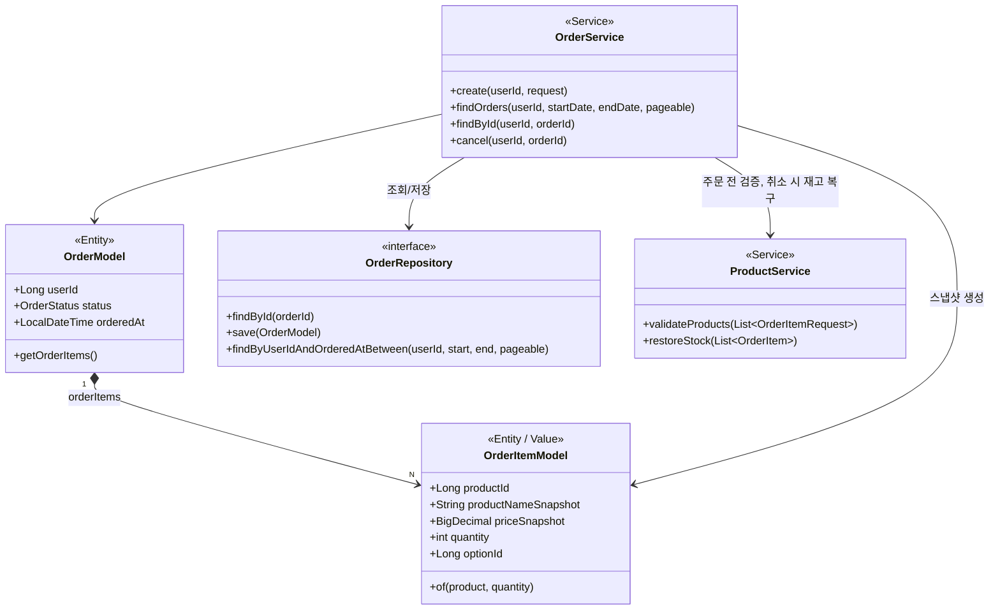
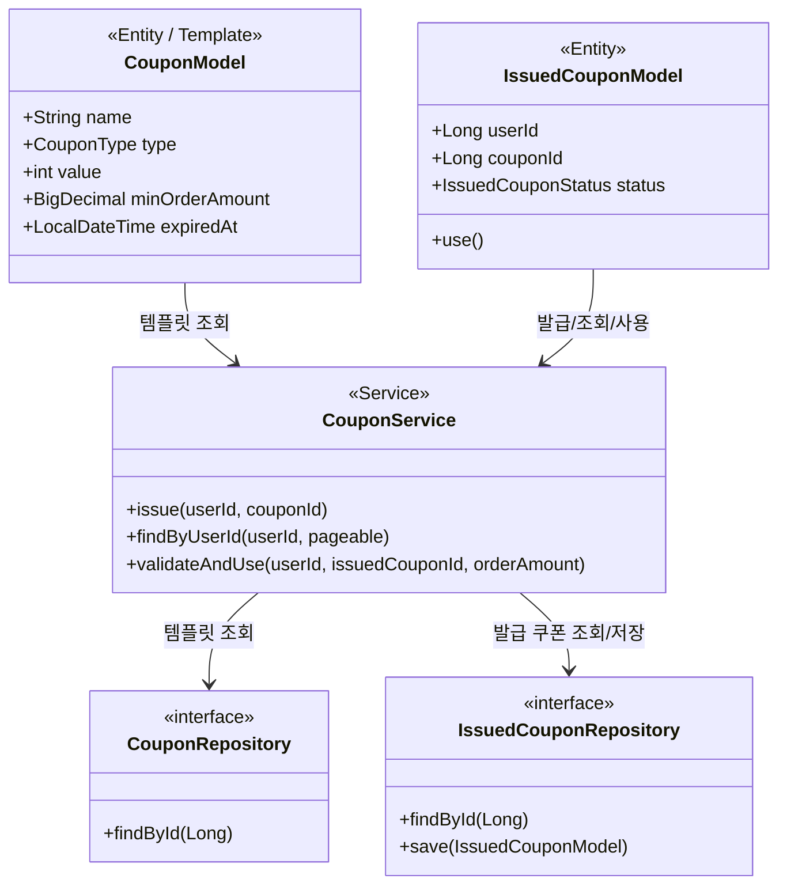

```mermaid
classDiagram
    direction TB

    subgraph interfaces
        ProductV1Controller
        BrandV1Controller
        LikeV1Controller
        CartV1Controller
        OrderV1Controller
        ProductV1Dto
        BrandV1Dto
        LikeV1Dto
        CartV1Dto
        OrderV1Dto
        ProductV1ApiSpec
        BrandV1ApiSpec
        LikeV1ApiSpec
        CartV1ApiSpec
        OrderV1ApiSpec
    end

    subgraph application
        ProductFacade
        BrandFacade
        LikeFacade
        CartFacade
        OrderFacade
        ProductInfo
        BrandInfo
        LikeInfo
        CartInfo
        OrderInfo
    end

    subgraph domain
        ProductService
        BrandService
        LikeService
        CartService
        OrderService
        ProductRepository
        BrandRepository
        LikeRepository
        CartRepository
        OrderRepository
    end

    subgraph domain_models
        ProductModel
        BrandModel
        LikeModel
        CartItemModel
        OrderModel
        OrderItemModel
    end

    subgraph infrastructure
        ProductRepositoryImpl
        BrandRepositoryImpl
        LikeRepositoryImpl
        CartRepositoryImpl
        OrderRepositoryImpl
        ProductJpaRepository
        BrandJpaRepository
        LikeJpaRepository
        CartItemJpaRepository
        OrderJpaRepository
    end

    ProductV1Controller --> ProductFacade
    BrandV1Controller --> BrandFacade
    LikeV1Controller --> LikeFacade
    CartV1Controller --> CartFacade
    OrderV1Controller --> OrderFacade

    ProductFacade --> ProductService
    ProductFacade --> ProductInfo
    BrandFacade --> BrandService
    BrandFacade --> BrandInfo
    LikeFacade --> LikeService
    LikeFacade --> LikeInfo
    CartFacade --> CartService
    CartFacade --> CartInfo
    OrderFacade --> OrderService
    OrderFacade --> OrderInfo

    ProductService --> ProductRepository
    ProductService --> BrandRepository
    ProductService --> ProductModel
    BrandService --> BrandRepository
    BrandService --> BrandModel
    LikeService --> LikeRepository
    LikeService --> ProductService
    LikeService --> LikeModel
    CartService --> CartRepository
    CartService --> ProductService
    CartService --> CartItemModel
    OrderService --> OrderRepository
    OrderService --> ProductService
    OrderService --> OrderModel
    OrderService --> OrderItemModel

    ProductRepositoryImpl ..|> ProductRepository
    BrandRepositoryImpl ..|> BrandRepository
    LikeRepositoryImpl ..|> LikeRepository
    CartRepositoryImpl ..|> CartRepository
    OrderRepositoryImpl ..|> OrderRepository
    ProductRepositoryImpl --> ProductJpaRepository
    BrandRepositoryImpl --> BrandJpaRepository
    LikeRepositoryImpl --> LikeJpaRepository
    CartRepositoryImpl --> CartItemJpaRepository
    OrderRepositoryImpl --> OrderJpaRepository
```

# 클래스 다이어그램 (도메인: Brands, Products, Likes, Cart, Orders, Coupons)

> 본 문서는 **도메인 책임**, **의존 방향**, **응집도** 확인을 위해 클래스 다이어그램을 사용한다.  
> 각 다이어그램은 **이유 → 다이어그램 → 해석 → 잠재 리스크** 순서로 제시한다.  
> 참조: [00-ubiquitous-language.md](./00-ubiquitous-language.md), [01-requirements.md](./01-requirements.md), [02-sequence-diagrams.md](./02-sequence-diagrams.md)

---

## 0. 클래스 다이어그램 & 도메인 모델

클래스 다이어그램은 **시스템 구성 객체** 간 구조와 책임을 시각화하는 설계 도구다.

### 왜 중요한가

- 도메인 개념 간 **책임과 관계**를 시각화한다.
- 설계 → 코드 전환 시 **패키지 구조·의존성 설계**의 기준이 된다.

### 접근 원칙

| 원칙               | 내용                                                                                                                                                   |
| ------------------ | ------------------------------------------------------------------------------------------------------------------------------------------------------ |
| **엔티티/VO 분리** | ID 존재 여부·생명 주기로 구분. ID 있고 영속되는 것은 Entity, 값 검증·불변 표현은 VO(Transient). **VO는 별도 테이블 없이 Entity 필드에 값만 저장**한다. |
| **연관 관계**      | **단방향**을 기본으로 하고, 양방향은 필요한 경우만 최소화한다.                                                                                         |
| **비즈니스 책임**  | 검증·계산·상태 변경 등 **비즈니스 규칙은 도메인 객체(Entity/VO)**에 두고, Service는 조율·트랜잭션 경계에 집중한다.                                     |
| **설계 후 점검**   | "한 객체에 책임이 몰리지 않았는가?"를 반드시 점검한다.                                                                                                 |

- 본 프로젝트에서는 **다른 애그리거트 참조는 ID만 보유**(Product → Brand는 brandId, Like → Product는 productId)하고, 연관 객체 직접 참조는 도메인 모델에서 최소화한다(인프라·N+1 이슈 방지).

### 자주 겪는 실수

- **모든 필드를 객체로 표현** → 지나친 복잡도. 가격·금액 등 값 하나면 VO(Price) 또는 원시 타입(BigDecimal)으로 충분한지 판단.
- **도메인 책임 없이 Service에 모든 로직 집중** → Entity/VO는 getter/setter만, 검증·계산은 전부 Service에 두는 패턴. 비즈니스 규칙은 도메인 객체에 두고 Service는 조율만 하도록 분리.
- **VO를 테이블처럼 다루기** → 예: Price를 별도 DB 테이블로 설계. VO는 값 객체로 엔티티 필드에 포함되어 저장된다.

### 구현 시 유의 (Brand·Product·Like·Order)

- **삭제 플래그**: Brand·Product는 ERD의 `deleted_at`을 사용한다. 구현 시 **BaseEntity**를 상속하고, `isDeleted()`는 **`getDeletedAt() != null`**로 둔다. 별도 boolean deleted 필드는 두지 않는다.
- **userId**: Like·Order 모델의 userId는 **User 엔티티의 PK(id, Long)**이다. API의 로그인 ID(String)는 Facade에서 Long으로 변환한 뒤 Service에 전달한다(01 §4.6).
- **Service 파라미터**: validateProducts, restoreStock 등 Service 메서드의 인자는 **도메인 또는 application 전용 타입**을 사용한다. interfaces 레이어의 API 요청 DTO와 동일 타입을 재사용하지 않는다(AGENTS.md 레이어 규칙).
- **LikeRepository**: 상품 상세/목록·인기순 정렬을 위해 **countByProductId(Long)** 또는 countByProductIdIn(Collection<Long>) 등 상품별 좋아요 수 조회를 제공한다(04 §4 인기순 정렬).
- **Brand 연쇄 삭제**: 브랜드 삭제 시 해당 브랜드 상품 전부 soft delete는 **Product 도메인 구현 후** BrandService.delete()에서 연결한다. ProductRepository.findByBrandId 또는 ProductService.softDeleteByBrandId 등으로 구현(01 §3.5).

---

## 1. 레이어별 클래스 구조 (전체 의존 방향)

- 설계 검증 목적: **interfaces → application → domain → infrastructure** 의존이 한 방향으로만 유지되는지, Controller가 Facade만 바라보고 Facade가 Service만 바라보는지 확인하기 위함.
- 도메인 간 의존(Likes/Cart/Orders가 Products에 의존)이 domain 레이어 안에서만 발생하는지 확인하기 위함.

### 다이어그램

### 해석

- **봐야 할 포인트**: interfaces는 application만 의존하고, application은 domain만 의존한다. domain의 Repository는 인터페이스만 두고 구현은 infrastructure가 담당하므로, domain은 JPA/Spring에 무관하게 유지된다.
- **도메인 간 의존**: LikeService, CartService, OrderService가 ProductService를 참조한다. 상품 존재·미삭제·재고·스냅샷 검증을 Product 도메인에 맡기기 위한 설계이며, 시퀀스 다이어그램(02)의 호출 순서와 일치한다.
- **설계 의도**: AGENTS.md의 레이어 규칙(Controller → Facade → Service → Repository)과 일치하도록, 책임이 계층별로 나뉘어 있음을 다이어그램으로 고정한다.

### 잠재 리스크

- **리스크**: ProductService에 대한 의존이 Likes/Cart/Orders 세 도메인에 퍼져 있어, ProductService 시그니처나 정책 변경 시 영향 범위가 넓다.
- **선택지**: (A) ProductService의 공개 메서드(findByIdAndNotDeleted, validateProductAvailability, validateProducts, restoreStock 등)를 최소한으로 유지하고 변경 시 하위 호환을 유지. (B) 공통 검증을 별도 도메인 서비스(예: ProductValidationService)로 분리해 Product 도메인과 결합 완화(클래스 수 증가).

---

## 2. Brand 도메인

- 브랜드 단일 도메인의 모델·서비스·저장소 책임과 soft delete 반영을 확인하기 위함.
- 어드민의 브랜드 CRUD(등록·조회·수정·삭제)가 클래스 책임으로 드러나는지 검증하기 위함.

### 다이어그램

### 해석

- **봐야 할 포인트**: BrandModel은 이름·삭제 여부 등 브랜드 상태만 보유한다. Soft delete이므로 deleted 플래그와 isDeleted() 등 도메인 행위는 모델에 둔다. 조회 시 "미삭제만" 쓰는 경우 findByIdAndNotDeleted는 Repository 또는 Service에서 제공한다.
- **구현**: BrandModel은 **BaseEntity 상속**으로 `deletedAt`을 사용하고, **isDeleted() = getDeletedAt() != null**로 둔다. 다이어그램의 "boolean deleted"는 삭제 여부 개념이며, 저장소는 04-erd §1의 deleted_at 컬럼과 일치시킨다.
- **설계 의도**: 브랜드 삭제 시 해당 브랜드의 모든 상품 연쇄 삭제(01 요구사항 4.1)는 **Product 도메인 구현 후** BrandService.delete()에서 ProductRepository.findByBrandId 또는 ProductService.softDeleteByBrandId 등으로 일괄 soft delete한다. Product 도메인은 brandId로만 참조하므로 Brand는 독립 애그리거트로 유지된다.

### 잠재 리스크

- **리스크**: BrandRepository에 findByIdAndNotDeleted를 두지 않으면, ProductService 등에서 삭제된 브랜드를 "유효한 브랜드"로 조회할 수 있다.
- **선택지**: (A) BrandRepository에 findByIdAndNotDeleted를 두고 외부 도메인(ProductService)에서 해당 메서드만 사용. (B) Service에서 조회된 Brand의 deleted 플래그를 명시적으로 검사.

---

## 3. Product 도메인 (Brand와의 관계)

- 상품이 반드시 하나의 브랜드에 속한다는 관계(01 요구사항 3.5)가 모델·서비스 책임에 어떻게 반영되는지 확인하기 위함.
- 상품 등록 시 브랜드 유효성 검사, 수정 시 브랜드 변경 불가, 주문/재고 검증·스냅샷·재고 복구가 ProductService에 어떻게 모이는지 검증하기 위함.

### 다이어그램

### 해석

- **봐야 할 포인트**: ProductModel은 brandId만 보유하고 BrandModel을 직접 참조하지 않는다(다른 애그리거트 루트 참조 최소화). **재고 충족 여부**는 ProductModel.hasStock(quantity) 등 모델 책임으로 두어 Service에만 로직이 몰리지 않도록 한다. **ProductRepository**는 `findById`(관리/내부용), **findByIdAndNotDeleted**(Like/Cart/Order 등에서 "판매 중인 상품" 조회용)를 제공한다. 목록·정렬(01 §3.7) 지원 시 findAll(필터, Pageable) 또는 동등 시그니처를 추가한다. 가격 등은 VO(Price)로 검증 후 Entity 필드(price)에 값만 저장할 수 있다(§0 VO 구분). 브랜드 유효성(존재·미삭제)은 ProductService가 BrandRepository를 통해 조율한다.
- **구현**: validateProducts, restoreStock의 파라미터(List~OrderItemRequest~, List~OrderItem~)는 **도메인 또는 application 전용 타입**을 사용한다. interfaces의 API 요청 DTO와 동일 타입을 재사용하지 않는다. Brand 연쇄 삭제를 위해 ProductRepository.findByBrandId(Long) 또는 ProductService.softDeleteByBrandId(Long) 등을 노출한다.
- **설계 의도**: Likes/Cart/Orders가 ProductService의 findByIdAndNotDeleted, validateProductAvailability, validateProducts, restoreStock에 의존하므로, 이 메서드 시그니처와 정책이 변경되면 영향 범위가 넓다. 스냅샷·재고는 주문 도메인과의 협력 경계를 나타낸다. 재고 차감은 결제 완료 시점(01 §3.1)이므로 주문 생성 시에는 검증만 수행한다.

### 잠재 리스크

- **리스크**: BrandRepository에서 findByIdAndNotDeleted를 제공하지 않으면 삭제된 브랜드에 상품이 등록될 수 있다(02 시퀀스 잠재 리스크와 동일).
- **선택지**: (A) BrandRepository에 findByIdAndNotDeleted를 두고 ProductService에서 해당 메서드만 사용. (B) Service에서 조회된 Brand의 deleted 플래그를 명시적으로 검사.

---

## 4. Like 도메인 (User · Product와의 관계)

- 좋아요가 "한 고객이 한 상품에 한 번만"이라는 비즈니스 규칙(01 요구사항 3.3)을 모델·서비스·저장소에서 어떻게 나누어 가지는지 확인하기 위함.
- LikeService가 ProductService에 의존하는 경계가 명확한지 검증하기 위함.

### 다이어그램

### 해석

- **봐야 할 포인트**: "1인 1좋아요"는 LikeRepository.existsByUserIdAndProductId + DB unique 제약(userId, productId)으로 보장된다. LikeService는 상품 검증 → 중복 검사 → Like 생성 순서를 유지한다(02 시퀀스와 동일). **userId**는 User 엔티티의 PK(id, Long)이며, API의 로그인 ID는 Facade에서 Long으로 변환 후 전달한다(01 §4.6).
- **구현**: 상품 상세/목록·인기순 정렬(01 §3.7, 04 §4)을 위해 **LikeRepository에 countByProductId(Long)** 또는 countByProductIdIn(Collection<Long>) 등 상품별 좋아요 수 조회를 추가한다.
- **설계 의도**: 삭제된 상품 좋아요 불가는 ProductService.findByIdAndNotDeleted에 위임하고, Like 도메인은 "좋아요 존재 여부·생성·취소"에만 집중한다.

### 잠재 리스크

- **리스크**: ProductService 조회 스펙 변경 시 Like 도메인이 영향을 받는다(02 잠재 리스크와 동일).
- **선택지**: (A) ProductService의 findByIdAndNotDeleted 시그니처를 안정적으로 유지. (B) 상품 상태 조회를 이벤트/캐시로 공유해 결합 완화(복잡도 증가).

---

## 5. Cart 도메인 (CartItem · Product와의 관계)

- 장바구니 항목(CartItem)이 고객·상품·옵션·수량을 어떻게 보유하고, CartService가 ProductService의 검증(판매 상태·재고·옵션)을 어떻게 사용하는지 확인하기 위함.
- 요구사항 3.4(동일 품목 합산, 상품 유효성 검사)가 서비스 책임으로 드러나는지 검증하기 위함.

### 다이어그램

### 해석

- **봐야 할 포인트**: **동일 품목 여부**는 CartItemModel.isSameProduct(productId, optionId)로 모델 책임을 두고, CartService는 조회·합산·저장을 조율한다. "동일 상품·동일 옵션 수량 합산"은 기존 항목 조회 후 quantity 갱신으로 처리. 추가·수정 시 상품 유효성은 ProductService.validateProductAvailability 한 번 호출로 검증한다(02 시퀀스 해석과 일치).
- **설계 의도**: Cart 도메인은 "어떤 상품을 얼마나 담았는지"와 "본인 소유 검증"만 담당하고, "판매 가능·재고·옵션 유효"는 Product 도메인에 위임한다.

### 잠재 리스크

- **리스크**: validateProductAvailability 내부 스펙(검증 순서, 에러 타입) 변경 시 Cart 도메인이 영향을 받는다(02 잠재 리스크와 동일).
- **선택지**: (A) ProductService에서 실패 원인별 구체 예외/에러 코드 반환. (B) BAD_REQUEST/NOT_FOUND만 반환하고 메시지는 공통 처리.

---

## 6. Order 도메인 (Order · OrderItem · Product 스냅샷)

- 주문이 여러 상품(OrderItem)을 포함하고, 주문 시점 상품 정보를 스냅샷으로 보존하는 구조가 모델에 어떻게 반영되는지 확인하기 위함.
- OrderService가 ProductService(validateProducts, restoreStock)에 의존하는 경계가 명확한지 검증하기 위함.

### 다이어그램

### 해석

- **봐야 할 포인트**: OrderItemModel은 주문 시점의 상품명·가격·수량·옵션을 스냅샷으로 보유한다. **스냅샷 생성**은 OrderItemModel.of(product, quantity) 등 모델/팩토리 책임으로 두어, 이후 Product가 바뀌어도 주문 내역이 변하지 않도록 한다(01 요구사항 3.2 스냅샷 보존). 재고 차감은 주문 생성 트랜잭션에 포함하지 않고, 결제 완료 시점에 처리한다(02 시퀀스 해석과 일치).
- **구현**: **userId**는 User 엔티티의 PK(id, Long). create(userId, request)의 request(주문 항목 목록)는 **도메인 또는 application 전용 타입**을 사용하며, interfaces의 API 요청 DTO와 동일 타입을 재사용하지 않는다(§0 구현 시 유의). restoreStock의 인자(List~OrderItem~)도 도메인 타입 기준이다.
- **설계 의도**: 주문 생성 시 validateProducts로 일괄 검증 후 Order + OrderItem 생성·저장만 담당하고, 재고 복구는 취소 시 OrderService → ProductService.restoreStock으로 처리한다. **쿠폰 적용 시**에는 OrderFacade 트랜잭션 안에서 CouponService.validateAndUse → ProductService.decreaseStockWithLock(비관적 락) → OrderService.createOrder 순으로 호출하고, 주문 스냅샷에 할인 전 금액·할인 금액·최종 결제 금액을 포함한다. **정합성**: 한 트랜잭션으로 쿠폰/재고/주문을 묶어 하나라도 실패 시 전부 롤백. **도메인 책임**: Product는 재고 음수 방지, Order는 스냅샷 보존(AGENTS.md §5 Consistency 참고).

### 잠재 리스크

- **리스크**: 주문 생성 후 결제 전 다른 주문으로 재고 소진 시, 결제 완료 시점 재고 차감 실패 가능(02 잠재 리스크와 동일). 재고 복구 시 상품/옵션 삭제로 실패하면 취소 전체 롤백된다.
- **선택지**: (A) 주문 생성 시 재고 예약(선점) 후 결제 완료 시 예약→차감. (B) 현재처럼 주문은 재고 확인만 하고, 결제 완료 시 차감 실패 시 주문 실패/취소 처리. (B') 재고 복구 실패 시 주문 상태만 CANCELLED로 두고 재고는 수동/배치 보정.

---

## 7. Coupon 도메인 (Coupon Template · Issued Coupon)

- 쿠폰은 **템플릿(어드민이 등록)**과 **발급 쿠폰(고객이 소유·사용)**으로 구분된다. 주문 시 발급 쿠폰 1장만 적용 가능하며, 적용 시 유효성 검증·USED 전이·스냅샷(할인 전/할인액/최종금액)이 필요하다.
- **트랜잭션·동시성**: 쿠폰 사용 처리와 재고 차감은 OrderFacade 한 트랜잭션 내에서 수행. 동일 쿠폰 중복 사용 방지를 위해 **비관적 락 권장**(SELECT FOR UPDATE / PESSIMISTIC_WRITE). 낙관적 락도 가능하나 재시도 로직 필요(01 §3.8, AGENTS.md §5).

### 다이어그램

### 해석

- **CouponModel(템플릿)**: 어드민이 등록·수정·삭제. type(FIXED/RATE), value(정액 원 / 정률 %), minOrderAmount(선택), expiredAt.
- **IssuedCouponModel**: 고객이 발급받은 인스턴스. userId, couponId(템플릿 참조), status(AVAILABLE/USED/EXPIRED). use() 호출 시 USED로 전이, 재사용 불가.
- **CouponService**: 발급(issue), 내 쿠폰 목록(findByUserId), 주문 시 유효성 검증 및 사용 처리(validateAndUse). validateAndUse는 존재·소유·미사용·미만료·최소 주문 금액 검사 후 사용 처리. 동시에 같은 발급 쿠폰 사용 요청 시 락으로 1회만 사용되도록 보장.
- **Order와의 협력**: **OrderFacade**가 주문 생성 전 CouponService.validateAndUse를 **직접** 호출한다. CouponFacade는 주문 플로우에 개입하지 않고, 쿠폰 발급·내 쿠폰 조회·어드민 템플릿 CRUD의 Application 진입점만 담당한다. 주문 성공 시 스냅샷에 할인 전 금액·할인 금액·최종 결제 금액을 설정한 뒤 Order 저장.
- **도메인 책임**: IssuedCoupon.use()(또는 동등 로직)에서 **AVAILABLE 여부·만료·minOrderAmount 충족**을 검증하고, 아니면 예외. 이 규칙은 Facade가 아닌 도메인에 둔다(AGENTS.md §5 Consistency).

### 잠재 리스크

- **리스크**: 쿠폰 사용과 재고 차감이 같은 트랜잭션에 포함되므로, 쿠폰만 사용 처리되고 재고 부족으로 주문 실패 시 롤백으로 쿠폰 상태 복구가 되어야 한다. 트랜잭션 경계를 OrderFacade에서 한 번만 잡아 All or Nothing 보장.
- **선택지**: IssuedCoupon 조회·갱신 시 비관적 락(SELECT FOR UPDATE) 또는 버전 기반 낙관적 락 적용.

---

## 8. 요약 표 (클래스 책임 · 레이어)

| 레이어             | 도메인  | 주요 클래스                                                                             | 책임                                                                                 |
| ------------------ | ------- | --------------------------------------------------------------------------------------- | ------------------------------------------------------------------------------------ |
| **domain**         | Brand   | BrandModel, BrandService, BrandRepository                                               | 브랜드 CRUD, soft delete                                                             |
| **domain**         | Product | ProductModel, ProductService, ProductRepository                                         | 상품 CRUD, 재고/옵션 검증, 스냅샷·재고 복구 지원                                     |
| **domain**         | Like    | LikeModel, LikeService, LikeRepository                                                  | 좋아요 추가/취소, 1인 1좋아요 검증                                                   |
| **domain**         | Cart    | CartItemModel, CartService, CartRepository                                              | 장바구니 추가/수정/삭제, 동일 품목 합산                                              |
| **domain**         | Order   | OrderModel, OrderItemModel, OrderService, OrderRepository                               | 주문 생성/조회/취소, 스냅샷 보존, 본인 검증, 쿠폰 적용 시 할인 금액·최종 금액 스냅샷 |
| **domain**         | Coupon  | CouponModel, IssuedCouponModel, CouponService, CouponRepository, IssuedCouponRepository | 쿠폰 템플릿 CRUD(어드민), 발급·내 쿠폰 조회, 주문 시 유효성 검증·사용 처리(1회 사용) |
| **application**    | 공통    | *Facade, *Info                                                                          | 트랜잭션 경계, 도메인 결과 → Info 변환                                               |
| **interfaces**     | 공통    | *V1Controller, *V1Dto, \*V1ApiSpec                                                      | HTTP 요청/응답, DTO 변환, API 명세                                                   |
| **infrastructure** | 공통    | *JpaRepository, *RepositoryImpl                                                         | JPA 영속성, Repository 인터페이스 구현                                               |

---

## 9. 설계 후 점검

다이어그램 반영 후 아래를 점검한다.

- [ ] **한 객체에 책임이 몰리지 않았는가?** — Service에만 비즈니스 규칙이 몰려 있지 않은지, Entity/VO에 검증·계산이 들어갈 부분은 없는지 확인.
- [ ] **엔티티/VO 구분이 생명 주기·ID 기준으로 명확한가?** — 영속되는 것(Entity)과 값/검증만 쓰는 것(VO, Transient) 구분.
- [ ] **연관 관계가 단방향 위주인가?** — 양방향 참조가 꼭 필요한 경우만 두었는지 확인.
- [ ] **VO를 테이블로 분리하려는 유혹은 없는가?** — Price, Address 등은 엔티티 필드로 포함 저장하는지 확인.

---
