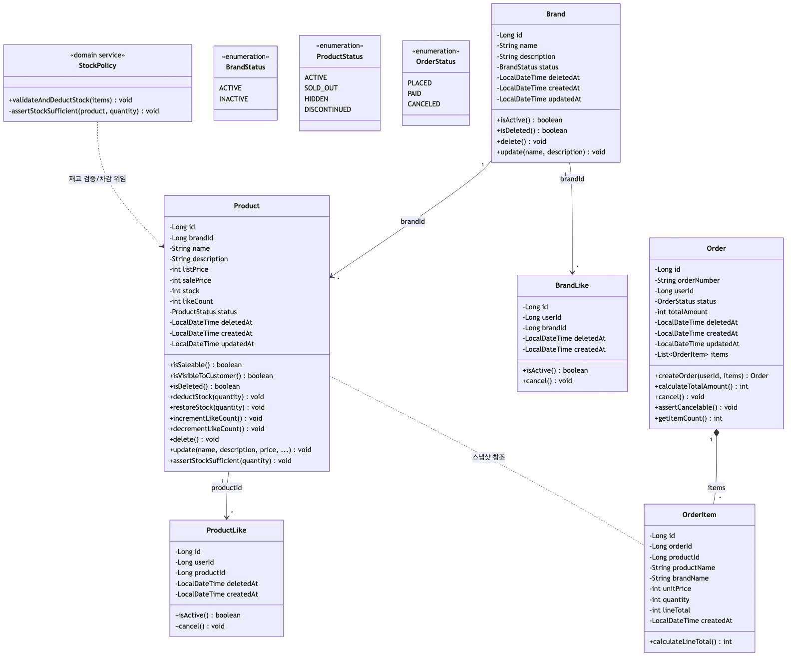
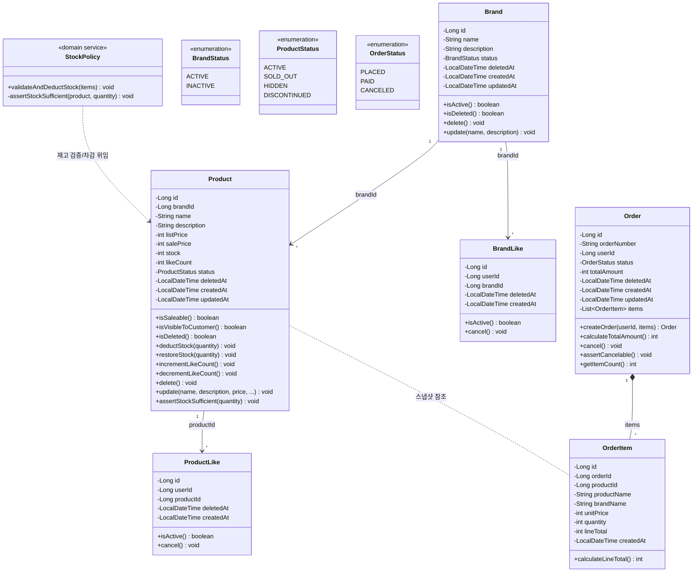

# 03. 도메인 객체 설계 (클래스 다이어그램)

---

## 설계 원칙

- **Entity**: 식별자(ID)를 가지며 생명주기가 있는 객체. 상태 변경 가능
- **VO (Value Object)**: 값 자체가 의미. 불변. 동등성 비교
- **Aggregate Root**: 외부에서 접근하는 유일한 진입점. 내부 일관성을 보장
- 연관 관계: **단방향 기본**, 양방향 최소화
- 비즈니스 규칙은 도메인 객체에 위치 (Service에 로직 집중 방지)
- Lombok 사용 금지, 생성자/getter 직접 작성 (CLAUDE.md 규칙)

---

## 1. 핵심 도메인 클래스 다이어그램



<details>
<summary>Mermaid 원본</summary>



</details>

---

## 2. Aggregate 경계

| Aggregate Root | 포함 Entity/VO | 설명 |
|---------------|---------------|------|
| **Brand** | Brand | 브랜드 정보 관리. 삭제 시 소속 Product 연쇄 삭제 (Service 레벨 조율) |
| **Product** | Product | 상품 정보 + 재고 + 좋아요 수 관리 |
| **ProductLike** | ProductLike | 좋아요 단독 Aggregate (Product와는 ID 참조만) |
| **BrandLike** | BrandLike | 브랜드 좋아요 단독 Aggregate (현재 API 미노출, 향후 확장용 선제 설계) |
| **Order** | Order, OrderItem | 주문 + 주문항목은 동일 Aggregate. OrderItem은 Order를 통해서만 접근 |

### Aggregate 경계 설계 근거

- **ProductLike를 Product Aggregate에 포함하지 않은 이유**: Like의 생명주기는 Product와 독립적. Product 변경 없이 Like만 생성/삭제될 수 있음. 포함 시 Product 잠금 범위가 불필요하게 넓어짐
- **OrderItem을 Order에 포함한 이유**: OrderItem은 Order 없이 존재할 수 없고, 주문 생성 시 함께 생성됨. 외부에서 OrderItem을 직접 조작하는 유스케이스 없음

---

## 3. Entity vs VO 경계

| 구분 | 타입 | 근거 |
|------|------|------|
| Brand | Entity | 식별자(id) 존재, 상태 변경 가능 |
| Product | Entity | 식별자 존재, 재고/가격/상태 변경 |
| ProductLike | Entity | 식별자 존재, 생성/삭제 생명주기 |
| BrandLike | Entity | 식별자 존재, 생성/삭제 생명주기 |
| Order | Entity | 식별자 존재, 상태 전이 |
| OrderItem | Entity | 식별자 존재, Order에 종속된 생명주기 |
| BrandStatus | Enum (VO) | 값 자체가 의미, 불변 |
| ProductStatus | Enum (VO) | 값 자체가 의미, 불변 |
| OrderStatus | Enum (VO) | 값 자체가 의미, 불변 |

### VO 적용 확장 가능 지점

현재는 구현 범위 내에서 과설계를 방지하기 위해 primitive 타입을 사용하되, 향후 아래 지점에 VO 도입 가능:

- **Money(Price)**: `listPrice`, `salePrice` → `Money` VO로 통합 시 통화/정밀도 규칙 캡슐화
- **Quantity**: `stock`, `quantity` → 음수 방지/최대값 규칙 캡슐화
- **OrderNumber**: 생성 규칙이 복잡해지면 VO로 분리

---

## 4. 핵심 도메인 규칙의 위치

| 규칙 | 위치 | 설명 |
|------|------|------|
| 복수 상품 재고 일괄 검증/차감 | `StockPolicy.validateAndDeductStock()` | 도메인 서비스 - 여러 상품의 재고를 원자적으로 처리 |
| 단일 상품 재고 충분 여부 검증 | `Product.assertStockSufficient()` | 도메인 불변 규칙 - 상품이 자신의 재고를 검증 |
| 재고 차감 | `Product.deductStock()` | 도메인 행위 - stock < 0 방지 |
| 재고 복원 | `Product.restoreStock()` | 취소 시 재고 복원 |
| 좋아요 수 증감 | `Product.incrementLikeCount()` / `decrementLikeCount()` | 도메인 행위 - likeCount < 0 방지 |
| 판매 가능 여부 | `Product.isSaleable()` | status == ACTIVE && stock > 0 |
| 브랜드 삭제 시 상품 연쇄 삭제 | `BrandAdminService` | Application 레벨 조율 (Aggregate 간 조율) |
| 주문 스냅샷 생성 | `Order.createOrder()` / `OrderItem` 생성자 | 도메인 팩토리 - 주문 시점 정보 고정 |
| 주문 취소 가능 여부 | `Order.assertCancelable()` | status == PLACED만 취소 가능 |
| 주문 총액 계산 | `Order.calculateTotalAmount()` | OrderItem.lineTotal의 합 |

---

## 5. Repository 책임 범위

| Repository | 대상 | 핵심 메서드 | 비고 |
|-----------|------|-----------|------|
| `BrandRepository` | Brand | `findById`, `save`, `findAll(pageable)` | |
| `ProductRepository` | Product | `findById`, `findByIdForUpdate`, `save`, `findByConditions(brandId, sort, pageable)`, `softDeleteAllByBrandId` | 비관적 락 지원 |
| `ProductLikeRepository` | ProductLike | `findByUserIdAndProductId`, `save`, `findByUserId(pageable)` | UK: (user_id, product_id) |
| `BrandLikeRepository` | BrandLike | `findByUserIdAndBrandId`, `save`, `findByUserId(pageable)` | UK: (user_id, brand_id) |
| `OrderRepository` | Order + OrderItem | `findById`, `save`, `findByUserIdAndDateRange(userId, startAt, endAt, pageable)` | OrderItem은 Order와 함께 영속화 |

---

## 6. 계층 간 의존성

```
Controller → Service/Facade → Domain(Entity/Policy) → Repository(Interface)
                                                            ↑
                                                    JPA Implementation
```

- Controller → Service: 단방향만 허용
- Service → Repository: 인터페이스 의존 (구현체는 인프라)
- Domain Entity: Repository 직접 참조 금지
- Service 간 순환 참조 금지

---

> 향후 확장 클래스 구조(Inventory, Coupon, Variant, Payment 등)는 [`future/03-class-diagram-expansion.md`](./future/03-class-diagram-expansion.md) 참조
