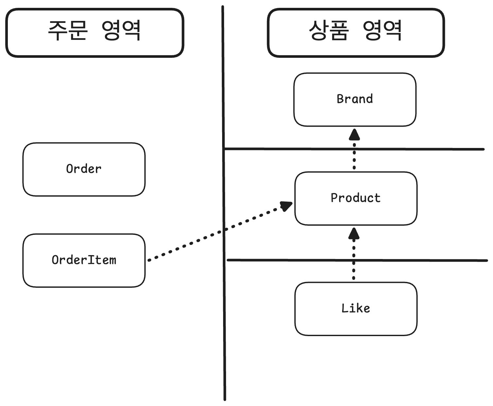
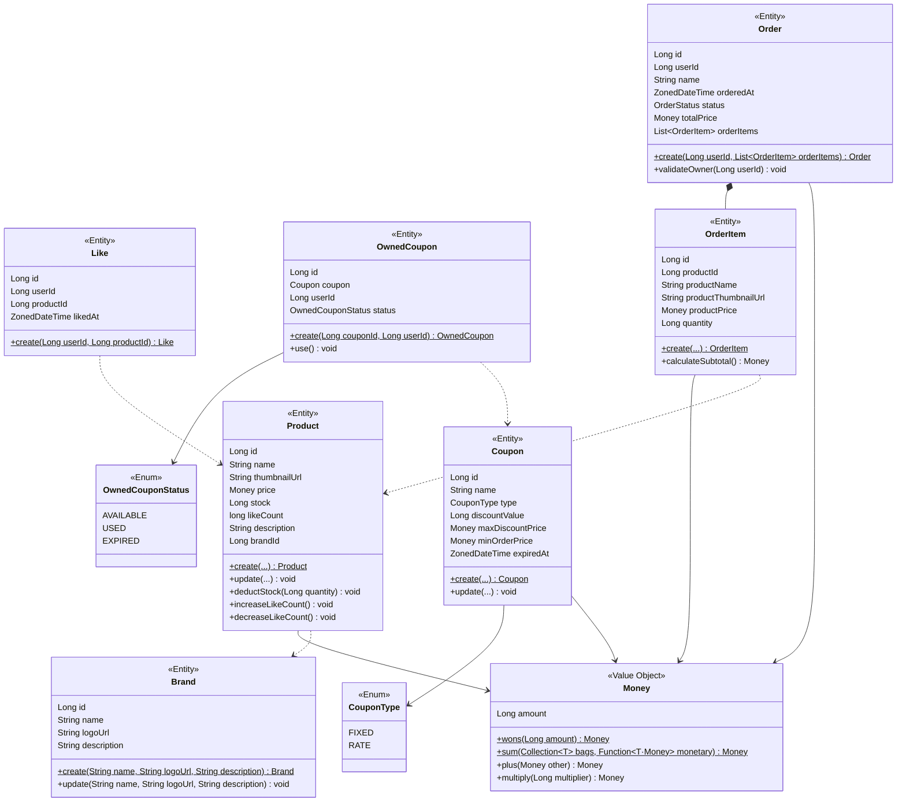

# Class Diagram

LAST UPDATED: 2026-03-01

## 목차
- [개요](#개요)
- [도메인 개념도](#도메인-개념도)
- [전체 도메인 클래스 다이어그램](#전체-도메인-클래스-다이어그램)
  - [설계 포인트](#설계-포인트)

## 개요

이 문서는 감성 이커머스 플랫폼의 도메인 모델을 클래스 다이어그램으로 정의한다.
[01-requirements.md](./01-requirements.md)의 요구사항과 [02-sequence-diagrams.md](./02-sequence-diagrams.md)의 API 흐름을 기반으로, 
각 도메인의 엔티티, 값 객체(Value Object), 열거형(Enum)과 이들의 관계를 Mermaid 클래스 다이어그램으로 표현한다.
용어 정의는 [00-glossary.md](./00-glossary.md)를 참고한다.

- 대상 도메인: 회원, 브랜드, 상품, 좋아요, 쿠폰, 주문

---

## 도메인 개념도

시스템의 도메인을 **주문 영역**, **쿠폰 영역**, **상품 영역**으로 분리한다.

- **주문 영역**: Order, OrderItem
- **쿠폰 영역**: Coupon, OwnedCoupon
- **상품 영역**: Brand, Product, Like
- **점선 화살표**: 도메인 경계를 넘는 ID 기반 참조
- 도메인 내부 객체는 직접 참조하고, 도메인 간에는 ID로만 참조하여 경계를 명확히 유지한다.

---

## 전체 도메인 클래스 다이어그램

### 설계 포인트

**공통**
- 모든 엔티티가 BaseEntity(`modules/jpa/.../domain/BaseEntity.java`)를 상속하여 `id`, `createdAt`, `updatedAt`, `deletedAt`을 공통으로 가진다. 다이어그램에서 `id`만 표기하고 나머지 감사 필드는 생략했다.
- Money는 원(KRW) 단위 정수(`Long`)로 관리한다.

**도메인 간 참조**
- 연관관계는 탐색 가능성을 기준으로 설정한다. 도메인 내부에서 함께 탐색되는 객체만 직접 참조하고, 도메인 경계를 넘는 참조는 ID로 대체한다.
- 도메인 간 참조를 ID 기반으로 하는 이유는, 직접 객체 참조를 사용하면 JPA가 도메인 간 연관관계를 관리하게 되어 한 도메인의 변경이 다른 도메인에 영향을 미치기 때문이다. ID 참조로 도메인 경계를 명확히 분리한다.
