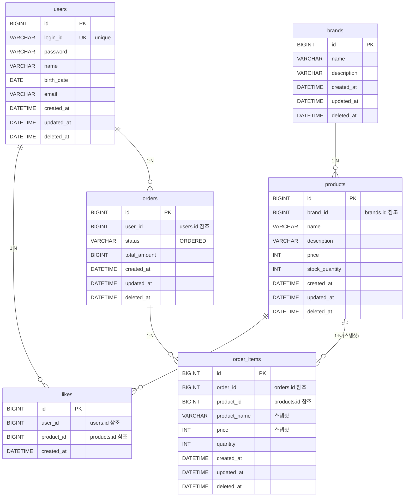

# 04. ERD

## ER 다이어그램

## 테이블 설명

### users (1주차 완성)

- 유저 정보 관리
- `login_id`에 UNIQUE 제약

### brands

- 브랜드 정보 관리
- soft delete (`deleted_at`)

### products

- 상품 정보 관리
- `brand_id`로 brands 참조 (FK 제약 미사용, 애플리케이션 레벨에서 관리)
- soft delete (`deleted_at`)

### likes

- 사용자-상품 좋아요 관계
- `user_id` + `product_id` 복합 UNIQUE 제약
- hard delete (삭제 시 레코드 완전 제거)
- `updated_at`, `deleted_at` 없음

### orders

- 주문 정보 관리
- `status`는 현재 ORDERED만 사용, 추후 확장
- `total_amount`는 주문 시점 최종 결제 금액
- soft delete (`deleted_at`)

### order_items

- 주문 항목 (Order 하위)
- `product_name`, `price`는 주문 시점 스냅샷
- 원본 상품 변경/삭제와 무관하게 주문 내역 유지
- `order_id`로 orders 참조, `product_id`로 원본 상품 참조

## 인덱스 고려사항

| 테이블 | 컬럼 | 사유 |
|--------|------|------|
| users | login_id | 로그인 시 조회 (UNIQUE) |
| products | brand_id | 브랜드별 상품 필터링 |
| likes | (user_id, product_id) | 중복 좋아요 방지 (UNIQUE) + 조회 |
| likes | product_id | 상품별 좋아요 수 집계 |
| orders | user_id | 사용자별 주문 목록 조회 |
| order_items | order_id | 주문별 항목 조회 |