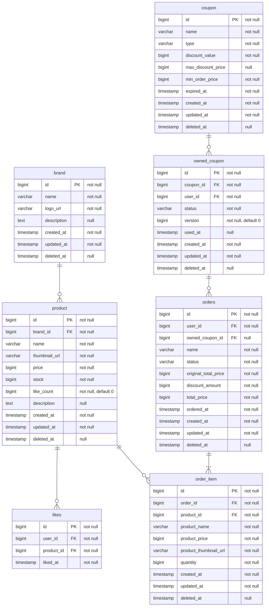

# ERD (Entity Relationship Diagram)

LAST UPDATED: 2026-03-03

## 목차
- [개요](#개요)
- [ERD](#erd)
- [설계 포인트](#설계-포인트)

## 개요

이 문서는 감성 이커머스 플랫폼의 데이터베이스 구조를 ERD(Entity Relationship Diagram)로 정의한다.
[03-class-diagram.md](./03-class-diagram.md)의 도메인 모델을 기반으로, 각 테이블의 컬럼, 제약 조건, 테이블 간 관계를 Mermaid ERD로 표현한다.
용어 정의는 [00-glossary.md](./00-glossary.md)를, 요구사항은 [01-requirements.md](./01-requirements.md)를 참고한다.

- 대상 도메인: 회원, 브랜드, 상품, 좋아요, 쿠폰, 주문

## ERD

## 설계 포인트

### 좋아요 수 비정규화

- 좋아요 수를 `product.like_count` 컬럼에 비정규화하여 저장한다.
- 좋아요 등록/취소 시 `likes` 테이블과 `product.like_count`를 동일 트랜잭션에서 동기화한다.
- 조회 시 likes 테이블을 집계하지 않고 `product.like_count`를 직접 읽는다.
- 동시성 제어: 아토믹 업데이트(`UPDATE SET likeCount = likeCount ± 1`)로 lost update를 방지한다.
- 결정 배경과 상세: [ADR - likeCount 비정규화](../adr/01-like-count-denormalization.md) 참고.

### 좋아요 삭제 방식

- likes 테이블은 BaseEntity를 상속하지 않으며, 좋아요 취소 시 **물리 삭제(hard delete)**를 사용한다.
- 좋아요는 등록/취소가 빈번하고 이력 보존이 불필요하므로, insert/delete로 단순하게 처리한다.

### 유니크 제약 조건

- `likes`: `(user_id, product_id)` UNIQUE — 한 사용자가 동일 상품에 하나의 좋아요만 등록 가능
- `owned_coupon`: `(coupon_id, user_id)` UNIQUE — 한 사용자가 동일 쿠폰을 1매만 발급 가능

### 주문 상태

- `orders.status`는 `OrderStatus` enum을 문자열로 저장한다.
- 현재 사용하는 상태값: `CREATED` (주문 생성 시 초기 상태)
- 상태 전이(배송, 완료, 취소 등)는 현재 과제 범위 밖이다.

### 쿠폰 발급 동시성 제어

- 1인 1매 보장: `UNIQUE(coupon_id, user_id)` + `DataIntegrityViolationException` 처리

### 쿠폰 적용 스냅샷

- 주문 시점의 할인 정보(원가, 할인액, 결제액)를 `orders` 테이블에 저장한다.
- `original_total_price`: 할인 적용 전 주문 총액
- `discount_amount`: 실제 적용된 할인 금액 (쿠폰 미적용 시 0)
- `total_price`: 최종 결제 금액 (`original_total_price - discount_amount`)
- `owned_coupon_id`: 사용된 `OwnedCoupon.id`를 저장하며, 쿠폰 미적용 시 NULL

### EXPIRED 실시간 판정

- DB에 EXPIRED 상태를 저장하지 않고, `coupon.expired_at` 기준으로 조회 시 실시간 판정한다.
- 만료일 변경 시 `owned_coupon` 레코드를 일괄 업데이트할 필요가 없다.

