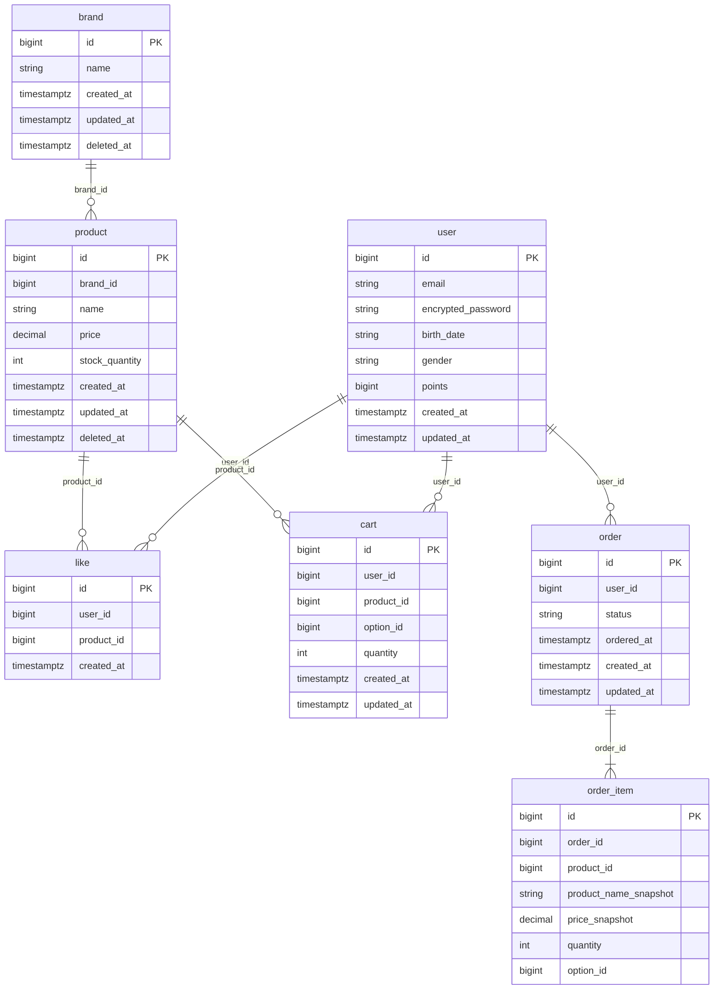

# ERD (Brand, Product, Like, Cart, Order)

> 본 문서는 **영속성 구조**, **관계의 주인**, **정규화 여부** 확인을 위해 ERD를 사용한다.  
> **관계 설계 원칙**: FK **제약**은 사용하지 않고, **참조용 컬럼**만 두어 조인·조회는 동일하게 사용한다. 참조 정합성은 서비스 레이어에서 검증한다.  
> 참조: [00-ubiquitous-language.md](./00-ubiquitous-language.md), [01-requirements.md](./01-requirements.md), [02-sequence-diagrams.md](./02-sequence-diagrams.md), [03-class-diagram.md](./03-class-diagram.md)

---

## 0. ERD가 중요한 이유

- **도메인 모델의 물리적 구현 기반**: 클래스 다이어그램(03)의 엔티티가 어떤 테이블·컬럼으로 매핑되는지 정의한다.
- **성능 이슈와 직결**: 조회 쿼리, 인덱스 전략이 ERD 구조에 의존한다.
- **API·도메인·DB 간 구조 일관성**: 용어(00)와 요구사항(01)이 테이블·컬럼명으로 일치하도록 유지한다.

### 접근 원칙

| 원칙 | 적용 |
|------|------|
| **1:N 관계** | N 쪽 테이블에 참조 컬럼(`xxx_id`)만 둠. **FK 제약은 DDL에 넣지 않음.** |
| **N:M** | 조인 테이블(예: like는 user–product 다대다를 user_id, product_id로 표현). 복합 UNIQUE로 비즈니스 제약. |
| **enum** | VARCHAR 또는 코드 값 저장(예: order.status, user.gender). |
| **soft delete** | `deleted_at` 컬럼 사용. NULL이면 미삭제. |
| **상태 관리** | `status` 컬럼으로 명확한 상태 전이 표현(예: order.status = ORDERED, PAID, CANCELLED). |
| **재고 동시성** | 재고 차감·복구 시 **비관적 락**(예: JPA `@Lock(LockModeType.PESSIMISTIC_WRITE)`, SELECT FOR UPDATE)을 사용하여 음수 재고를 방지한다. |

---

## 1. 전체 ERD

- DB 테이블·컬럼·**논리적 관계**(참조 컬럼)가 요구사항(01)의 삭제 정책·브랜드-상품 소속·주문 스냅샷·1인 1좋아요에 맞게 설계되었는지 검증하기 위함.
- **FK 제약은 사용하지 않음**. 관계는 참조 컬럼으로만 표현하고, 조인·조회는 동일하게 사용.

### 다이어그램

- 위 관계선은 **논리적 관계**(어떤 컬럼이 어떤 테이블의 id를 참조하는지)를 나타낸다. **DDL에는 FOREIGN KEY 제약을 생성하지 않는다.**

### 해석

- **봐야 할 포인트**
  - **관계의 주인(참조 컬럼 보유)**: product.brand_id, like.user_id/product_id, cart.user_id/product_id, order.user_id, order_item.order_id. 조회 시 `ON b.id = p.brand_id` 등으로 조인. FK 제약은 없으므로 참조 정합성은 서비스에서 저장 전 검증.
  - **삭제 정책**: brand·product는 `deleted_at`(soft delete). like·cart는 물리 DELETE. order는 물리 삭제 금지, 취소는 `status` 변경.
  - **1인 1좋아요**: `like` 테이블에 **UNIQUE(user_id, product_id)** 제약으로 보장(구현 시 DDL에 포함).
  - **상태**: order.status로 ORDERED, PAID, CANCELLED 등 상태 전이 표현. 전이 규칙은 §2 아래 "주문 상태 전이 규칙" 표 참고.
  - **재고 락**: product.stock_quantity 갱신(차감·복구) 시 비관적 락을 적용한다. 구현 시 Repository/Service에서 조회·차감을 한 트랜잭션 내에서 수행.
- **정규화**: order_item의 상품명·가격 중복은 의도적 비정규화(주문 이력 보존). 그 외는 3NF 수준.

### 잠재 리스크 및 보완

- **참조 무결성**: DB가 존재하지 않는 id 저장을 막지 않음. → 저장/수정 경로를 서비스로 일원화하고, 저장 전 참조 대상 존재·유효 여부 검증 + 실패 케이스 테스트로 보완.
- **연쇄 삭제**: Brand 삭제 시 Product soft delete를 서비스에서 빼먹을 수 있음. → 연쇄 로직을 한 서비스 메서드에 모으고, "Brand 삭제 후 해당 product.deleted_at 설정"을 통합 테스트로 검증.

---

## 2. 테이블·컬럼 요약

| 테이블 | PK | 주요 컬럼 | 삭제 방식 | 비고 |
|--------|-----|------------|-----------|------|
| **user** | id | email, encrypted_password, birth_date, gender, points | - | Like/Cart/Order의 user_id 참조(참조 컬럼만, FK 제약 없음) |
| **brand** | id | name, deleted_at | Soft delete | deleted_at NULL이면 미삭제 |
| **product** | id | brand_id, name, price, stock_quantity, deleted_at | Soft delete | brand_id는 brand.id 참조(참조 컬럼만) |
| **like** | id | user_id, product_id, created_at | Hard delete | UNIQUE(user_id, product_id) 로 1인 1좋아요 |
| **cart** | id | user_id, product_id, option_id, quantity | Hard delete | 동일 상품·옵션 시 수량 합산 |
| **order** | id | user_id, status, ordered_at | 물리 삭제 금지 | status로 취소 등 상태 전이. 구현 시 테이블명 `orders` 사용 가능 |
| **order_item** | id | order_id, product_id, product_name_snapshot, price_snapshot, quantity, option_id | Order와 동일 | 스냅샷: 주문 시점 값 보존 |

### 주문 상태 전이 규칙 (order.status)

| 상태 | 설명 | 취소 가능 |
|------|------|-----------|
| ORDERED | 주문 생성 직후(결제 전) | 가능(즉시) |
| PAID | 결제 완료 | 가능(재고 복구 후 CANCELLED) |
| SHIPPING | 배송 중 | 불가 |
| DELIVERED | 배송 완료 | 불가 |
| CANCELLED | 취소됨 | - |

- **규칙**: 주문 생성 시 초기값은 ORDERED. 결제·배송 도메인 추가 시 PAID, SHIPPING, DELIVERED로 확장. 취소 시 ORDERED/PAID → CANCELLED만 허용.

---

## 3. 관계·참조 요약

| 관계 | 참조 컬럼(주인) | 카디널리티 | 비고 |
|------|-----------------|------------|------|
| Brand → Product | product.brand_id | N : 1 | 상품은 하나의 브랜드에만 속함 |
| User → Like | like.user_id | 1 : N | UNIQUE(user_id, product_id)로 1인 1상품 1좋아요 |
| Product → Like | like.product_id | 1 : N | |
| User → Cart | cart.user_id | 1 : N | |
| Product → Cart | cart.product_id | 1 : N | |
| User → Order | order.user_id | 1 : N | |
| Order → Order_item | order_item.order_id | 1 : N | 주문 항목은 주문에 종속 |

- 위 참조 컬럼에 대한 **FOREIGN KEY 제약은 DDL에 정의하지 않는다.** 조인은 `테이블.id = 상대테이블.xxx_id` 로 수행.

---

## 4. 인덱스 권장 (성능)

| 테이블 | 인덱스 | 목적 |
|--------|--------|------|
| product | idx_product_brand_id (brand_id) | 브랜드별 상품 조회, 조인 |
| like | idx_like_user_id (user_id), idx_like_product_id (product_id) | 사용자별 좋아요 목록, 상품별 좋아요 수 |
| like | uk_like_user_product (user_id, product_id) UNIQUE | 1인 1좋아요 보장 |
| cart | idx_cart_user_id (user_id) | 사용자별 장바구니 조회 |
| order | idx_order_user_id (user_id), idx_order_ordered_at (ordered_at) | 사용자별·기간별 주문 조회 |
| order_item | idx_order_item_order_id (order_id) | 주문별 항목 조회 |

### 인기순(좋아요 많은 순) 정렬 성능

- 상품 목록 "인기순" 정렬은 `like` 테이블의 `product_id`별 COUNT로 구현 가능하다. `idx_like_product_id`로 집계 쿼리 성능을 확보한다.
- **보완**: 상품 수·트래픽이 커지면 상품별 좋아요 수를 **캐시(Redis)** 또는 **집계 컬럼/테이블**로 유지하고, 정렬 시 해당 값을 사용하는 방안을 검토한다.

---

## 5. 구현 시 유지할 것

- **참조 컬럼**: brand_id, user_id, product_id, order_id는 그대로 두고, 조인·조회는 현재 ERD와 동일하게 사용.
- **UNIQUE(user_id, product_id)** on like: 1인 1좋아요 보장을 위해 DDL에 포함.
- **JPA**: 다른 애그리거트 참조는 `Long brandId`, `Long userId` 등 ID만 두고, `@ManyToOne` 사용하지 않음. DDL은 Flyway/Liquibase로 관리 시 REFERENCES 절 포함하지 않음.
- **참조 정합성**: 저장/수정 전 서비스에서 참조 대상 존재·미삭제 여부 검증.

---
