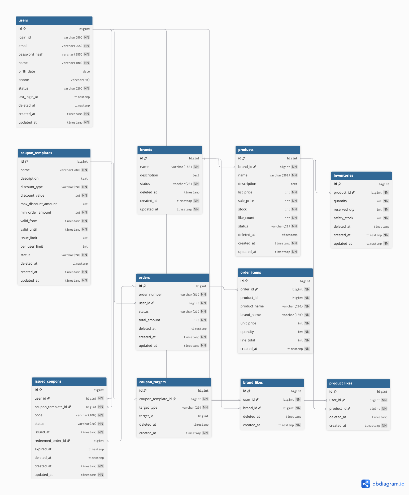
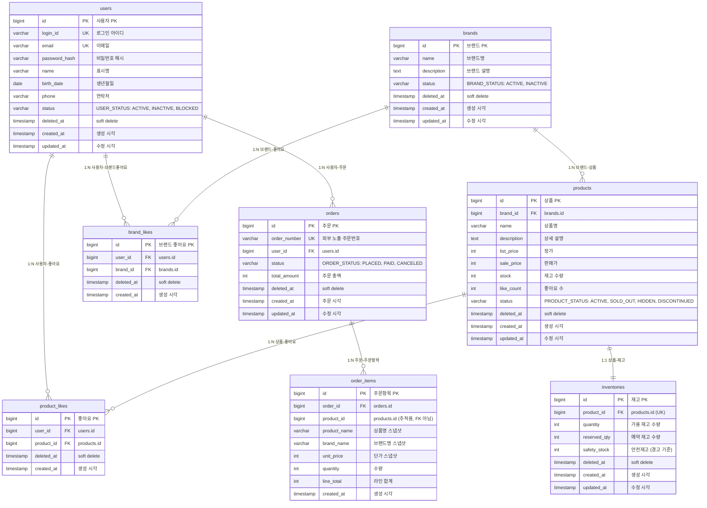

# 04. 전체 테이블 구조 및 관계 정리 (ERD)

---

## 설계 원칙

- 소프트 삭제: 모든 테이블에 `deleted_at` 컬럼 (물리 삭제 금지)
- 상태 관리: `status` VARCHAR 컬럼으로 명확한 상태 전이 표현
- enum: VARCHAR 저장 (코드 가독성 + 확장성)
- 1:N 관계: FK로 표현
- 조회 시 `deleted_at IS NULL` 조건 필수
- DBML 원본: `04-erd.dbml` 참조

---

## 1. 핵심 ERD (현재 구현 범위)

Mermaid 원본

---

## 2. 테이블 상세 명세

### 2-1. brands (브랜드)

| 컬럼 | 타입 | 제약 | 설명 |
|------|------|------|------|
| id | BIGINT | PK, AUTO_INCREMENT | 브랜드 PK |
| name | VARCHAR(150) | NOT NULL | 브랜드명 |
| description | TEXT | | 브랜드 설명 |
| status | VARCHAR(20) | NOT NULL, DEFAULT 'ACTIVE' | BRAND_STATUS |
| deleted_at | TIMESTAMP | NULL | soft delete |
| created_at | TIMESTAMP | NOT NULL | 생성 시각 |
| updated_at | TIMESTAMP | NOT NULL | 수정 시각 |

**인덱스**: `idx_brands_status(status)`, `idx_brands_deleted_at(deleted_at)`

---

### 2-2. products (상품)

| 컬럼 | 타입 | 제약 | 설명 |
|------|------|------|------|
| id | BIGINT | PK, AUTO_INCREMENT | 상품 PK |
| brand_id | BIGINT | FK(brands.id), NOT NULL | 소속 브랜드 |
| name | VARCHAR(200) | NOT NULL | 상품명 |
| description | TEXT | | 상세 설명 |
| list_price | INT | NOT NULL | 정가 (할인 전 가격) |
| sale_price | INT | NOT NULL | 판매가 |
| stock | INT | NOT NULL, DEFAULT 0 | 재고 수량 (0 이상) |
| like_count | INT | NOT NULL, DEFAULT 0 | 좋아요 수 (0 이상) |
| status | VARCHAR(20) | NOT NULL, DEFAULT 'ACTIVE' | PRODUCT_STATUS |
| deleted_at | TIMESTAMP | NULL | soft delete |
| created_at | TIMESTAMP | NOT NULL | 생성 시각 |
| updated_at | TIMESTAMP | NOT NULL | 수정 시각 |

**인덱스**: `idx_products_brand_id(brand_id)`, `idx_products_status(status)`, `idx_products_deleted_at(deleted_at)`, `idx_products_created_at(created_at)`, `idx_products_sale_price(sale_price)`, `idx_products_like_count(like_count)`

**설계 결정**:
- `stock`을 products에 직접 포함: 현재 구현 범위에서는 상품 단위 재고로 충분. 향후 Variant/옵션별 재고가 필요하면 별도 `inventories` 테이블로 분리
- `like_count`를 products에 직접 포함: 상품 목록 조회 시 좋아요순 정렬에 사용. 집계 쿼리 대비 조회 성능 이점. 동시성 이슈는 원자적 UPDATE로 대응

---

### 2-3. product_likes (상품 좋아요)

| 컬럼 | 타입 | 제약 | 설명 |
|------|------|------|------|
| id | BIGINT | PK, AUTO_INCREMENT | 좋아요 PK |
| user_id | BIGINT | FK(users.id), NOT NULL | 사용자 |
| product_id | BIGINT | FK(products.id), NOT NULL | 대상 상품 |
| deleted_at | TIMESTAMP | NULL | soft delete (취소 시) |
| created_at | TIMESTAMP | NOT NULL | 좋아요 시각 |

**유니크 제약**: `uk_product_likes(user_id, product_id)` - 사용자당 상품별 좋아요 1건 보장

**인덱스**: `idx_product_likes_user_id(user_id)`, `idx_product_likes_product_id(product_id)`, `idx_product_likes_deleted_at(deleted_at)`

**soft delete와 유니크 제약 조합 정책**:
- MySQL에서 `(user_id, product_id)` UNIQUE + deleted_at NULL 조합을 정확히 강제하려면:
  - **방안 A**: 취소 시 hard delete → 유니크 자연 보장 (단순, 이력 없음)
  - **방안 B**: generated column 활용 → `UNIQUE(user_id, product_id, active_flag)` where active_flag = IF(deleted_at IS NULL, 1, NULL)
  - **방안 C**: 애플리케이션에서 선조회 후 제어 + DB UK는 (user_id, product_id)로 설정하고 deleted_at IS NULL 조건은 쿼리에서 처리
- **본 설계 기본**: 방안 C (애플리케이션 검증 우선 + DB 유니크는 안전망)

---

### 2-4. brand_likes (브랜드 좋아요)

| 컬럼 | 타입 | 제약 | 설명 |
|------|------|------|------|
| id | BIGINT | PK, AUTO_INCREMENT | 좋아요 PK |
| user_id | BIGINT | FK(users.id), NOT NULL | 사용자 |
| brand_id | BIGINT | FK(brands.id), NOT NULL | 대상 브랜드 |
| deleted_at | TIMESTAMP | NULL | soft delete |
| created_at | TIMESTAMP | NOT NULL | 좋아요 시각 |

**유니크 제약**: `uk_brand_likes(user_id, brand_id)`

**인덱스**: `idx_brand_likes_user_id(user_id)`, `idx_brand_likes_brand_id(brand_id)`, `idx_brand_likes_deleted_at(deleted_at)`

---

### 2-5. orders (주문)

| 컬럼 | 타입 | 제약 | 설명 |
|------|------|------|------|
| id | BIGINT | PK, AUTO_INCREMENT | 주문 PK |
| order_number | VARCHAR(50) | UNIQUE, NOT NULL | 외부 노출 주문번호 |
| user_id | BIGINT | FK(users.id), NOT NULL | 주문자 |
| status | VARCHAR(20) | NOT NULL, DEFAULT 'PLACED' | ORDER_STATUS |
| total_amount | INT | NOT NULL | 주문 총액 (order_items.line_total의 합산) |
| deleted_at | TIMESTAMP | NULL | soft delete |
| created_at | TIMESTAMP | NOT NULL | 주문 시각 |
| updated_at | TIMESTAMP | NOT NULL | 수정 시각 |

**인덱스**: `uk_orders_order_number(order_number)`, `idx_orders_user_id_created_at(user_id, created_at)`, `idx_orders_status(status)`, `idx_orders_deleted_at(deleted_at)`

**order_number 생성 정책**: 날짜 + 시퀀스 조합 (예: `ORD-20260213-00001`) 또는 UUID 기반. 외부 노출 시 id 대신 사용

---

### 2-6. order_items (주문항목 - 스냅샷)

| 컬럼 | 타입 | 제약 | 설명 |
|------|------|------|------|
| id | BIGINT | PK, AUTO_INCREMENT | 주문항목 PK |
| order_id | BIGINT | FK(orders.id), NOT NULL | 소속 주문 |
| product_id | BIGINT | NOT NULL | 원본 상품 ID (추적/정산용, **FK 아님**) |
| product_name | VARCHAR(200) | NOT NULL | **상품명 스냅샷** |
| brand_name | VARCHAR(150) | NOT NULL | **브랜드명 스냅샷** |
| unit_price | INT | NOT NULL | **단가 스냅샷** (주문 시점 판매가) |
| quantity | INT | NOT NULL | 주문 수량 |
| line_total | INT | NOT NULL | 라인 합계 (unit_price * quantity) |
| created_at | TIMESTAMP | NOT NULL | 생성 시각 |

**인덱스**: `idx_order_items_order_id(order_id)`

**스냅샷 설계 의도**:
- `product_name`, `brand_name`, `unit_price`는 주문 시점의 값을 고정 저장
- 원본 상품이 이후 변경/삭제되어도 주문 상세 조회 시 당시 정보를 정확히 표시
- `product_id`는 FK constraint 없음 (원본 삭제 시에도 주문 데이터 유지, 추적/정산용으로만 사용)

---

### 2-7. inventories (재고)

| 컬럼 | 타입 | 제약 | 설명 |
|------|------|------|------|
| id | BIGINT | PK, AUTO_INCREMENT | 재고 PK |
| product_id | BIGINT | FK(products.id), UNIQUE, NOT NULL | 상품 1:1. 향후 Variant 도입 시 variant_id로 전환 |
| quantity | INT | NOT NULL, DEFAULT 0 | 가용 재고 수량 (0 이상) |
| reserved_qty | INT | NOT NULL, DEFAULT 0 | 예약 재고 수량 (결제 진행 중 홀드) |
| safety_stock | INT | NOT NULL, DEFAULT 0 | 안전재고 (경고 기준) |
| deleted_at | TIMESTAMP | NULL | soft delete |
| created_at | TIMESTAMP | NOT NULL | 생성 시각 |
| updated_at | TIMESTAMP | NOT NULL | 수정 시각 |

**인덱스**: `uk_inventories_product_id(product_id)`, `idx_inventories_deleted_at(deleted_at)`

**재고 예약 흐름**:
- 가용 수량 = `quantity - reserved_qty` (0 이상)
- 주문서(OrderSheet) 생성 시: `reserved_qty += 수량` (HELD)
- 결제 성공 시: `quantity -= 수량`, `reserved_qty -= 수량` (CONFIRMED)
- 결제 실패/만료 시: `reserved_qty -= 수량` (RELEASED)

**현재 → 확장 전환 경로**:
- 현재: `products.stock`으로 즉시 차감 (현재 구현 범위)
- 확장: `inventories` 테이블의 reservation 모델로 전환
- Variant 도입 시: `product_id` → `variant_id`로 FK 전환

---

## 3. 제약 조건 및 정합성 정책 요약

| 테이블 | 제약 | 유형 | 설명 |
|--------|------|------|------|
| products | brand_id → brands.id | FK | 상품은 반드시 브랜드에 소속 |
| product_likes | (user_id, product_id) | UK | 중복 좋아요 방지 |
| brand_likes | (user_id, brand_id) | UK | 중복 좋아요 방지 |
| orders | order_number | UK | 주문번호 유일성 |
| order_items | order_id → orders.id | FK | 주문항목은 주문에 종속 |
| order_items | product_id | 참조만 | FK 아님 - 상품 삭제 시에도 스냅샷 유지 |
| inventories | product_id → products.id | FK + UK | 상품당 재고 1건 (1:1) |
| inventories | quantity >= 0 | 앱 검증 | 가용 재고 음수 방지. 애플리케이션 레벨 검증 필수 |
| inventories | reserved_qty >= 0 | 앱 검증 | 예약 재고 음수 방지. 애플리케이션 레벨 검증 필수 |
| products | stock >= 0 | 앱 검증 | 재고 음수 방지. 애플리케이션 레벨 검증 필수, DB CHECK constraint 선택적 추가 (MySQL 8.0.16+) |
| products | like_count >= 0 | 앱 검증 | 좋아요 수 음수 방지. 애플리케이션 레벨 검증 필수, DB CHECK constraint 선택적 추가 |

---

## 4. 소프트 삭제 정책 일관성

| 테이블 | soft delete | 정책 |
|--------|-----------|------|
| brands | deleted_at | 삭제 시 소속 products도 함께 soft delete |
| products | deleted_at | 삭제되어도 기존 order_items 스냅샷 유지 |
| product_likes | deleted_at | 좋아요 취소 = soft delete |
| brand_likes | deleted_at | 좋아요 취소 = soft delete |
| orders | deleted_at | 주문 취소는 status=CANCELED로 관리 (soft delete와 별도) |
| order_items | - | 삭제 없음 (주문과 생명주기 동일, 스냅샷이므로 변경/삭제 불가) |
| inventories | deleted_at | 상품 삭제 시 함께 soft delete |

---

## 5. 인덱스 전략

| 테이블 | 인덱스 | 용도 |
|--------|--------|------|
| products | `idx_products_brand_id` | 브랜드별 상품 필터링 |
| products | `idx_products_status` | 상태별 조회 |
| products | `idx_products_created_at` | 최신순 정렬 |
| products | `idx_products_sale_price` | 가격순 정렬 |
| products | `idx_products_like_count` | 좋아요순 정렬 |
| product_likes | `uk_product_likes(user_id, product_id)` | 중복 방지 + 존재 여부 조회 |
| brand_likes | `uk_brand_likes(user_id, brand_id)` | 중복 방지 + 존재 여부 조회 |
| orders | `idx_orders_user_id_created_at` | 사용자별 날짜 범위 조회 |
| order_items | `idx_order_items_order_id` | 주문별 항목 조회 |
| inventories | `uk_inventories_product_id(product_id)` | 상품당 재고 1건 보장 (1:1) |

---

> 향후 확장 ERD(Inventory, Coupon, 옵션/Variant, 장바구니, 결제 등)는 [`future/04-erd-expansion.md`](./future/04-erd-expansion.md) 참조
