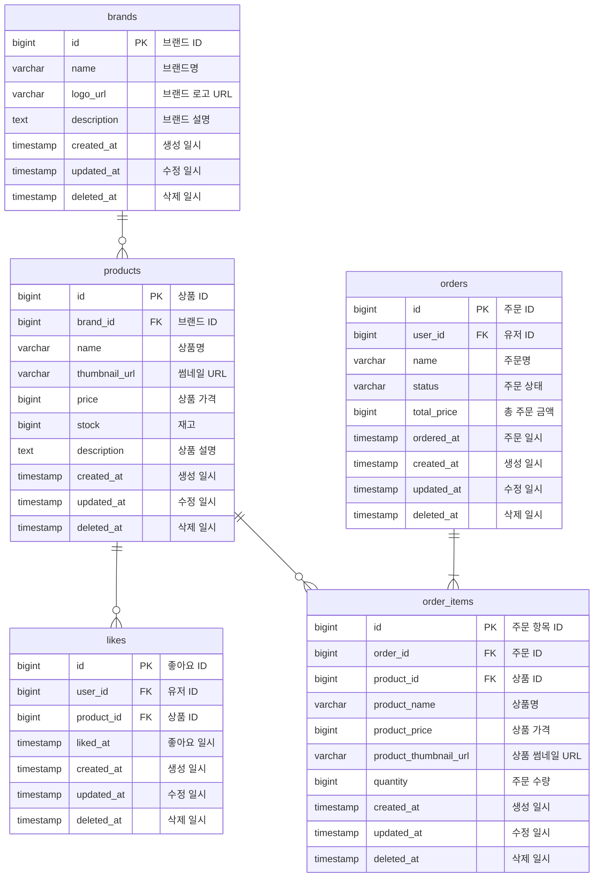

# ERD (Entity Relationship Diagram)

LAST UPDATED: 2026-02-12

## 목차
- [개요](#개요)
- [ERD](#erd)
- [설계 포인트](#설계-포인트)

## 개요

이 문서는 감성 이커머스 플랫폼의 데이터베이스 구조를 ERD(Entity Relationship Diagram)로 정의한다.
[03-class-diagram.md](./03-class-diagram.md)의 도메인 모델을 기반으로, 각 테이블의 컬럼, 제약 조건, 테이블 간 관계를 Mermaid ERD로 표현한다.
용어 정의는 [00-glossary.md](./00-glossary.md)를, 요구사항은 [01-requirements.md](./01-requirements.md)를 참고한다.

- 대상 도메인: 회원, 브랜드, 상품, 좋아요, 주문

## ERD

## 설계 포인트

### 좋아요 수

- 좋아요 수는 상품 테이블에 별도의 컬럼으로 저장하지 않고, likes 테이블에서 집계하여 조회한다.
- 추후 과제를 진행하면서 성능 이슈가 있을 경우 비정규화를 고려한다.

### 좋아요 삭제 방식

- likes 테이블은 BaseEntity를 상속하여 `deleted_at` 컬럼이 존재하지만, 좋아요 취소 시 **물리 삭제(hard delete)**를 사용한다.
- 좋아요는 등록/취소가 빈번하고 이력 보존이 불필요하므로, insert/delete로 단순하게 처리한다.

### 유니크 제약 조건

- `likes`: `(user_id, product_id)` UNIQUE — 한 사용자가 동일 상품에 하나의 좋아요만 등록 가능

### 주문 상태

- `orders.status`는 `OrderStatus` enum을 문자열로 저장한다.
- 현재 사용하는 상태값: `CREATED` (주문 생성 시 초기 상태)
- 상태 전이(배송, 완료, 취소 등)는 현재 과제 범위 밖이다.
