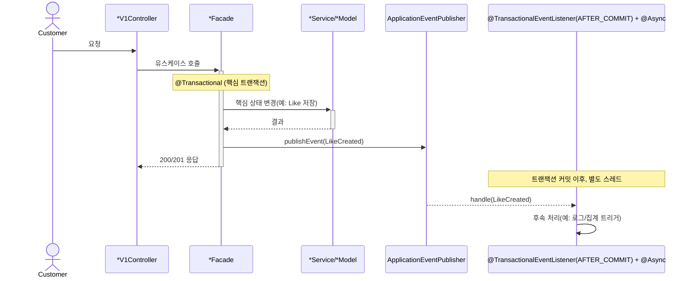
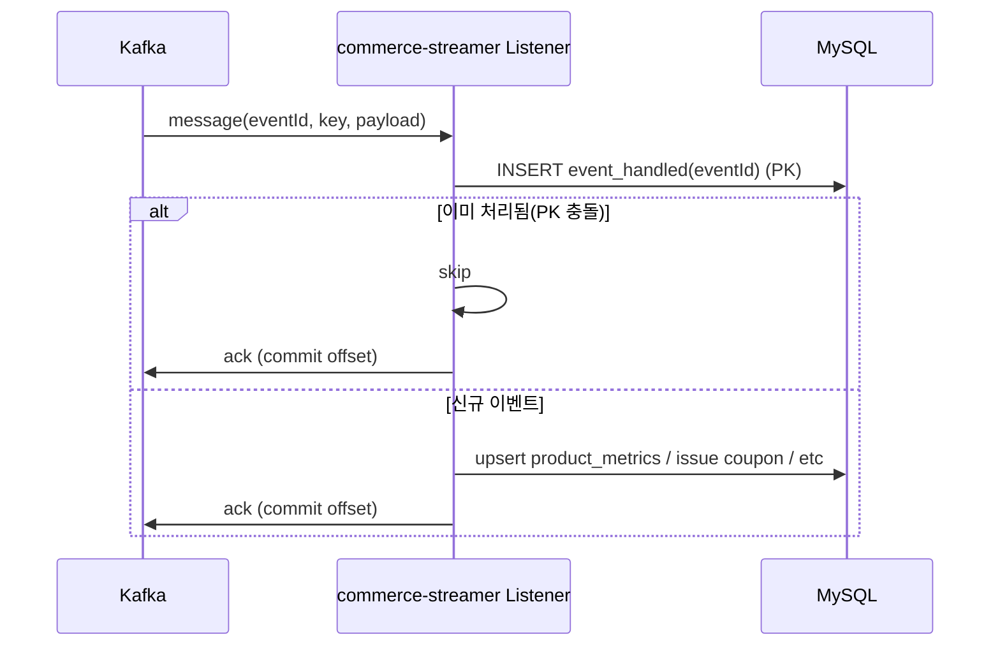
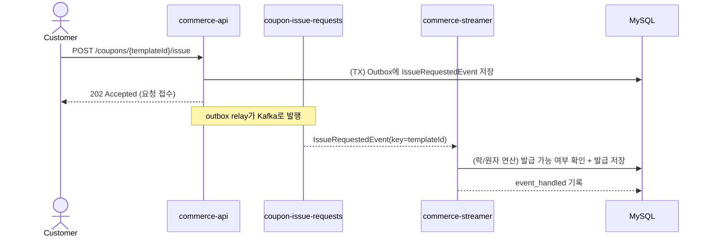

# 이벤트 기반 아키텍처 & Kafka 파이프라인 설계 (ApplicationEvent → Outbox → Kafka → Consumer)

> 목표: **무거운 동기 연산을 분리**하고, **서비스 경계 밖으로 이벤트를 발행**하여(Producer) 별도 Consumer 앱이 **후속 처리/운영 책임**을 담당하도록 한다.  
> 범위: (1) Spring `ApplicationEvent`로 **애플리케이션 내부 경계 분리**, (2) Kafka + **Transactional Outbox**로 **At-Least-Once 발행**, (3) Consumer의 **Idempotency + Manual Ack + DLQ**로 **신뢰 가능한 파이프라인**, (4) Kafka 기반 **선착순 쿠폰 발급** 시나리오.

---

## 0. 왜 이 문서가 필요한가 (문제 정의)

기존에는 주요 흐름이 하나의 트랜잭션에 결합되어 있었다.

```
createOrder()
 ├── 재고 차감
 ├── 쿠폰 사용
 ├── 결제 요청
 └── 주문 저장
```

### 문제점 (근거)


| 문제      | 설명                                            | 결과                       |
| ------- | --------------------------------------------- | ------------------------ |
| 실패 전파   | 외부 연동(PG) 지연/실패가 주문 전체 롤백으로 전파                | 사용자 경험 악화, 재시도/복구 난이도 상승 |
| 결합도 증가  | Order 흐름에 Product/Coupon/Payment/User가 동시에 엮임 | 변경 영향 범위 확대, 테스트 어려움     |
| 긴 트랜잭션  | DB 락/커넥션 점유 증가                                | TPS 저하, 장애 확산            |
| 재처리 어려움 | “어디까지 성공했나”가 불명확                              | 운영 복구가 수동/추측 기반이 됨       |


---

## 1. 분리 기준: “Command vs Event”로 경계 결정

### 1.1 원칙

- **Command(명령)**: “해라” → 호출자가 흐름을 **제어**하고, 실패를 **동기적으로** 다룬다.
- **Event(사실 통지)**: “발생했다” → 호출자는 통지하고, 후속 처리는 **구독자**가 책임진다.

### 1.2 무엇을 이벤트로 분리할 것인가 (판단 기준)


| 분리 후보                        | 이벤트로 분리 적합 조건             | 반대로 동기로 유지할 조건(근거)             |
| ---------------------------- | ------------------------- | ------------------------------ |
| 유저 행동 로깅, 알림, 집계             | “실패해도 핵심 유스케이스가 성공해야 함”   | 핵심 상태 변경(주문 확정, 재고 차감 등)       |
| 상품 좋아요 후 집계(product_metrics) | 좋아요 성공과 집계는 **사후 정합성** 허용 | 좋아요 자체가 실패하면 사용자 기능 실패         |
| 외부 시스템 전파(데이터 플랫폼 전송 등)      | 내부 커밋과 외부 전송을 분리해야 함      | 외부 전송이 없으면 내부 데이터가 무의미한 경우(드뭄) |


**핵심 근거**: `05-transaction-query.md`, `06-payment-implementation-plan.md`에서 반복되는 전제는 “외부 호출/후속 처리는 트랜잭션 밖으로 분리”이며, 이를 이벤트로 구현한다.

---

## 2. Step 1 — Spring ApplicationEvent로 “JVM 내부” 경계 나누기

### 2.1 구조

- Producer(예: `LikeFacade`, `OrderFacade`)는 **핵심 트랜잭션을 커밋**한 뒤 이벤트를 발행한다.
- Listener는 `@TransactionalEventListener(phase = AFTER_COMMIT)`로 **커밋 이후**에만 실행된다.
- Listener는 `@Async`로 **응답 지연을 유발하지 않도록** 비동기로 수행한다.

### 2.2 시퀀스 (AFTER_COMMIT + 비동기)




### 2.3 리스크 & 대응


| 리스크       | 설명                        | 대응                                        |
| --------- | ------------------------- | ----------------------------------------- |
| 예외 은닉     | 비동기 리스너 실패가 사용자에게 보이지 않음  | 실패 로그/메트릭 필수, “실패 이벤트” 적재(Outbox/DLQ로 확장) |
| 중복 실행     | 재시도/중복 발행 시 여러 번 처리될 수 있음 | 이벤트 ID 기반 멱등 처리(Consumer 단계에서 강제)         |
| 순서 보장 어려움 | 비동기는 병렬 실행 가능             | 순서 의존 로직은 분리하지 않거나 Kafka key로 파티션 순서 보장   |


---

## 3. Step 2 — Kafka 이벤트 파이프라인 (서비스 경계 밖 전파)

### 3.1 전체 아키텍처

```mermaid
flowchart LR
  A[commerce-api\n(Producer)] -->|DB TX: 도메인 변경 + Outbox 저장| DB[(MySQL)]
  B[commerce-batch\n(Outbox Relay)] -->|poll outbox| DB
  B -->|publish to Kafka\nacks=all, idempotence=true| K[(Kafka)]
  K --> C[commerce-streamer\n(Consumer)]
  C -->|idempotent upsert| M[(product_metrics)]
  C -->|event_handled PK| H[(event_handled)]
  C -->|failed msg| D[(DLQ topic)]
```


**의도**: “도메인 커밋”과 “Kafka 발행”을 동일 트랜잭션으로 묶을 수 없으므로, **Outbox**로 간극을 메운다(At-Least-Once 발행).

### 3.2 Producer 신뢰성: Transactional Outbox (At-Least-Once)

#### 핵심 규칙

- **도메인 데이터 변경**과 **Outbox 이벤트 저장**은 **같은 DB 트랜잭션**으로 커밋된다.
- Kafka 발행은 **별도 릴레이(배치/워커)**가 수행한다.
- 릴레이는 실패 시 재시도하며, 결국 브로커에 **최소 1회** 기록된다.

#### Outbox 이벤트 최소 스키마(권장)


| 컬럼                    | 용도                                |
| --------------------- | --------------------------------- |
| `event_id` (PK, UUID) | Consumer 멱등 키                     |
| `aggregate_type`      | `PRODUCT`, `ORDER`, `COUPON` 등    |
| `aggregate_id`        | partition key 후보(순서 보장 단위)        |
| `event_type`          | `LIKE_CREATED`, `ORDER_CREATED` 등 |
| `payload` (JSON)      | 이벤트 본문(스키마 버전 포함 권장)              |
| `occurred_at`         | 도메인 발생 시각                         |
| `status`              | `NEW`, `PUBLISHED`, `FAILED`      |
| `published_at`        | 발행 성공 시각                          |


### 3.3 Kafka 토픽 설계 (예시)


| 토픽                      | key                               | 용도                      |
| ----------------------- | --------------------------------- | ----------------------- |
| `product-events`        | `productId`                       | **상품(product)** 도메인 이벤트(좋아요·집계 등) |
| `order-events`          | `orderId`                         | 주문 생성/상태 변경/결제 상태 이벤트   |
| `coupon-issue-requests` | `couponTemplateId`(또는 `couponId`) | 선착순 발급 요청 큐             |
| `*-dlq`                 | 원 토픽 key 유지                       | 반복 실패 메시지 격리            |


**근거**: Kafka는 **Partition 단위로만 순서 보장**되므로, “업무적으로 같은 스트림에서 순서를 지켜야 하는 단위”를 key로 선택한다.

### 3.4 Producer 권장 설정(최소)

- `acks=all`
- `enable.idempotence=true` (Kafka Producer 멱등)
- (선택) `retries` + `delivery.timeout.ms` 튜닝

**한계(명시)**: Producer 멱등(idempotence)은 “브로커에 중복 기록을 줄이는 장치”일 뿐, **Consumer 중복 처리를 제거하지 못한다.** 따라서 Consumer의 멱등 처리는 필수다.

---

## 4. Consumer 신뢰성: At-Least-Once 수신 + Idempotency + Manual Ack + DLQ

### 4.1 처리 원칙

- **Manual Ack**: DB 반영이 성공한 뒤에만 offset commit.
- **Idempotent Consumer**: `event_id`를 `event_handled`에 기록하여 중복 메시지를 무시한다.
- **DLQ**: 반복 실패 메시지는 DLQ로 격리해 운영자가 재처리/원인 분석한다.

### 4.2 `event_handled` 테이블(권장)


| 컬럼                               | 용도                |
| -------------------------------- | ----------------- |
| `event_id` (PK)                  | 중복 처리 차단 키        |
| `topic` / `partition` / `offset` | 추적성(선택)           |
| `handled_at`                     | 처리 완료 시각          |
| `handler`                        | 어떤 핸들러가 처리했는지(선택) |


**왜 로그 테이블과 분리하는가(근거)**  
실패/재시도/중복 처리의 핵심은 “처리 여부의 원자적 판단”인데, 로그는 보통 **append** 용도이고 쿼리 패턴이 달라진다. `event_handled`는 **PK 단건 조회 + 삽입**이 주 패턴이므로 분리하는 편이 단순/고성능이다.

### 4.3 Consumer 처리 시퀀스(멱등 + manual ack)




### 4.4 DLQ 정책(권장)


| 케이스   | 예시                     | 처리           |
| ----- | ---------------------- | ------------ |
| 영구 실패 | 스키마 불일치, 필수 필드 누락      | 즉시 DLQ       |
| 일시 실패 | DB 일시 장애, lock timeout | 제한 재시도 후 DLQ |

현재 구현 반영:
- `commerce-streamer`는 비복구성 오류(`IllegalArgumentException`)를 재시도 없이 `product-events.DLQ`로 보낸다.
- `commerce-batch`는 `OutboxDlqRedriveScheduler`/`OutboxDlqRedriveService`로 DLQ를 polling해 원본 토픽(`product-events`)으로 재발행한다.
- 재발행 성공 건만 offset commit 하여 실패 건은 다음 주기에 재시도한다.
- `outbox.dlq-redrive.max-attempts`에 도달한 메시지는 `outbox.dlq-redrive.parking-topic`(기본 `product-events.DLQ.PARK`)으로 격리한다.
- 운영 계측은 `kafka.collector.events.*`, `kafka.outbox.dlq.redrive.*` 카운터를 기본 제공한다.

### 4.5 Redis 멱등·event_handled 정리·스키마·Kafka 보존 (구현 정책)

| 주제 | 정책 |
| --- | --- |
| Redis 장애 | 경량 멱등은 **DB(`event_handled`) 폴백 없음**. 예외는 Consumer **재시도·DLQ**로 처리하고, Redis 복구 후 **DLQ 재처리**로 정합성 맞춤. |
| `event_handled` 삭제 | 멱등용 **기술 로그**로 보고, 보관 `retention-days` 이후 **영구 삭제**면 충분. 별도 감사 아카이브는 비즈니스 요구가 있을 때만. |
| 정리 스케줄 | `batch-size` 단위 DELETE를 **while**로 반복하되, 스케줄 **한 실행**당 `max-loops-per-run`·`max-rows-per-run` 상한으로 다음 주기와 겹침·장시간 점유를 방지. |
| 운영 DDL | `commerce-streamer`는 Flyway(`classpath:db/migration`)로 collector 테이블·인덱스를 **Git으로 관리**. `local`/`test`는 Hibernate `create` + Flyway 비활성. |
| Kafka·Redis·DB 보존 | **“Consumer가 멈춘 뒤에도 몇 일까지 재처리 가능해야 하는가”**를 먼저 정하고, 브로커 **보존 기간**·Redis **TTL**·`event_handled` **retention**이 그 기준을 만족하도록 맞춤(예: DB retention이 브로커 보존보다 길면 유실 위험). |


---

## 5. Metrics 집계 예시: `product_metrics` Upsert (Eventual Consistency)

### 목표

- “좋아요”는 **동기 성공**이어야 한다.
- “좋아요 수 집계”는 **비동기 처리**로 eventual consistency를 허용한다.

### 정합성 모델(명시)

- API 응답 직후의 `likeCount`는 “즉시 반영”을 보장하지 않는다.
- 집계는 Kafka lag에 따라 지연될 수 있다.

### 최신성 보호(권장 전략)


| 전략                        | 설명                           |
| ------------------------- | ---------------------------- |
| `updated_at`/`version` 비교 | 더 최신 이벤트만 반영(역순 유입 방어)       |
| 집계는 upsert                | 동일 이벤트가 여러 번 와도 결과가 동일하도록 설계 |


---

## 6. Step 3 — Kafka 기반 선착순 쿠폰 발급 설계

### 6.1 요구 시나리오

“선착순 100장 쿠폰에 1만 명이 동시에 요청”

- API는 **Kafka에 요청만 적재**하고 빠르게 응답한다.
- Consumer가 **순차 처리(파티션 단위)**하여 초과 발급을 방지한다.

### 6.2 처리 흐름




### 6.3 동시성/중복 발급 방지(필수)


| 문제               | 대응(권장)                                       | 근거                 |
| ---------------- | -------------------------------------------- | ------------------ |
| 동일 유저 중복 발급      | `(user_id, template_id)` 유니크 인덱스             | 중복 요청/재처리에도 1회만 발급 |
| 총 수량 상한(100장) 초과 | “남은 수량”을 DB에서 **원자적 감소** 또는 `FOR UPDATE`로 선점 | 동시성에서 초과 발급 방지     |


### 6.4 사용자 결과 조회(권장)

- 발급 요청은 비동기이므로, 클라이언트는 아래 중 하나로 결과를 확인한다.
  - (A) `requestId`로 상태 조회 API(폴링)
  - (B) “내 쿠폰 목록” 조회로 최종 결과 확인

---

## 7. 운영 체크리스트 (최소)


| 항목           | 체크                                    |
| ------------ | ------------------------------------- |
| Consumer lag | lag 모니터링 및 알람                         |
| DLQ 적재량      | DLQ 급증 시 스키마/DB 장애/코드 버그 신호           |
| 재처리 전략       | DLQ 메시지 재처리(수동/배치) 절차 문서화             |
| 스키마 버전       | payload에 `schemaVersion` 포함, 하위 호환 유지 |
| 파티션 키        | 순서가 필요한 도메인에 key를 일관되게 적용             |


---

## 8. 문서 간 참조

- 트랜잭션/락/오케스트레이션: `./05-transaction-query.md`
- 결제(외부 연동/트랜잭션 분리 근거): `./06-payment-implementation-plan.md`
- 시퀀스 다이어그램 작성 스타일/경계: `./02-sequence-diagrams.md`
- Kafka 학습 자료(프로젝트 내): `skills/kafka/KAFKA_APPLICATION.md, SKILL.md`

---

## 9. 구현 반영 현황 (Step 2)

현재 코드 반영 상태(`commerce-api` → Outbox → `commerce-batch` 릴레이 → `commerce-streamer` Consumer):

- **완료**
  - Outbox 릴레이 value를 envelope(`eventId`,`eventType`,`occurredAt`,`data`)로 전송
  - Kafka header(`eventId`,`eventType`) 포함
  - Consumer에서 `event_handled` PK 멱등 처리 + `product_metrics` upsert
  - `event_handled` 저장과 `product_metrics` 갱신은 동일 `@Transactional` 범위에서 수행
  - manual ack(처리 성공 후 commit) 적용
  - `occurredAt` 기반 순서 역전 방어(LWW) 적용
  - 경량 이벤트 Redis 멱등: **DB 폴백 없음** (§4.5)
  - `event_handled` 보관 정리: `retention-days` + 스케줄당 `max-loops-per-run` / `max-rows-per-run` 가드 (§4.5)
  - `dev`/`qa`/`prd` 프로필: collector 스키마 **Flyway** (`db/migration`, 히스토리 테이블 `flyway_schema_history_streamer`)
- **후속**
  - DLQ redrive 운영 파라미터 튜닝(배치 크기/주기/타임아웃/재처리 한도)
  - lag/실패율/DLQ 적재량 모니터링 및 알람
  - 동일 DB를 쓰는 타 앱과 스키마 소유 범위 합의 시 Flyway 마이그레이션 통합 또는 단일 오너 지정

