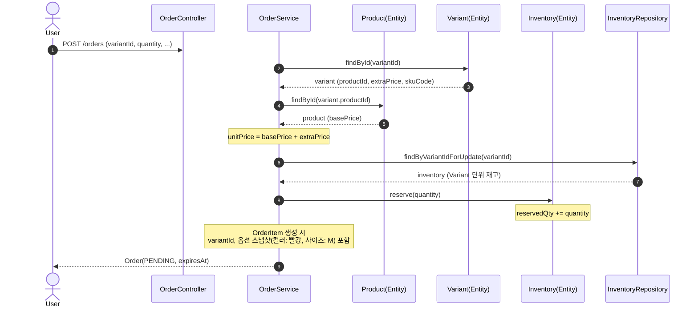
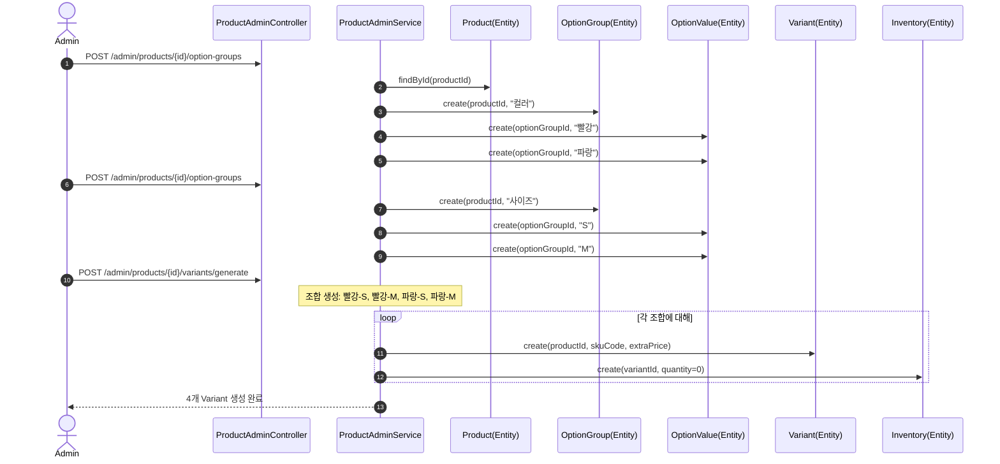

# 향후 확장 시퀀스 다이어그램: 옵션/Variant 시스템

> Variant 도입 시 변경되는 핵심 흐름을 시퀀스로 정리한다.
> 현재 설계에서 Product 단위로 동작하는 흐름이 Variant 단위로 확장된다.

---

## A. Variant 단위 주문 생성 흐름

현재 설계에서는 `productId + quantity`로 주문을 생성하지만, Variant 도입 시 `variantId + quantity`로 전환된다. 재고 예약도 Variant 단위로 변경된다.

**현재 설계와의 차이점**:
- `productId` → `variantId`로 재고/주문 항목 단위 변경
- 단가 계산: `basePrice` 단일 → `basePrice + extraPrice`
- OrderItem에 옵션 정보 스냅샷 추가 필요

---

## B. 상품 옵션 설정 흐름 (Admin)

**핵심 포인트**:
- OptionGroup/OptionValue 생성 → Variant 조합 생성 → Inventory 자동 초기화
- Variant 생성 시 Inventory도 함께 생성 (현재 상품 생성 시 Inventory 초기화와 동일 패턴)