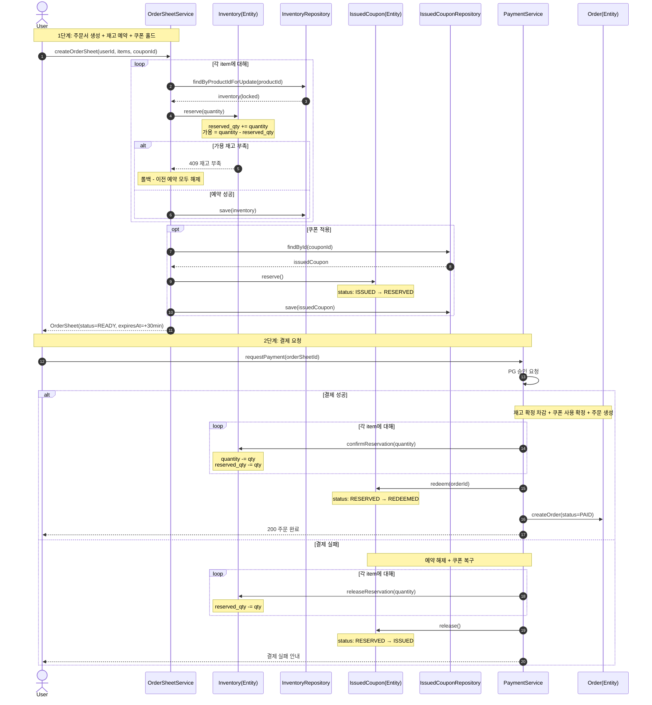
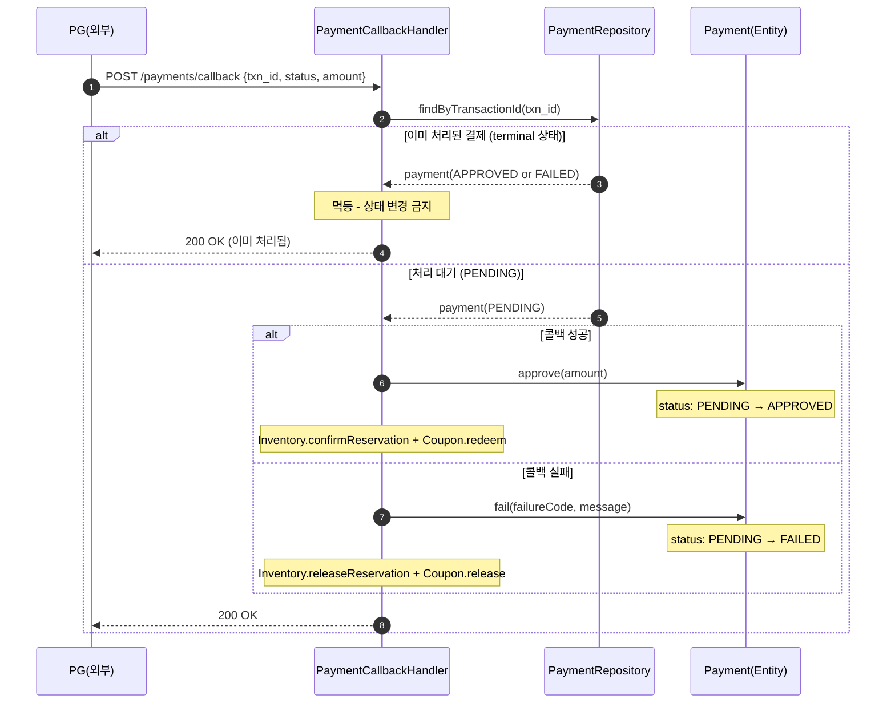

# 향후 확장 시퀀스 다이어그램

> 현재 구현 범위 이후 결제/쿠폰 도메인 도입 시 예상되는 핵심 흐름을 시퀀스로 정리한다.

---

## A. 재고 예약 + 쿠폰 홀드 + 결제 흐름

현재 설계에서는 `POST /api/v1/orders`로 직접 주문을 생성하지만, 향후 결제/쿠폰 도메인이 추가되면 재고 예약(Inventory) + 쿠폰 홀드(IssuedCoupon) + 결제(Payment) 흐름으로 확장한다.

**책임 분리 포인트**:
- `Inventory(Entity)`: 예약/확정/해제 (도메인 행위 - 재고 보호는 재고의 책임)
- `IssuedCoupon(Entity)`: 상태 전이 reserve/redeem/release (도메인 행위)
- `OrderSheetService`: 예약 조율 (애플리케이션 서비스)
- `PaymentService`: 결제 결과에 따른 확정/롤백 조율

---

## B. 결제 콜백 (멱등/역순 대응)

**핵심 정책**:
- `transaction_id` 기반 멱등 처리 - 동일 콜백 재전송 시 상태 변경 없음
- terminal 상태(APPROVED, FAILED)에 도달하면 이후 콜백은 무시
- 성공: `Payment=APPROVED`, `Inventory=CONFIRMED`, `Coupon=REDEEMED`
- 실패: `Payment=FAILED`, `Inventory=RELEASED`, `Coupon=ISSUED`
