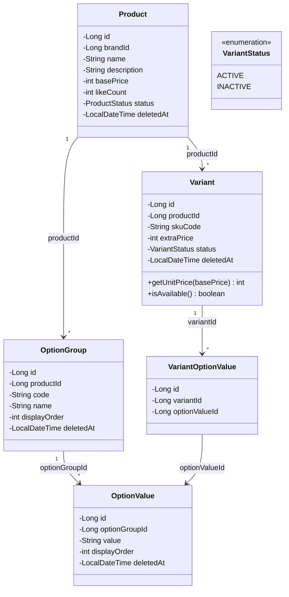
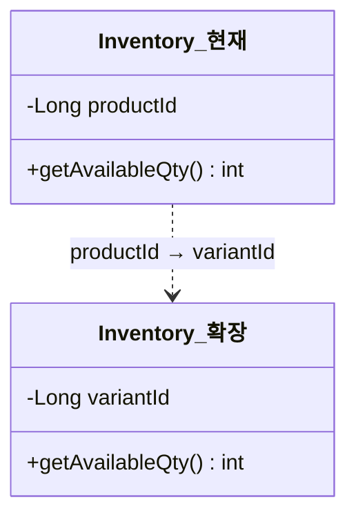

# 향후 확장 클래스 구조: 옵션/Variant 시스템

> Variant 도입 시 추가/변경되는 도메인 클래스 구조를 정리한다.

---

## A. Option/Variant 클래스 구조

---

## B. 기존 클래스 변경 사항

Variant 도입 시 기존 클래스에서 변경이 필요한 부분:

### Inventory 변경

- `productId` → `variantId`로 참조 대상 변경
- 옵션 없는 상품: 기본 Variant 1개를 생성하여 호환 유지

### OrderItem 변경

| 필드 | 현재 | 확장 |
|------|------|------|
| 참조 대상 | `productId` | `variantId` + `productId` (추적용) |
| 스냅샷 추가 | - | `optionSnapshot` (ex: "컬러: 빨강, 사이즈: M") |
| 단가 계산 | `basePrice` | `basePrice + extraPrice` |

### CartItem 변경

| 필드 | 현재 | 확장 |
|------|------|------|
| UK 기준 | `(cart_id, product_id)` | `(cart_id, variant_id)` |
| merge 기준 | 동일 상품 | 동일 Variant (동일 옵션 조합) |

---

## C. Aggregate 경계

| Aggregate Root | 포함 Entity | 설명 |
|---------------|------------|------|
| **Product** | Product, OptionGroup, OptionValue | 옵션 구조는 Product와 동일 생명주기 |
| **Variant** | Variant, VariantOptionValue | Variant는 독립 Aggregate (재고/주문에서 직접 참조) |

**Variant를 Product에 포함하지 않는 이유**:
- Variant는 주문, 재고, 장바구니에서 직접 참조됨
- Variant 단위 재고 변경 시 Product 잠금 범위를 확대하지 않기 위함
- Product 수정(이름, 설명)과 Variant 재고 변동은 독립적