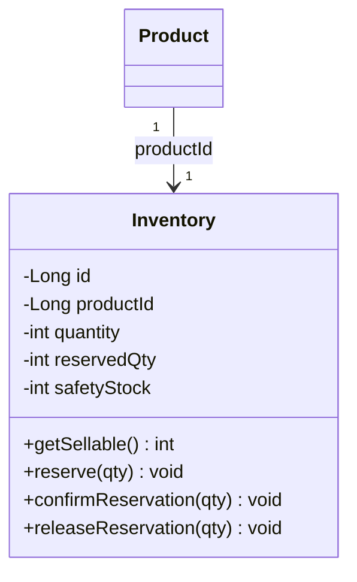
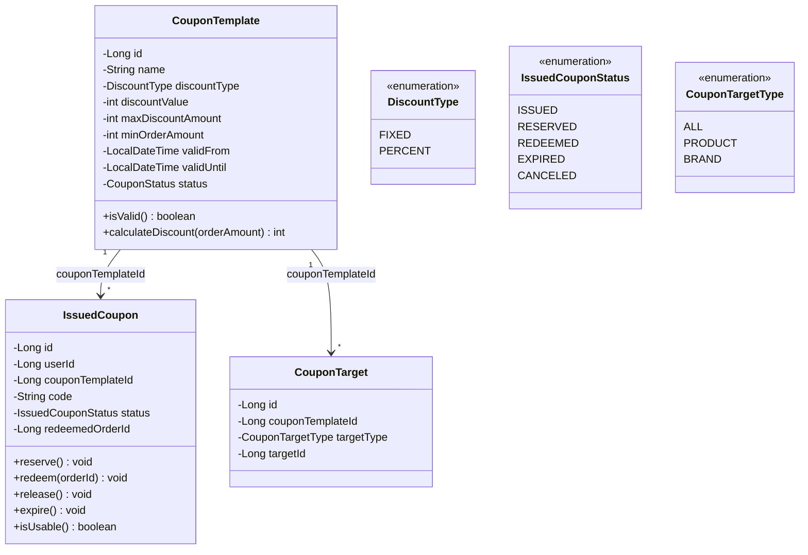
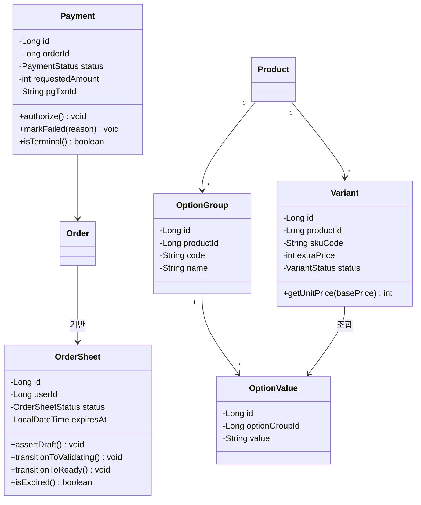

# 향후 확장 클래스 구조

> 현재 구현 범위 이후 도입할 도메인의 클래스 구조를 정리한다.

---

## A. 재고 예약 모델 (Inventory)

현재 `Product.stock`으로 즉시 차감하지만, 결제 도메인 도입 시 예약 모델로 확장한다.

- **현재**: `Product.stock`으로 즉시 차감 (현재 구현 범위)
- **확장 시**: `Inventory`로 분리, `getSellable() = quantity - reservedQty`
- **Variant 도입 시**: `productId` → `variantId`로 전환, `Product 1:N Variant 1:1 Inventory`

---

## B. 쿠폰 시스템 (Coupon)

---

## C. 결제/옵션/장바구니 (방향만 제시)

