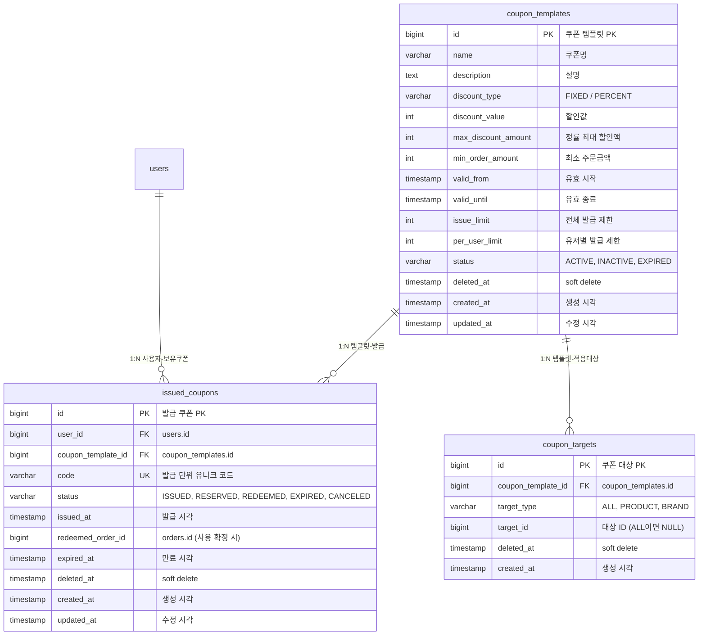

# 향후 확장 ERD

> 현재 구현 범위 이후 도입할 도메인의 테이블 구조를 정리한다.
> DBML 원본은 `../04-erd.dbml`의 확장 섹션 참조.

---

## A. 쿠폰 시스템 (Coupon)

### coupon_templates 테이블 명세

| 컬럼 | 타입 | 제약 | 설명 |
|------|------|------|------|
| id | BIGINT | PK, AUTO_INCREMENT | 쿠폰 템플릿 PK |
| name | VARCHAR(200) | NOT NULL | 쿠폰명 |
| description | TEXT | | 쿠폰 설명 |
| discount_type | VARCHAR(20) | NOT NULL | DISCOUNT_TYPE: FIXED(정액), PERCENT(정률) |
| discount_value | INT | NOT NULL | 정액: 금액, 정률: 퍼센트 |
| max_discount_amount | INT | NULL | 정률 최대 할인액 (PERCENT일 때만 유효) |
| min_order_amount | INT | NOT NULL | 최소 주문금액 |
| valid_from | TIMESTAMP | NOT NULL | 유효 시작일 |
| valid_until | TIMESTAMP | NOT NULL | 유효 종료일 |
| issue_limit | INT | NULL | 전체 발급 제한 (NULL이면 무제한) |
| per_user_limit | INT | NULL | 유저별 발급 제한 (NULL이면 무제한) |
| status | VARCHAR(20) | NOT NULL | COUPON_STATUS: ACTIVE, INACTIVE, EXPIRED |
| deleted_at | TIMESTAMP | NULL | soft delete |
| created_at | TIMESTAMP | NOT NULL | 생성 시각 |
| updated_at | TIMESTAMP | NOT NULL | 수정 시각 |

### issued_coupons 테이블 명세

| 컬럼 | 타입 | 제약 | 설명 |
|------|------|------|------|
| id | BIGINT | PK, AUTO_INCREMENT | 발급 쿠폰 PK |
| user_id | BIGINT | FK(users.id), NOT NULL | 보유 사용자 |
| coupon_template_id | BIGINT | FK(coupon_templates.id), NOT NULL | 쿠폰 정책 |
| code | VARCHAR(100) | UNIQUE, NOT NULL | 발급 단위 유니크 코드 |
| status | VARCHAR(20) | NOT NULL | ISSUED → RESERVED → REDEEMED / EXPIRED / CANCELED |
| issued_at | TIMESTAMP | NOT NULL | 발급 시각 |
| redeemed_order_id | BIGINT | NULL | orders.id (사용 확정 시 연결) |
| expired_at | TIMESTAMP | NULL | 만료 시각 |
| deleted_at | TIMESTAMP | NULL | soft delete |
| created_at | TIMESTAMP | NOT NULL | 생성 시각 |
| updated_at | TIMESTAMP | NOT NULL | 수정 시각 |

**쿠폰 상태 전이**:
- `ISSUED` → 발급됨 (사용 가능)
- `RESERVED` → 주문서에서 홀드 중 (결제 대기)
- `REDEEMED` → 결제 성공으로 사용 확정
- `EXPIRED` → 유효기간 만료
- `CANCELED` → 관리자/시스템 취소

### coupon_targets 테이블 명세

| 컬럼 | 타입 | 제약 | 설명 |
|------|------|------|------|
| id | BIGINT | PK, AUTO_INCREMENT | 쿠폰 대상 PK |
| coupon_template_id | BIGINT | FK(coupon_templates.id), NOT NULL | 소속 템플릿 |
| target_type | VARCHAR(20) | NOT NULL | COUPON_TARGET_TYPE: ALL, PRODUCT, BRAND |
| target_id | BIGINT | NULL | 대상 ID (ALL이면 NULL) |
| deleted_at | TIMESTAMP | NULL | soft delete |
| created_at | TIMESTAMP | NOT NULL | 생성 시각 |

**적용 대상 정책**: 템플릿 1개가 여러 대상에 적용 가능 (1:N). 예: 브랜드 A + 브랜드 B 상품에 모두 적용

---

## B. 기타 (참고)

결제/옵션/장바구니 도메인 도입 시 추가되는 테이블 (DBML 미포함, 방향만 제시):

| 도메인 | 테이블 | 설명 |
|--------|--------|------|
| 옵션/Variant | `product_option_groups`, `product_option_values`, `product_variants` | Product → OptionGroup → OptionValue → Variant 구조 |
| 장바구니 | `carts`, `cart_lines` | 유저당 ACTIVE Cart 1개 정책, variant 단위 merge |
| 주문서 | `order_sheets`, `order_sheet_lines` | 결제 전 스냅샷 + 재고예약/쿠폰홀드 기준 |
| 결제 | `payments` | Order당 1건 (UK), PG 연동, 멱등 처리 |
