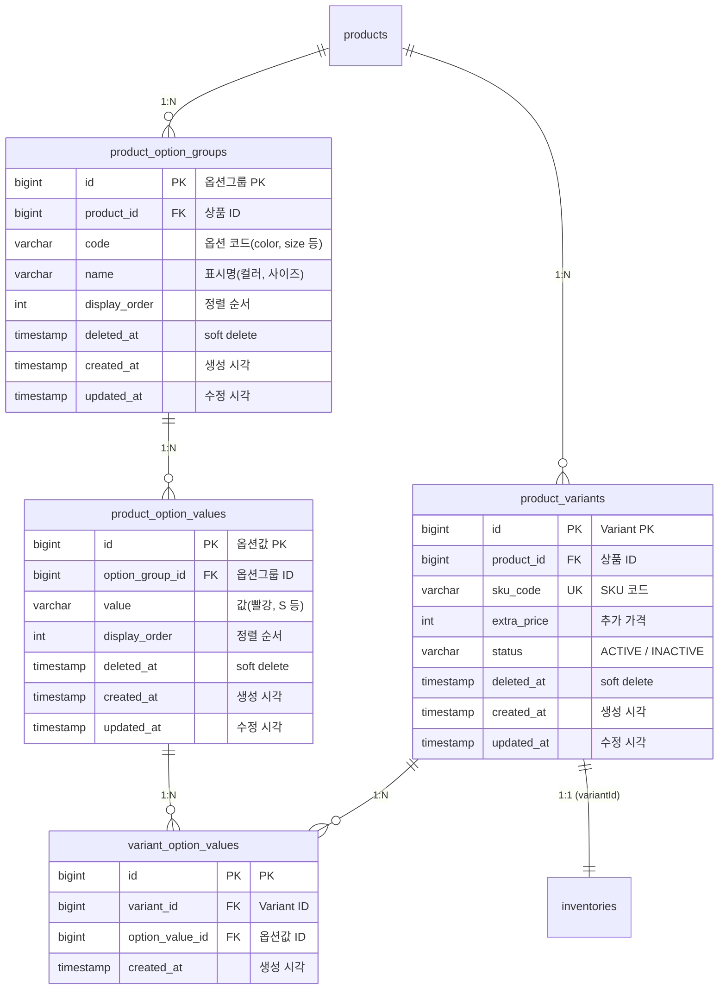

# 향후 확장 ERD: 옵션/Variant 시스템

> Variant 도입 시 추가되는 테이블과 기존 테이블 변경 사항을 정리한다.

---

## A. 신규 테이블

### product_option_groups 테이블 명세

| 컬럼 | 타입 | 제약 | 설명 |
|------|------|------|------|
| id | BIGINT | PK, AUTO_INCREMENT | 옵션그룹 PK |
| product_id | BIGINT | NOT NULL | 소속 상품 |
| code | VARCHAR(50) | NOT NULL | 옵션 코드 (color, size 등) |
| name | VARCHAR(100) | NOT NULL | 표시명 (컬러, 사이즈) |
| display_order | INT | NOT NULL, DEFAULT 0 | 정렬 순서 |
| deleted_at | TIMESTAMP | NULL | soft delete |
| created_at | TIMESTAMP | NOT NULL | 생성 시각 |
| updated_at | TIMESTAMP | NOT NULL | 수정 시각 |

### product_option_values 테이블 명세

| 컬럼 | 타입 | 제약 | 설명 |
|------|------|------|------|
| id | BIGINT | PK, AUTO_INCREMENT | 옵션값 PK |
| option_group_id | BIGINT | NOT NULL | 소속 옵션그룹 |
| value | VARCHAR(100) | NOT NULL | 옵션 값 (빨강, S 등) |
| display_order | INT | NOT NULL, DEFAULT 0 | 정렬 순서 |
| deleted_at | TIMESTAMP | NULL | soft delete |
| created_at | TIMESTAMP | NOT NULL | 생성 시각 |
| updated_at | TIMESTAMP | NOT NULL | 수정 시각 |

### product_variants 테이블 명세

| 컬럼 | 타입 | 제약 | 설명 |
|------|------|------|------|
| id | BIGINT | PK, AUTO_INCREMENT | Variant PK |
| product_id | BIGINT | NOT NULL | 소속 상품 |
| sku_code | VARCHAR(100) | UNIQUE, NOT NULL | SKU 코드 |
| extra_price | INT | NOT NULL, DEFAULT 0 | 추가 가격 (base_price + extra_price = 최종 단가) |
| status | VARCHAR(20) | NOT NULL, DEFAULT 'ACTIVE' | ACTIVE / INACTIVE |
| deleted_at | TIMESTAMP | NULL | soft delete |
| created_at | TIMESTAMP | NOT NULL | 생성 시각 |
| updated_at | TIMESTAMP | NOT NULL | 수정 시각 |

### variant_option_values 테이블 명세

| 컬럼 | 타입 | 제약 | 설명 |
|------|------|------|------|
| id | BIGINT | PK, AUTO_INCREMENT | PK |
| variant_id | BIGINT | NOT NULL | 소속 Variant |
| option_value_id | BIGINT | NOT NULL | 옵션값 참조 |
| created_at | TIMESTAMP | NOT NULL | 생성 시각 |

**UK**: `(variant_id, option_value_id)` — 동일 Variant에 같은 옵션값 중복 방지

---

## B. 기존 테이블 변경 사항

Variant 도입 시 기존 테이블에서 변경이 필요한 부분:

| 테이블 | 변경 내용 |
|--------|----------|
| `inventories` | `product_id` → `variant_id`로 FK 변경 |
| `cart_items` | `product_id` → `variant_id`로 FK 변경, UK도 `(user_id, variant_id)`로 변경 |
| `order_items` | `variant_id` 컬럼 추가, `option_snapshot` (VARCHAR) 추가 |

---

## C. 테이블 수 변화

| 상태 | 테이블 수 |
|------|----------|
| 현재 설계 (Round 3, 단순화 후) | 14개 |
| Variant 도입 후 | 18개 (+4: option_groups, option_values, variants, variant_option_values) |