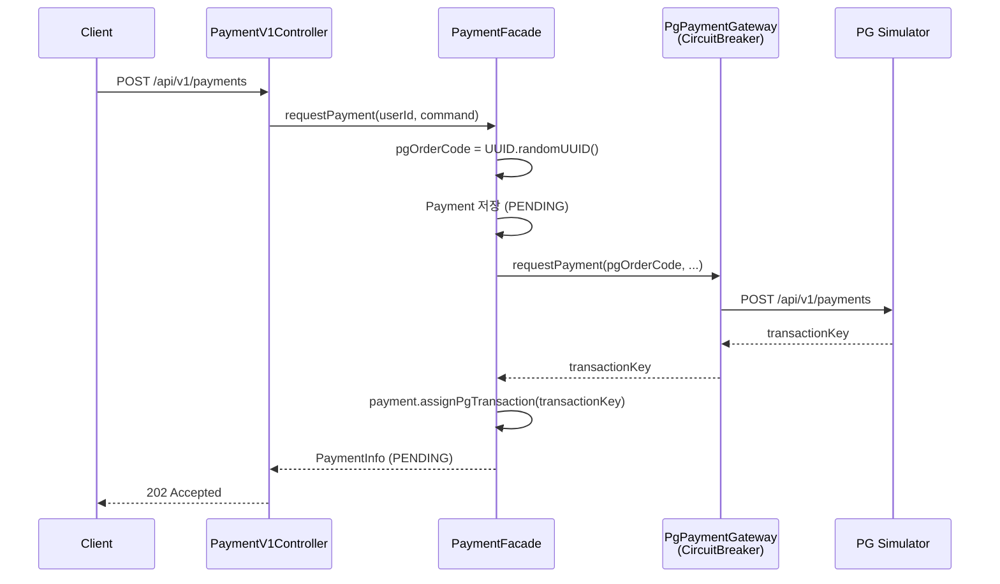
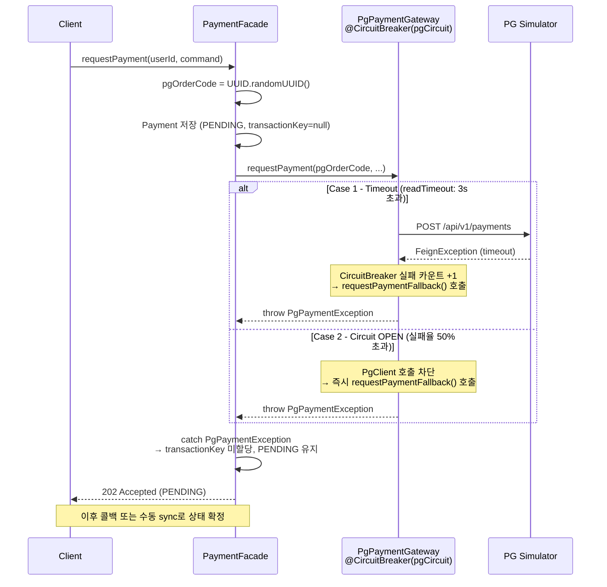
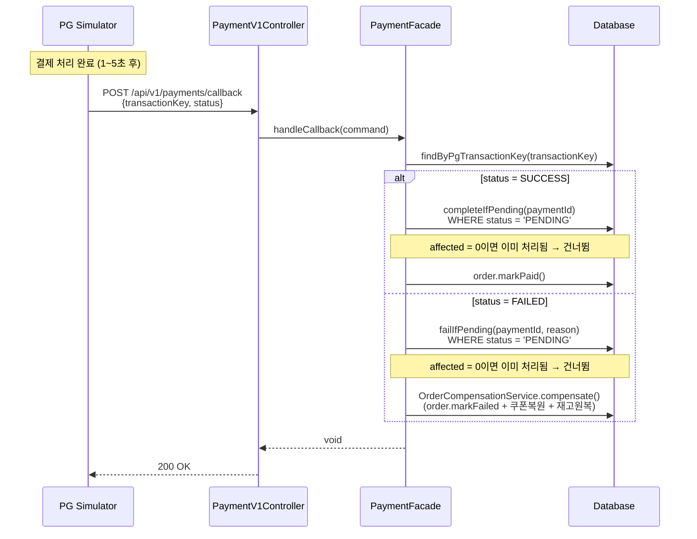
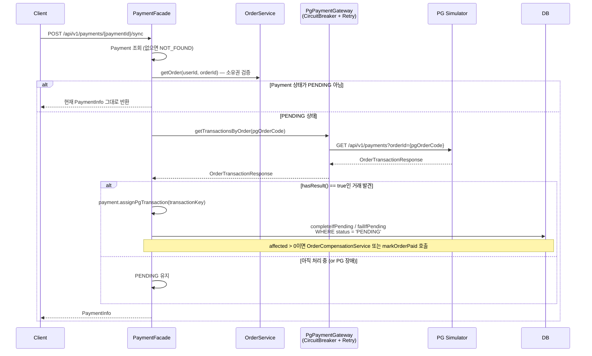

# Round 6 — 멘토 제출용 리뷰 문서

> PG 연동 회복력 설계 | 2026.03.19

---

## 1. 전체 플로우 개요

이번 과제의 핵심은 PG(외부 결제 시스템)가 **언제든 실패할 수 있다**는 전제 하에,
내부 시스템이 그 장애를 흡수하면서도 결제 상태를 최종적으로 정확히 반영하는 구조를 설계하는 것입니다.

크게 3가지 흐름으로 구성했습니다:

| 플로우 | 트리거 | 역할 |
|--------|--------|------|
| 결제 요청 | 클라이언트 | PG에 결제 요청, 실패해도 PENDING 유지 |
| PG 콜백 수신 | PG 서버 | 처리 완료 후 상태 확정 |
| 수동 동기화 | 클라이언트 | 콜백 미수신 시 수동으로 PG 조회 후 상태 확정 |

---

## 2. 시퀀스 다이어그램

### 2-1. 결제 요청 (정상)



---

### 2-2. 결제 요청 (PG 장애 / Circuit Open)



**fallback이 연결되는 방식**

fallback은 yml 설정이 아니라 **어노테이션**으로 연결됩니다.

```java
// PgPaymentGateway.java:17-18
@CircuitBreaker(name = "pgCircuit", fallbackMethod = "requestPaymentFallback")
public PgPaymentDto.TransactionResponse requestPayment(...) { ... }
```

`fallbackMethod = "requestPaymentFallback"` — 메서드가 예외를 던지면 (원인이 timeout이든 Circuit Open이든) Resilience4j가 자동으로 fallback 메서드를 호출합니다.

```java
// PgPaymentGateway.java:55-58  ← fallback 메서드
private PgPaymentDto.TransactionResponse requestPaymentFallback(
        String userId, PgPaymentDto.PaymentRequest request, Throwable t) {
    log.warn("PG 결제 요청 실패 - fallback 처리. cause={}", t.getMessage());
    throw new PgPaymentException("PG 결제 요청 불가: " + t.getMessage());
}
```

yml(`application.yml:46-56`)은 **Circuit이 언제 열리는지** 기준값만 담당합니다:

```yaml
# application.yml:49-56
pgCircuit:
  failure-rate-threshold: 50       # 실패율 50% 초과 시 OPEN
  sliding-window-size: 10          # 최근 10회 기준
  minimum-number-of-calls: 10      # 평가 시작 최소 호출 수
  wait-duration-in-open-state: 10s # OPEN → HALF-OPEN 대기
  slow-call-duration-threshold: 3s # 3초 이상 응답도 실패로 간주
  slow-call-rate-threshold: 50     # 느린 호출 50% 초과 시 OPEN
```

즉, fallback 연결은 코드(`@CircuitBreaker(fallbackMethod=...)`)가, 서킷 동작 기준은 yml이 각각 담당하는 구조입니다.

---

### 2-3. PG 콜백 수신 → 상태 확정



---

### 2-4. 수동 동기화 (콜백 미수신 복구)



---

## 3. 핵심 설계 결정 및 고민

### 3-1. 비동기 결제 구조에서 클라이언트에게 결과 전달 방식

> **리뷰 요청**: 현재 PG 모듈은 결제 결과를 콜백으로 비동기 응답하는 구조라, 클라이언트는 결제 요청 후 결과를 바로 알 수 없습니다. 일반적인 간편결제(토스페이먼츠 등)는 결제 완료 후 리다이렉트로 즉시 확정되는 걸로 알고 있는데, **현재 구조에서는 클라이언트가 최종 결과를 어떤 방식으로 전달받는 게 적절할지** 의견 부탁드립니다.

PG 장애(timeout, Circuit Open) 시 timeout은 "실패"가 아니라 "모름"이므로 PENDING으로 보류하는 방식을 선택했습니다.

| 방식 | 장점 | 단점 |
|------|------|------|
| A. 즉시 실패 응답 | 단순, 클라이언트가 명확히 인지 | PG가 실제로 처리했을 수 있음 → 결제됐는데 주문 취소 위험 |
| **B. PENDING 보류 ✅** | 데이터 유실 없음, 이후 복구 가능 | 클라이언트가 최종 결과를 바로 알 수 없음 |

PG가 실제로 결제를 처리했지만 응답만 유실됐을 수 있고, 즉시 실패 처리하면 결제는 됐는데 주문은 취소되는 상태 불일치가 발생하기 때문에 B를 선택했습니다. 다만 PENDING 보류를 선택하면서 **클라이언트가 최종 결과를 어떻게 전달받을지**가 풀어야 할 숙제로 남았습니다.

---

### 3-2. Retry 전략 — requestPayment에서 제거

> **리뷰 요청**: 비동기 결제 구조에서 retry는 중복 결제를 유발하므로 제거했습니다. 다만 **PG가 요청 자체를 수신하지 못한 케이스**(connection refused 등)에서는 PG에 거래 자체가 없어 콜백도 오지 않고, sync 조회해도 결과가 없어 PENDING이 영원히 방치될 수 있습니다. **이런 엣지 케이스까지 고려해야 할지** 의견 부탁드립니다.

현재 결제모듈(pg-simulator)에서 최종적인 결제 처리 결과(성공/실패)는 요청 응답이 아닌 **콜백**으로 옵니다. transactionKey 수신 여부와 무관하게, 요청한 결제가 실제로 처리됐는지는 응답 결과로 알 수 없습니다.

이 구조에서 retry를 하면:

```
1차 요청 → PG가 결제 처리 시작 → 콜백 예정
         → FeignException (timeout 등)
         → @Retry 트리거
2차 요청 → PG에 결제 요청 중복 전송
         → 각 요청마다 독립적인 콜백 발생 가능
```

retry는 "요청을 다시 보내는 것"이므로, 비동기 처리 구조에서는 중복 결제 요청이 됩니다. 결제 처리 결과는 어차피 콜백으로 기다려야 하기 때문에, retry로 얻을 수 있는 이점이 없습니다.

따라서 retry 없이 PENDING으로 보류한 뒤 콜백 또는 syncPayment로 최종 상태를 확정하는 방식을 선택했습니다.

반면 `getTransaction`(조회)은 멱등 연산이므로 retry를 유지했습니다.

추가로, retry-exceptions에서도 `PgPaymentException`을 제거하고 `FeignException`만 남겼습니다. `PgPaymentException`은 한도 초과 등 비즈니스 실패를 의미하므로 재시도해도 결과가 같고, Resilience4j 실행 순서가 `Retry → CircuitBreaker → method`이기 때문에 Circuit Open 상태에서 fallback이 던진 `PgPaymentException`이 Retry까지 전파되어 fallback을 3번 반복 호출하는 문제도 있었습니다.

```yaml
retry-exceptions:
  - feign.FeignException   # 네트워크/타임아웃만 재시도
# PgPaymentException 제거 — 비즈니스 실패는 재시도 불필요 + Circuit Open 시 fallback 반복 방지
```

---

### 3-3. 결제 실패 시 보상 트랜잭션 — OrderCompensationService 분리

> **리뷰 요청**: 보상 로직을 PaymentFacade에서 OrderCompensationService로 분리해 하나의 진입점으로 통일했습니다. **`compensate()` 자체가 실패하는 경우**(예: 재고 원복 중 예외) 현재는 트랜잭션 전체가 롤백되어 보상이 아예 안 된 상태로 남는데, **이 케이스에 대한 별도 대응이 필요할지** 의견 부탁드립니다.

결제 실패(`failIfPending()` affected > 0) 시 세 가지 복원이 필요합니다.

1. Order 상태 → FAILED
2. 사용된 쿠폰 → AVAILABLE 복원
3. 차감된 재고 → 원복

이 보상 로직을 `OrderCompensationService`로 분리해 하나의 진입점으로 통일했습니다.

```java
// PaymentFacade — 결제 실패 시 보상 위임
case FAILED -> {
    int affected = paymentRepository.failIfPending(payment.getId(), reason);
    if (affected > 0) {
        orderCompensationService.compensate(payment.getOrderId());
    }
}

// OrderCompensationService — 보상 로직 일괄 처리
@Transactional
public void compensate(Long orderId) {
    orderService.markOrderFailed(orderId);
    if (order.issuedCouponId() != null) {
        issuedCouponService.restore(order.issuedCouponId(), order.userId());
    }
    productService.restoreStock(items);
}
```

현재 `compensate()` 내부는 하나의 트랜잭션으로 묶여 있어서, 예를 들어 재고 원복 중 예외가 발생하면 쿠폰 복원·주문 상태 변경까지 전부 롤백됩니다. 결제는 FAILED인데 보상이 안 된 상태로 남게 됩니다.

---

## 4. 보충 — race condition 방어

`syncPayment`(수동 동기화)와 `handleCallback`(PG 콜백)이 동시에 실행되면 둘 다 PENDING을 읽고 보상 로직이 중복 실행될 수 있습니다.

이를 조건부 UPDATE(`WHERE status = 'PENDING'`)로 방어했습니다:

```
handleCallback → failIfPending() → affected = 1 → compensate() 실행
syncPayment    → failIfPending() → affected = 0 → compensate() 건너뜀
```

먼저 UPDATE에 성공한 쪽만 후속 로직을 실행하므로 중복 보상이 원천 차단됩니다.
