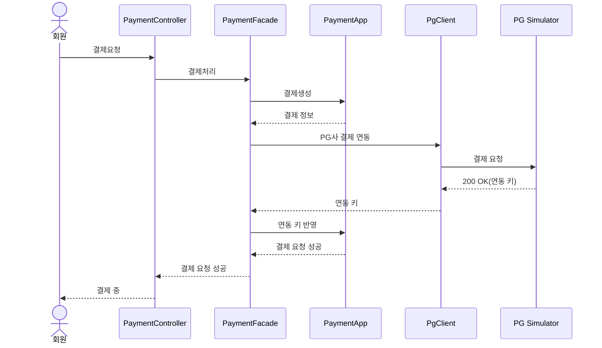
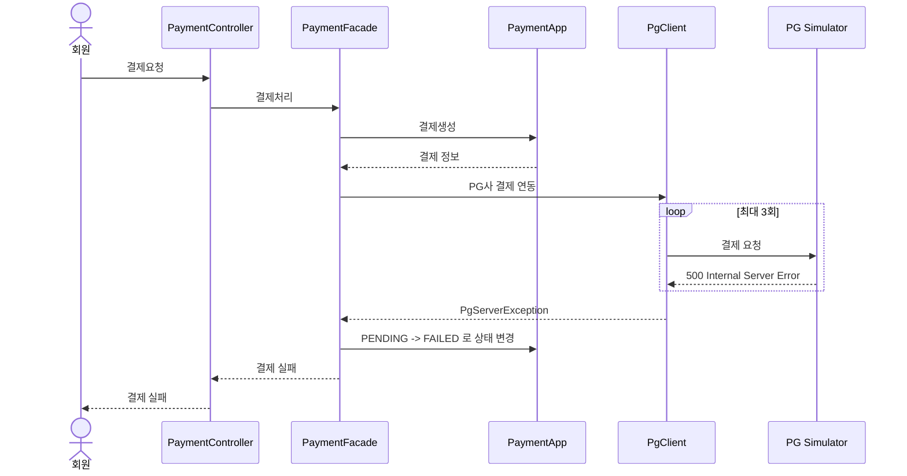
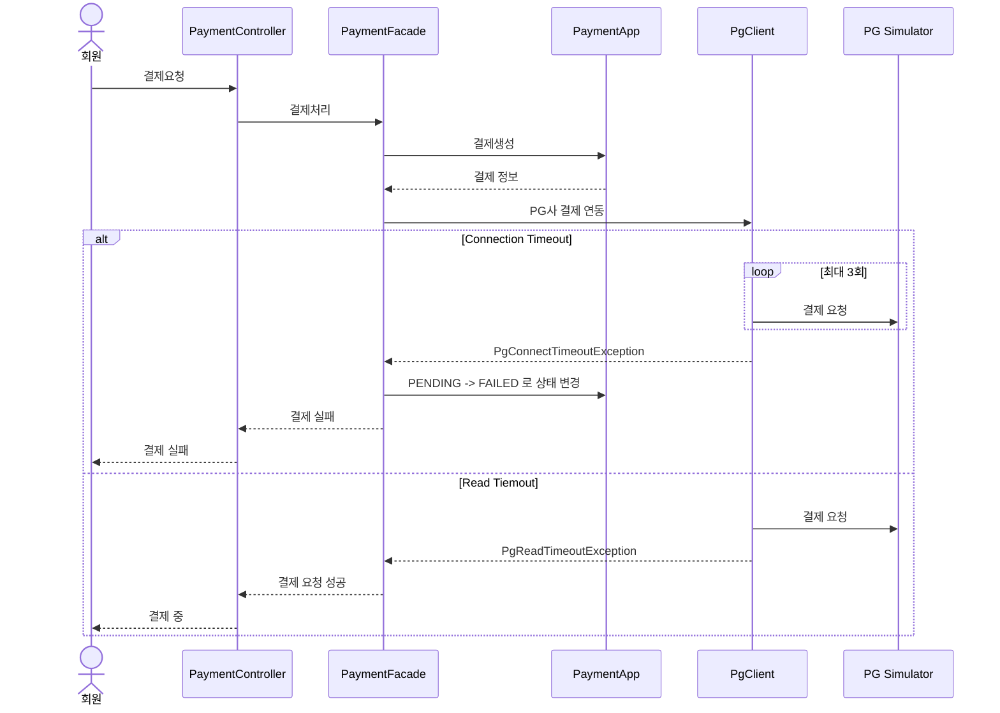
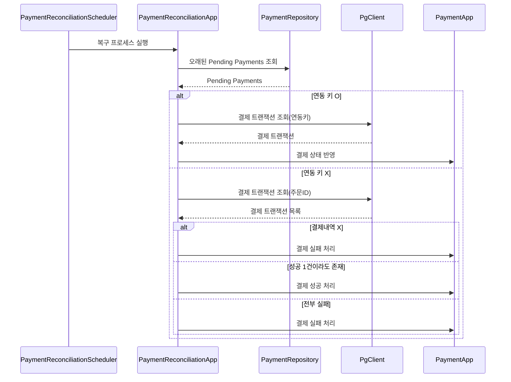

### 결제 요청

### 장애 상황 및 대응 전략
#### 1. PG Simulator - 500 응답
- 일시적 오류일 가능성이 있다 판단하고 재시도
- 3회 재시도에도 실패 시 장애로 판단하고 실패 처리

 

#### 2. PG Simulator - 응답 지연
- 응답 지연 시간이 길어질 수록 스레드 풀 고갈 가능성이 올라감
- 이를 방지하기 위해서 API 호출 시 타임아웃 설정
- Connection Timeout: 1초 => 발생 시 3회 재시도
- Read Timeout: 2초 => 이미 결제 진행 중일 수 있으므로 재시도 X
  - callback 또는 복구 프로세스에 의해 PG사와 데이터 동기화

 

#### 3. PG Simulator - 결제 요청 무응답 or 콜백 미호출
- 결제 요청 후 콜백 예상 시간이 지났으나 PENDING 상태인 결제 요청들
- 특정 주기로 직접 PG사 데이터 확인해서 동기화 진행
