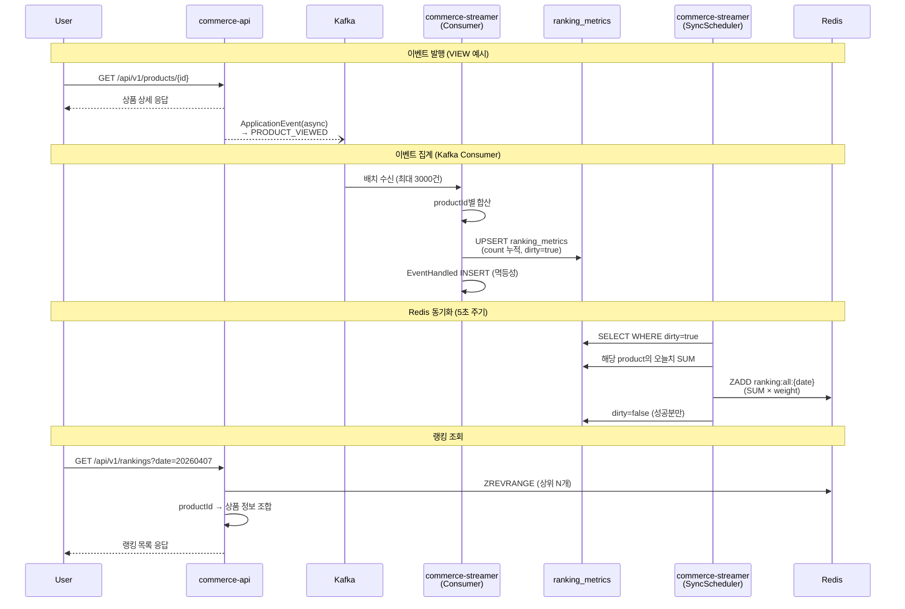
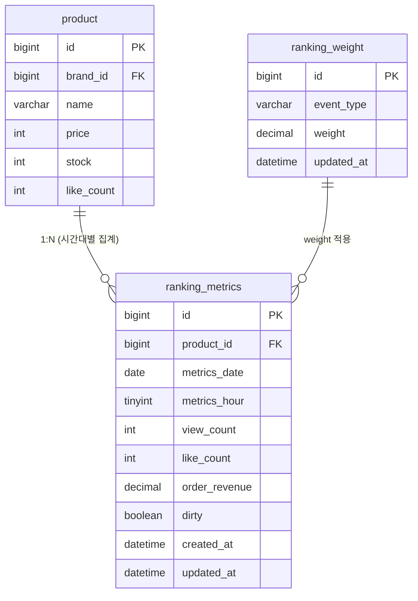

# Round 9 — Redis ZSET 기반 실시간 랭킹 파이프라인 요구사항 분석

## 문제 상황

| 관점 | 문제 |
|------|------|
| **사용자** | 인기 상품이 뭔지 모른다 — 상품 목록에서 어떤 게 많이 팔리고 관심받는지 알 수 없음 |
| **비즈니스** | 인기 상품을 노출해야 구매 전환율이 오르는데, 실시간 반영이 안 되면 어제 인기였던 상품만 보임 |
| **시스템** | product_metrics에 집계 데이터가 쌓이지만, 누적 구조(row 1개/상품)라서 일간 랭킹 산출 불가. 랭킹을 DB 쿼리로 뽑으면 동시 조회 시 불필요한 반복 연산 |

---

## 핵심 설계 결정

### Q1. VIEW 이벤트 발행 방식
- **결정:** ApplicationEvent(비동기) → Kafka 발행
- **근거:** 조회는 빈번하고 가중치 0.1로 낮아 Outbox 트랜잭션 보장 불필요. 실패 시 리트라이, 그래도 실패하면 유실 허용.

### Q2. ORDER_CREATED payload 확장
- **결정:** Outbox payload에 items 배열 추가 (`productId`, `price`, `quantity`)
- **근거:** 랭킹은 상품별(productId별) 점수가 필요. Consumer에서 items를 파싱해서 상품별로 처리.
- **기존:** `Map.of("orderId", ..., "totalAmount", ..., "itemCount", ...)`
- **변경:** `Map.of("orderId", ..., "totalAmount", ..., "items", event.items())`

### Q3. product_metrics 테이블 구조 변경
- **결정:** 기존 누적 1 row 구조 → 시간대별 row + 원시 데이터 저장으로 교체
- **근거:** 일간/시간별 랭킹 산출, weight 변경 시 재계산, Redis 복구(SSOT) 모두 지원

### Q4. 랭킹 키 상수 공유
- **결정:** `modules/redis`에 랭킹 키 상수 클래스 정의
- **근거:** commerce-api와 commerce-streamer 모두 이미 redis 모듈을 의존. 추가 의존성 불필요.

### Q5. Weight 저장 위치
- **결정:** DB가 원장(ranking_weight 테이블), Redis에 캐시. Consumer는 Redis 우선 조회, miss 시 DB fallback.
- **근거:** 실시간 weight 변경 지원 + Redis 장애 시 안전.

### Q6. Redis 적재 방식 & 멱등성
- **결정:** DB 우선 + 스케줄러 ZADD (PR #339 dirty 플래그 패턴 차용)
- **흐름:**
  1. Consumer → ranking_metrics UPSERT (count 누적, dirty=true) + EventHandled INSERT
  2. SyncScheduler (5초 주기) → dirty 행 조회 → 오늘치 SUM × weight 계산 → ZADD → dirty=false
- **근거:** DB가 SSOT, ZADD 덮어쓰기로 멱등성 확보, 이원화 저장 원자성 문제 회피
- **PR #339과의 차이:** 누적 점수(base_points) 대신 원시 데이터 저장 → weight 변경 시 즉시 재계산 가능

### Q7. LIKE_CANCELLED 처리
- **결정:** like_count 차감
- **근거:** 좋아요 취소는 랭킹 점수에 반영되어야 함. 이벤트 순서 역전으로 음수가 되더라도 ZADD 덮어쓰기로 자연 보정.

---

## 데이터 흐름

### 이벤트 발행 → 집계 → Redis 동기화 → API 조회

---

## ERD

### 인덱스 전략
- `ranking_metrics`: UNIQUE(product_id, metrics_date, metrics_hour) — UPSERT 핵심
- `ranking_metrics`: INDEX(dirty, metrics_date) — SyncScheduler 조회용
- `ranking_weight`: UNIQUE(event_type)

---

## Redis 키 설계

| 키 | 자료구조 | TTL | 용도 |
|----|----------|-----|------|
| `ranking:all:{yyyyMMdd}` | Sorted Set | 2일 | 일간 랭킹 |
| `ranking:hour:{yyyyMMddHH}` | Sorted Set | 2일 | 시간별 랭킹 (Nice-to-Have) |
| `ranking:weight:{eventType}` | String | 짧은 TTL | weight 캐시 |

---

## 잠재 리스크

| 리스크 | 설명 | 대응 선택지 |
|--------|------|------------|
| SyncScheduler 단일 장애점 | 스케줄러가 멈추면 Redis 랭킹이 stale | 헬스체크 + 알림, 또는 @SchedulerLock |
| 오늘치 SUM 집계 비용 | dirty 상품이 많으면 상품 수 × 24 row SUM | 상품 수가 극단적이지 않으면 OK. 필요시 일간 캐시 row 추가 |
| VIEW 이벤트 볼륨 | 조회가 가장 빈번 → Kafka 토픽 부하 | 별도 토픽 분리, 또는 앱 내 버퍼링 후 발행 |
| like_count 음수 | 이벤트 순서 역전 시 CANCELLED이 먼저 도착 | 최소값 0 클램핑, 또는 ZADD 시 자연 보정되므로 허용 |

---

## 과제 체크리스트 매핑

### Must-Have
- [ ] Kafka Consumer → ranking_metrics UPSERT + dirty 플래그
- [ ] SyncScheduler → dirty 행 조회 → SUM × weight → ZADD
- [ ] 랭킹 Page 조회 API: `GET /api/v1/rankings?date=yyyyMMdd&size=20&page=1`
- [ ] 상품 상세 조회 시 해당 상품 순위 포함 (없으면 null)
- [ ] VIEW 이벤트 발행 (ApplicationEvent → Kafka)
- [ ] ORDER_CREATED payload에 items 추가

### Nice-to-Have
- [ ] 시간 단위(1시간) 랭킹
- [ ] 콜드 스타트 — 23:50 Score Carry-Over 스케줄러
- [ ] 실시간 Weight 조절 (ranking_weight 테이블 + 관리자 API)
- [ ] Kafka 배치 리스너 최적화
