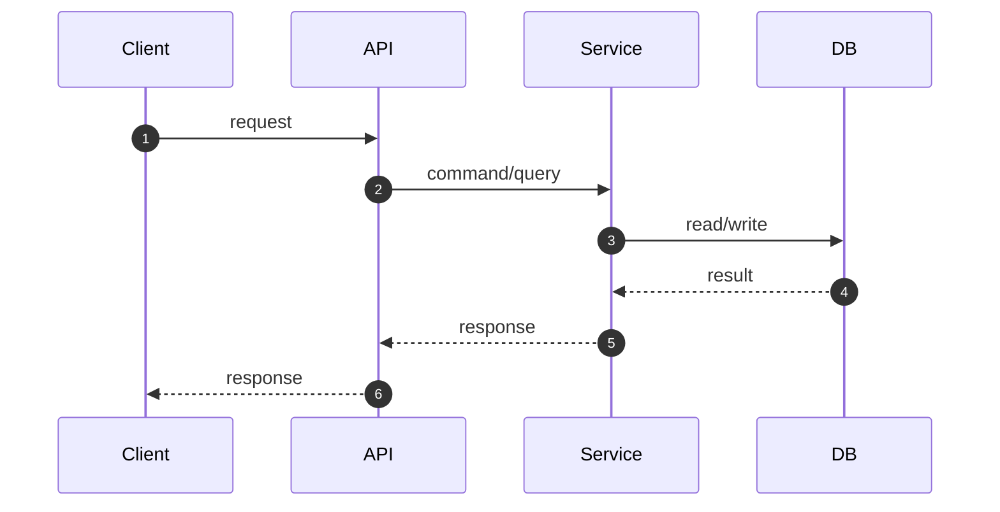

# CLAUDE.md
이 파일은 Claude Code가 이 프로젝트를 이해하는 데 필요한 컨텍스트를 제공합니다.

## 프로젝트 개요
 **Spring Boot + Java 멀티 모듈 템플릿 프로젝트**입니다.
커머스 도메인을 위한 API, Batch, Streamer 애플리케이션으로 구성되어 있습니다.

## 기술 스택 및 버전

| 기술 | 버전 |
|------|------|
| Java | 21 |
| Spring Boot | 3.4.4 |
| Spring Cloud | 2024.0.1 |
| Gradle (Kotlin DSL) | - |
| MySQL | 8.0 |
| Redis | 7.0 |
| Kafka (KRaft) | 3.5.1 |

### 주요 라이브러리

| 라이브러리 | 버전 | 용도 |
|------------|------|------|
| QueryDSL | - | 타입 안전한 JPA 쿼리 |
| SpringDoc OpenAPI | 2.7.0 | API 문서화 |
| Micrometer Prometheus | - | 메트릭 수집 |
| Lombok | - | 보일러플레이트 코드 제거 |
| Jackson | - | JSON 직렬화 |
| Testcontainers | - | 통합 테스트 |
| SpringMockK | 4.0.2 | 테스트 Mock |
| Mockito | 5.14.0 | 테스트 Mock |
| Instancio | 5.0.2 | 테스트 데이터 생성 |

## 모듈 구조

```
Root (loopers-java-spring-template)
├── apps/                          # 실행 가능한 Spring Boot Application
│   ├── commerce-api/              # REST API 서버 (Web, OpenAPI)
│   ├── commerce-batch/            # 배치 처리 (Spring Batch)
│   └── commerce-streamer/         # 이벤트 스트리밍 (Kafka)
│
├── modules/                       # 재사용 가능한 공통 모듈
│   ├── jpa/                       # JPA + QueryDSL 설정
│   ├── redis/                     # Redis 설정
│   └── kafka/                     # Kafka 설정
│
└── supports/                      # 부가 기능 모듈
    ├── jackson/                   # Jackson 직렬화 설정
    ├── logging/                   # 로깅 설정 (Slack Appender)
    └── monitoring/                # Prometheus 메트릭 설정
```

### 모듈 의존성
- **apps**: `modules` + `supports` 모듈을 조합하여 사용
- **modules**: 독립적인 인프라 설정, 도메인에 의존하지 않음
- **supports**: 로깅, 모니터링 등 부가 기능

## 패키지 구조 (apps 내부)
각 app 모듈은 **Layered Architecture**를 따릅니다:

```
com.loopers
├── interfaces/          # 외부 인터페이스 (Controller, DTO)
│   └── api/
├── application/         # 애플리케이션 서비스 (Use Case)
├── domain/              # 도메인 모델 (Entity, Repository Interface)
├── infrastructure/      # 인프라 구현체 (Repository Impl)
└── support/             # 공통 지원 (Error Handler 등)
    └── error/
```

## 빌드 및 실행

### 빌드
```bash
./gradlew build
```

### 테스트
```bash
./gradlew test
```

테스트 설정:
- 타임존: `Asia/Seoul`
- 프로필: `test`
- Testcontainers로 MySQL, Redis, Kafka 컨테이너 자동 실행

### 로컬 인프라 실행
```bash
docker-compose -f ./docker/infra-compose.yml up
```
- MySQL: `localhost:3306` (user: application / password: application / db: loopers)
- Redis Master: `localhost:6379`
- Redis Replica: `localhost:6380`
- Kafka: `localhost:19092`
- Kafka UI: `localhost:9099`

### 모니터링
```bash
docker-compose -f ./docker/monitoring-compose.yml up
```
- Grafana: `localhost:3000` (admin/admin)

## 코드 컨벤션

- **Group ID**: `com.loopers`
- **테스트**: JUnit 5 + Mockito/SpringMockK + Testcontainers
- **코드 커버리지**: JaCoCo (XML 리포트)

## 주요 설정 파일

- `gradle.properties` - 버전 관리
- `build.gradle.kts` - 루트 빌드 설정 (공통 의존성)
- `settings.gradle.kts` - 모듈 정의
- `docker/infra-compose.yml` - 로컬 인프라
- `docker/monitoring-compose.yml` - 모니터링 인프라


## 개발 규칙
### 진행 Workflow - 증강 코딩
- **대원칙** : 방향성 및 주요 의사 결정은 개발자에게 제안만 할 수 있으며, 최종 승인된 사항을 기반으로 작업을 수행.
- **중간 결과 보고** : AI 가 반복적인 동작을 하거나, 요청하지 않은 기능을 구현, 테스트 삭제를 임의로 진행할 경우 개발자가 개입.
- **설계 주도권 유지** : AI 가 임의판단을 하지 않고, 방향성에 대한 제안 등을 진행할 수 있으나 개발자의 승인을 받은 후 수행.

### 개발 Workflow - TDD (Red > Green > Refactor)
- 모든 테스트는 3A 원칙으로 작성할 것 (Arrange - Act - Assert)
- 테스트 코드는 given,when,then으로 작성될 수 있도록 하고, 주석으로 표시.
- 테스트 코드는 Red → Green → Refactor로 테스트 해볼 수 있도록 각각 항목에 맞게 작성.
#### 1. Red Phase : 실패하는 테스트 먼저 작성
- 요구사항을 만족하는 기능 테스트 케이스 작성
- 테스트 예시
#### 2. Green Phase : 테스트를 통과하는 코드 작성
- Red Phase 의 테스트가 모두 통과할 수 있는 코드 작성
- 오버엔지니어링 금지
#### 3. Refactor Phase : 불필요한 코드 제거 및 품질 개선
- 불필요한 private 함수 지양, 객체지향적 코드 작성
- unused import 제거
- 성능 최적화
- 모든 테스트 케이스가 통과해야 함


## 테스트 전략
### 테스트 피라미드

```
                /\
               /E2E\          실제 API 호출 (TestRestTemplate + Testcontainers)
              /______\
             /        \
            /Integration\     Service + DB (Testcontainers)
           /______________\
          /                \
         /   Unit Tests     \  Mock/Stub 사용 (빠른 피드백)
        /____________________\
```

### 테스트 더블 적용

| 레이어 | 테스트 클래스 | 테스트 더블 | 검증 대상 |
|--------|--------------|------------|----------|
| Domain (VO) | `LoginIdTest`, `PasswordTest` 등 | 없음 | 유효성 검사 |
| Domain (Service) | `MemberServiceTest` | Mock (Repository, PasswordEncoder) | 비즈니스 로직 |
| Application | `MemberFacadeTest` | Mock (MemberService) | 변환 로직 |
| Interfaces | `MemberV1ControllerTest` | MockBean + MockMvc | HTTP, 헤더 |
| Integration | `MemberServiceIntegrationTest` | 없음 (Testcontainers) | DB 연동 |
| E2E | `MemberV1ApiE2ETest` | 없음 (Testcontainers) | 전체 흐름 |

### 테스트 더블 종류

| 유형 | 목적 | 사용 예시 |
|------|------|----------|
| **Dummy** | 파라미터 채우기 | 사용되지 않는 객체 |
| **Stub** | 고정값 반환 | `when(...).thenReturn(...)` |
| **Mock** | 행위 검증 | `verify(..., times(1)).method()` |
| **Spy** | 실제 객체 + 호출 추적 | `spy(realObject)` |
| **Fake** | 간소화된 구현 | 인메모리 Repository |

### 테스트 실행

```bash
# JDK 21 필수 (JDK 24에서 Jacoco 호환성 이슈)
JAVA_HOME=/path/to/jdk21 ./gradlew :apps:commerce-api:test

# 단위 테스트만
./gradlew :apps:commerce-api:test --tests "com.loopers.domain.member.*Test"

# 통합 테스트만
./gradlew :apps:commerce-api:test --tests "com.loopers.domain.member.MemberServiceIntegrationTest"

# E2E 테스트만
./gradlew :apps:commerce-api:test --tests "com.loopers.interfaces.api.MemberV1ApiE2ETest"
```

### HTTP 테스트 파일
- `http/commerce-api/member-v1.http` - 회원가입 API 테스트


## 주의사항
### 1. Never Do
- 실제 동작하지 않는 코드, 불필요한 Mock 데이터를 이용한 구현을 하지 말 것
- null-safety 하지 않게 코드 작성하지 말 것 (Java 의 경우, Optional 을 활용할 것)
- println 코드 남기지 말 것
- 개발자 승인 없이 `build.gradle.kts`에 새로운 의존성을 추가하지 말 것
- 기존 테스트를 `@Disabled` 하거나 임의로 삭제하여 통과시키지 말 것
- 환경 설정값(Secret, URL 등)을 코드에 하드코딩하지 말 것

### 2. Recommendation
- 실제 API 를 호출해 확인하는 E2E 테스트 코드 작성
- 재사용 가능한 객체 설계
- 성능 최적화에 대한 대안 및 제안
- 개발 완료된 API 의 경우, `.http/**.http` 에 분류해 작성
- JPA Entity 설계 시 `protected` 기본 생성자를 사용하고 정적 팩토리 메서드 사용을 고려할 것
- 레이어 간 의존성 역전(DIP)을 준수하며, DTO와 Entity의 경계를 명확히 할 것
- 비즈니스 예외 발생 시 전용 `ErrorCode`와 `CustomException`을 정의하여 사용할 것

### 3. Priority
- 실제 동작하는 해결책만 고려
- null-safety, thread-safety 고려
- 테스트 가능한 구조로 설계 
- 기존 코드 패턴 분석 후 일관성 유지
- 동료 개발자가 읽기 쉬운 가독성 높은 코드를 최우선으로 함
- 모든 로직 구현 시 '실패 케이스(Edge Case)'에 대한 예외 처리를 먼저 설계함

---

## 구현되어야 하는 기능
- week별 구현 기능에 대한 명세는 docs/week{주차}.md 파일 참고


#### PR작성 템플릿
```
## 📌 Summary
<!--
무엇을/왜 바꿨는지 한눈에 보이게 작성한다.
- 문제(배경) / 목표 / 결과(효과) 중심으로 3~5줄 권장한다.
-->

- 배경:
- 목표:
- 결과:


## 🧭 Context & Decision
<!--
설계 의사결정 기록을 남기는 영역이다.
"왜 이렇게 했는가"가 핵심이다.
-->

### 문제 정의
- 현재 동작/제약:
- 문제(또는 리스크):
- 성공 기준(완료 정의):

### 선택지와 결정
- 고려한 대안:
    - A:
    - B:
- 최종 결정:
- 트레이드오프:
- 추후 개선 여지(있다면):


## 🏗️ Design Overview
<!--
구성 요소와 책임을 간단히 정리한다.
-->

### 변경 범위
- 영향 받는 모듈/도메인:
- 신규 추가:
- 제거/대체:

### 주요 컴포넌트 책임
- `ComponentA`:
- `ComponentB`:
- `ComponentC`:


## 🔁 Flow Diagram
<!--
가능하면 Mermaid로 작성한다. (시퀀스/플로우 중 택1)
"핵심 경로"를 먼저 그리고, 예외 흐름은 아래에 분리한다.
-->

### Main Flow

