> 이번 주차에 EDA와 Kafka를 학습하면서 수많은 물음표가 떠올랐습니다.
> 스스로 물음표들을 느낌표로 바꾸며 의사결정과 설계해나갔던 과정으로 작성하게 되었습니다.

### 환경

| 항목 | 값 |
|------|-----|
| 서버 | EC2 large (2 vCPU, 8GB RAM), 단일 인스턴스 |
| DB | MySQL 8.0, 허용 커넥션 45 |
| Hikari Pool | 30 (DB 허용의 67%, 운영 여유 15개 = DBeaver + 장애 대응) |
| Tomcat Threads | 40 (Hikari x 1.3, TX 분리로 커넥션 점유가 짧아서 스레드 > 커넥션 OK) |
| Kafka | 단일 브로커, KRaft 모드, replication-factor=1 |
| 앱 구조 | commerce-api (Producer) + commerce-streamer (Consumer) |

### 트래픽 프로파일

| API | 초당 요청 | Outbox 경유? | 추가 작업 |
|-----|----------|:-----------:|----------|
| 상품 조회 | ~100 | X | Kafka fire-and-forget (readOnly TX 유지) |
| 좋아요 | ~15 | X | Kafka fire-and-forget (일시적 부정확, reconciliation) |
| 결제 승인 | ~4 | **O** | Outbox INSERT (TX2 안) |
| 쿠폰 발급 | 스파이크 | **O** | Outbox INSERT (같은 TX) + afterCommit 즉시 발행 + 스케줄러 보완 |
| **합계** | **~132** | | |

### 전체 아키텍처

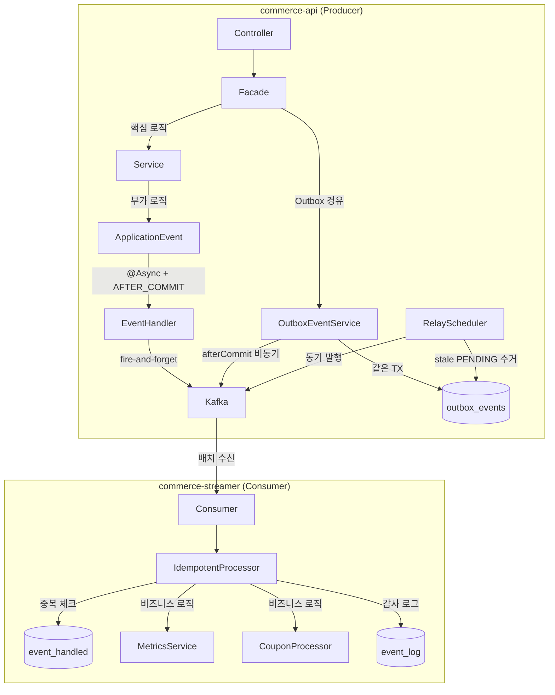

---

## 의사결정 기록

### 이 문서의 구조

1. **왜 분리하는가** (D1~D3) — 핵심/부가 판별, 모놀리식에서의 분리 여부, 내부/외부 전달 기준
2. **어떻게 발행하는가** (D4~D7) — Outbox INSERT 위치, 발행 전략 v1→v3 진화, AFTER_COMMIT, 토픽 설계
3. **어떻게 중복을 막는가** (D8~D10) — Kafka/발행/소비 3계층 멱등성
4. **실패하면 어떻게 되는가** (D11~D13) — DLT + 재시도, 결과적 일관성, 관측성
5. **설정값 근거** — Consumer/Producer/스레드풀/서버/리소스 풀

---

### 1. 왜 분리하는가

#### D1. 핵심 vs 부가 분리 근거

> **판별 기준**: "이 로직이 실패해도 핵심 비즈니스는 성공해야 하는가?"

| 분리 O (부가) | 분리 X (핵심) |
|-------------|-------------|
| 좋아요 집계, 조회수 집계 | 재고 확정/해제 |
| 결제 완료 로깅 | 주문 상태 전이 |
| 사용자 활동 기록 | 쿠폰 선점 |

부가 로직은 `@TransactionalEventListener(AFTER_COMMIT)` + `@Async`로 분리하여, 핵심 트랜잭션의 성공을 보장하면서 장애를 격리했다.

```java
// LikeCountEventHandler.java
@TransactionalEventListener(phase = AFTER_COMMIT)
@Async
public void handleLiked(ProductLikedEvent event) {
    productService.incrementLikeCount(event.productId());
    productCacheManager.evictDetail(event.productId());
    publishToKafka("product.liked", event.productId(), event);
}

private void publishToKafka(String eventType, Long productId, Object event) {
    kafkaTemplate.send(CATALOG_EVENTS, String.valueOf(productId),
            outboxEventFactory.createPayload(eventType, event));
}
```

좋아요 요청 시 핵심(likes INSERT)과 부가(집계, Kafka 발행)가 분리되는 전체 흐름:

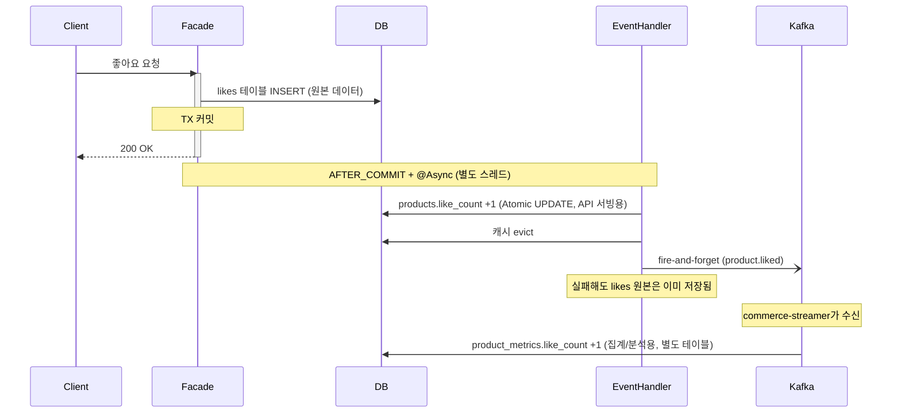

`product_metrics`는 fire-and-forget 경로의 INCREMENT 기반 집계이므로 메시지 유실·중복 시 drift가 누적된다. 별도 Reconciliation을 두지 않은 이유는 분석/대시보드용 근사치 지표이며, 비즈니스 의사결정에 사용되는 정확한 좋아요 수는 `products.like_count`(Reconciliation 대상)를 참조하기 때문이다.

#### D2. 핵심 내 분리 여부 — "모놀리식에서 안 한다"

결제 성공 후 재고 확정, 주문 상태 전이, 쿠폰 사용 확정 등 후속 작업들을 이벤트로 분리할 수 있는지 검토했다.

**분리한다면?** — 중간 상태를 도입하면 가능하다.

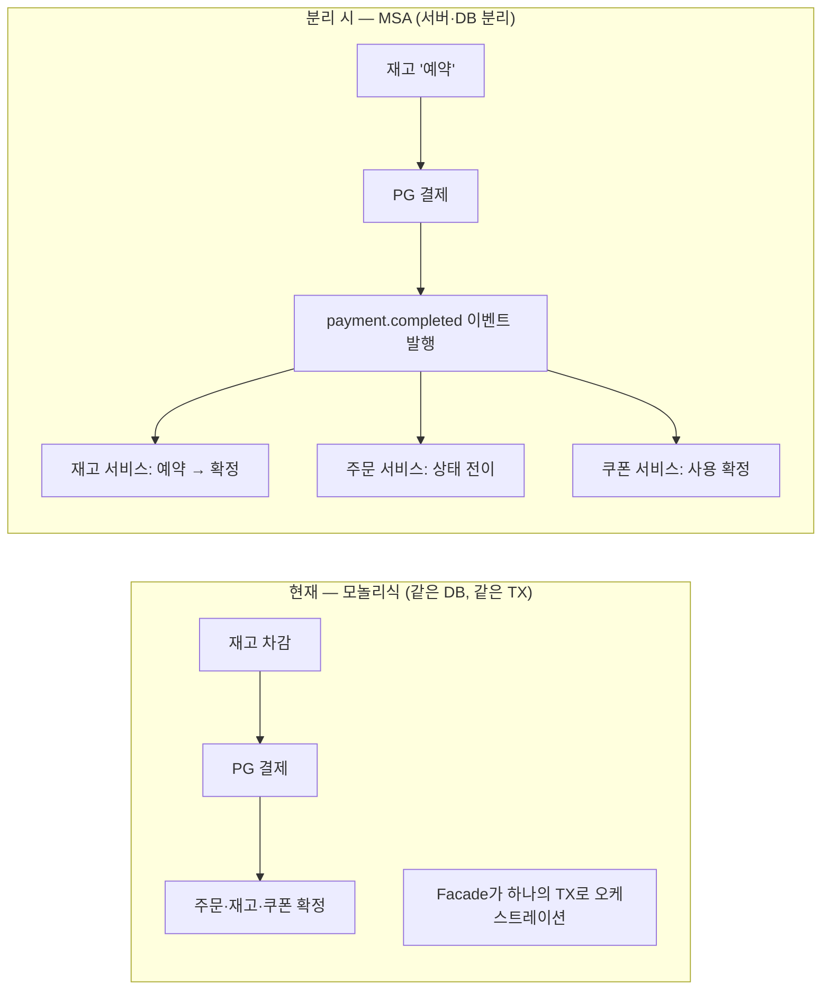

재고를 즉시 차감하는 대신 "예약" 중간 상태를 두면, 결제 성공 이벤트를 수신한 각 서비스가 독립적으로 확정 처리할 수 있다. 각 서비스가 자기 DB만 알면 되므로 Outbox + 이벤트 핸들러로 결과적 일관성을 달성한다.

**결론: 현재는 분리하지 않는다.**

- 지금은 모놀리식이므로 Facade가 오케스트레이션 역할을 하며, 같은 DB의 같은 TX 안에서 처리한다
- 같은 DB 안의 단순 UPDATE를 Kafka 셀프컨슘으로 분리하면 over-engineering
- 후속 작업 실패 확률 ≈ 0 (네트워크 홉 없음, 같은 DB 인스턴스)
- 이미 `reconcilePending` 스케줄러 + Payment 상태 머신으로 일관성 보장 중
- **서버와 DB가 분리되는 시점**에 비로소 위 구조가 필요해지며, 설계안은 ADR에 기록해 둠

#### D3. ApplicationEvent vs Outbox — 내부/외부 전달 기준

> **판별 기준**: 같은 JVM 내부에 이벤트를 보낼 때는 ApplicationEvent, 외부 서비스에 전달해야 할 때는 Kafka(Outbox)를 사용한다.

| 경로 | 전달 범위 | 선택 |
|------|----------|------|
| 좋아요/조회수 집계 | 같은 JVM 내 핸들러가 처리 | **ApplicationEvent** (유실 시 reconciliation 배치로 복구, 매일 02:00 실행, 최대 24시간 부정확 허용) |
| 사용자 활동 로깅 | 같은 JVM 내 핸들러가 처리 | **ApplicationEvent** |
| 결제 완료 → 메트릭 집계 | commerce-streamer(외부 앱)가 소비 | **Outbox → Kafka** |
| 쿠폰 발급 요청 | commerce-streamer(외부 앱)가 소비 | **Outbox → Kafka** |

두 경로가 Facade에서 어떻게 갈라지는지 시각화하면:

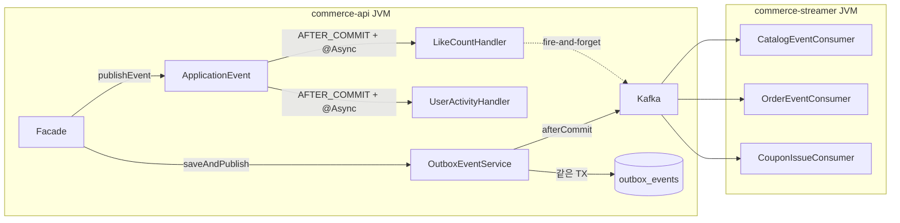

---

### 2. 어떻게 발행하는가

#### D4. Outbox INSERT 위치 — Facade 직접 호출

`@TransactionalEventListener(BEFORE_COMMIT)` 리스너에서 자동 INSERT하는 방식도 가능하지만, Facade를 읽었을 때 Outbox 발행 여부가 보이지 않는다. 이벤트 리스너를 통한 간접 호출은 불필요한 추상화라고 판단하여, Facade에서 `outboxEventService.saveAndPublish()`를 직접 호출하는 방식을 선택했다. Facade를 읽으면 "여기서 이벤트가 나간다"가 즉시 파악된다.

```java
// PaymentFacade.java — Facade에서 직접 호출
@Transactional
public PaymentInfo completePayment(...) {
    // 비즈니스 로직
    Payment payment = paymentService.confirm(...);
    orderService.payOrder(...);
    stockService.confirmStock(...);

    // Outbox INSERT + 즉시 발행 — 같은 TX 안에서 원자적으로
    outboxEventService.saveAndPublish(
        "payment.completed", "payment", String.valueOf(payment.getId()),
        ORDER_EVENTS, new PaymentCompletedEvent(...)
    );
    return PaymentInfo.from(payment);
}
```

```java
// OutboxEventService.java
@Transactional(propagation = Propagation.MANDATORY) // TX 없이 호출하면 즉시 예외
public void saveAndPublish(String eventType, String aggregateType, String aggregateId,
                           String topic, Object eventPayload) {
    OutboxEvent outboxEvent = outboxEventFactory.create(eventType, aggregateType, aggregateId, topic, eventPayload);
    outboxEventRepository.save(outboxEvent); // 같은 TX에서 INSERT

    afterCommit(() ->
            kafkaTemplate.send(outboxEvent.getTopic(), outboxEvent.getAggregateId(), outboxEvent.getPayload())
                    .whenComplete((result, ex) -> {
                        if (ex != null) {
                            log.warn("즉시 발행 실패, @Scheduled가 보완 예정: eventId={}", outboxEvent.getEventId(), ex);
                        } else {
                            outboxEventRepository.markPublishedByEventId(outboxEvent.getEventId());
                        }
                    }));
}
```

#### D5. 발행 전략 — 즉시 발행 + Scheduled 보완

3단계 진화를 거쳤다.

**v1. 스케줄러 단독 (폴링)** — 스케줄러가 주기적으로 PENDING을 수거하여 발행. 구현은 단순하지만 폴링 주기만큼 지연이 발생한다.

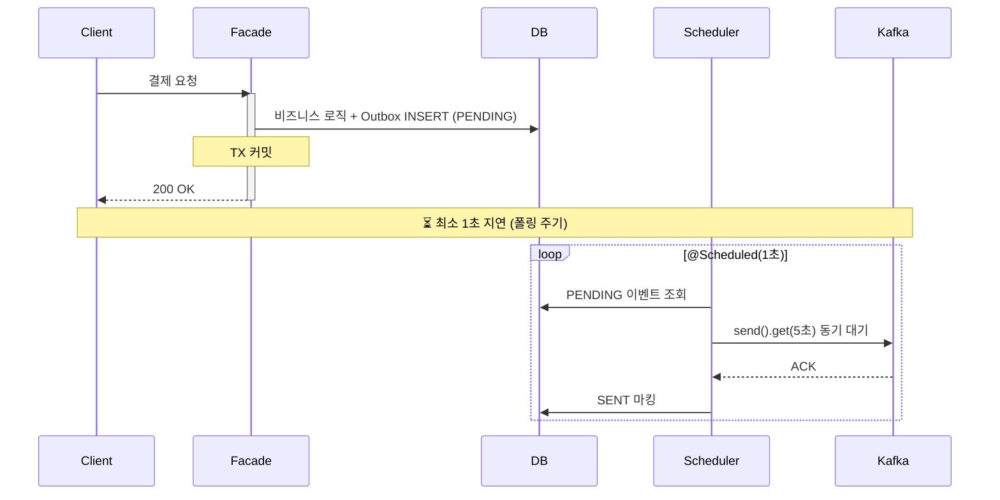

```java
// OutboxRelayScheduler.java (v1 시절)
@Scheduled(fixedDelay = 1000)
public void relay() {
    List<OutboxEvent> events = outboxEventRepository.findPending(BATCH_SIZE);
    for (OutboxEvent event : events) {
        kafkaTemplate.send(event.getTopic(), event.getAggregateId(), event.getPayload())
                .get(5, TimeUnit.SECONDS); // 동기 대기
        event.markSent();
        outboxEventRepository.save(event);
    }
}
```

**v2. 즉시 발행 + 셀프컨슘**

TX 커밋 직후 비동기로 즉시 발행하고, Producer가 발행한 메시지를 다시 Consumer(셀프컨슘)로 수신하여 SENT를 마킹하는 구조. 지연은 해결됐지만 다음 단점들로 **폐기.**

- SENT 마킹 전용 Consumer Group을 별도로 만들어야 함 (운영 부담)
- 셀프컨슘 Consumer의 장애 시 SENT 마킹이 밀리는 문제
- SENT 마킹을 위해 Kafka를 한 번 더 경유 — 불필요한 네트워크 홉
- v3의 `whenComplete` 콜백이면 Kafka ACK 시점에 바로 SENT 마킹 가능 — 더 단순하고 빠름

**v3. 즉시 발행 + Scheduled 보완 (최종)** — TX 커밋 직후 `afterCommit`에서 비동기로 즉시 발행하고, `whenComplete` 콜백으로 SENT 마킹. 즉시 발행이 실패하면 PENDING 유지 → 스케줄러가 1분마다 수거.

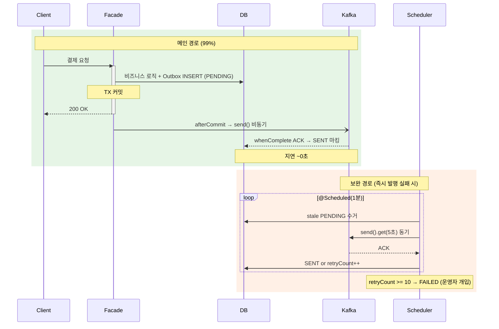

```java
// OutboxRelayScheduler.java (v3 — 보완 전용)
@Scheduled(fixedDelay = 60000) // 1분 간격
public void compensatePendingEvents() {
    List<OutboxEvent> pendingEvents = outboxEventRepository.findPending(BATCH_SIZE);
    if (pendingEvents.isEmpty()) return;

    for (OutboxEvent event : pendingEvents) {
        try {
            kafkaTemplate.send(event.getTopic(), event.getAggregateId(), event.getPayload())
                    .get(5, TimeUnit.SECONDS); // 스케줄러는 사용자 대기 없으므로 동기 블로킹 안전
            event.markSent();
        } catch (Exception e) {
            event.incrementRetryCount();
            if (event.getRetryCount() >= MAX_RETRY_COUNT) {
                event.markFailed();
                log.error("Outbox FAILED: eventId={}, retryCount={}", event.getEventId(), event.getRetryCount(), e);
            }
        }
        outboxEventRepository.save(event);
    }
}
```

- 정상 케이스 지연: **~0초** (v1 대비 1초 → 0초)
- 즉시 발행 실패 시 PENDING 유지 → 스케줄러가 1분 내 수거
- `@Transactional(MANDATORY)`: TX 없는 컨텍스트에서 호출 시 즉시 예외 → Outbox가 비즈니스 TX 밖에서 저장되는 실수 방지

**인지하고 있는 트레이드오프:**

> **whenComplete 콜백**: 콜백이 `kafka-producer-network-thread`에서 실행되므로, `markPublishedByEventId()`의 Hikari 커넥션 대기 시 모든 send() 콜백이 밀릴 수 있다. 현재 규모에서 SENT 마킹은 Hikari 30개 중 1개를 수 ms 점유 후 반환하므로 풀 고갈 가능성이 없고, 실패해도 PENDING 유지 → 스케줄러 보완으로 유실 불가능하므로 의도적으로 단순하게 유지했다. 중규모 전환 시 별도 비동기 스레드로 분리하거나 `BlockingQueue` + 배치 마킹으로 전환한다.

> **findPending 타이밍 윈도우**: 즉시 발행 ACK 대기 중에 스케줄러가 같은 PENDING을 수거하면 불필요한 중복 발행이 발생한다. `findPending` 쿼리에 `WHERE created_at < NOW() - 10초` 조건을 추가하여, 즉시 발행이 진행 중일 수 있는 이벤트는 스킵하도록 개선했다.

**현재 트래픽(~132 rps)에서는 이 방식이 적합하지만, 스케일 한계가 존재한다:**

- `afterCommit`에서 `kafkaTemplate.send()`를 호출하면 Kafka Producer의 내부 버퍼와 커넥션 풀을 Tomcat 스레드가 공유한다. 트래픽이 수천 rps 이상으로 올라가면 Producer 버퍼 경합이 발생하고, 비동기 콜백 처리를 위한 스레드 자원도 부족해진다.
- 이 경우 애플리케이션이 직접 발행하는 대신, **Debezium 같은 CDC(Change Data Capture)** 도입을 고려해야 한다. CDC는 DB의 binlog를 직접 읽어 Outbox 테이블의 INSERT를 감지하고 Kafka로 발행하므로, 애플리케이션의 스레드풀/커넥션 풀에 전혀 부담을 주지 않는다.

| 방식 | 적합 규모 | 장점 | 단점 |
|------|----------|------|------|
| afterCommit 즉시 발행 (현재) | ~수백 rps | 구현 단순, 인프라 추가 없음 | Producer 버퍼/스레드 경합 |
| CDC (Debezium) | 수천 rps 이상 | 앱 자원 무부담, 스케일 독립 | 인프라 복잡도 증가 (Debezium + Kafka Connect) |

#### D6. AFTER_COMMIT을 선택한 이유

| phase | 리스너 예외 시 발행자 TX | 실행 시점 |
|-------|---------------------|----------|
| DEFAULT | **롤백** | TX 안에서 동기 실행 |
| BEFORE_COMMIT | **롤백** | 커밋 직전 |
| **AFTER_COMMIT** | **영향 없음** | 커밋 완료 후 |

부가 로직(좋아요 집계, 로깅)의 실패가 핵심 비즈니스(결제, 주문)를 롤백시키면 안 된다. AFTER_COMMIT으로 완전히 격리했다.

#### D7. Event vs Command 토픽

| 토픽 | 성격 | 네이밍 | 수신자 |
|------|------|--------|--------|
| `catalog-events` | **Event** | 과거시제 (`product.liked`) | 불특정 다수 |
| `order-events` | **Event** | 과거시제 (`payment.completed`) | 불특정 다수 |
| `coupon-issue-requests` | **Command** | 요청형 | 쿠폰 서비스 (특정) |

쿠폰 발급은 "이런 일이 일어났다"가 아니라 "이것을 처리해라"이므로 Command 토픽으로 분류했다.

---

### 3. 어떻게 중복을 막는가

발행 측과 소비 측의 전략이 다르다:

- **발행 측(Producer)**: 무조건 한 번 이상 보낸다 (At-Least-Once). 유실보다 중복이 낫다.
- **소비 측(Consumer)**: Producer가 보낸 메시지를 믿지 않는다. 같은 메시지가 여러 번 올 수 있다고 가정하고 멱등 처리한다.
- **Kafka 레벨**: 자체적으로 Exactly-Once를 지원하지만, Producer → Broker 구간에 한정되며 애플리케이션 레벨 중복은 커버하지 못한다.

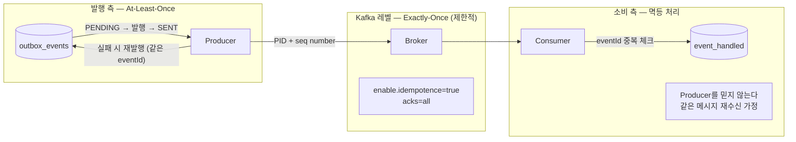

#### D8. Kafka 레벨 멱등성 — 자체 Exactly-Once의 한계

```yaml
spring.kafka.producer:
  acks: all                        # 모든 ISR 복제본 확인 후 ACK
  properties:
    enable.idempotence: true       # PID + sequence number로 브로커 중복 저장 방지
```

Kafka는 `enable.idempotence=true` 설정으로 **Producer → Broker 구간**의 중복을 방지한다. 네트워크 재시도로 같은 메시지가 두 번 전송되어도 Broker가 PID + sequence number로 걸러낸다.

**하지만 이것만으로는 부족하다:**

| 구간 | Kafka 멱등성이 커버하는가? | 예시 |
|------|:-----------------------:|------|
| Producer → Broker 중복 전송 | **O** | 네트워크 타임아웃 후 재전송 |
| 애플리케이션이 같은 이벤트를 두 번 발행 | **X** | Outbox 스케줄러가 SENT 마킹 전에 재실행 |
| Consumer가 같은 메시지를 두 번 처리 | **X** | 리밸런싱으로 오프셋 커밋 전 재할당 |

따라서 Kafka 레벨 멱등성은 기본으로 켜두되, 발행 레벨(D9)과 소비 레벨(D10)에서 각각 추가 방어가 필요하다.

**replication-factor=1의 내구성 한계**: 현재 브로커 1대가 죽으면 Kafka 레벨에서는 메시지가 유실된다. 단, Outbox 테이블에 원본이 남아 있으므로 스케줄러가 재발행하여 복구된다. 운영 환경에서는 replication-factor=3으로 전환하여 Kafka 레벨 내구성을 확보할 예정이다.

#### D9. 발행 레벨 — At-Least-Once (무조건 한 번 이상 보낸다)

Outbox 테이블의 `status` 상태 머신으로 "유실 없는 발행"을 보장한다:

```
PENDING → SENT → (7일 후 삭제)
    ↓
  FAILED (retryCount >= 10)
```

- `eventId(UUID)`: 이벤트별 고유 식별자 — 비즈니스 TX 안에서 생성
- 즉시 발행 실패 → PENDING 유지 → 스케줄러가 **같은 eventId로** 재발행
- SENT 마킹: `@Modifying` + `@Transactional`로 자체 TX에서 원자적 UPDATE
- 같은 비즈니스 이벤트가 다른 eventId로 발행되는 일이 없다
- **결과: 중복 발행은 가능하지만, 유실은 불가능** → Consumer가 멱등 처리로 중복을 걸러냄
- **클린업**: SENT 레코드는 7일 후 자동 삭제 (`OutboxCleanupScheduler`, 매일 03:00). FAILED 레코드는 운영자 확인 후 수동 처리

#### D10. 소비 레벨 — Producer를 믿지 않는다 (멱등 처리)

At-Least-Once 발행이므로 같은 메시지가 여러 번 올 수 있다. Consumer는 이를 가정하고 `event_handled` 테이블로 중복을 필터링한다.

```java
// IdempotentProcessor.java
@Transactional
public void process(String eventId, String eventType, String topic, String groupId, Runnable handler) {
    if (eventHandledRepository.existsByEventId(eventId)) {
        eventLogRepository.save(EventLog.skipped(eventId, eventType, topic, groupId));
        consumerMetrics.recordSkipped(topic, groupId, eventType);
        return; // 이미 처리됨 — SKIP
    }

    long start = System.currentTimeMillis();
    try {
        handler.run(); // 비즈니스 로직 실행
        eventHandledRepository.save(EventHandled.of(eventId, eventType)); // 같은 TX
        long duration = System.currentTimeMillis() - start;
        eventLogRepository.save(EventLog.processed(eventId, eventType, topic, groupId, duration));
        consumerMetrics.recordProcessed(topic, groupId, eventType, duration);
    } catch (Exception e) {
        eventLogRepository.save(EventLog.failed(eventId, eventType, topic, groupId, e.getMessage()));
        consumerMetrics.recordFailed(topic, groupId, eventType);
        throw e; // re-throw → ErrorHandler → DLT
    }
}
```

```java
// CatalogEventConsumer.java
@KafkaListener(topics = CATALOG_EVENTS, groupId = "metrics-aggregation",
               containerFactory = BATCH_LISTENER)
public void consume(List<ConsumerRecord<String, Map<String, Object>>> records, Acknowledgment ack) {
    for (int i = 0; i < records.size(); i++) {
        ConsumerRecord<String, Map<String, Object>> record = records.get(i);
        Map<String, Object> value = record.value();
        String eventId = (String) value.get("eventId");
        String eventType = (String) value.get("eventType");

        try {
            idempotentProcessor.process(eventId, eventType, CATALOG_EVENTS, GROUP_ID, () -> {
                switch (eventType) {
                    case "product.liked" -> metricsService.incrementLikeCount(productId, 1);
                    case "product.unliked" -> metricsService.incrementLikeCount(productId, -1);
                    case "product.viewed" -> metricsService.incrementViewCount(productId, 1);
                }
            });
        } catch (Exception e) {
            throw new BatchListenerFailedException("Consumer 처리 실패", i);
        }
    }
    ack.acknowledge(); // 수동 커밋
}
```

최초 수신 시 비즈니스 로직을 실행하고, 같은 eventId가 재수신되면 SKIP하는 흐름:

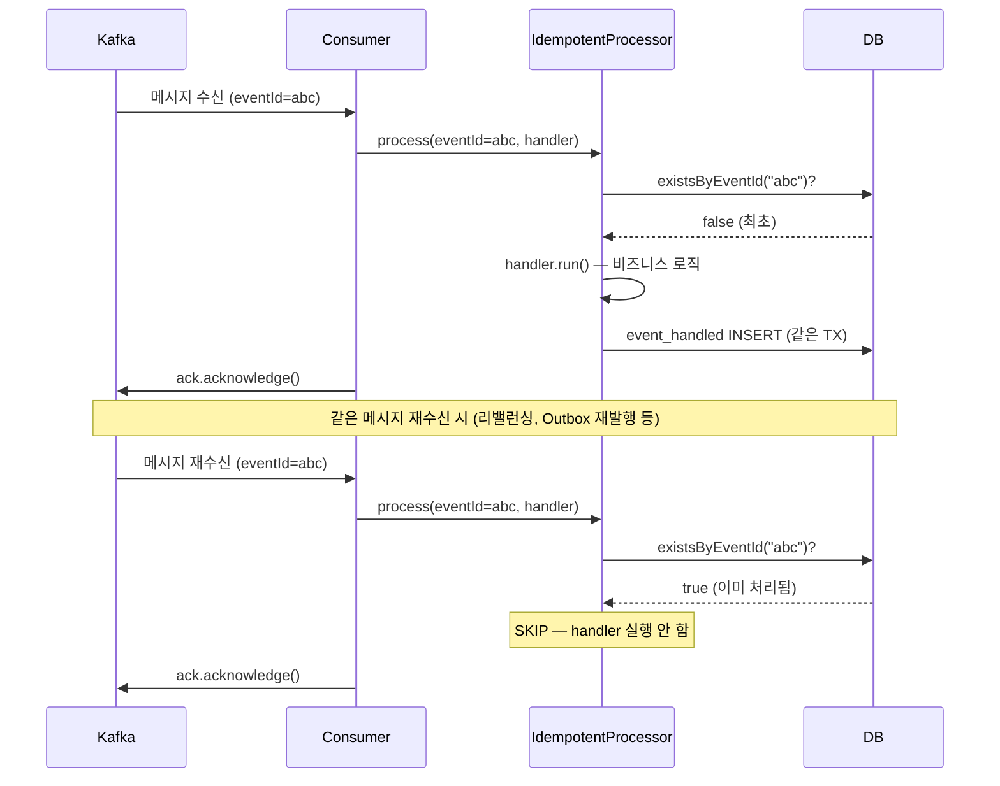

- 비즈니스 로직 실행 + `event_handled` INSERT가 **같은 TX** → 원자적 보장
- 처리 성공했는데 기록이 안 남는 경우가 없다 (둘 다 커밋되거나, 둘 다 롤백)
- **At-Least-Once 발행 + 멱등 소비 = Exactly-Once 의미론**
- **클린업**: `event_handled` 레코드는 7일 후 자동 삭제 (`EventHandledCleanupScheduler`, 매일 04:00)

> **주의**: Outbox FAILED의 수동 재발행은 반드시 7일 이내에 처리해야 한다. 초과 시 `event_handled`에서 삭제되어 멱등성 체크를 통과할 수 있다.

---

### 4. 실패하면 어떻게 되는가

#### D11. DLT + 재시도 전략

```java
// KafkaConfig.java — DLT + 에러 핸들링
@Bean
public DeadLetterPublishingRecoverer deadLetterPublishingRecoverer(KafkaTemplate<Object, Object> kafkaTemplate) {
    return new DeadLetterPublishingRecoverer(kafkaTemplate, (record, ex) ->
            new TopicPartition(record.topic() + ".DLT", -1));
}

@Bean
public CommonErrorHandler commonErrorHandler(DeadLetterPublishingRecoverer recoverer) {
    DefaultErrorHandler errorHandler = new DefaultErrorHandler(recoverer, new FixedBackOff(1000L, 2L));
    errorHandler.addNotRetryableExceptions(
            JsonParseException.class,      // 메시지 포맷 오류 → 재시도 의미 없음
            JsonMappingException.class
    );
    return errorHandler;
}
```

**Consumer 측 실패 흐름:**

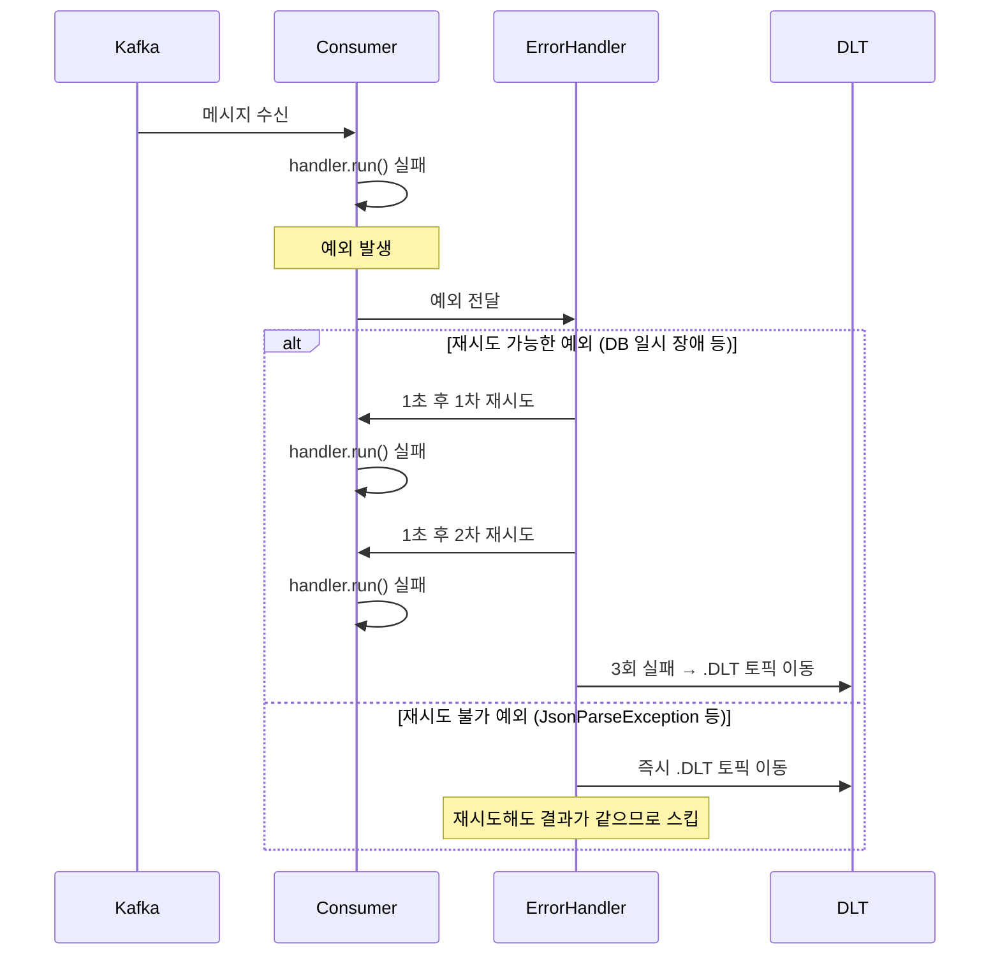

**배치 처리 중 부분 실패 흐름**:

1. 배치 내 i번째 레코드에서 실패 → `BatchListenerFailedException(i)` throw
2. `ack.acknowledge()`에 도달하지 않음 → 오프셋 커밋 안 됨
3. ErrorHandler가 i번째만 재시도 → 최종 실패 시 DLT로 이동
4. 다음 poll에서 0번째부터 다시 수신
5. 0~(i-1)번째: 이미 `event_handled`에 기록 → **SKIP**
6. i+1 이후: 아직 미처리 → **정상 처리**

**Outbox 측 발행 실패 흐름:**

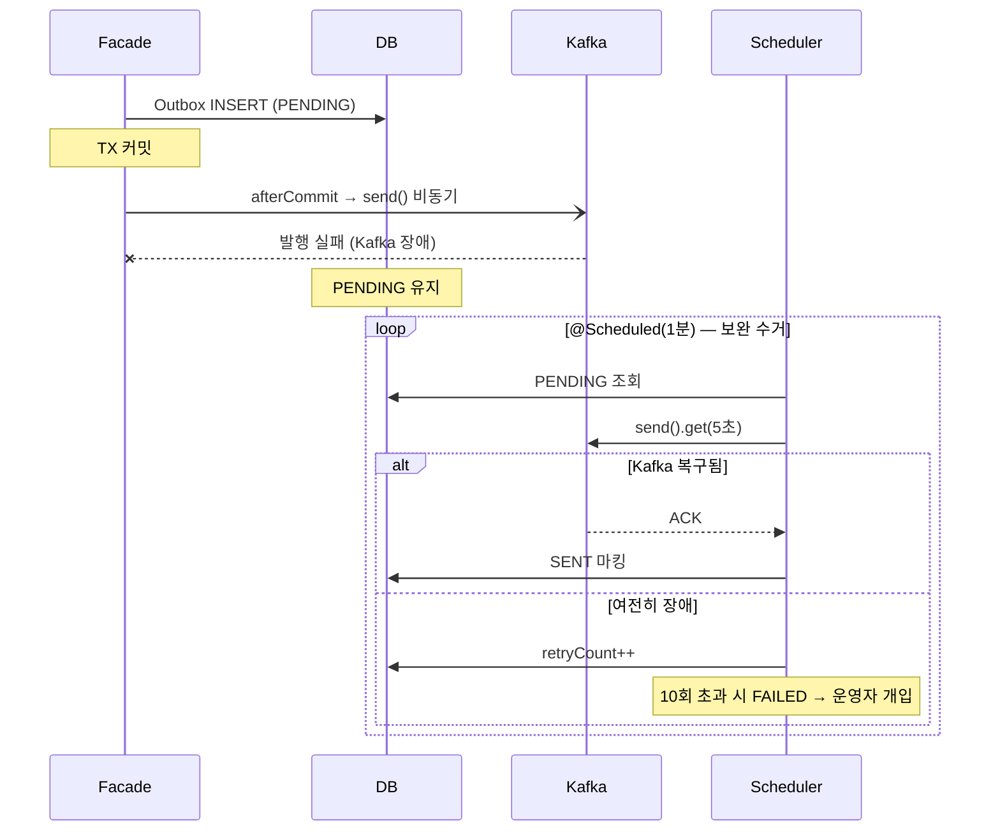

**설정 요약:**

| 구분 | 재시도 | 최종 실패 시 |
|------|--------|------------|
| Consumer | FixedBackOff 1초 x 2회 | `.DLT` 토픽 이동 |
| Outbox | 스케줄러 1분 간격, `.get(5초)` | retryCount >= 10 → FAILED |

#### D11-1. DLQ 후속 처리 전략 (운영 구상)

현재 구현된 것은 **DLT 토픽 자동 생성 + `DeadLetterPublishingRecoverer`로 실패 메시지 자동 라우팅**까지다. DLT에 쌓인 메시지를 조회하거나 재발행하는 운영 도구는 아직 구현하지 않았다. 향후 운영 환경에서 DLT 메시지가 실제로 발생했을 때, 아래 절차로 처리할 계획이다.

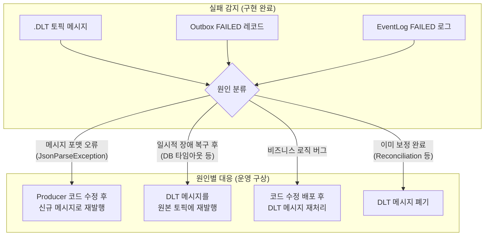

| 원인 | 대응 | Consumer 멱등성 보장 |
|------|------|:------------------:|
| 메시지 포맷 오류 | Producer 코드 수정 후 신규 메시지 발행 | 새 eventId이므로 해당 없음 |
| 일시적 장애 후 복구 | DLT 메시지를 원본 토픽에 재발행 | **O** — 같은 eventId로 재수신, 이미 처리됐으면 SKIP |
| 비즈니스 로직 버그 | 코드 수정 배포 후 DLT 메시지 재처리 | **O** — event_handled에 없으면 정상 처리 |
| Reconciliation으로 이미 보정 | DLT 메시지 폐기 | 처리 불필요 |

DLT 재발행 시에도 Consumer의 `IdempotentProcessor`가 eventId로 중복을 필터링하므로, 안전하게 재처리할 수 있다. DLT 메시지 조회/재발행 Admin API와 모니터링 알림은 운영 환경 안정화 후 구현 예정이다.

#### D12. 결과적 일관성 보장 메커니즘

이벤트만으로는 100% 일관성을 보장할 수 없다. 3가지 보완 장치를 두었다:

| 계층 | 메커니즘 | 역할 |
|------|---------|------|
| 발행 | Outbox + RelayScheduler | At-Least-Once 발행 보장 |
| 도메인 | Payment 상태 머신 + reconcilePending | 미결 결제 자동 보정 |
| 데이터 | Reconciliation 배치 | 좋아요 수를 `likes` 테이블 `COUNT(*)`로 주기적 동기화 |

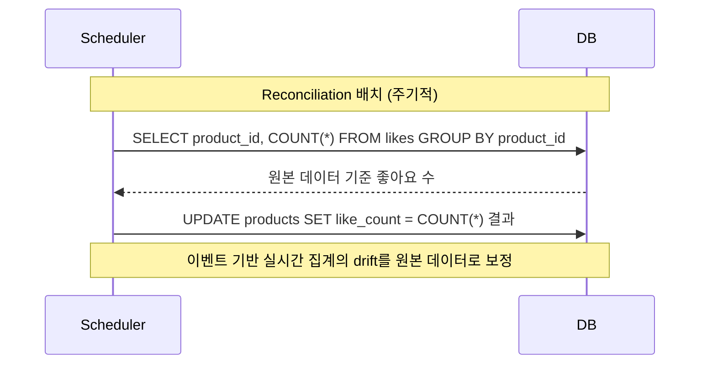

**Reconciliation 설계 원칙**: "이벤트 기반 실시간 집계를 신뢰하되, 주기적으로 원본 데이터와 대조하여 drift를 보정한다."

#### D13. 관측성 — 3계층 구조

| 계층 | 도구 | 목적 |
|------|------|------|
| 감사 추적 | `EventLog` 테이블 | 이벤트별 PROCESSED/SKIPPED/FAILED 상태, 에러 메시지, 처리 시간 |
| 실시간 모니터링 | `ConsumerMetrics` (Micrometer) | `consumer.event.processed/skipped/failed` Counter + Timer |
| 최종 실패 | DLT 토픽 | 재시도 불가 메시지 격리 |

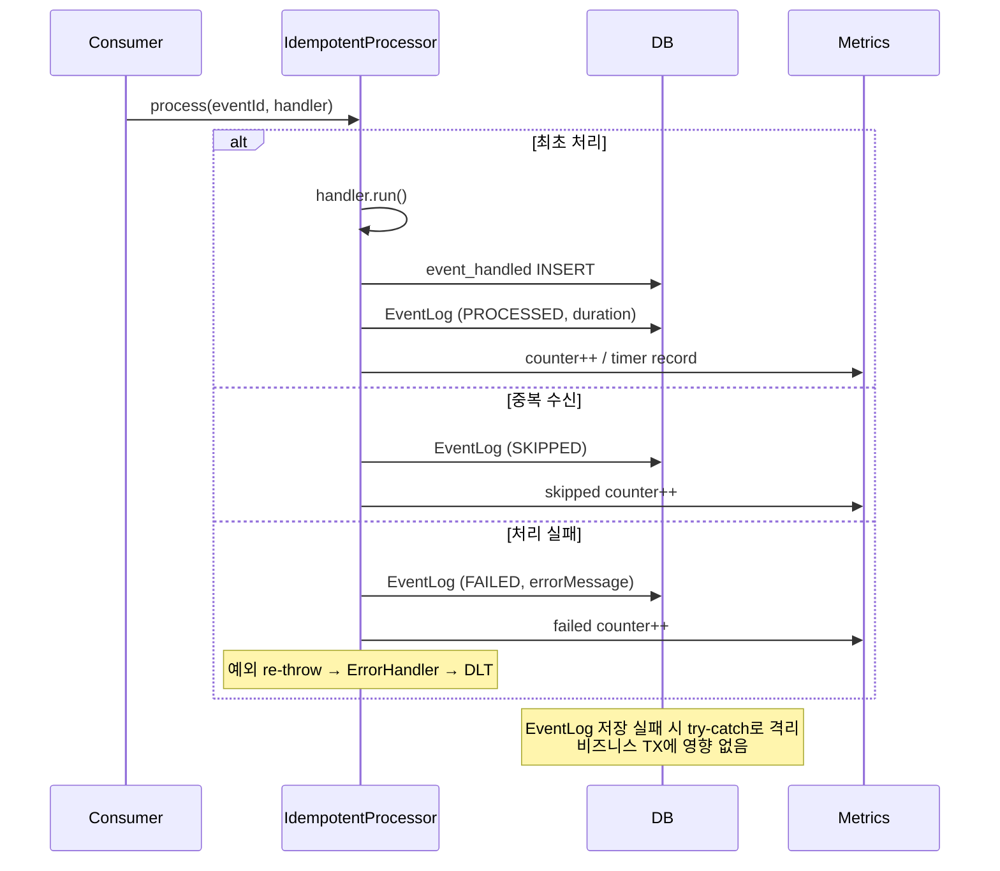

---

### 5. 설정값 근거

#### Kafka Consumer 설정

```java
// KafkaConfig.java
public static final int MAX_POLLING_SIZE = 500;                // ~132 rps 기준 적정 배치
public static final int FETCH_MIN_BYTES = 1;                   // 메시지 도착 즉시 반환
public static final int FETCH_MAX_WAIT_MS = 1000;              // 1초 대기 후 반환
public static final int SESSION_TIMEOUT_MS = 60 * 1000;        // 1분
public static final int HEARTBEAT_INTERVAL_MS = 20 * 1000;     // 20초 (1/3 of session_timeout)
public static final int MAX_POLL_INTERVAL_MS = 2 * 60 * 1000;  // 2분

// 배치 리스너 팩토리
factory.getContainerProperties().setAckMode(ContainerProperties.AckMode.MANUAL);
factory.setConcurrency(3);
factory.setBatchListener(true);
```

| 설정 | 값 | 근거 |
|------|-----|------|
| `max.poll.records` | 500 | ~132 rps 기준 적정 배치. 3000에서 축소 — DB 부하 시 레코드당 40ms면 3000 x 40ms = 120초로 `max.poll.interval.ms`와 일치하여 리밸런싱 위험. 500이면 20초로 충분한 마진 확보 |
| `fetch.min.bytes` | 1 (byte) | 메시지 도착 즉시 반환. 기존 1MB 설정 시 현재 트래픽에서 거의 항상 `fetch.max.wait.ms` 타임아웃에 걸려 **모든 배치에 불필요한 지연이 추가**됨. 배치 효율은 트래픽이 올라가면 자연스럽게 좋아짐 |
| `fetch.max.wait.ms` | 1초 | 메시지 없을 때 최대 대기 시간. 기존 5초에서 축소 — 즉시 발행으로 발행 지연 ~0초를 달성했는데 Consumer에서 5초를 다시 추가하는 건 비효율 |
| `session.timeout.ms` | 60초 | 리밸런싱 민감도. 너무 짧으면 GC pause로 불필요한 리밸런싱 |
| `heartbeat.interval.ms` | 20초 | session.timeout의 1/3 (Kafka 권장) |
| `max.poll.interval.ms` | 2분 | 500개 배치 처리 최대 허용 시간. 레코드당 40ms(DB 부하)여도 20초 → 충분한 마진 |
| `ack-mode` | MANUAL | 처리 완료 후 명시적 커밋 → 메시지 유실 방지 |
| `concurrency` | 3 | 토픽당 파티션 3개(KafkaTopicConfig)와 1:1 매칭 |

#### Kafka Producer 설정

| 설정 | 값 | 근거 |
|------|-----|------|
| `acks` | all | 모든 ISR 복제 확인. 현재 replication-factor=1이라 실질적으로 acks=1과 동일하지만, 운영 환경 replication-factor=3 전환 시 설정 변경 없이 안전성 확보 |
| `enable.idempotence` | true | PID + sequence number로 브로커 중복 저장 방지 |

#### 비동기 스레드풀 설정

```java
// AsyncConfig.java
@Override
public Executor getAsyncExecutor() {
    ThreadPoolTaskExecutor executor = new ThreadPoolTaskExecutor();
    executor.setCorePoolSize(5);
    executor.setMaxPoolSize(10);
    executor.setQueueCapacity(100);
    executor.setRejectedExecutionHandler(new ThreadPoolExecutor.CallerRunsPolicy());
    executor.setWaitForTasksToCompleteOnShutdown(true);
    executor.setAwaitTerminationSeconds(30);
    executor.setThreadNamePrefix("event-handler-");
    executor.initialize();
    return executor;
}

@Override
public AsyncUncaughtExceptionHandler getAsyncUncaughtExceptionHandler() {
    return (ex, method, params) ->
            log.error("비동기 핸들러 미처리 예외: method={}", method.getName(), ex);
}
```

| 설정 | 값 | 근거 |
|------|-----|------|
| `corePoolSize` | 5 | 좋아요 ~15 rps + 조회 이벤트. 평상시 5스레드로 충분 |
| `maxPoolSize` | 10 | 스파이크 시 2배 확장. Hikari 30개 중 이벤트 핸들러가 과점유하지 않도록 제한 |
| `queueCapacity` | 100 | core 포화 시 큐잉. 100개 이상이면 CallerRunsPolicy로 호출자 스레드에서 실행 |
| `rejectedExecutionHandler` | CallerRunsPolicy | 큐 가득 시 버리지 않고 호출자(Tomcat 스레드)가 직접 실행 → 메시지 유실 방지, 자연스러운 백프레셔 |
| `awaitTerminationSeconds` | 30 | 셧다운 시 진행 중 작업 완료 대기 |

**CallerRunsPolicy 트레이드오프**: `AFTER_COMMIT` 리스너는 TX 커밋 후이지만 컨트롤러 return 전에 호출된다. `@Async`가 정상이면 비동기 스레드풀에 제출하고 바로 return하지만, CallerRunsPolicy 발동 시 Tomcat 스레드가 부가 로직을 동기 실행하므로 클라이언트 응답이 지연될 수 있다. 현재 트래픽(좋아요 ~15 rps, core 5)에서 큐 100까지 차는 상황은 사실상 발생하지 않으며, 발생한다면 시스템 자체가 비정상이므로 메시지를 버리는 것(`DiscardPolicy`)보다 속도를 늦추면서라도 처리하는 게 낫다고 판단했다.

#### 서버 설정

```yaml
# application.yml
server:
  shutdown: graceful              # 진행 중 요청 완료 후 종료
  tomcat:
    threads:
      max: 40                     # Hikari 30 x 1.3
      min-spare: 10
```

```yaml
# jpa.yml
datasource:
  mysql-jpa:
    main:
      maximum-pool-size: 30       # DB 허용 45의 67%
      minimum-idle: 20
```

| 설정 | 값 | 근거 |
|------|-----|------|
| `shutdown` | graceful | 새 요청 거부 + 진행 중 요청 완료 대기 후 종료. `awaitTerminationSeconds`와 함께 이벤트 핸들러 작업 유실 방지 |
| `threads.max` | 40 | Hikari 30 x 1.3. TX 분리(부가 로직 비동기 처리)로 커넥션 점유 시간이 짧아 스레드 > 커넥션 성립 |
| `maximum-pool-size` | 30 | DB 허용 45의 67%. 나머지 15개는 DBeaver, 장애 대응, 모니터링 여유 |
| `minimum-idle` | 20 | 평상시 유휴 커넥션 유지. 트래픽 스파이크 시 30까지 확장 |

#### 리소스 풀 설계

```
MySQL 허용 커넥션: 45
  ├─ Hikari Pool: 30 (67%) — 앱 전용
  └─ 여유: 15 — DBeaver, 장애 대응, 모니터링

Tomcat 스레드: 40 (Hikari x 1.3)
  └─ TX 분리(부가 로직 비동기 처리)로 커넥션 점유 시간이 짧아
     스레드 수 > 커넥션 수가 성립

비동기 스레드풀: core 5 / max 10 / queue 100
  └─ 이벤트 핸들러 전용. Hikari 풀을 과점유하지 않도록 제한
     큐 초과 시 CallerRunsPolicy로 Tomcat 스레드가 직접 실행
```

---

### 학습 레퍼런스

이번 과제를 진행하며 Kafka와 메시징 시스템의 기초를 별도 레포에서 학습했습니다.

- [messaging-lab](https://github.com/ghtjr410/messaging-lab) — 메시징 시스템 기초 개념 학습 (Producer/Consumer 패턴, 메시지 보장 수준, 직렬화/역직렬화)
- [kafka-lab](https://github.com/ghtjr410/kafka-lab) — Kafka 실습 (토픽/파티션/컨슈머 그룹, 배치 처리, 수동 커밋, 에러 핸들링, DLT 구성)

---

# 리뷰 포인트

## 리뷰 포인트 1: 스케줄드 폴링 단독의 한계를 개선하기 위해 즉시 발행 + 보완 폴링 구조로 전환했습니다

### 스케줄드 폴링 단독의 문제점
```
TX 커밋 → Outbox INSERT (PENDING) → 스케줄러가 N초마다 폴링 → send → SENT
```

- 처리량 상한이 "배치 크기 ÷ (배치 × ACK 시간)"으로 고정됩니다.
- 트래픽이 이 상한을 넘으면 설정 튜닝(배치 크기 증가, 폴링 주기 단축)이 필요한데, 둘 다 DB 부하를 올립니다.
- 정상 케이스에서도 폴링 주기만큼 지연이 발생합니다.

### 개선 — 즉시 발행 + 보완 폴링
```
TX 커밋 → Outbox INSERT (PENDING) → afterCommit에서 즉시 send (메인 경로)
                                   → 실패 시 PENDING 유지 → @Scheduled가 수거 (보완 경로)
```

afterCommit에서 send()가 논블로킹으로 즉시 리턴하므로,
정상 케이스 지연이 거의 없고 처리량 상한이 Kafka 브로커 한계까지 올라갑니다.
@Scheduled는 실패 건만 수거하는 안전망 역할입니다.

**메인 경로 — 즉시 발행 (OutboxEventService)**
```java
@Transactional(propagation = Propagation.MANDATORY)
public void saveAndPublish(String eventType, String aggregateType, 
                           String aggregateId, String topic, Object payload) {
    OutboxEvent outbox = outboxEventFactory.create(eventType, aggregateType, aggregateId, topic, payload);
    outboxEventRepository.save(outbox);

    afterCommit(() ->
        kafkaTemplate.send(outbox.getTopic(), outbox.getAggregateId(), outbox.getPayload())
            .whenComplete((result, ex) -> {
                if (ex == null) {
                    outboxEventRepository.markPublishedByEventId(outbox.getEventId());
                } else {
                    log.warn("즉시 발행 실패, @Scheduled가 보완 예정: eventId={}",
                             outbox.getEventId(), ex);
                }
            }));
}
```

**보완 경로 — 스케줄드 폴링 (OutboxRelayScheduler)**
```java
@Scheduled(fixedDelay = 60000)
public void compensatePendingEvents() {
    List pending = outboxEventRepository.findPending(BATCH_SIZE);
    for (OutboxEvent event : pending) {
        try {
            kafkaTemplate.send(event.getTopic(), event.getAggregateId(), event.getPayload())
                .get(5, TimeUnit.SECONDS);
            event.markSent();
        } catch (Exception e) {
            event.incrementRetryCount();
            if (event.getRetryCount() >= MAX_RETRY) {
                event.markFailed();
            }
        }
        outboxEventRepository.save(event);
    }
}
```

**시퀀스 다이어그램 — 메인 경로 (정상)**
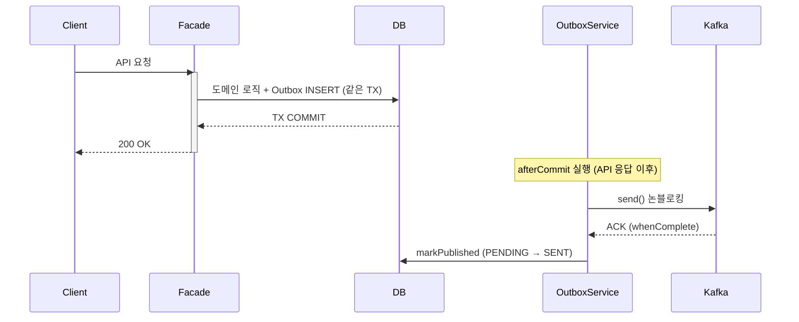

**시퀀스 다이어그램 — 보완 경로 (즉시 발행 실패 시)**
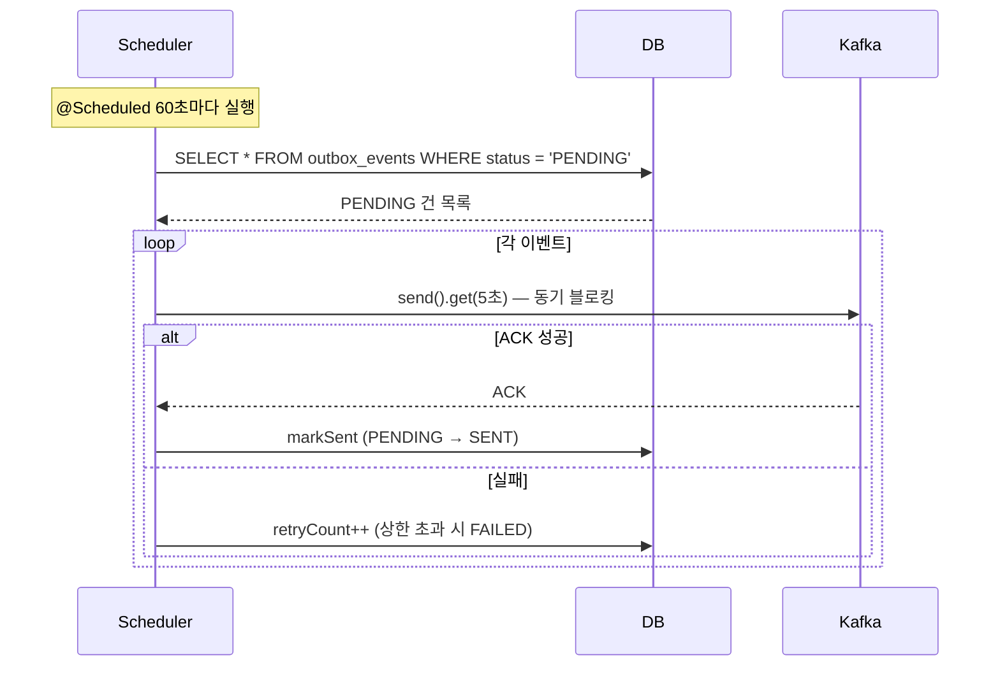

### 인지하고 있는 트레이드오프

whenComplete 콜백은 kafka-producer-network-thread에서 DB를 직접 호출합니다.
이 스레드에서 커넥션을 잡는 동안 Kafka 전체 발행이 정체될 수 있습니다.

다만 마킹이 실패해도 유실은 구조적으로 불가능합니다:
PENDING 유지 → @Scheduled가 .get()으로 수거 → 중복 발행 → Consumer 멱등 방어.
whenComplete 마킹의 역할은 "보완 폴링이 불필요하게 재발행하는 걸 줄여주는 최적화"입니다.

### 트래픽 증가 시 대응 전략
```
현재     → whenComplete에서 직접 DB 호출. 단순하고 충분.
중규모   → BlockingQueue + 배치 마킹으로 kafka 스레드 보호.
대규모   → CDC(Debezium)로 전환. 릴레이 자체를 인프라에 위임.
```

스케줄드 폴링 단독의 한계를 개선하기 위해 이런 구조를 시도해봤는데,
실무에서도 이 전략이 유효한지, 그리고 트래픽 증가 시 대응 경로가 현실적인지 의견이 궁금합니다.

