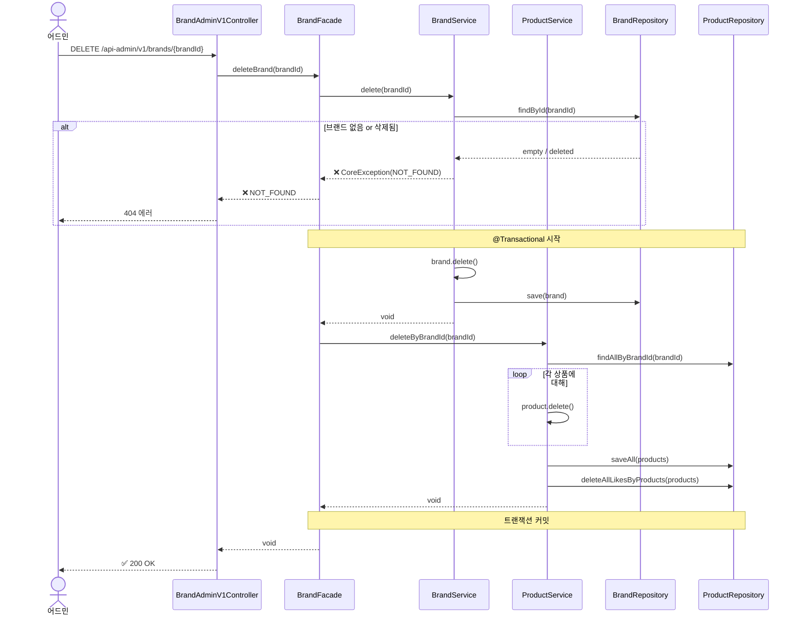
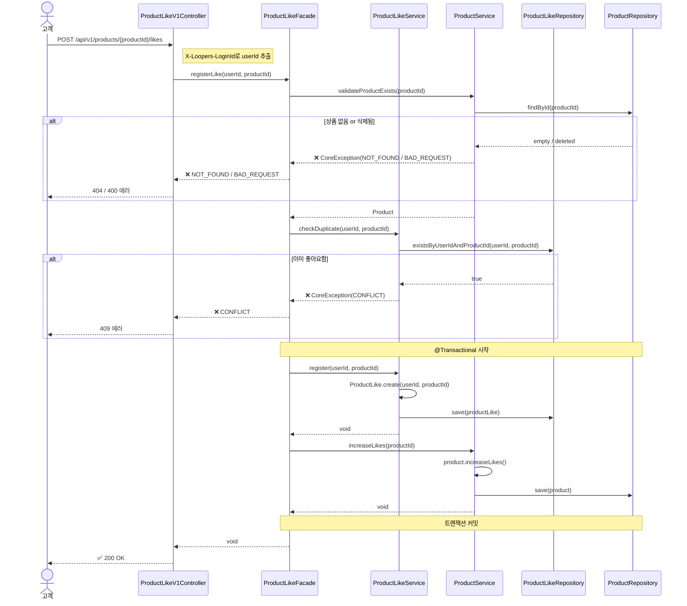
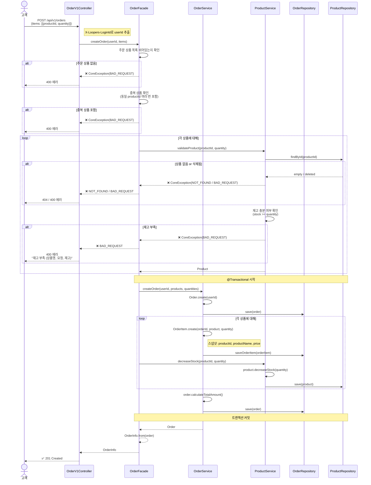

# 시퀀스 다이어그램 (Sequence Diagrams)

## 📋 문서 정보

- **작성일:** 2026-02-09
- **버전:** 1.0.0
- **상태:** Phase 1 설계

---

## 다이어그램 개요

가장 복잡한 비즈니스 흐름 3가지만 선별했습니다.

**선정 기준:**
- 여러 컴포넌트 간 협력이 필수
- 트랜잭션 경계가 중요
- 복잡한 검증 순서 존재

**제외한 것:**
- 단순 CRUD (브랜드/상품 등록, 수정, 조회)
- 역순 로직 (좋아요 취소 - 좋아요 등록의 반대)
- 단순 필터링 (상품 목록 조회)

---

# 1. 브랜드 삭제 (Cascade)

**목적:** 브랜드 삭제 시 연관된 상품과 좋아요도 함께 삭제되는 복잡한 흐름

**왜 시퀀스가 필요한가?**
- 3개 컴포넌트 협력 (BrandService → ProductService → LikeService)
- 트랜잭션 경계 명확화 필요
- Cascade 삭제 순서 중요

**핵심 포인트:**
- BrandFacade가 트랜잭션 경계를 관리 (@Transactional)
- BrandService.delete() → ProductService.deleteByBrandId() 순서로 Cascade 처리
- 브랜드 삭제 → 상품 삭제 → 좋아요 삭제 순서 보장
- 하나의 트랜잭션에서 원자적으로 처리 (전체 성공 or 전체 실패)
- Facade가 여러 Service를 조합하는 책임

---

# 2. 좋아요 등록

**목적:** 좋아요 등록과 좋아요 수 증가를 하나의 트랜잭션으로 처리

**왜 시퀀스가 필요한가?**
- 2개 작업의 트랜잭션 경계 명확화 (좋아요 등록 + 좋아요 수 증가)
- 원자성 보장 필요 (둘 다 성공 or 둘 다 실패)

**핵심 포인트:**
- ProductLikeFacade가 트랜잭션 경계를 관리
- 좋아요 등록과 좋아요 수 증가는 하나의 트랜잭션
- 중간에 실패하면 전체 롤백
- 삭제된 상품에는 좋아요 불가
- Static Factory Method 패턴 사용 (ProductLike.create())

---

# 3. 주문 생성

**목적:** 여러 상품을 주문하면서 복잡한 검증과 재고 차감을 트랜잭션으로 처리

**왜 시퀀스가 필요한가?**
- 가장 복잡한 비즈니스 흐름 (4개 컴포넌트 협력)
- 다단계 검증 순서 중요 (중복 → 존재 → 활성 → 재고)
- 트랜잭션 경계 명확화 필수
- 스냅샷 저장 로직 표현

**핵심 포인트:**
- OrderFacade가 트랜잭션 경계를 관리
- 4개 컴포넌트 협력 (Controller → Facade → OrderService, ProductService)
- 검증 순서 명확: 빈 목록 → 중복 → 존재 → 활성 → 재고
- 모든 상품 검증 완료 후 트랜잭션 시작 (부분 주문 불가)
- 주문 생성 → 주문 상품 생성 (스냅샷) → 재고 차감 순서 보장
- 하나의 트랜잭션에서 원자적으로 처리 (전체 성공 or 전체 실패)
- 스냅샷 저장: productId (참조용), productName/price (스냅샷)
- Static Factory Method 패턴 사용 (Order.create(), OrderItem.create())

