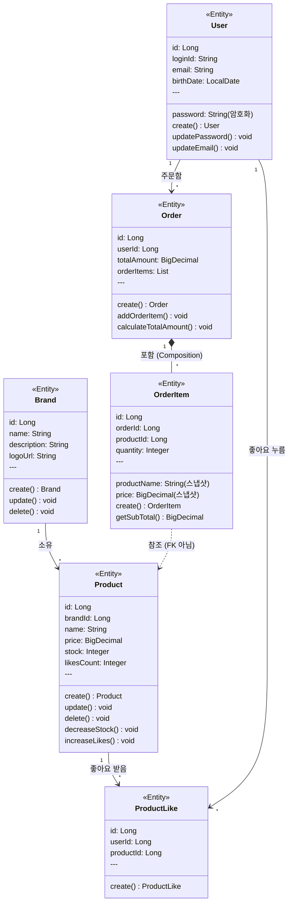

# 클래스 다이어그램 (Class Diagram)

## 📋 문서 정보

- **작성일:** 2026-02-12
- **버전:** 1.0.0
- **상태:** Phase 1 설계

---

## 다이어그램 개요

Clean Architecture 계층별로 도메인 객체의 책임과 관계를 표현합니다.

**목적:**
- 도메인 객체 간 책임 분리 확인
- 의존 방향 검증 (Domain → Infrastructure 의존 금지)
- 엔티티 설계 패턴 확인

---

## 전체 도메인 클래스 다이어그램



---

## 도메인 관계 설명

### Brand → Product (1:N, 소유)
- 하나의 브랜드는 여러 상품을 소유
- 브랜드 삭제 시 상품도 함께 Soft Delete (Cascade)
- 상품의 브랜드는 생성 후 변경 불가 (불변)

### Product → ProductLike (1:N, 좋아요 받음)
- 하나의 상품은 여러 좋아요를 받음
- 상품 삭제 시 좋아요도 함께 Hard Delete (Cascade)

### User → ProductLike (1:N, 좋아요 누름)
- 하나의 사용자는 여러 상품에 좋아요
- 중복 좋아요 불가 (user_id, product_id 유니크 제약)

### User → Order (1:N, 주문함)
- 하나의 사용자는 여러 주문
- 주문 삭제 기능 없음 (영구 보존)

### Order → OrderItem (1:N, Composition)
- 하나의 주문은 여러 주문 상품 포함
- Order 없이 OrderItem 존재 불가 (강한 결합)
- Order 삭제 시 OrderItem도 함께 삭제

### OrderItem ··> Product (참조, FK 아님)
- 주문 상품은 상품 ID를 참조만 함 (외래 키 제약 없음)
- 스냅샷: productName, price를 복사하여 저장
- 상품 삭제 후에도 주문 내역 유지

---

## 계층별 상세 설계

### Domain Layer

#### Brand (브랜드)

**책임:**
- 브랜드 정보 관리 (이름, 설명, 로고)
- Soft Delete 처리
- 생성/수정 시각 자동 관리

**핵심 속성:**
- name: 브랜드명 (필수, 유니크, trim 처리)
- description: 설명 (선택)
- logoUrl: 로고 URL (선택)
- deletedAt: 삭제 시각 (Soft Delete)

**핵심 행위:**
- create(): 브랜드 생성 (Static Factory Method)
- update(): 브랜드 정보 수정
- delete(): Soft Delete 처리
- isDeleted(): 삭제 여부 확인

**불변 규칙:**
- 브랜드명은 trim 처리
- 삭제된 브랜드는 수정 불가 (Service에서 검증)
- 생성일시는 변경 불가

---

#### Product (상품)

**책임:**
- 상품 정보 관리
- 재고 관리 (차감, 검증)
- 좋아요 수 관리 (증가, 감소)
- Soft Delete 처리

**핵심 속성:**
- brandId: 브랜드 ID (필수, 불변)
- name: 상품명 (필수)
- price: 가격 (필수, BigDecimal)
- stock: 재고 (필수, 0 이상)
- likesCount: 좋아요 수 (비정규화, 0 이상)
- deletedAt: 삭제 시각 (Soft Delete)

**핵심 행위:**
- create(): 상품 생성 (Static Factory Method)
- update(): 상품 정보 수정 (brandId 제외)
- delete(): Soft Delete 처리
- decreaseStock(): 재고 차감 (재고 부족 시 예외)
- increaseLikes(): 좋아요 수 증가
- decreaseLikes(): 좋아요 수 감소 (음수 방지)
- hasEnoughStock(): 재고 충분 여부 확인

**불변 규칙:**
- brandId는 생성 후 변경 불가
- 재고는 음수 불가
- 좋아요 수는 음수 불가
- 가격은 0보다 커야 함

---

#### ProductLike (좋아요)

**책임:**
- 고객-상품 간 좋아요 관계 관리
- 중복 방지 (DB 유니크 제약)

**핵심 속성:**
- userId: 사용자 ID (필수)
- productId: 상품 ID (필수)
- createdAt: 생성 시각

**핵심 행위:**
- create(): 좋아요 생성 (Static Factory Method)

**불변 규칙:**
- 생성 후 수정 불가 (Immutable)
- Hard Delete 방식
- (userId, productId) 복합 유니크 제약

---

#### Order (주문)

**책임:**
- 주문 정보 관리
- 주문 상품 목록 관리
- 총 금액 계산

**핵심 속성:**
- userId: 사용자 ID (필수)
- totalAmount: 총 주문 금액 (자동 계산)
- orderedAt: 주문 시각 (자동 설정)
- orderItems: 주문 상품 목록 (1:N)

**핵심 행위:**
- create(): 주문 생성 (Static Factory Method)
- addOrderItem(): 주문 상품 추가
- calculateTotalAmount(): 총 금액 계산

**불변 규칙:**
- 주문 후 수정 불가 (현재 스펙)
- 주문일시는 생성 시 자동 설정
- 삭제 기능 없음 (영구 보존)

---

#### OrderItem (주문 상품)

**책임:**
- 주문 시점의 상품 정보 스냅샷 저장
- 상품별 금액 계산

**핵심 속성:**
- orderId: 주문 ID (필수)
- productId: 상품 ID (참조용, 외래 키 아님)
- productName: 상품명 (스냅샷)
- price: 가격 (스냅샷)
- quantity: 수량 (필수, 1 이상)

**핵심 행위:**
- create(): 주문 상품 생성 (Static Factory Method, 스냅샷 저장)
- getSubTotal(): 상품별 금액 계산 (price × quantity)

**불변 규칙:**
- 생성 후 수정 불가 (Immutable)
- productId는 참조용 (외래 키 아님)
- productName, price는 스냅샷 (상품 정보 변경에 영향 없음)

---

#### User (사용자)

**책임:**
- 사용자 정보 관리 (로그인 ID, 비밀번호, 이메일, 생년월일)
- 비밀번호 암호화 (Service Layer에서 처리)
- 사용자 인증 지원

**핵심 속성:**
- loginId: 로그인 ID (필수, 유니크)
- password: 비밀번호 (필수, BCrypt 암호화)
- email: 이메일 (필수)
- birthDate: 생년월일 (필수)

**핵심 행위:**
- create(): 사용자 생성 (Static Factory Method)
- updatePassword(): 비밀번호 변경
- updateEmail(): 이메일 변경
- matchesPassword(): 비밀번호 일치 여부 확인 (Service에서 BCrypt 검증)

**불변 규칙:**
- loginId는 생성 후 변경 불가 (유니크 제약)
- 비밀번호는 BCrypt로 암호화하여 저장
- 어드민도 User 테이블에 저장 (role 구분은 현재 미구현)

---

## 설계 패턴

### 1. Static Factory Method

모든 엔티티는 `create()` 정적 팩토리 메서드를 사용합니다.

**장점:**
- 생성 의도를 명확히 표현
- 생성 로직을 캡슐화
- 불변 규칙 강제

### 2. Protected Constructor

JPA를 위한 기본 생성자는 `protected`로 선언합니다.

**장점:**
- 외부에서 직접 생성 방지
- JPA 프록시 생성 허용

### 3. Soft Delete

Brand, Product는 Soft Delete 방식을 사용합니다.

**장점:**
- 데이터 복구 가능
- 히스토리 추적 가능
- 외래 키 무결성 유지

### 4. Snapshot Pattern

OrderItem은 주문 시점의 상품 정보를 스냅샷으로 저장합니다.

**장점:**
- 주문 내역 불변성 보장
- 상품 정보 변경에 영향 없음

---

## 의존 방향

```
Controller → Facade → Service → Repository → Entity
                ↓
              Info/DTO
```

**규칙:**
- Domain은 Infrastructure에 의존하지 않음
- Service는 Repository 인터페이스에만 의존
- Facade는 여러 Service를 조합

---

**작성일:** 2026-02-12  
**버전:** 1.0.0
