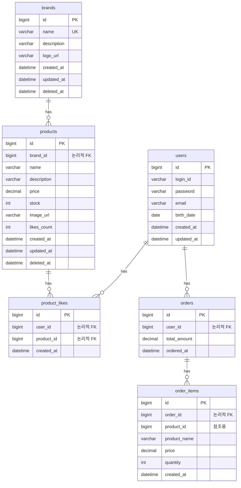

# ERD (Entity Relationship Diagram)

## 📋 문서 정보

- **작성일:** 2026-02-12
- **버전:** 1.0.0
- **상태:** Phase 1 설계

---

## ERD 다이어그램

**중요: 이 다이어그램은 논리적 관계를 표현한 것이며, 실제 DB에는 외래 키 제약조건(FOREIGN KEY CONSTRAINT)을 걸지 않습니다.**

---

## 관계 정의

### 1. Brand ↔ Product (1:N)

- 하나의 브랜드는 여러 상품을 가짐
- 브랜드 Soft Delete 시 상품도 Soft Delete (Application Level Cascade)
- 상품의 브랜드는 생성 후 변경 불가

### 2. Product ↔ ProductLike (1:N)

- 하나의 상품은 여러 좋아요를 받음
- 상품 Soft Delete 시 좋아요 Hard Delete (Application Level Cascade)
- 중복 좋아요 방지: `(user_id, product_id)` 유니크 제약

### 3. User ↔ ProductLike (1:N)

- 하나의 고객은 여러 상품에 좋아요
- 고객 탈퇴 시 Application Level에서 처리

### 4. User ↔ Order (1:N)

- 하나의 고객은 여러 주문
- 주문 삭제 기능 없음 (영구 보존)

### 5. Order ↔ OrderItem (1:N, Composition)

- 하나의 주문은 여러 주문 상품 포함
- Order 없이 OrderItem 존재 불가

### 6. OrderItem ··> Product (참조만)

- 주문 상품은 상품 ID를 참조 (외래 키 아님)
- 스냅샷: `product_name`, `price` 저장하여 불변성 보장
- 상품 삭제 후에도 주문 내역 유지

---

## 데이터 정합성 보장

### 외래 키 정책

**실제 DB에는 외래 키 제약조건을 걸지 않습니다.**

- Application Level에서 참조 무결성 검증
- Service Layer에서 존재 여부 및 활성 상태 확인
- Cascade 삭제는 Application Level에서 트랜잭션으로 처리

### Soft Delete 정합성

| 테이블 | 삭제 방식 | Cascade 처리 |
|--------|----------|-------------|
| brands | Soft Delete | 연관 상품도 Soft Delete |
| products | Soft Delete | 연관 좋아요 Hard Delete |
| product_likes | Hard Delete | - |
| orders | 삭제 없음 | - |
| order_items | 삭제 없음 | - |

### 비정규화 동기화

- **products.likes_count**: 좋아요 등록/취소 시 트랜잭션으로 동기화
- **orders.total_amount**: 주문 생성 시 자동 계산

### 트랜잭션 경계

- **브랜드 삭제**: 브랜드 + 상품 + 좋아요 (하나의 트랜잭션)
- **좋아요 등록/취소**: 좋아요 + likesCount (하나의 트랜잭션)
- **주문 생성**: 주문 + 주문 상품 + 재고 차감 (하나의 트랜잭션)

---

**작성일:** 2026-02-12  
**버전:** 1.0.0

