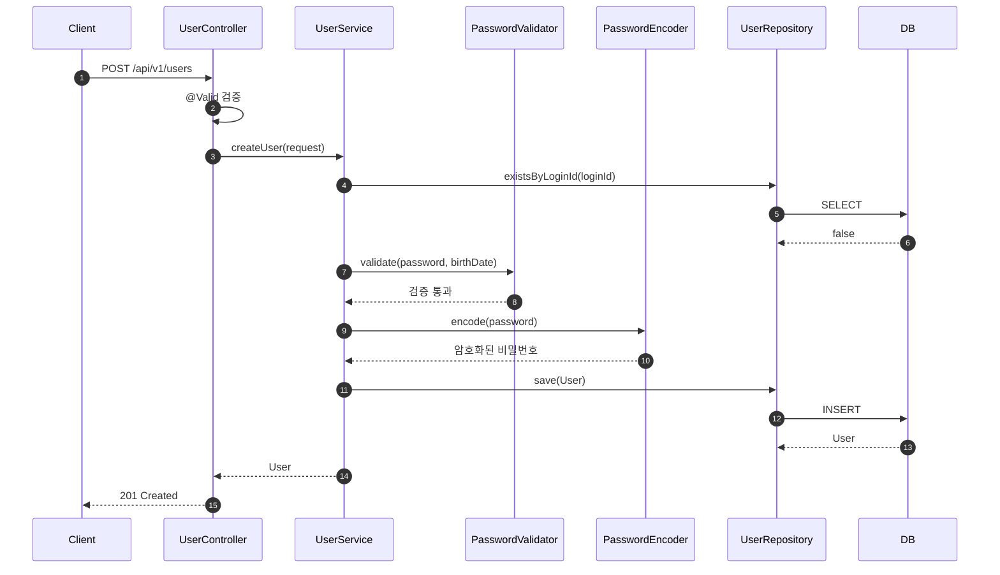
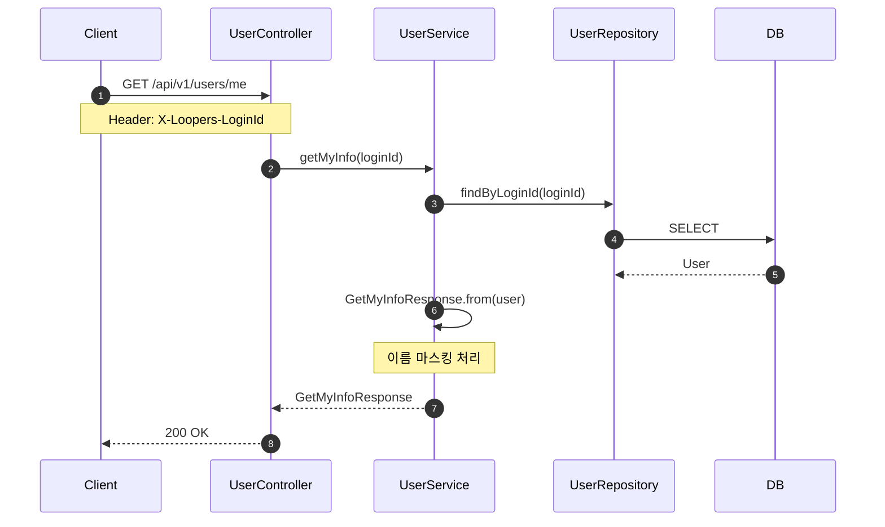
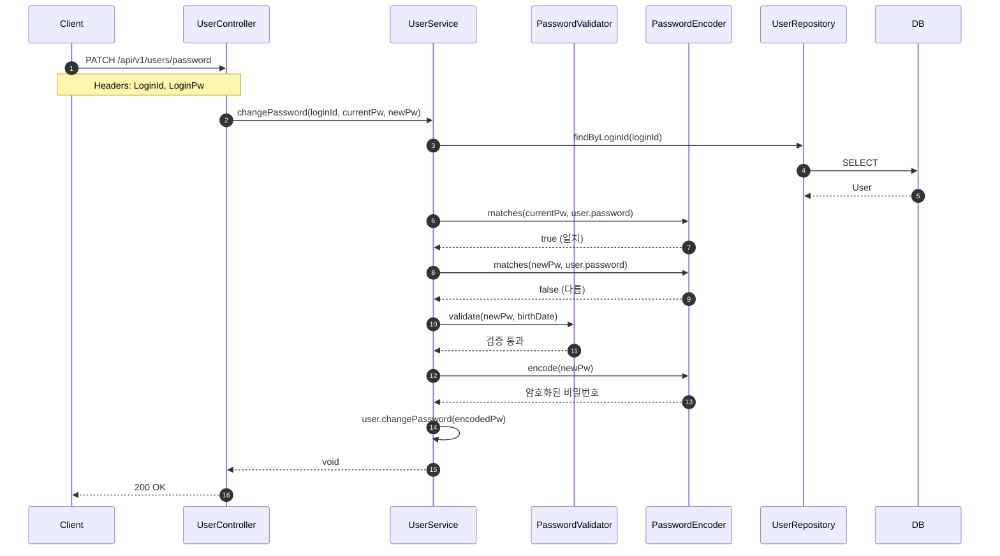
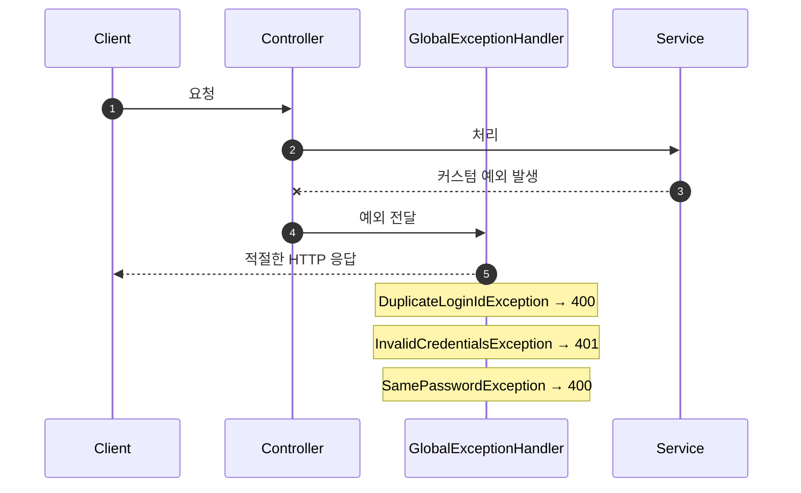

# 사용자 기능 PR

## 📌 Summary

- 배경: 서비스 이용을 위한 사용자 관련 기본 기능 필요
- 목표: 회원가입, 내 정보 조회, 비밀번호 변경 API 구현
- 결과: TDD(Inside-Out) 방식으로 사용자 API 구현 완료. 레이어별 책임 분리 및 커스텀 예외 처리 적용

## 🧭 Context & Decision

### 문제 정의
- 현재 동작/제약: 사용자 관련 기능 없음
- 문제(또는 리스크): 비밀번호 검증을 도메인에서 수행 시, 암호화된 비밀번호가 규칙 검증에 걸리는 문제 발생
- 성공 기준(완료 정의):
  - 회원가입 API 정상 동작, 중복 ID 방지, 비밀번호 암호화 저장
  - 내 정보 조회 시 이름 마스킹 처리
  - 비밀번호 변경 시 기존 비밀번호 확인 및 새 비밀번호 규칙 검증

### 선택지와 결정
- 고려한 대안:
  - A: 도메인(User)에서 비밀번호 규칙 검증 수행
  - B: 별도 PasswordValidator 유틸리티 클래스로 분리
- 최종 결정: B안 채택 - PasswordValidator로 분리 (static 메서드)
- 트레이드오프: 도메인이 비밀번호 규칙 검증을 하지 않음 → 규칙 검증은 Service 레이어에서 호출
- 추후 개선 여지: 도메인 객체가 담당하는 책임이 너무 없어 도메인 생성 시 유효성 보장이 되지 않는 문제가 있음, 도메인의 역할에 대해 좀 더 정의해보고 책임을 부여할 것 

## 🏗️ Design Overview

### 변경 범위
- 영향 받는 모듈/도메인: commerce-api (user 패키지)
- 신규 추가:
  - Controller: `UserController`
  - Service: `UserService`
  - Domain: `User`
  - DTO: `CreateUserRequest`, `CreateUserResponse`, `GetMyInfoResponse`, `ChangePasswordRequest`
  - Validator: `PasswordValidator`
  - Repository: `UserRepository`
  - Exception: `DuplicateLoginIdException`, `InvalidCredentialsException`, `SamePasswordException`, `GlobalExceptionHandler`
- 제거/대체: 없음

### 주요 컴포넌트 책임

| 컴포넌트 | 책임 |
|----------|------|
| `UserController` | HTTP 요청/응답 매핑, 헤더 인증 정보 추출, DTO 검증 위임 (@Valid) |
| `UserService` | 비즈니스 로직 (중복 ID 검증, 비밀번호 검증/암호화, 사용자 조회) |
| `User` | 도메인 엔티티, 필수값 검증, 이름 마스킹, 비밀번호 변경 |
| `PasswordValidator` | 비밀번호 규칙 검증 (8~16자, 허용 문자, 생년월일 포함 여부) |
| `CreateUserRequest` | 회원가입 입력 검증 (필수값, loginId 형식, 이메일, 생년월일 형식) |
| `ChangePasswordRequest` | 비밀번호 변경 입력 검증 (필수값) |
| `GetMyInfoResponse` | 내 정보 응답 DTO (마스킹된 이름 포함) |
| `GlobalExceptionHandler` | 커스텀 예외 → HTTP 응답 변환 |

## 🔁 Flow Diagram

### 1. 회원가입 Flow

### 2. 내 정보 조회 Flow

### 3. 비밀번호 변경 Flow

### Exception Flow

